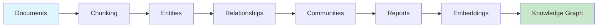

# GraphRAG란 무엇인가?

**GraphRAG** (Graph-based Retrieval-Augmented Generation)는 Microsoft Research에서 개발한 고급 데이터 파이프라인 및 변환 도구 모음입니다. 대규모 언어 모델(LLM)을 사용하여 비정형 텍스트에서 의미 있는 구조화된 지식을 추출하고, 지식 그래프 메모리 구조를 활용하여 LLM 출력을 크게 향상시킵니다.

## 목표

GraphRAG는 기존 RAG 시스템의 핵심 제한 사항인 문서의 **전체 구조**를 이해하지 못하는 문제를 해결합니다. 관련 엔티티의 커뮤니티로 구성된 지식 그래프에 정보를 구성하여, GraphRAG는 집중된 로컬 쿼리와 포괄적인 전체 이해를 모두 가능하게 합니다.

## 주요 기능

### 1. 지식 그래프 추출
자동으로 식별하고 추출합니다:
- **엔티티** - 사람, 조직, 위치, 이벤트
- **관계** - 엔티티 간의 연결
- **주장** - 출처 속성이 포함된 사실적 단언

### 2. 커뮤니티 감지
[[Leiden Algorithm]]을 사용하여 관련 엔티티의 클러스터를 발견하고, 원본 자료의 주제적 구성을 반영하는 계층 구조를 생성합니다.

### 3. 벡터 임베딩
다음을 위한 의미적 임베딩을 생성합니다:
- 유사도 검색을 위한 텍스트 청크
- 엔티티 검색을 위한 엔티티 설명
- 주제 쿼리를 위한 커뮤니티 컨텍스트

### 4. 이중 검색 방법
- [[Local Search]] - 엔티티 중심, 구체적인 질문
- [[Global Search]] - 커뮤니티 수준, 광범위한 질문

### 5. 증분 업데이트
전체 재처리 없이 새 문서로 기존 지식 그래프를 효율적으로 업데이트합니다.

## 작동 방식

### 인덱싱 파이프라인

### 단계별 프로세스

1. **입력 처리** - 문서를 로드하고 관리하기 쉬운 청크로 분할합니다
2. **NLP 처리** - LLM이 각 청크에서 엔티티와 관계를 추출합니다
3. **그래프 구성** - 추출된 데이터를 통합 지식 그래프로 어셈블합니다
4. **커뮤니티 감지** - [[Leiden Algorithm]]이 계층적 커뮤니티를 식별합니다
5. **보고서 생성** - LLM이 각 커뮤니티의 핵심 인사이트를 요약합니다
6. **임베딩** - 의미적 검색을 위한 벡터 표현을 생성합니다

## 데이터 모델

GraphRAG는 다양한 데이터 모델을 사용합니다:

- [[Entity]] - 타입과 설명이 포함된 명명된 엔티티
- [[Relationship]] - 엔티티 간의 가중치 연결
- [[Community]] - 엔티티의 계층적 클러스터
- [[Community Report]] - 자연어 요약
- [[Text Unit]] - 소스 텍스트 청크
- [[Covariate]] - 추가 메타데이터 (주장, 사실)

## GraphRAG vs 기존 RAG

| 측면 | 기존 RAG | GraphRAG |
|--------|----------------|----------|
| **구조** | 평면 청크 | 구조화된 지식 그래프 |
| **컨텍스트** | 가장 가까운 청크 | 엔티티 관계 + 커뮤니티 계층 |
| **전체 쿼리** | 제한적 | 커뮤니티를 통한 전체 그래프 이해 |
| **쿼리 유형** | 의미적 검색 | 로컬 + 전체 + DRIFT + 기본 |

## 사용 사례

### 로컬 검색에 적합한 경우
- "X와 Y의 관계는 무엇인가?"
- "이 주제의 핵심 인물은 누구인가?"
- "X에 대한 구체적인 세부사항은 무엇인가?"

### 전체 검색에 적합한 경우
- "이 데이터셋의 주요 테마는 무엇인가?"
- "전체 말뭉치를 요약해달라"
- "주제 간의 상위 수준 관계는 무엇인가?"

## 아키텍처

GraphRAG는 여러 상호 연결된 모듈로 구성됩니다:

- [[Index Module]] - 지식 그래프 구축을 위한 핵심 파이프라인
- [[Query Module]] - 검색 및 검색 방법
- [[Configuration Module]] - 설정 및 매개변수
- [[Storage Module]] - 데이터 지속성
- [[Language Model Module]] - LLM 제공자 통합
- [[Storage Module]] - 벡터 데이터베이스 통합
- [[Index Module]] - 명령줄 인터페이스

## 다음 단계

- [[Getting Started]] - 빠른 시작 가이드
- [[Architecture Overview]] - 상세 시스템 아키텍처
- [[Configuration Module]] - 구성 옵션
- [[Indexing API]] - 프로그래밍 방식 액세스

---
*참조: [[Home]], [[Data Flow]], [[Technology Stack]]*
