# Chapter 7: Community Detection

## 학습 목표

이 장을 마치면 다음을 수행할 수 있습니다:
- 그래프 이론에서 커뮤니티의 정의 설명
- GraphRAG에서 사용되는 Leiden 알고리즘 이해
- 엔티티 그래프에서 커뮤니티가 탐지되는 방법 설명
- 커뮤니티의 계층적 구조 설명
- 커뮤니티 기반 검색 전략 적용

---

## 7.1 커뮤니티란 무엇인가?

### 7.1.1 그래프 이론에서의 정의

**커뮤니티**(클러스터 또는 모듈이라고도 함)는 그룹 외부의 노드보다 서로 더 밀접하게 연결된 노드 그룹입니다.

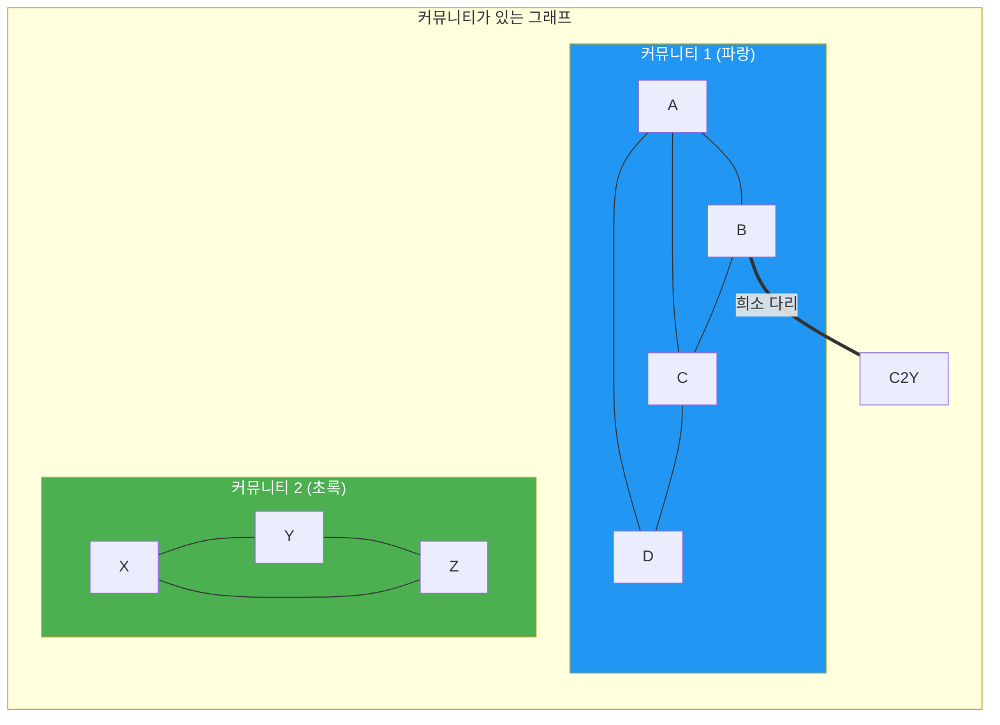

**핵심 통찰:** 커뮤니티 내에서 노드는 많은 내부 연결과 적은 외부 연결을 가집니다.

### 7.1.2 실제 커뮤니티 예시

| 도메인 | 커뮤니티 | 구성원 | 연결 |
|--------|-----------|---------|-------------|
| **소셜** | 친구 그룹 | 친구들 | 사회적 관계 |
| **학술** | 연구 분야 | 연구자, 논문 | 인용, 협력 |
| **생물학** | 단백질 복합체 | 단백질 | 물리적 상호작용 |
| **웹** | 주제 클러스터 | 웹 페이지 | 하이퍼링크 |
| **지식** | 개념 클러스터 | 관련 개념 | 의미적 관계 |

### 7.1.3 RAG에서 커뮤니티의 중요성

커뮤니티는 검색에 여러 가지 이점을 제공합니다:

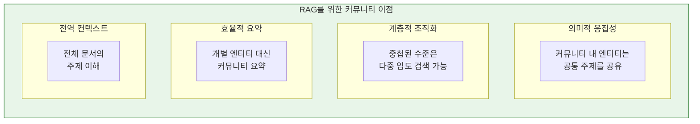

**실제 예시:**
```
질문: "이 말뭉치의 주요 연구 주제는 무엇입니까?"

커뮤니티 없음: 개별 엔티티 나열
커뮤니티 있음: 응집된 연구 영역 식별 (예: "머신러닝", "양자 컴퓨팅")
```

### 7.1.4 계층적 커뮤니티 구조

커뮤니티는 여러 수준에서 존재할 수 있습니다:

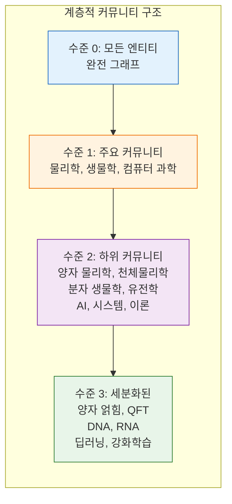

**다른 수준의 사용 사례:**
- **높은 수준**: 광범위한 주제, 전역 질의
- **낮은 수준**: 구체적 주제, 상세 질의
- **동적 선택**: 질의의 구체성에 따른 수준 선택

---

## 7.2 Leiden 알고리즘

### 7.2.1 알고리즘 개요 및 직관

**Leiden 알고리즘**은 초기 Louvain 알고리즘을 개선한 최신 커뮤니티 탐지 알고리즘입니다.

**핵심 아이디어:** **모듈성**을 반복적으로 최적화합니다. 이는 그래프가 얼마나 잘 커뮤니티로 분할되었는지를 측정하는 지표입니다.

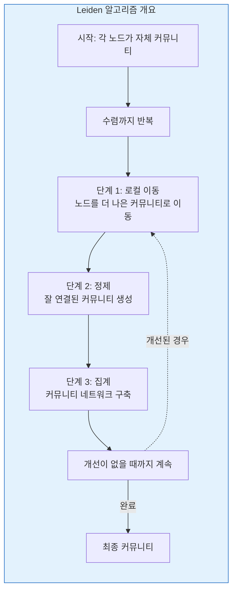

### 7.2.2 네 가지 단계 설명

#### 단계 1: 로컬 이동

각 노드는 인접 커뮤니티로의 이동을 고려합니다:

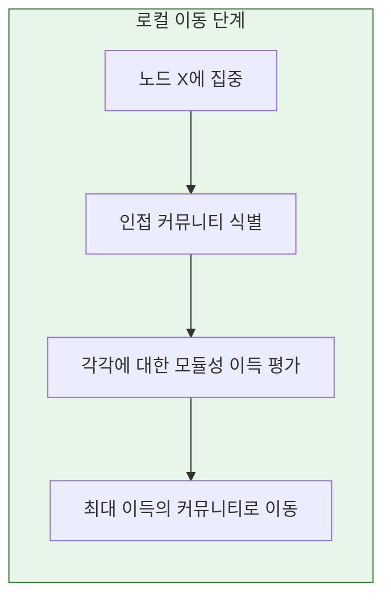

**모듈성 이득 공식:**
```
ΔQ = [ki,in / 2m - ki × Σtot / 2m²]
```
여기서:
- `ki,in`: 노드에서 커뮤니티로의 엣지
- `ki`: 노드의 차수
- `Σtot`: 커뮤니티의 총 차수
- `m`: 그래프의 총 엣지 수

#### 단계 2: 정제

Leiden은 Louvain이 없는 정제 단계를 추가합니다:

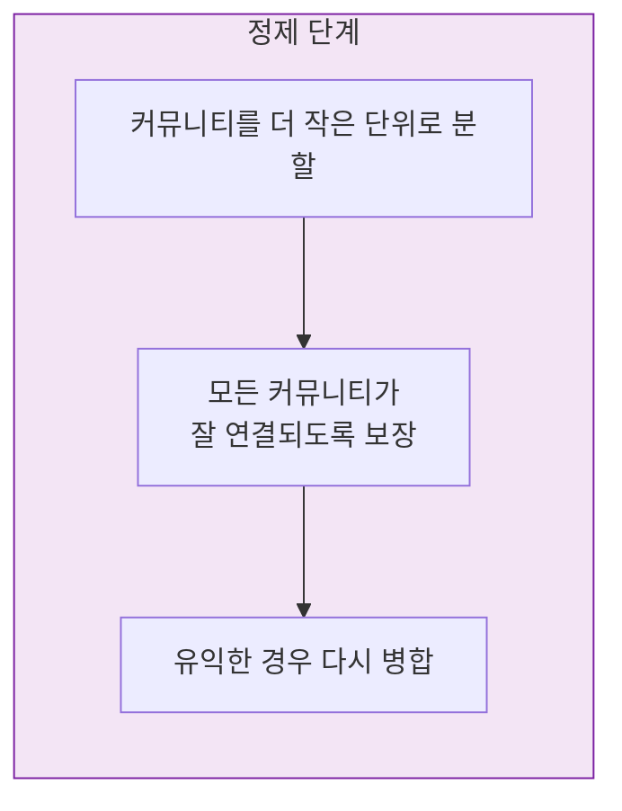

**정제가 중요한 이유:**
- 잘못 연결된 커뮤니티 방지
- 최종 분할의 품질 보장
- 수렴 보장

#### 단계 3: 집계

커뮤니티가 노드가 되는 새 네트워크를 구축합니다:

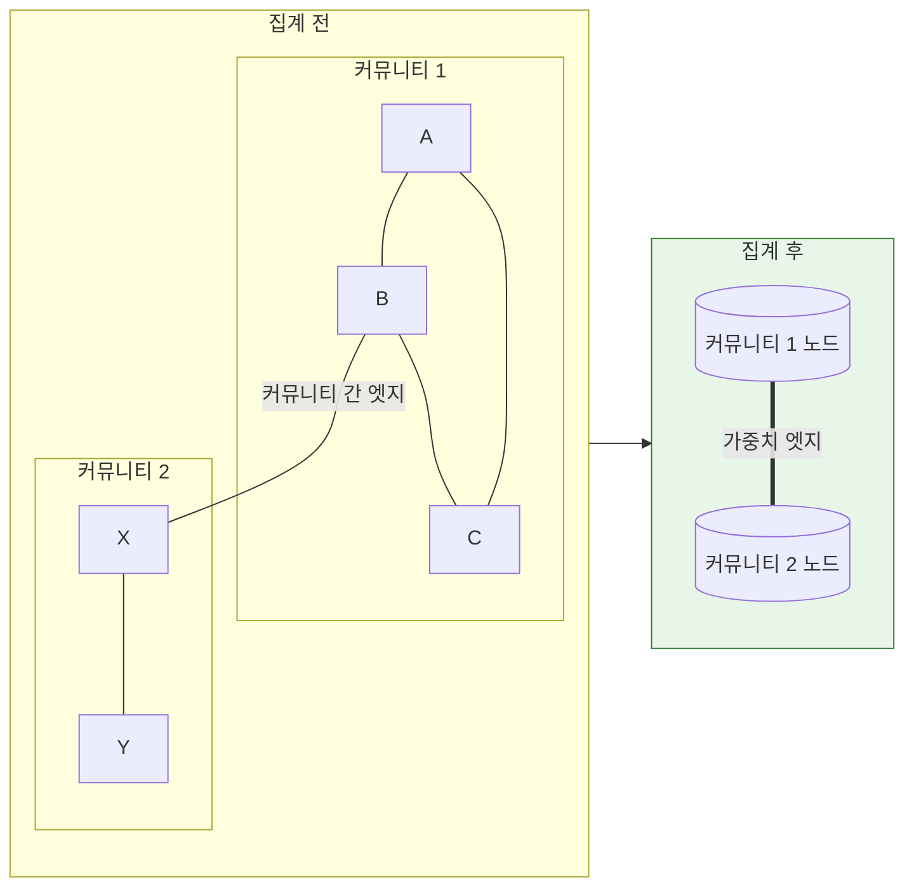

#### 단계 4: 반복

더 이상 개선이 없을 때까지 반복합니다:

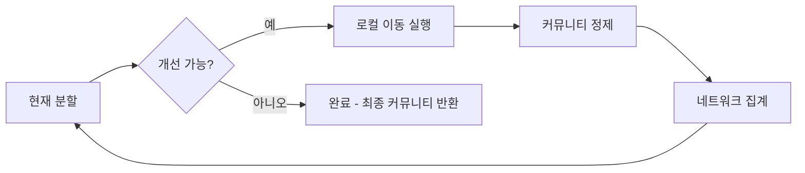

### 7.2.3 분할 품질 (모듈성)

**모듈성**은 커뮤니티 분할의 품질을 측정합니다:

```
Q = (1/2m) × Σ[Aij - (ki × kj / 2m)] × δ(ci, cj)
```

**직관:**
- 실제 엣지를 랜덤 그래프에서의 예상 엣지와 비교
- 높은 모듈성 = 더 나은 커뮤니티 구조
- 범위: [-1, 1], 실제 그래프에서는 일반적으로 [0.3, 0.7]

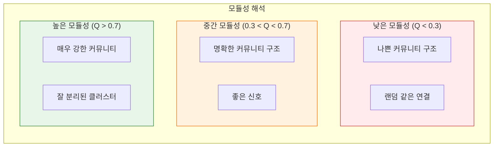

### 7.2.4 계층적 수준 생성

Leiden은 자연스럽게 계층적 커뮤니티를 생성합니다:

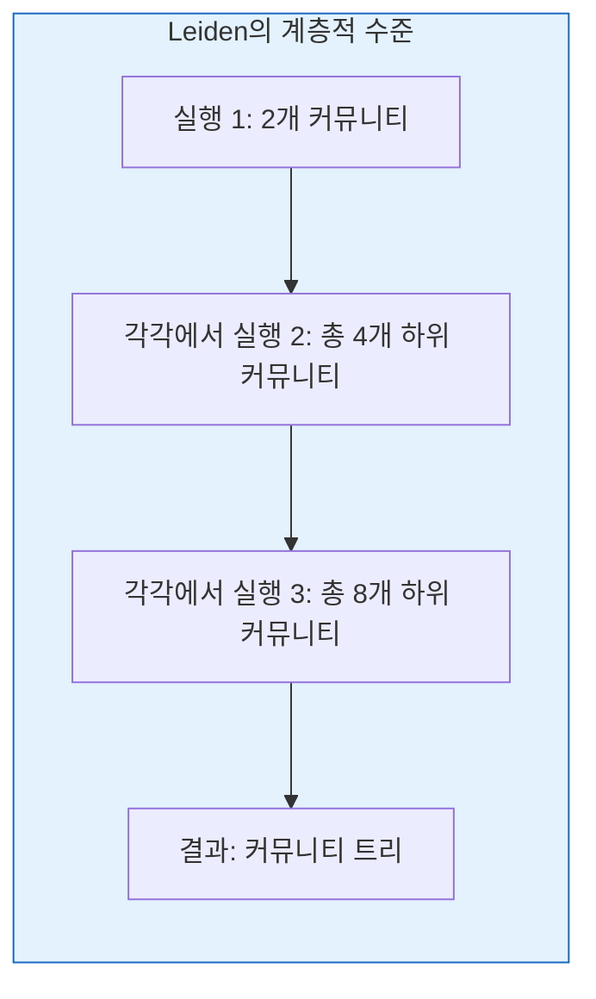

**GraphRAG는 여러 수준을 저장합니다:**
- 수준 0: 단일 커뮤니티 (모든 엔티티)
- 수준 1: 최상위 커뮤니티
- 수준 2: 하위 커뮤니티
- 수준 N+: 가장 세분화된 수준

---

## 7.3 GraphRAG의 커뮤니티 탐지

### 7.3.1 엔티티 그래프에서 Leiden 실행

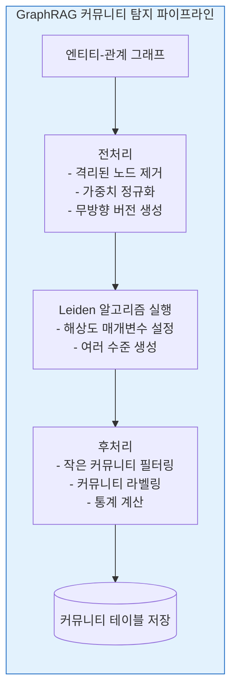

### 7.3.2 해상도 매개변수

**해상도 매개변수 (γ)**는 커뮤니티 크기를 제어합니다:

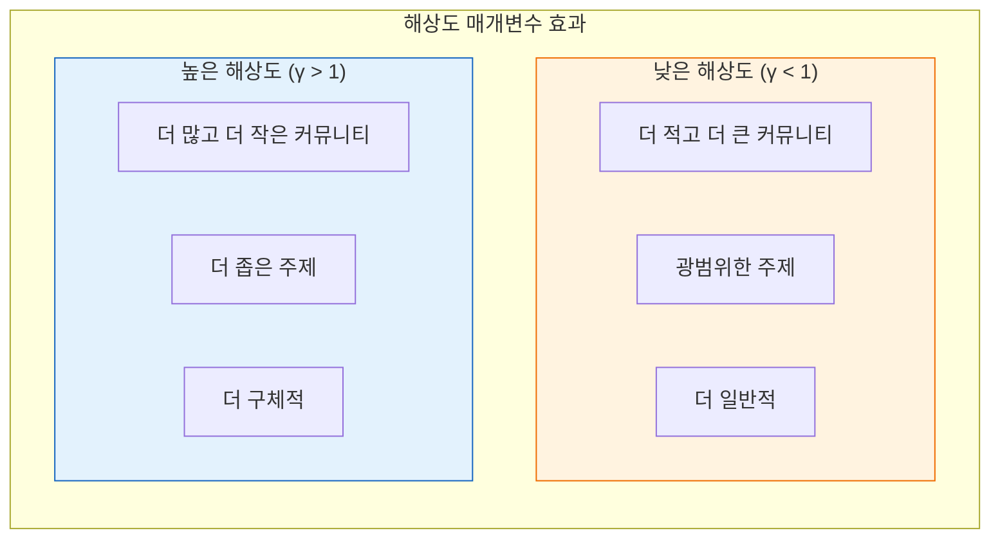

**해상도 선택:**
- `γ = 1.0`: 기본값, 균형 잡힘
- `γ < 1.0`: 더 적고 더 광범위한 커뮤니티
- `γ > 1.0`: 더 구체적인 커뮤니티

### 7.3.3 수준 선택 전략

몇 개의 수준을 사용해야 할까요?

| 전략 | 설명 | 사용 사례 |
|----------|-------------|----------|
| **고정 수준** | N개 수준 생성 | 단순, 예측 가능 |
| **품질 임계값** | 모듈성 이득이 임계값 미만일 때 중지 | 자동, 품질 기반 |
| **크기 임계값** | 커뮤니티가 너무 작아지면 중지 | 과도한 분할 방지 |
| **도메인 기반** | 도메인 개념과 일치하는 수준 사용 | 해석 가능성 |

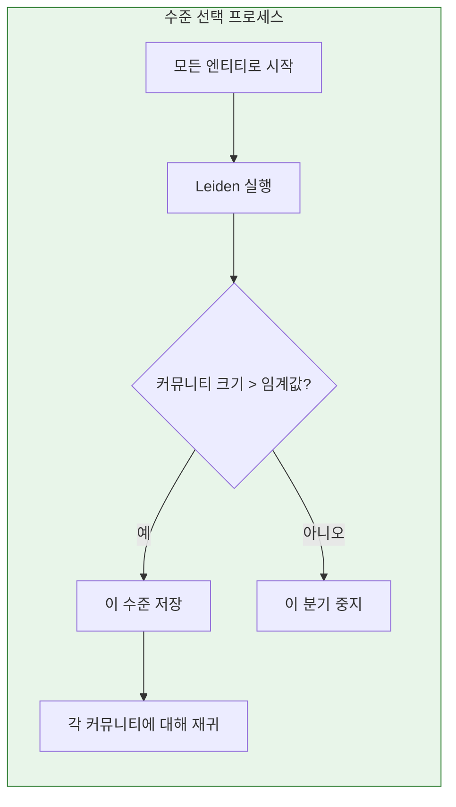

### 7.3.4 커뮤니티 요약

각 커뮤니티는 효율적인 검색을 위해 요약됩니다:

```mermaid
flowchart TB
    subgraph Summarization["커뮤니티 요약"]
        direction TB

        COMM[커뮤니티:<br/>엔티티: {아인슈타인, 상대성이론, 중력,</>시간-공간, 광속}]

        CONTEXT[컨텍스트 수집:<br/>- 엔티티 설명<br/>- 관계 설명<br/>- 원본 텍스트 단위]

        PROMPT[요약 프롬프트 구축<br/>"이러한 엔티티를 연결하는<br/>핵심 주제를 요약하세요..."]

        LLM[LLM이 요약 생성]

        SUMMARY["요약: '이 커뮤니티는 아인슈타인의 이론 물리학 연구를 다루며,<br/>특수 및 일반 상대성이론, 중력의 본질,<br/>그리고 빛의 기본 속도 한계를 포함합니다.'"]

        COMM --> CONTEXT --> PROMPT --> LLM --> SUMMARY
    end

    style Summarization fill:#f3e5f5,stroke:#7b1fa2
```

**요약 품질 요소:**
- **응집성**: 엔티티가 응집된 주제를 형성하는가?
- **적용 범위**: 모든 핵심 측면이 언급되었는가?
- **간결성**: 요약이 적절하게 간결한가?
- **검색 가능성**: 관련 질의에서 요약을 찾을 수 있는가?

### 7.3.5 커뮤니티 시각화

커뮤니티 구조를 시각화하여 그래프를 이해할 수 있습니다:

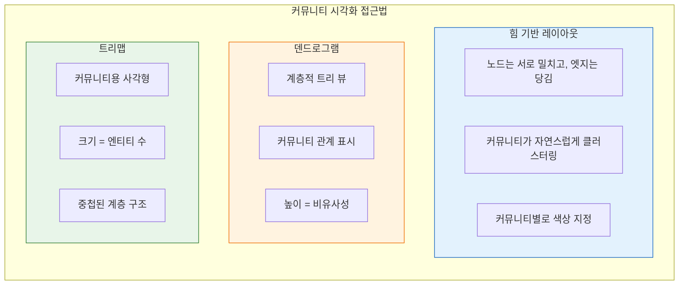

---

## 7.4 커뮤니티 기반 검색

### 7.4.1 커뮤니티가 검색을 개선하는 방법

```mermaid
flowchart TB
    subgraph Without["커뮤니티 없음"]
        direction TB

        Q1[질문: "머신러닝 동향"]

        RETR1[개별 엔티티 검색<br/>- 신경망<br/>- 딥러닝<br/>- SVM<br/>- 랜덤 포레스트<br/>- 분산된 결과]

        Q1 --> RETR1
    end

    subgraph With["커뮤니티 있음"]
        direction TB

        Q2[질문: "머신러닝 동향"]

        COMM1[ML 커뮤니티 식별]

        SUMM[커뮤니티 요약 검색<br/>'ML은 신경망, 딥러닝에 초점을 맞추고<br/>컴퓨터 비전 및 NLP 응용을 포함']

        ENT[선택 사항: 상세를 위해<br/>커뮤니티 내 상위 엔티티 검색]

        Q2 --> COMM1 --> SUMM --> ENT
    end

    style Without fill:#fff3e0,stroke:#ef6c00
    style With fill:#e8f5e9,stroke:#2e7d32
```

### 7.4.2 로컬 vs 전역 컨텍스트

```mermaid
flowchart TB
    subgraph Local["로컬 검색 (엔티티 중심)"]
        direction TB

        QUERY[질문: "아인슈타인에 대해 말해주세요"]

        ENTITY[아인슈타인 엔티티 찾기]

        NEIGHBORS[직접 이웃 가져오기<br/>- 상대성이론<br/>- 중력<br/>- 노벨상<br/>- 프린스턴]

        QUERY --> ENTITY --> NEIGHBORS
    end

    subgraph Global["전역 검색 (커뮤니티 중심)"]
        direction TB

        QUERY2[질문: "주요 물리학 주제는 무엇입니까?"]

        COMM[물리학 커뮤니티 찾기<br/>- 상대성이론 및 우주론<br/>- 양자 역학<br/>- 열역학]

        SUMM[커뮤니티 요약 검색]

        QUERY2 --> COMM --> SUMM
    end

    style Local fill:#e3f2fd,stroke:#1565c0
    style Global fill:#f3e5f5,stroke:#7b1fa2
```

### 7.4.3 커뮤니티 인식 랭킹

결과를 랭킹할 때 커뮤니티 멤버십은 신호를 제공합니다:

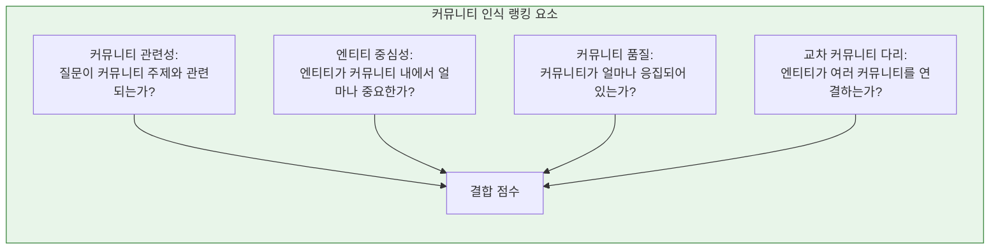

### 7.4.4 다중 수준 검색 전략

```mermaid
flowchart TB
    subgraph MultiLevel["다중 수준 검색"]
        direction TB

        QUERY[사용자 질의]

        ANALYZE[질의 구체성 분석]

        L1{매우 구체적?}

        L1_YES[세분화된 커뮤니티 사용<br/>(수준 3-4)]

        L1_NO{일반 주제?}

        L2_YES[광범위한 커뮤니티 사용<br/>(수준 1-2)]

        L2_NO[여러 수준 사용 및<br/>결과 결합]

        QUERY --> ANALYZE --> L1
        L1 -->|예| L1_YES
        L1 -->|아니오| L1_NO
        L1_NO -->|예| L2_YES
        L1_NO -->|아니오| L2_NO
    end

    style MultiLevel fill:#e3f2fd,stroke:#1565c0
```

---

## 7.5 커뮤니티 테이블 구조

### 7.5.1 GraphRAG 커뮤니티 스키마

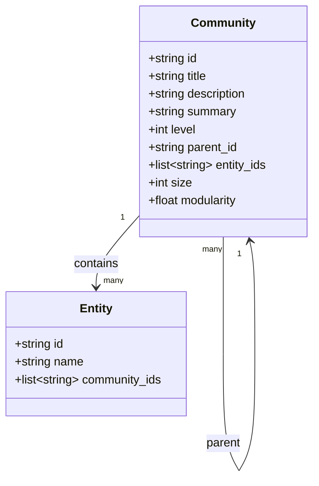

### 7.5.2 예시 커뮤니티 레코드

```json
{
  "id": "comm_001",
  "title": "양자 물리학 연구",
  "description": "양자 역학, 양자 컴퓨팅, 양자 정보 이론과 관련된 엔티티",
  "summary": "이 커뮤니티는 양자 얽힘, 중첩, 양자 컴퓨팅 응용을 포함한 기본 양자 물리학 개념을 다룹니다. 주요 연구자로는 파인만, 보어, 슈뢰딩거와 양자 우위 연구 현대 기관들이 포함됩니다.",
  "level": 2,
  "parent_id": "comm_phys_001",
  "entity_ids": ["ent_feynman", "ent_bohr", "ent_schrodinger", "ent_quantum_entanglement", "ent_qubit"],
  "size": 127,
  "modularity": 0.72
}
```

---

## 장 요약

이 장에서는 GraphRAG의 커뮤니티 탐지를 다루었습니다:

**핵심 개념:**
- **커뮤니티**는 밀접하게 연결된 노드 그룹입니다
- **의미적 응집성**과 **계층적 조직화**를 제공합니다
- 커뮤니티는 **전역 컨텍스트**와 **효율적 요약**을 가능하게 합니다

**Leiden 알고리즘:**
- 네 단계: 로컬 이동, 정제, 집계, 반복
- 분할의 품질 지표인 **모듈성**을 최적화합니다
- 자연스럽게 **계층적 수준**을 생성합니다
- **해상도 매개변수**가 커뮤니티 크기를 제어합니다

**GraphRAG 구현:**
- 엔티티-관계 그래프에서 Leiden 실행
- 여러 계층 수준 생성
- LLM을 통해 **커뮤니티 요약** 생성
- **로컬** 및 **전역** 검색 모두 지원

**다음 단계:**
커뮤니티가 탐지되었으므로, [[Textbook - Text Units and Chunking]]에서 텍스트가 어떻게 구성되고 그래프 요소와 연결되는지 살펴봅니다.

---

## 복습 질문

1. 그래프 이론에서 커뮤니티란 무엇이며 RAG에 유용한 이유는 무엇입니까?
2. Leiden 알고리즘의 네 단계를 설명하세요.
3. 모듈성이란 무엇이며 커뮤니티 탐지에서 어떻게 사용됩니까?
4. 해상도 매개변수는 커뮤니티 탐지 결과에 어떤 영향을 줍니까?
5. 커뮤니티 맥락에서 로컬 검색과 전역 검색을 비교하세요.
6. GraphRAG의 커뮤니티 테이블 스키마에 포함된 필드는 무엇입니까?

---

## 연습문제

1. 노드 1-5가 서로 연결되고, 노드 6-10이 서로 연결되며, 노드 3과 노드 7을 연결하는 엣지가 하나만 있는 10개 노드의 그래프가 있습니다. 커뮤니티를 식별하세요.

2. 해상도 = 1.0으로 Leiden을 실행하여 5개 커뮤니티를 얻었습니다. 해상도 = 2.0으로 다시 실행하면 어떤 결과를 기대하시겠습니까?

3. "기후 변화 연구"에 관한 커뮤니티에 대한 커뮤니티 요약 프롬프트를 설계하세요. 요약에 어떤 요소가 포함되어야 합니까?

---

## 추가 참고자료

- "From Louvain to Leiden: guaranteeing well-connected communities" (Traag et al., 2019)
- "Modularity and community structure in networks" (Newman, 2006)
- 커뮤니티 탐지 설문 및 벤치마크
- GraphRAG 커뮤니티 탐지 문서
