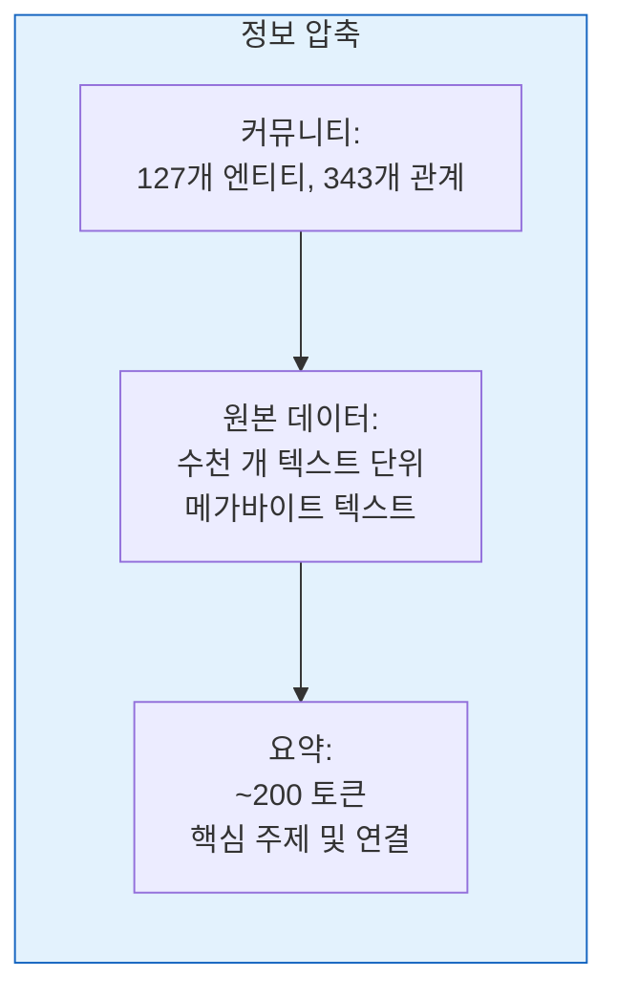
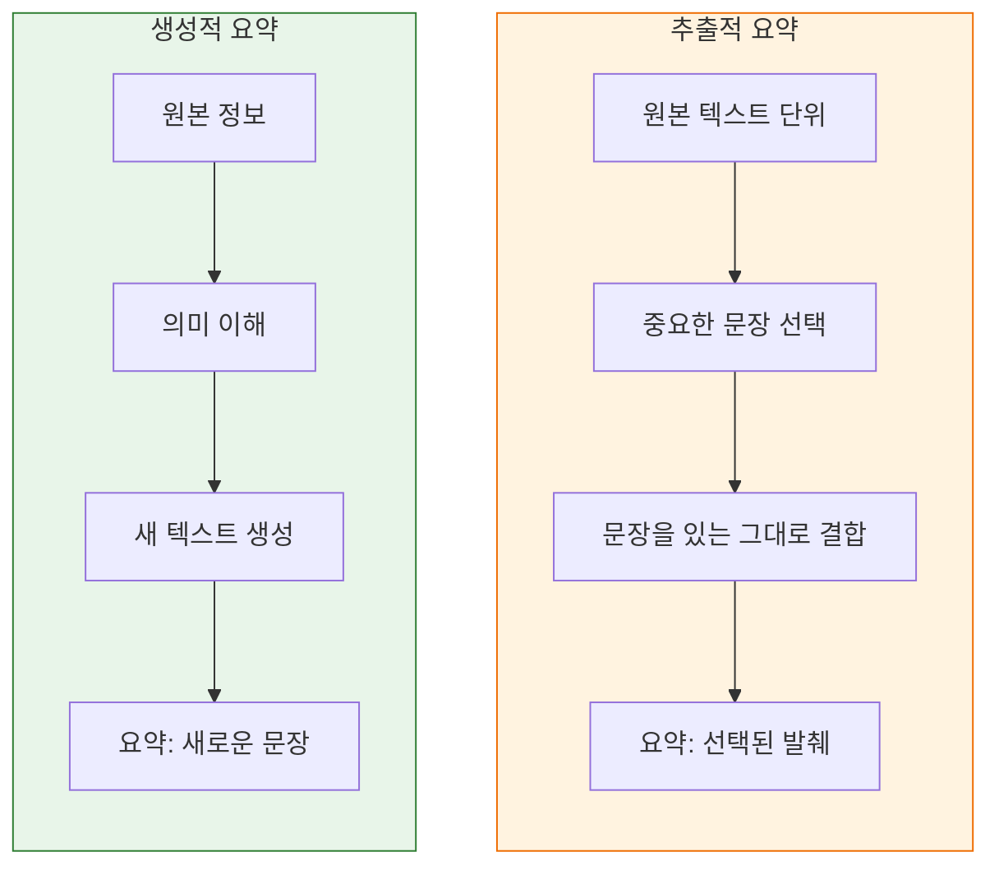
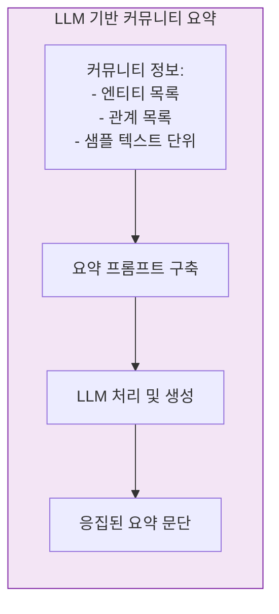
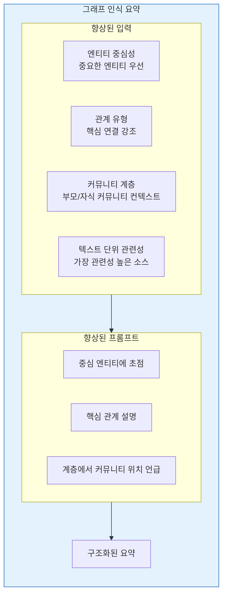
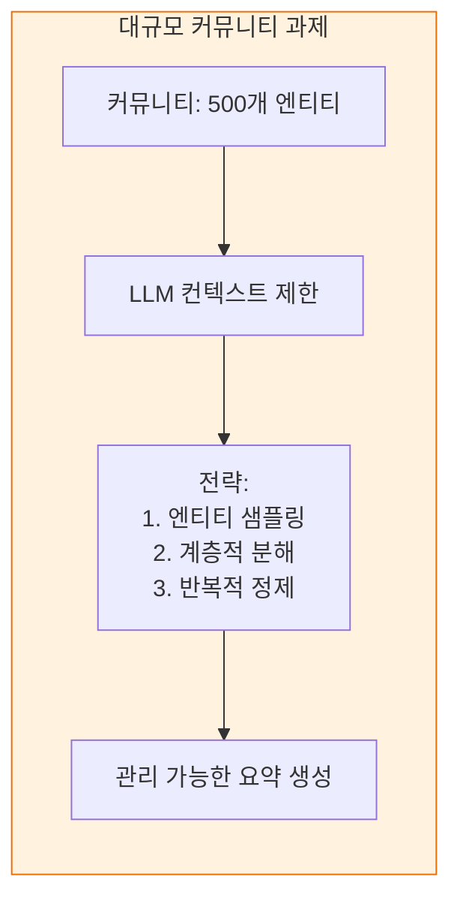
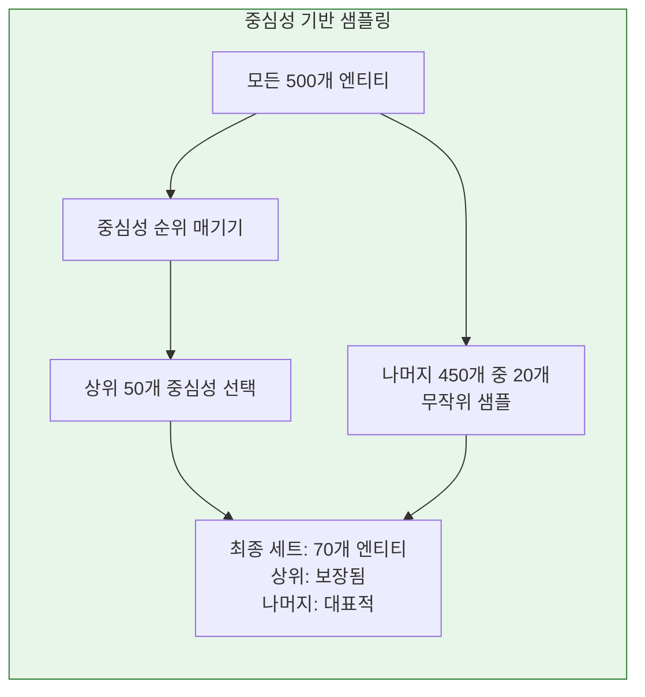
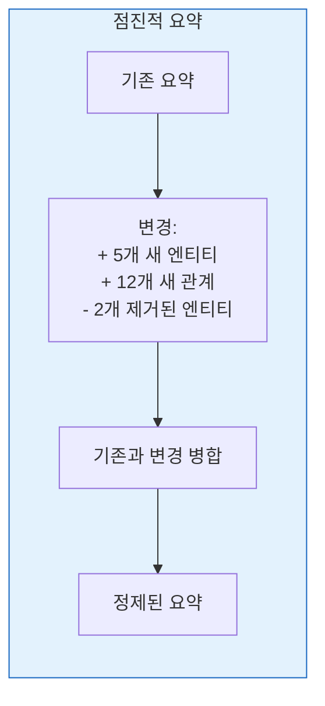
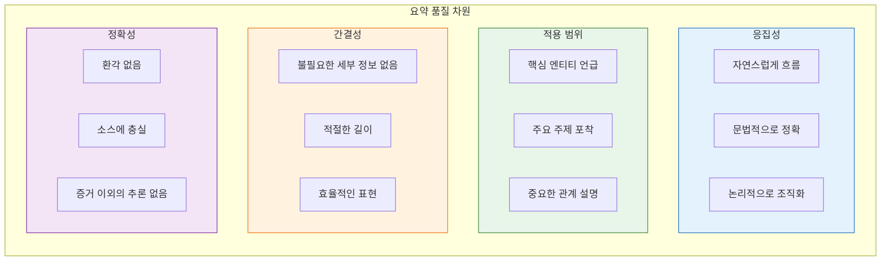
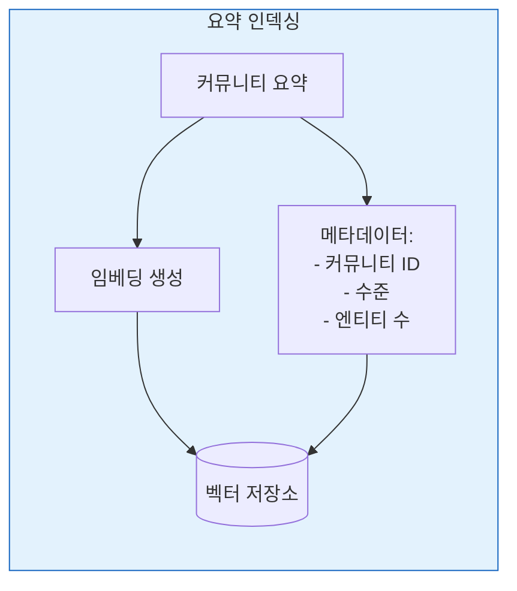
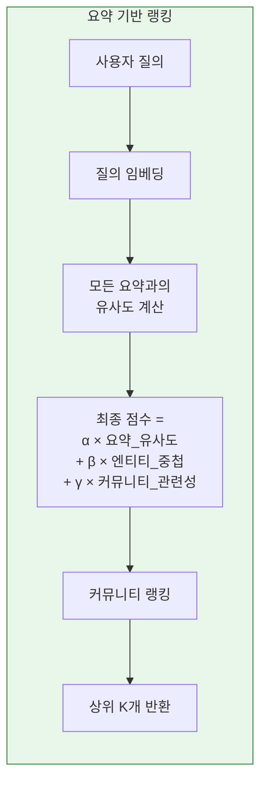

# Chapter 9: Community Summarization

## 학습 목표

이 장을 마치면 다음을 수행할 수 있습니다:
- 커뮤니티를 요약해야 하는 이유 설명
- 추출적 요약과 생성적 요약 방법 비교
- 커뮤니티 요약을 위한 프롬프트 설계
- 요약에서 대규모 커뮤니티 처리
- 검색에서 요약 효과적 사용

---

## 9.1 커뮤니티를 요약하는 이유는?

### 9.1.1 정보 압축

커뮤니티는 수십 또는 수백 개의 엔티티와 관계를 포함할 수 있습니다. 요약은 핵심 통찰을 보존하면서 이 정보를 압축합니다.



**요약 없음:**
- 검색 시 모든 커뮤니티 요소를 가져와야 함
- 컨텍스트 윈도우가 초과됨
- 사용자가 분절된 사실을 보게 됨

**요약 있음:**
- 커뮤니티당 하나의 간결한 설명
- 빠른 전역 검색
- 응집된 주제적 이해

### 9.1.2 의미적 응집성

좋은 요약은 커뮤니티의 "본질"을 포착합니다:

```mermaid
flowchart TB
    subgraph Example["커뮤니티 요약 예시"]
        direction TB

        ENTITIES[엔티티:<br/>- 아인슈타인<br/>- 상대성이론<br/>- 시간-공간<br/>- 중력<br/>- 광속<br/>- 광전 효과<br/>- 브라운 운동<br/>- 노벨상 (1921)]

        SUMMARY["이 커뮤니티는 알베르트 아인슈타인의 이론 물리학 연구를 다루며,<br/>시간, 공간, 중력에 대한 우리의 이해를 혁신한 특수 및 일반<br/>상대성이론에 초점을 맞춥니다. 또한 양자 역학(광전 효과) 및<br/>통계 역학에 대한 그의 연구를 포함합니다."]

        ENTITIES --> SUMMARY
    end

    style Example fill:#e8f5e9,stroke:#2e7d32
```

### 9.1.3 검색 효율성

요약은 효율적인 전역 검색을 가능하게 합니다:

```mermaid
flowchart TB
    subgraph Comparison["검색 비교"]
        direction TB

        subgraph Without["요약 없음"]
            W1[관련 커뮤니티 찾기]
            W2[각 커뮤니티에서<br/>모든 엔티티 검색]
            W3[각 커뮤니티에서<br/>모든 관계 검색]
            W4[대규모 컨텍스트 조립]
            W5["결과: 컨텍스트 오버플로우"]
        end

        subgraph With["요약 있음"]
            H1[관련 커뮤니티 찾기]
            H2[커뮤니티 요약 검색<br/>(각각 ~200 토큰)]
            H3[선택 사항: 상세를 위해<br/>상위 엔티티 가져오기]
            H4[집중된 컨텍스트 조립]
            H5["결과: 효율적인 검색"]
        end
    end

    style Without fill:#ffebee,stroke:#c62828
    style With fill:#e8f5e9,stroke:#2e7d32
```

### 9.1.4 인간 해석 가능성

요약은 지식 그래프를 인간이 접근할 수 있게 만듭니다:

| 사용 사례 | 요약이 도움이 되는 방식 |
|----------|-------------------|
| **탐색** | 사용자가 커뮤니티 주제를 빠르게 이해 |
| **검증** | 검토자가 커뮤니티 품질 확인 |
| **디버깅** | 개발자가 클러스터링 문제 감지 |
| **문서화** | 그래프 구조가 자체 문서화 |

---

## 9.2 요약 방법

### 9.2.1 추출적 vs 생성적



| 측면 | 추출적 | 생성적 |
|--------|------------|-------------|
| **출력** | 원본의 문장 | 새로 생성된 텍스트 |
| **응집성** | 분절될 수 있음 | 자연스럽게 응집 |
| **압축** | 제한적 | 높음 |
| **충실도** | 정확한 인용 | 의역 |
| **복잡도** | 더 단순 | 더 복잡 |
| **GraphRAG 사용** | 드물게 사용 | 주요 방법 |

### 9.2.2 LLM 기반 요약

GraphRAG는 생성적 요약을 위해 LLM을 사용합니다:



**LLM 요약의 장점:**
- 자연스럽고 응집된 텍스트
- 여러 소스를 종합할 수 있음
- 도메인별 용어 처리
- 프롬프트를 통한 가이드 가능

**과제:**
- 요약당 API 비용
- 환각 가능성
- 요약 간 일관성
- 대규모 커뮤니티의 토큰 제한

### 9.2.3 그래프 인식 요약

표준 요약은 그래프 구조를 무시합니다. 그래프 인식 요약은 다음을 통합합니다:



### 9.2.4 다중 수준 요약

다른 계층 수준은 다른 요약 스타일이 필요합니다:

```mermaid
flowchart TB
    subgraph Levels["다중 수준 요약"]
        direction TB

        L1[수준 1: 광범위한 커뮤니티<br/>요약: "양자 역학, 상대성이론,<br/>열역학을 포함하는 물리학 연구"]

        L2[수준 2: 하위 커뮤니티<br/>요약: "양자 얽힘, 중첩,<br/>컴퓨팅에 초점을 맞춘 양자 역학 연구"]

        L3[수준 3: 세분화된<br/>요약: "벨의 정리 및 응용을 탐구하는<br/>양자 얽힘 연구"]

        L1 --> L2 --> L3
    end

    style Levels fill:#e8f5e9,stroke:#2e7d32
```

**수준별 요약 특성:**

| 수준 | 길이 | 초점 | 상세 |
|-------|--------|-------|--------|
| **높음 (1-2)** | 더 짧음 (100-150 토큰) | 광범위한 주제 | 일반적 |
| **중간 (3-4)** | 중간 (150-250 토큰) | 구체적 주제 | 중간 |
| **낮음 (5+)** | 더 김 (250-400 토큰) | 상세 분석 | 높음 |

---

## 9.3 GraphRAG 요약 파이프라인

### 9.3.1 커뮤니티 요약을 위한 프롬프트 설계

#### 기본 요약 프롬프트

```markdown
당신은 지식 그래프 커뮤니티를 분석하고 있습니다.

커뮤니티 정보:
- 엔티티: {entity_list}
- 핵심 관계: {relationship_list}
- 샘플 컨텍스트: {text_units}

작업: 다음을 설명하는 간결한 요약 (2-3문장)을 작성하세요:
1. 이러한 엔티티를 연결하는 것
2. 주요 주제 또는 개념
3. 주목할 만한 관계 또는 계층 구조

가이드라인:
- 엔티티 나열이 아닌 의미적 응집성에 초점
- 도메인에 적절한 용어 사용
- 간결하지만 완전하게
- 제공된 정보 이외의 추론 지양

요약:
```

#### 그래프 구조가 포함된 향상된 프롬프트

```markdown
당신은 수준 {level}의 지식 그래프 커뮤니티를 분석하고 있습니다.

커뮤니티 구조:
- 이 커뮤니티는 {n_entities}개 엔티티를 포함
- 상위 커뮤니티: "{parent_summary}"
- {n_children}개 하위 커뮤니티

중심성별 엔티티:
{central_entities}

핵심 관계 유형:
{relationship_types}

작업: 다음을 수행하는 요약을 작성하세요:
1. 커뮤니티의 주요 초점 설명
2. 상위 커뮤니티와의 관계 설명
3. 가장 중요한 엔티티와 그 역할 언급
4. 핵심 관계 패턴 강조

요약:
```

### 9.3.2 대규모 커뮤니티 처리

대규모 커뮤니티 (100+ 엔티티)는 과제를 제시합니다:



**대규모 커뮤니티를 위한 전략:**

| 전략 | 설명 | 트레이드오프 |
|----------|-------------|-----------|
| **상위 K 엔티티** | 중심성 순 상위 엔티티만 요약 | 중요한 세부 정보 누락 가능 |
| **먼저 클러스터링** | 하위 클러스터링 후 각각 요약 | 더 복잡, 더 많은 요약 |
| **반복적** | 여러 패스로 생성 및 정제 | 더 비쌈 |
| **계층적** | 상위 요약 구축을 위해 자식 요약 사용 | 자식 요약이 존재해야 함 |

#### 중심성 기반 샘플링



### 9.3.3 점진적 요약

처음부터 다시 생성하지 않고 요약을 업데이트합니다:



**이점:**
- 전체 재생성보다 빠름
- 요약 안정성 보존
- LLM API 비용 절감

**과제:**
- 불일치가 누적될 수 있음
- 변경 추적 필요
- 주기적 전체 재생성이 필요할 수 있음

### 9.3.4 품질 평가

요약이 좋은지 어떻게 알 수 있을까요?



**자동화된 메트릭:**
- **ROUGE**: 참조 요약과의 중첩 (참조 필요)
- **임베딩 유사도**: 커뮤니티 엔티티와의 의미적 유사도
- **엔티티 적용 범위**: 언급된 중요한 엔티티 비율
- **길이 적절성**: 목표 토큰 범위 내

**인간 평가 기준:**
- 요약이 커뮤니티를 정확하게 표현하는가?
- 이 요약이 사용자가 커뮤니티를 이해하는 데 도움이 되는가?
- 요약이 해당 수준에 적절하게 상세한가?

---

## 9.4 검색에서 요약 사용

### 9.4.1 요약 인덱싱

요약은 다른 텍스트와 마찬가지로 인덱싱됩니다:



**요약 임베딩:**
- 커뮤니티 간 의미적 검색 가능
- 질의 임베딩과 비교 가능
- 유사도 기반 랭킹 지원

### 9.4.2 요약 기반 랭킹

질의에 대한 커뮤니티 검색 시:



### 9.4.3 요약과 원본 텍스트 결합

요약은 개요를 제공하고 원본 텍스트는 상세 정보를 제공합니다:

```mermaid
flowchart TB
    subgraph Hybrid["하이브리드 검색 전략"]
        direction TB

        QUERY[질의: "양자 얽힘 응용"]

        SUMM_RETrieve[양자 커뮤니티 요약 검색<br/>제공: 얽힘 연구 개요]

        ENTITY_RETrieve[커뮤니티 내 상위 엔티티 검색<br/>제공: 구체적 연구자, 논문]

        TEXT_RETrieve[관련 텍스트 단위 검색<br/>제공: 상세 설명, 인용]

        ASSEMBLE[컨텍스트 조립:<br/>1. 요약 (개요)<br/>2. 엔티티 (구조)<br/>3. 텍스트 단위 (상세)]

        QUERY --> SUMM_RETrieve
        QUERY --> ENTITY_RETrieve
        QUERY --> TEXT_RETrieve
        SUMM_RETrieve --> ASSEMBLE
        ENTITY_RETrieve --> ASSEMBLE
        TEXT_RETrieve --> ASSEMBLE
    end

    style Hybrid fill:#f3e5f5,stroke:#7b1fa2
```

**컨텍스트 조립 전략:**

| 전략 | 사용 시기 | 구성 |
|----------|-------------|-------------|
| **요약만** | 광범위한 주제적 질의 | 커뮤니티 요약 |
| **요약 + 엔티티** | 중간 정도 구체성 | 요약 + 핵심 엔티티 설명 |
| **요약 + 텍스트** | 상세 정보 필요 | 요약 + 관련 텍스트 단위 |
| **전체** | 최대 상세 | 요약 + 엔티티 + 텍스트 + 관계 |

### 9.4.4 업데이트 전략

커뮤니티 업데이트를 어떻게 처리하나요?

```mermaid
flowchart TB
    subgraph Updates["업데이트 전략"]
        direction TB

        CHANGE[커뮤니티 변경:<br/>+ 새 엔티티<br/>+ 새 관계]

        DECIDE{중요도?}

        MINOR[사소한 변경<br/>(< 10% 엔티티)]

        MODERATE[중간 변경<br/>(10-30% 엔티티)]

        MAJOR[주요 변경<br/>(> 30% 엔티티)]

        S_NONE[업데이트 불필요]

        S_REFRESH[요약 새로 고침]

        S_REGEN[요약 재생성]

        CHANGE --> DECIDE
        DECIDE -->|< 10%| MINOR --> S_NONE
        DECIDE -->|10-30%| MODERATE --> S_REFRESH
        DECIDE -->|> 30%| MAJOR --> S_REGEN
    end

    style Updates fill:#fff3e0,stroke:#ef6c00
```

---

## 장 요약

이 장에서는 GraphRAG의 커뮤니티 요약을 다루었습니다:

**요약이 중요한 이유:**
- 대량의 그래프 데이터 **압축**
- 커뮤니티를 위한 **의미적 응집성** 제공
- 전역 질의를 위한 **효율적인 검색** 가능
- **인간 해석 가능성** 개선

**요약 방법:**
- **생성적** (LLM 기반)이 주요 접근법
- **그래프 인식** 요약은 구조 통합
- **다중 수준** 요약은 계층 깊이에 적응

**파이프라인:**
- **프롬프트 설계**가 요약 생성 가이드
- **대규모 커뮤니티**는 샘플링 또는 분해 필요
- **품질 평가**는 자동화 및 인간 메트릭 사용

**요약 사용:**
- 검색을 위해 다른 텍스트처럼 **인덱싱**
- 하이브리드 검색을 위해 엔티티 및 텍스트와 **결합**
- 변경 중요도에 따라 **전략적으로 업데이트**

**다음 단계:**
핵심 개념이 완료되었으므로, [[Part 3: Implementation]]에서 GraphRAG 시스템 구축 및 실행을 다루며, [[Textbook - System Architecture]]로 시작합니다.

---

## 복습 질문

1. 커뮤니티 요약이 GraphRAG에 중요한 이유는 무엇입니까?
2. 추출적 요약과 생성적 요약을 비교하세요. GraphRAG는 어떤 것을 사용하고 왜 그렇습니까?
3. 그래프 인식 요약은 표준 요약과 어떻게 다릅니까?
4. 컨텍스트 제한을 초과하는 대규모 커뮤니티를 처리하는 전략은 무엇입니까?
5. 요약은 검색 프로세스에서 어떻게 사용됩니까?
6. 요약을 언제 재생성하고 언제 새로 고쳐야 합니까?

---

## 연습문제

1. "해안 도시에 대한 기후 변화 영향"에 관한 커뮤니티에 대한 요약 프롬프트를 설계하세요. 요약에 어떤 요소가 포함되어야 합니까?

2. 커뮤니티에 200개 엔티티가 있습니다. LLM 컨텍스트 제한은 4000 토큰입니다. 각 엔티티 설명은 평균 50 토큰입니다. 요약을 어떻게 처리하시겠습니까?

3. 요약이 있습니다: "이 커뮤니티는 머신러닝 연구를 다룹니다." 커뮤니티에 "강화학습"과 관련된 10개의 새 엔티티가 추가됩니다. 어떻게 해야 합니까?

---

## 추가 참고자료

- "Abstractive Text Summarization" 설문
- 요약을 위한 LLM 프롬프트 엔지니어링
- GraphRAG 요약 문서
- 요약 품질 메트릭 평가
