# Chapter 5: Entity Extraction
# 제 5장: 개체 추출

## Learning Objectives
## 학습 목표

By the end of this chapter, you will be able to:
이 장을 마치면 다음을 수행할 수 있습니다:
- Define what entities are and their role in knowledge graphs
- 개체가 무엇인지와 지식 그래프에서의 역할 정의하기
- Explain how LLMs extract entities from unstructured text
- LLM이 비정형 텍스트에서 개체를 추출하는 방법 설명하기
- Design effective prompts for entity extraction
- 개체 추출을 위한 효과적인 프롬프트 설계하기
- Evaluate entity quality and apply validation techniques
- 개체 품질을 평가하고 검증 기술 적용하기
- Understand the GraphRAG entity extraction pipeline
- GraphRAG 개체 추출 파이프라인 이해하기

---

## 5.1 What are Entities?
## 5.1 개체란 무엇인가?

### 5.1.1 Formal Definition
### 5.1.1 형식적 정의

An **entity** is a distinct, identifiable object, concept, or named thing that exists in the world or in a domain of knowledge. In the context of GraphRAG, entities are the nodes of our knowledge graph.
**개체(entity)**는 세계 또는 지식 도메인에 존재하는 구별 가능하고 식별 가능한 객체, 개념, 또는 명명된 것입니다. GraphRAG의 문맥에서 개체는 지식 그래프의 노드입니다.

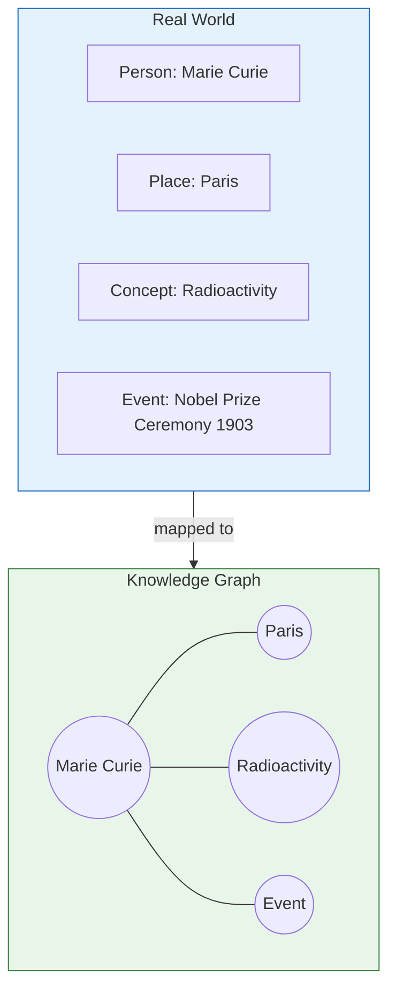

### 5.1.2 Entity Types and Categories
### 5.1.2 개체 유형 및 범주

Entities can be categorized in multiple ways:
개체는 여러 방식으로 분류할 수 있습니다:

#### By Semantic Type
#### 의미 유형별

| Category | Examples | GraphRAG Handling |
|----------|----------|-------------------|
| **Persons** | Marie Curie, Albert Einstein | High priority, core entities |
| **인물** | 마리 퀴리, 알버트 아인슈타인 | 높은 우선순위, 핵심 개체 |
| **Organizations** | Microsoft, NASA | Important for institutional queries |
| **조직** | 마이크로소프트, NASA | 기관 쿼리에 중요 |
| **Locations** | Paris, Mars, Pacific Ocean | Enable geographic queries |
| **위치** | 파리, 화성, 태평양 | 지리적 쿼리 가능 |
| **Concepts** | Radioactivity, Gravity, Justice | Domain-specific, variable importance |
| **개념** | 방사능, 중력, 정의 | 도메인 특정, 가변적 중요도 |
| **Events** | World War II, Moon Landing | Temporal relationships |
| **사건** | 제2차 세계대전, 달 착륙 | 시간적 관계 |
| **Artifacts** | Eiffel Tower, Mona Lisa | Cultural entities |
| **인공물** | 에펠탑, 모나리자 | 문화적 개체 |
| **Dates/Times** | 1898, 20th Century | Temporal anchoring |
| **날짜/시간** | 1898년, 20세기 | 시간적 고정 |
| **Quantities** | 100kg, $5M | Measurement entities |
| **수량** | 100kg, 500만 달러 | 측정 개체 |

#### By Abstraction Level
#### 추상화 수준별

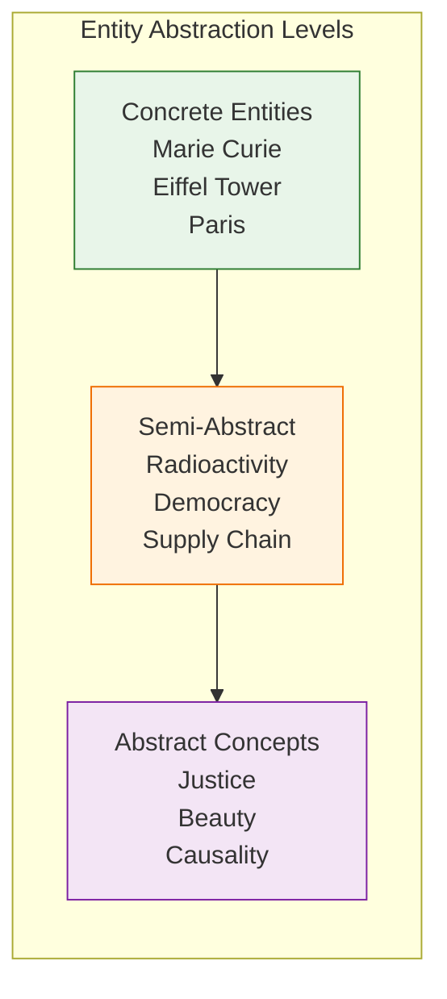

### 5.1.3 Importance in Knowledge Representation
### 5.1.3 지식 표현에서의 중요성

Entities are the foundation of knowledge representation because they:
개체는 지식 표현의 기초입니다. 그 이유는 다음과 같습니다:

1. **Anchor meaning**: Concepts become manipulable objects
1. **의미 고정**: 개념이 조작 가능한 객체가 됩니다
2. **Enable connections**: Relationships connect entities
2. **연결 가능**: 관계가 개체를 연결합니다
3. **Support reasoning**: Inferences travel through entity networks
3. **추론 지원**: 추론이 개체 네트워크를 통해 전파됩니다
4. **Provide context**: Entities carry descriptive information
4. **컨텍스트 제공**: 개체가 설명 정보를 전달합니다

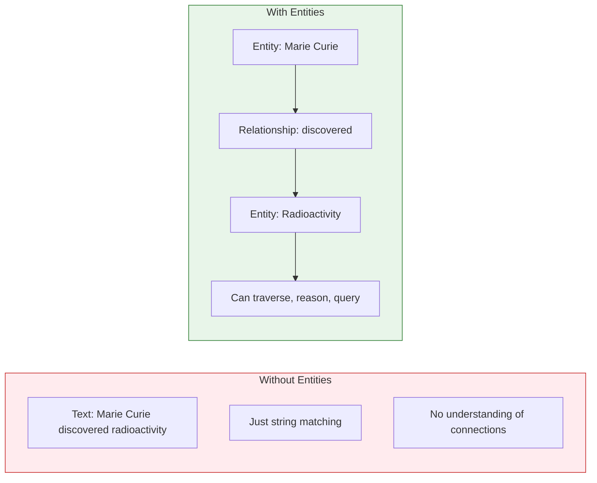

### 5.1.4 Examples Across Domains
### 5.1.4 도메인별 예시

| Domain | Sample Entities | Relationships |
|--------|----------------|---------------|
| **Academic** | Papers, Authors, Institutions | cites, authored-by, affiliated-with |
| **학술** | 논문, 저자, 기관 | 인용, 작성, 소속 |
| **Legal** | Cases, Statutes, Parties | precedent, applies-to, argued-by |
| **법률** | 사건, 법규, 당사자 | 판례, 적용, 논증 |
| **Medical** | Diseases, Treatments, Symptoms | treats, causes, symptom-of |
| **의학** | 질병, 치료법, 증상 | 치료, 원인, 증상 |
| **News** | People, Events, Organizations | covered, participant-in, located-at |
| **뉴스** | 사람, 사건, 조직 | 보도, 참여, 위치 |
| **Finance** | Companies, Stocks, Markets | owns, trades-on, competitor |
| **금융** | 회사, 주식, 시장 | 소유, 거래, 경쟁 |

---

## 5.2 LLM-Based Entity Extraction
## 5.2 LLM 기반 개체 추출

### 5.2.1 How LLMs Extract Entities
### 5.2.1 LLM이 개체를 추출하는 방법

LLMs extract entities through **prompted generation**, not classification:
LLM은 분류가 아닌 **프롬프트 기반 생성**을 통해 개체를 추출합니다:

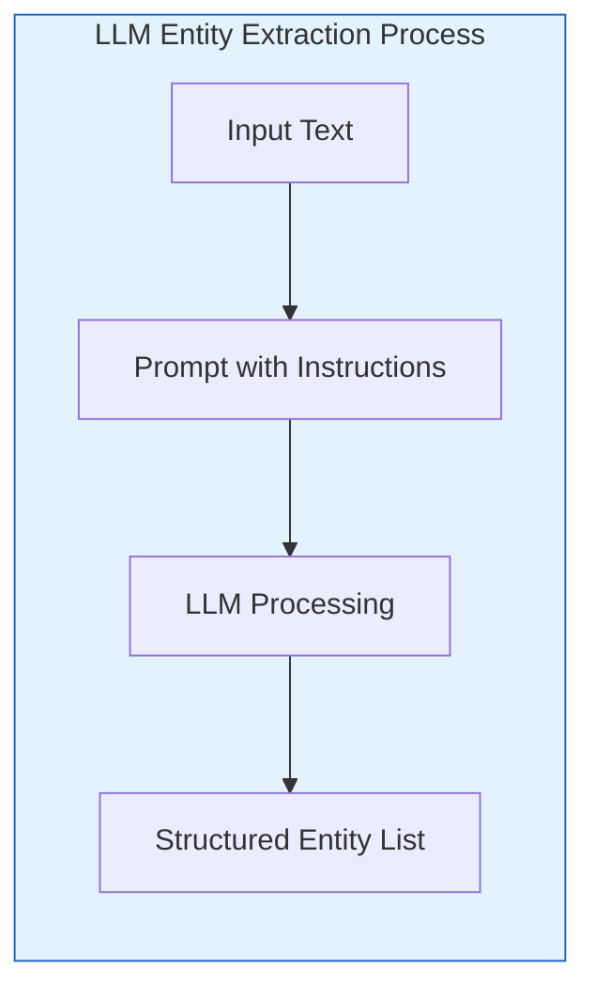

**Key difference from traditional NER:**
**전통 NER과의 핵심 차이점:**
- Traditional NER: Classification model (tag each token)
- 전통 NER: 분류 모델 (각 토큰에 태그 지정)
- LLM extraction: Generation (output entities in structured format)
- LLM 추출: 생성 (구조화된 형식으로 개체 출력)

### 5.2.2 Prompt Design for Entity Extraction
### 5.2.2 개체 추출을 위한 프롬프트 설계

#### Basic Entity Extraction Prompt
#### 기본 개체 추출 프롬프트

```markdown
You are an expert at identifying entities in text.

From the text below, extract all important entities.
For each entity, provide:
- name: the entity name
- type: the entity type (PERSON, ORGANIZATION, LOCATION, CONCEPT, etc.)
- description: a brief description

Text: {text}

Respond in JSON format:
{
  "entities": [
    {"name": "...", "type": "...", "description": "..."}
  ]
}
```

#### Domain-Specific Prompt Enhancement
#### 도메인 특정 프롬프트 향상

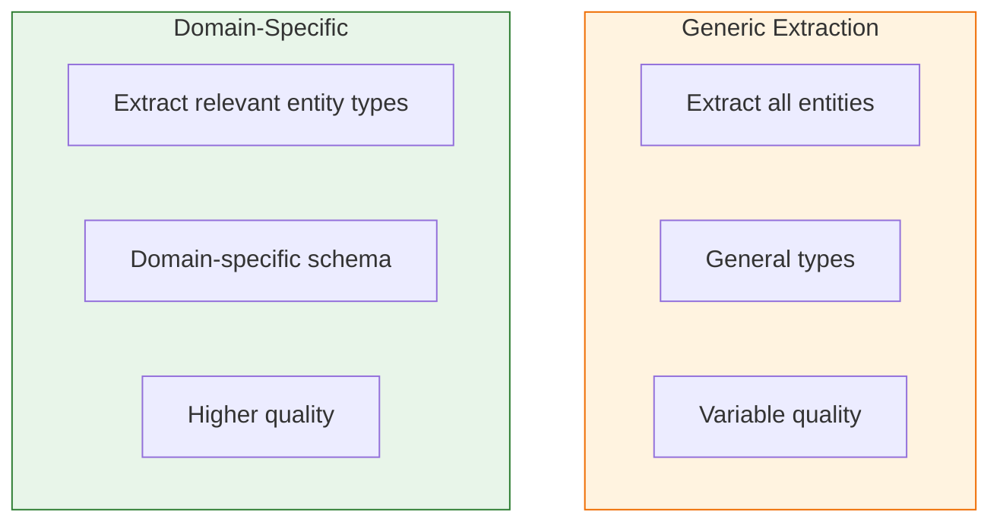

**Example: Scientific Paper Extraction**
**예시: 과학 논문 추출**

```markdown
You are analyzing scientific papers.

Extract entities relevant to scientific research:
- RESEARCHER: People who conduct research
- INSTITUTION: Universities, labs, organizations
- CONCEPT: Scientific concepts, theories, phenomena
- METHOD: Research methods, techniques
- METRIC: Measurements, statistics, performance metrics

Text: {text}
```

### 5.2.3 Handling Entity Ambiguity
### 5.2.3 개체 모호성 처리

Entities can be ambiguous in multiple ways:
개체는 여러 방식으로 모호할 수 있습니다:

#### Types of Ambiguity
#### 모호성 유형

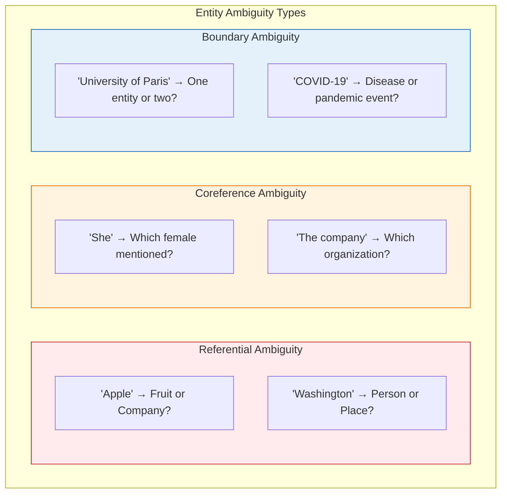

#### Strategies for Resolution
#### 해결 전략

| Strategy | Description | Implementation |
|----------|-------------|----------------|
| **Contextual disambiguation** | Use surrounding text | LLM naturally handles this |
| **컨텍스트적 명확화** | 주변 텍스트 사용 | LLM이 자연스럽게 처리 |
| **Type constraints** | Use schema to guide | Prompt specifies valid types |
| **유형 제약** | 스키마를 사용하여 안내 | 프롬프트가 유효한 유형 지정 |
| **Confidence scoring** | Assign uncertainty | LLM can provide confidence |
| **신뢰도 점수** | 불확실성 할당 | LLM이 신뢰도 제공 가능 |
| **Entity linking** | Link to knowledge base | Post-processing step |
| **개체 연결** | 지식 베이스 연결 | 후처리 단계 |
| **Coreference resolution** | Resolve pronouns | Separate NLP step or LLM prompt |
| **공지 참조 해결** | 대명사 해결 | 별도 NLP 단계 또는 LLM 프롬프트 |

### 5.2.4 Multi-Level Entity Hierarchies
### 5.2.4 다중 수준 개체 계층 구조

Entities often exist in hierarchies:
개체는 종종 계층 구조로 존재합니다:

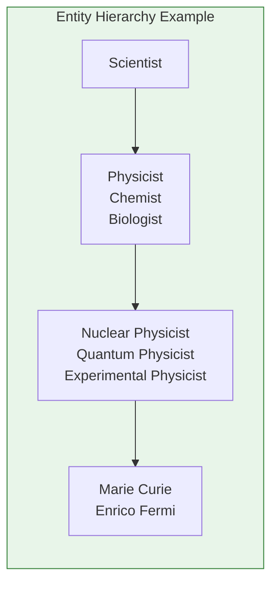

**Extraction strategies for hierarchies:**
**계층 구조 추출 전략:**

1. **Extract at most specific level**: Let LLM find specific entity types
1. **가장 구체적인 수준에서 추출**: LLM이 구체적인 개체 유형 찾도록 함
2. **Post-hoc generalization**: Map specific to general categories
2. **사후 일반화**: 구체적에서 일반적 범주로 매핑
3. **Hierarchy in schema**: Prompt includes type hierarchy
3. **스키마에 계층 구조 포함**: 프롬프트에 유형 계층 구조 포함

```markdown
Extract entities with the most specific applicable type:
- Person → Scientist → Physicist → Nuclear Physicist
Use the most specific level that applies.
```

---

## 5.3 Entity Quality and Validation
## 5.3 개체 품질 및 검증

### 5.3.1 What Makes a "Good" Entity?
### 5.3.1 "좋은" 개체의 조건

A good entity should be:
좋은 개체는 다음 조건을 만족해야 합니다:

| Quality Criterion | Description | Example |
|-------------------|-------------|---------|
| **Distinctive** | Clearly distinguishable | "Marie Curie" ✓ vs "Person" ✗ |
| **명확성** | 명확히 구별 가능 | "마리 퀴리" ✓ vs "사람" ✗ |
| **Informative** | Carries semantic meaning | "Radioactivity" ✓ vs "Thing" ✗ |
| **정보성** | 의미론적 정보 전달 | "방사능" ✓ vs "것" ✗ |
| **Stable** | Consistently referenced | "United Nations" ✓ vs "The organization" ✗ |
| **안정성** | 일관되게 참조됨 | "유엔" ✓ vs "그 조직" ✗ |
| **Queryable** | Likely to be searched for | "Eiffel Tower" ✓ vs "Building #42" ✗ |
| **조회 가능성** | 검색될 가능성 높음 | "에펠탑" ✓ vs "건물 #42" ✗ |
| **Connectable** | Can relate to other entities | "Paris" connects to many things |
| **연결 가능성** | 다른 개체와 관계 형성 | "파리"는 많은 것과 연결 |

### 5.3.2 Filtering and Ranking Entities
### 5.3.2 개체 필터링 및 순위 매기기

Not all extracted entities are equally valuable.
모든 추출된 개체가 동일하게 가치 있는 것은 아닙니다.

#### Filtering Criteria
#### 필터링 기준

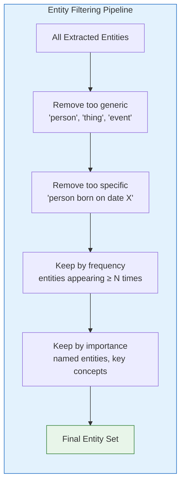

#### Ranking Metrics
#### 순위 매기기 지표

| Metric | Formula | Use Case |
|--------|---------|----------|
| **Degree centrality** | Number of relationships | Find well-connected entities |
| **차수 중심성** | 관계 수 | 잘 연결된 개체 찾기 |
| **Text frequency** | Count across documents | Find important concepts |
| **텍스트 빈도** | 문서 전체 수 | 중요한 개념 찾기 |
| **PageRank** | Importance based on links | Find influential entities |
| **PageRank** | 링크 기반 중요도 | 영향력 있는 개체 찾기 |
| **Human curation** | Manual review | Domain-specific filtering |
| **사람 큐레이션** | 수동 검토 | 도메인 특정 필터링 |

### 5.3.3 Entity Resolution (Deduplication)
### 5.3.3 개체 해결 (중복 제거)

**Entity resolution** identifies when different surface forms refer to the same entity.
**개체 해결(entity resolution)**은 서로 다른 표면 형식이 동일한 개체를 참조할 때를 식별합니다.

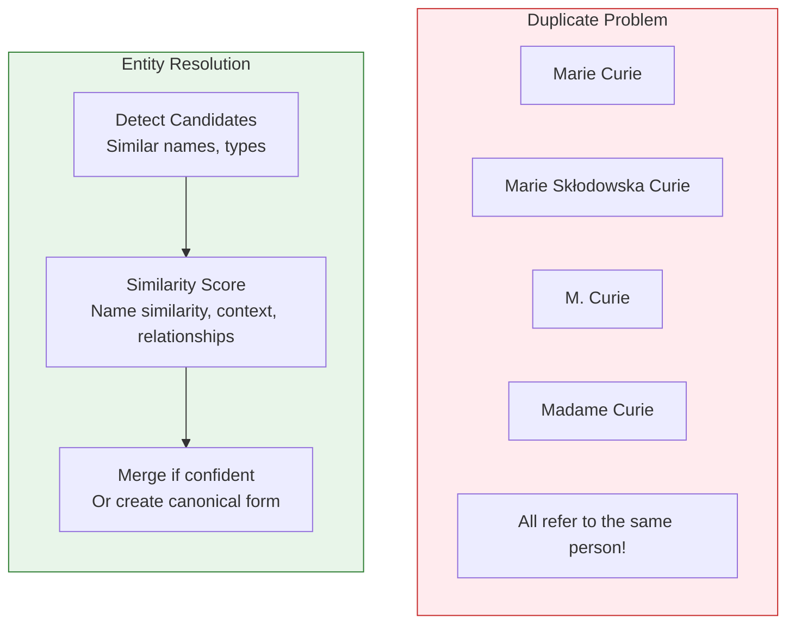

#### Resolution Strategies
#### 해결 전략

| Strategy | Technique | Pros | Cons |
|----------|-----------|------|------|
| **String similarity** | Levenshtein, Jaccard | Fast | Misses many variants |
| **문자열 유사도** | 레벤슈타인, 자카드 | 빠름 | 많은 변형 누락 |
| **Embedding similarity** | Vector similarity | Captures semantics | May confuse different entities |
| **임베딩 유사도** | 벡터 유사도 | 의미 포착 | 다른 개체 혼동 가능 |
| **Graph-based** | Shared relationships | Very accurate | Computationally expensive |
| **그래프 기반** | 공유 관계 | 매우 정확함 | 계산 비용 높음 |
| **LLM-based** | Ask LLM if same | Most accurate | Expensive, slow |
| **LLM 기반** | LLM에 동일 여부 질문 | 가장 정확함 | 비싸고 느림 |

### 5.3.4 Quality Metrics
### 5.3.4 품질 지표

#### Entity Extraction Quality Metrics
#### 개체 추출 품질 지표

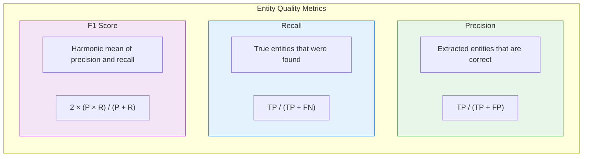

**Additional domain-specific metrics:**
**추가 도메인 특정 지표:**
- **Type accuracy**: Percentage of correctly typed entities
- **유형 정확도**: 올바르게 입력된 개체의 백분율
- **Coverage**: How many important entities are captured
- **커버리지**: 포착된 중요한 개체의 수
- **Consistency**: Same entity extracted consistently across documents
- **일관성**: 문서 전체에서 동일한 개체가 일관되게 추출됨

---

## 5.4 Entity Extraction in GraphRAG
## 5.4 GraphRAG에서의 개체 추출

### 5.4.1 The GraphRAG Extraction Pipeline
### 5.4.1 GraphRAG 추출 파이프라인

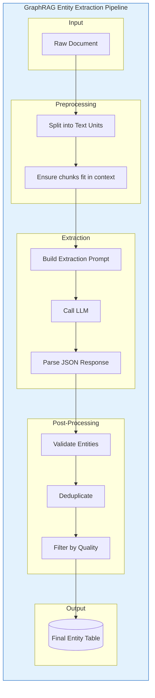

### 5.4.2 Chunking Strategies
### 5.4.2 청킹 전략

The size and composition of text chunks affects extraction quality.
텍스트 청크의 크기와 구성은 추출 품질에 영향을 미칩니다.

#### Chunk Size Tradeoffs
#### 청크 크기 트레이드오프

| Chunk Size | Advantages | Disadvantages |
|------------|------------|---------------|
| **Small** (1-2 sentences) | Focused, less noise | May miss cross-sentence entities |
| **작음** (1-2문장) | 집중됨, 노이즈 적음 | 문장 간 개체 누락 가능 |
| **Medium** (paragraph) | Good balance | May have multiple topics |
| **중간** (문단) | 좋은 균형 | 여러 주제 포함 가능 |
| **Large** (document) | Complete context | Expensive, less focused |
| **큼** (문서) | 완전한 컨텍스트 | 비쌈, 덜 집중됨 |

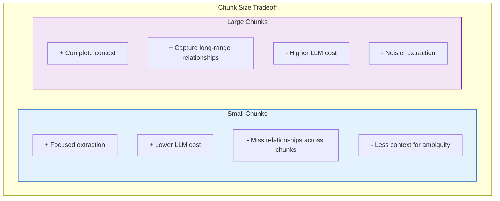

#### GraphRAG's Approach: Overlapping Chunks
#### GraphRAG의 접근법: 중첩 청크

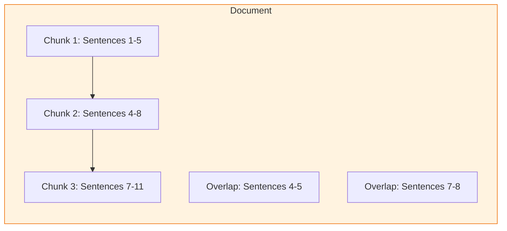

**Benefits of overlapping chunks:**
**중첩 청크의 이점:**
- Entities at boundaries won't be missed
- 경계에 있는 개체를 놓치지 않음
- Reduces inconsistency across chunks
- 청크 간 불일치 감소
- Better context for ambiguous entities
- 모호한 개체에 대한 더 나은 컨텍스트

### 5.4.3 Entity Type Schemas
### 5.4.3 개체 유형 스키마

GraphRAG allows flexible entity schemas:
GraphRAG은 유연한 개체 스키마를 허용합니다:

#### Minimal Schema
#### 최소 스키마

```json
{
  "entity_types": [
    "PERSON",
    "ORGANIZATION",
    "LOCATION",
    "CONCEPT"
  ]
}
```

#### Rich Schema (Domain-Specific)
#### 풍부한 스키마 (도메인 특정)

```json
{
  "entity_types": {
    "PERSON": {
      "subtypes": ["SCIENTIST", "POLITICIAN", "ARTIST"],
      "attributes": ["birth_date", "nationality"]
    },
    "CONCEPT": {
      "subtypes": ["SCIENTIFIC_THEORY", "PHENOMENON", "METHOD"],
      "attributes": ["domain", "year_discovered"]
    }
  }
}
```

### 5.4.4 Handling Edge Cases
### 5.4.4 엣지 케이스 처리

#### Difficult Entity Types
#### 어려운 개체 유형

| Challenge | Example | Strategy |
|-----------|---------|----------|
| **Temporal expressions** | "last decade", "the 90s" | Extract as date entities or normalize |
| **시간 표현** | "지난 10년", "90년대" | 날짜 개체로 추출 또는 정규화 |
| **Quantities** | "millions", "5 kg" | Extract with units |
| **수량** | "수백만", "5kg" | 단위와 함께 추출 |
| **Negations** | "not cancer" | Include negation in entity description |
| **부정** | "암이 아님" | 개체 설명에 부정 포함 |
| **Hypotheticals** | "proposed theory" | Mark as hypothetical |
| **가정** | "제안된 이론" | 가상으로 표시 |
| **Fiction** | "Sherlock Holmes" | Tag as fictional if needed |
| **픽션** | "셜록 홈즈" | 필요시 가상으로 태그 |

#### Multi-Word Entities
#### 다단어 개체

```
Challenge: "University of California, Berkeley"
Options:
- Single entity: University of California, Berkeley ✓
- Split: University + California + Berkeley ✗
```

**Strategy**: Let LLM determine boundaries with guidance:
**전략**: LLM이 안내에 따라 경계 결정하도록 함:

```markdown
Extract the most specific, complete entity names.
Include all modifiers and qualifiers as part of the entity name.
```

---

## 5.5 The Entity Table Structure
## 5.5 개체 테이블 구조

### 5.5.1 GraphRAG Entity Schema
### 5.5.1 GraphRAG 개체 스키마

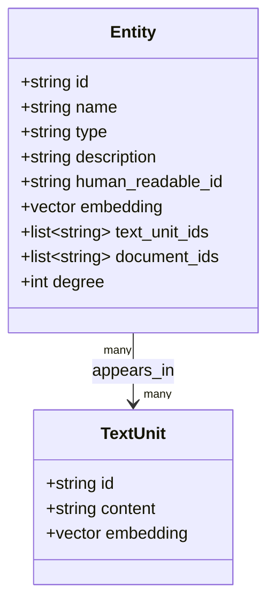

### 5.5.2 Example Entity Record
### 5.5.2 예시 개체 레코드

```json
{
  "id": "ent_00123",
  "name": "Marie Curie",
  "type": "PERSON",
  "description": "Polish-French physicist and chemist who conducted pioneering research on radioactivity",
  "human_readable_id": "marie-curie",
  "embedding": [0.234, -0.567, 0.891, ...],
  "text_unit_ids": ["tu_001", "tu_015", "tu_023"],
  "document_ids": ["doc_001"],
  "degree": 12,
  "attributes": {
    "birth_year": "1867",
    "death_year": "1934",
    "nationality": "Polish-French",
    "nobel_prizes": 2
  }
}
```

---

## Chapter Summary
## 장 요약

In this chapter, we covered entity extraction in GraphRAG:
이 장에서는 GraphRAG의 개체 추출을 다루었습니다:

**Key Concepts:**
**핵심 개념:**
- **Entities** are distinct, identifiable objects that form knowledge graph nodes
- **개체**는 지식 그래프 노드를 형성하는 구별 가능하고 식별 가능한 객체입니다
- Entity types include persons, organizations, locations, concepts, events, and more
- 개체 유형에는 인물, 조직, 위치, 개념, 사건 등이 포함됩니다
- **LLM-based extraction** uses prompted generation, not classification
- **LLM 기반 추출**은 분류가 아닌 프롬프트 기반 생성을 사용합니다

**Extraction Techniques:**
**추출 기술:**
- **Prompt design** specifies entity types and output format
- **프롬프트 설계**는 개체 유형과 출력 형식을 지정합니다
- **Ambiguity handling** requires context, constraints, and confidence scoring
- **모호성 처리**는 컨텍스트, 제약 조건, 신뢰도 점수가 필요합니다
- **Hierarchical entities** can be extracted at specific or general levels
- **계층적 개체**는 구체적 또는 일반적 수준에서 추출할 수 있습니다

**Quality Assurance:**
**품질 보증:**
- **Filtering** removes generic or overly specific entities
- **필터링**은 일반적이거나 지나치게 구체적인 개체를 제거합니다
- **Entity resolution** merges duplicate surface forms
- **개체 해결**은 중복된 표면 형식을 병합합니다
- **Quality metrics** include precision, recall, and type accuracy
- **품질 지표**에는 정밀도, 재현율, 유형 정확도가 포함됩니다

**GraphRAG Implementation:**
**GraphRAG 구현:**
- **Chunking** with overlap balances context and cost
- **청킹**은 중첩을 통해 컨텍스트와 비용의 균형을 맞춥니다
- **Flexible schemas** allow domain-specific entity types
- **유연한 스키마**는 도메인 특정 개체 유형을 허용합니다
- **Post-processing** validates, deduplicates, and filters entities
- **후처리**는 개체를 검증, 중복 제거, 필터링합니다

**Next Steps:**
**다음 단계:**
With entities identified, [[Textbook - Relationship Extraction]] will cover how to find and extract the connections between entities.
개체가 식별되었으므로, [[Textbook - Relationship Extraction]]에서 개체 간의 연결을 찾고 추출하는 방법을 다룹니다.

---

## Review Questions
## 복습 문제

1. What is an entity and why are they important for knowledge graphs?
1. 개체란 무엇이며 지식 그래프에서 중요한 이유는 무엇인가요?
2. How does LLM-based entity extraction differ from traditional NER?
2. LLM 기반 개체 추출은 전통 NER과 어떻게 다른가요?
3. Describe three types of entity ambiguity and how to handle them.
3. 개체 모호성의 세 가지 유형과 처리 방법을 설명하세요.
4. What are the tradeoffs between small and large text chunks for extraction?
4. 추출을 위한 작은 텍스트 청크와 큰 텍스트 청크의 트레이드오프는 무엇인가요?
5. How does entity resolution work, and why is it necessary?
5. 개체 해결은 어떻게 작동하며 왜 필요한가요?
6. What fields are included in GraphRAG's entity table schema?
6. GraphRAG의 개체 테이블 스키마에 포함된 필드는 무엇인가요?

---

## Exercises
## 연습 문제

1. Design an entity extraction prompt for a news article domain. What entity types would you include, and why?
1. 뉴스 기사 도메인을 위한 개체 추출 프롬프트를 설계하세요. 어떤 개체 유형을 포함하시겠습니까, 그 이유는?

2. Given these surface forms, determine which refer to the same entity:
2. 다음 표면 형식 중 동일한 개체를 참조하는 것을 결정하세요:
   - "Apple"
   - "Apple Inc."
   - "AAPL"
   - "the Cupertino company"
   - "a fruit"

3. You're extracting from scientific papers. Some papers mention "CNN" (the network) while others mention "CNN" (Convolutional Neural Network). How would you handle this ambiguity?
3. 과학 논문에서 추출 중입니다. 일부 논문은 "CNN"(네트워크)을 언급하고 다른 논문은 "CNN"(합성곱 신경망)을 언급합니다. 이 모호성을 어떻게 처리하시겠습니까?

---

## Further Reading
## 추가 참고자료

- "Named Entity Recognition" survey (Nadeau & Sekine)
- "Entity Resolution: Theoretical Foundations and Applications"
- GraphRAG entity extraction documentation
- LLM prompt engineering for information extraction
