# Chapter 2: Graph Theory Fundamentals

## 학습 목표

이 장을 마치면 다음을 수행할 수 있습니다:
- 그래프의 정의와 구성 요소 식별
- 다양한 그래프 유형 구별
- 지식 그래프의 개념 이해
- GraphRAG에 사용되는 기본 그래프 알고리즘 설명
- 정보 검색 맥락에서 그래프 용어 올바르게 사용

---

## 2.1 그래프와 그래프 구조

### 2.1.1 그래프란 무엇인가?

수학과 컴퓨터 과학에서 **그래프**는 객체 간의 관계를 나타내는 구조입니다. 두 가지 기본 구성 요소로组成됩니다.

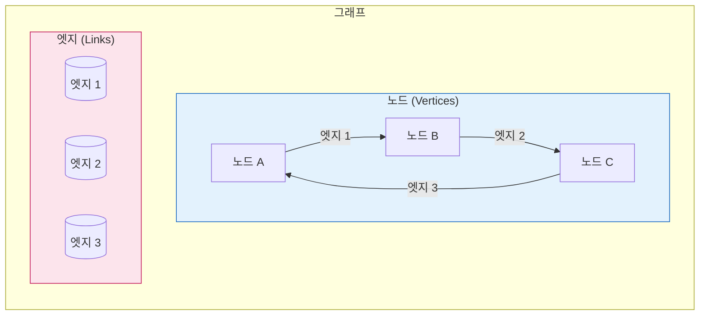

**형식적 정의:**

그래프 G는 쌍 (V, E)로 표현하며:
- **V**는 꼭짓점(노드라고도 함)의 집합
- **E**는 각각 두 꼭짓점을 연결하는 엣지의 집합

**GraphRAG에서:**
- **꼭짓점(V)** → 개체(사람, 장소, 개념, 문서)
- **엣지(E)** → 관계(연결됨, 인용함,함께 일함)

### 2.1.2 필수 그래프 용어

| 용어 | 정의 | GraphRAG 예시 |
|------|------------|--------------|
| **꼭짓점 / 노드** | 객체를 나타내는 기본 단위 | "마리 퀴리", "파리", "방사선" |
| **엣지 / 링크** | 두 노드 사이의 연결 | 마리 퀴리 --발견→ 방사선 |
| **차수 (Degree)** | 노드에 연결된 엣지 수 | 개체가 가진 관계 수 |
| **이웃 (Neighbor)** | 엣지로 연결된 노드 | 특정 개체와 직접 관련된 개체들 |
| **경로 (Path)** | 노드를 연결하는 엣지 시퀀스 | A에서 B로의 관계 체인 |
| **순환 (Cycle)** | 같은 노드에서 시작하고 끝나는 경로 | 상호연결된 개체의 루프 |
| **연결 성분** | 모든 노드가 연결된 부분 그래프 | 관련된 개체의 클러스터 |
| **고립 노드** | 엣지가 없는 노드 | 발견된 관계가 없는 개체 |

### 2.1.3 그래프 유형

#### 유향 그래프 vs. 무향 그래프

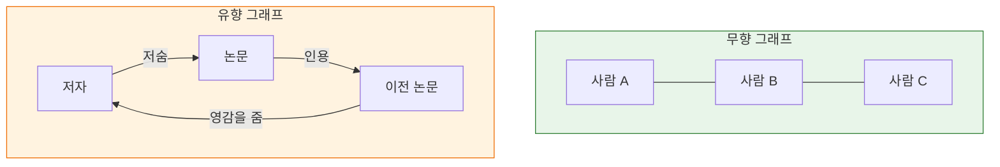

**무향 그래프:** 엣지에 방향이 없습니다. 관계가 대칭적입니다.
- 예: "연결됨" 또는 "관련됨"
- GraphRAG에서: 동시 출현 관계

**유향 그래프:** 엣지가 소스에서 타겟으로의 방향을 가집니다.
- 예: "인용함", "영향을 줌", "위치"
- GraphRAG에서: 인용 네트워크, 계층적 관계

#### 가중치 그래프 vs. 무가중치 그래프

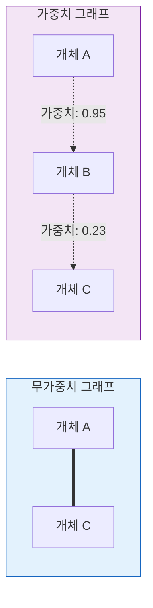

**가중치 그래프:** 각 엣지에 강도, 빈도 또는 중요성을 나타내는 숫자 값(가중치)이 있습니다.
- GraphRAG에서: 관계 가중치는 연결이 얼마나 강하거나 중요한지 나타냄
- 더 높은 가중치 = 더 강한 관계 = 검색에 더 관련성

#### 단순 그래프 vs. 멀티그래프

| 유형 | 설명 | GraphRAG 사용 |
|------|-------------|--------------|
| **단순 그래프** | 두 노드 사이에 최대 하나의 엣지 | 드뭄 - 개체는 종종 여러 관계 유형 보유 |
| **멀티그래프** | 노드 간 여러 엣지 허용 | 일반적 - 같은 개체 쌍이 "인용함" AND "기반" 가능 |

### 2.1.4 그래프 시각화

그래프는 다양한 방식으로 시각화할 수 있습니다.

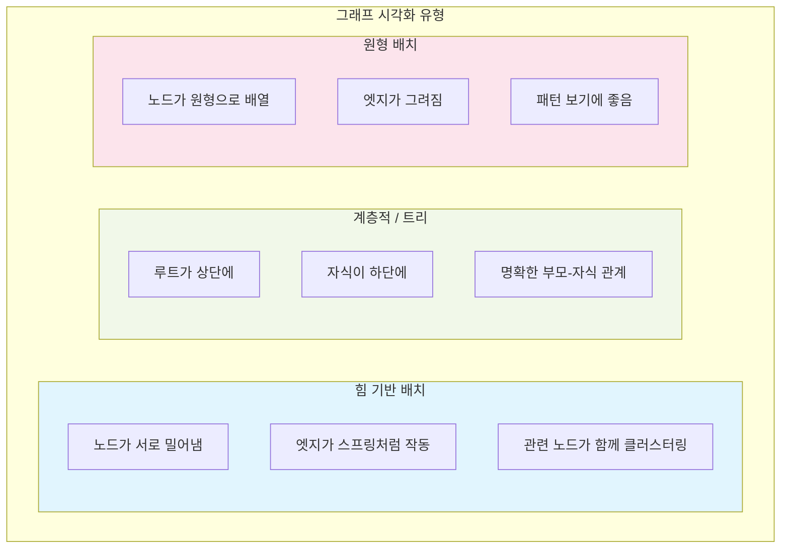

**GraphRAG에서:** 힘 기반 배치가 자주 사용됩니다. 관련 개체의 클러스터(커뮤니티가 됨)를 자연스럽게 보여주기 때문입니다.

---

## 2.2 지식 그래프

### 2.2.1 지식 그래프란 무엇인가?

**지식 그래프(KG)**는 다음과 같은 그래프입니다.
- **노드**가 실제 개체(구체적 또는 추상적)를 나타냄
- **엣지**가 개체 간 관계를 나타냄
- 개체와 관계 모두 **유형**과 **속성**을 가짐

**핵심 통찰:** 일반 그래프와 달리 지식 그래프는 모든 요소에 **의미적 의미**가 부여됩니다.

### 2.2.2 트리플 구조

지식 그래프는 다음 형식의 **트리플**로 구축됩니다.

```
주어 ──술어──> 목적어
```

또는 `(주어, 술어, 목적어)`로 표기

**예시:**
- `(마리 퀴리, 발견, 방사선)`
- `(파리, 수도, 프랑스)`
- `(아인슈타인, 태어난 곳, 독일)`
- `(GPT-4, 개발자, OpenAI)`

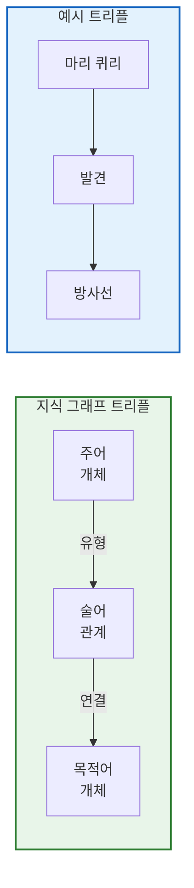

### 2.2.3 온톨로지와 스키마

**온톨로지**는 지식 그래프에 존재할 수 있는 개체와 관계 유형을 정의합니다.

**온톨로지 구성 요소:**

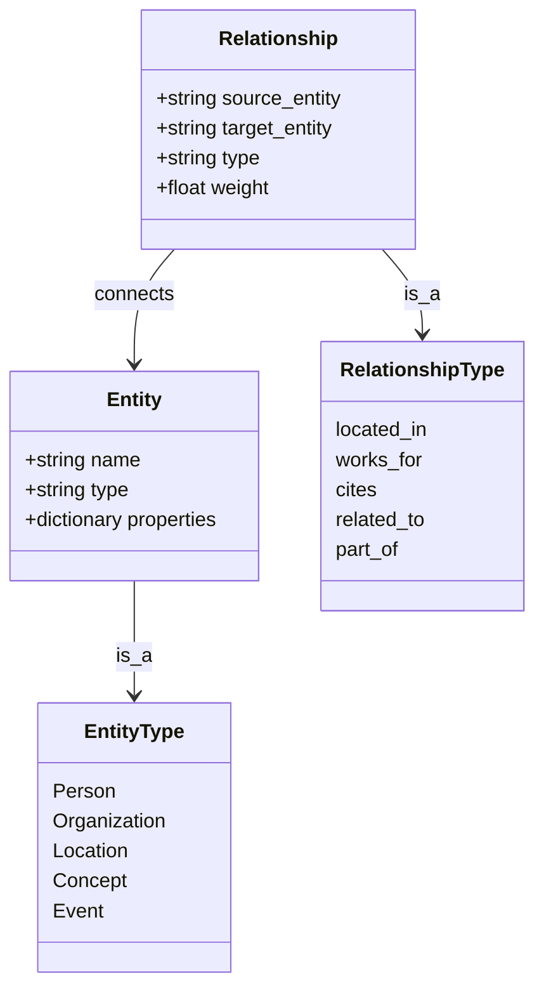

**GraphRAG에서:**
- 개체 유형은 추출 중에 발견됨 (Person, Organization, Concept 등)
- 관계 유형은 텍스트에서 나타남 (cited-by, mentioned-with, contains 등)
- 스키마는 종종 엄격하게 사전 정의되기보다 **유연함**

### 2.2.4 유명한 지식 그래프

| 지식 그래프 | 설명 | 규모 |
|-----------------|-------------|-------|
| **Google 지식 그래프** | Google의 지식 패널 강화 | 5000억+ 사실 |
| **Wikidata** | 오픈 협업 지식 베이스 | 1억+ 항목 |
| **DBpedia** | Wikipedia의 구조화된 데이터 | 1000만+ 개체 |
| **YAGO** | Wikipedia와 WordNet 결합 | 1000만+ 개체 |

**핵심 통찰:** 이러한 KG는 **수동으로 큐레이션**되거나 **구조화된 데이터에서 추출**됩니다. GraphRAG는 LLM을 사용하여 **비정형 텍스트에서 자동으로** 지식 그래프를 생성합니다.

### 2.2.5 속성 그래프

**속성 그래프**는 노드와 엣지 모두에서 키-값 쌍을 허용합니다.

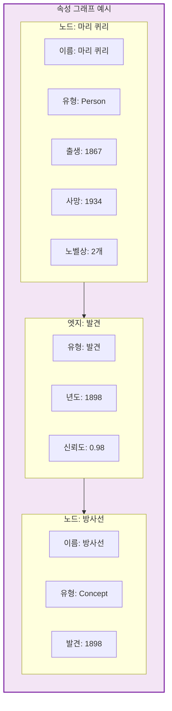

**GraphRAG는 속성 그래프를 사용**합니다:
- **개체 속성:** 이름, 유형, 설명, 소스 텍스트 유닛
- **관계 속성:** 가중치, 소스, 설명

---

## 2.3 정보 검색을 위한 그래프 알고리즘

### 2.3.1 그래프 알고리즘이 중요한 이유

그래프 알고리즘을 통해 다음을 수행할 수 있습니다.
- 순회를 통한 **관련 정보 찾기**
- 커뮤니티 탐지를 통한 **구조 발견**
- 중심성 측정을 통한 **중요성 랭킹**
- 효율적인 경로를 통한 **검색 최적화**

### 2.3.2 그래프 순회

**순회**는 엣지를 따라 그래프의 노드를 방문하는 과정입니다.

#### 너비 우선 탐색 (BFS)

현재 깊이의 모든 이웃을 먼저 방문한 후 더 깊이 들어갑니다.

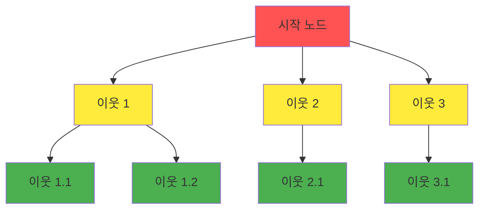

**GraphRAG 사용:** 쿼리 개체부터 특정 "거리"(홉) 내의 모든 개체 찾기.

#### 깊이 우선 탐색 (DFS)

각 분기를 따라 가능한 한 깊이 탐색한 후 역추적합니다.

**GraphRAG 사용:** 관계 체인을 따라 먼 연결 찾기.

### 2.3.3 경로 탐색

**최단 경로**는 두 노드 사이의 최소 엣지 수를 찾습니다.

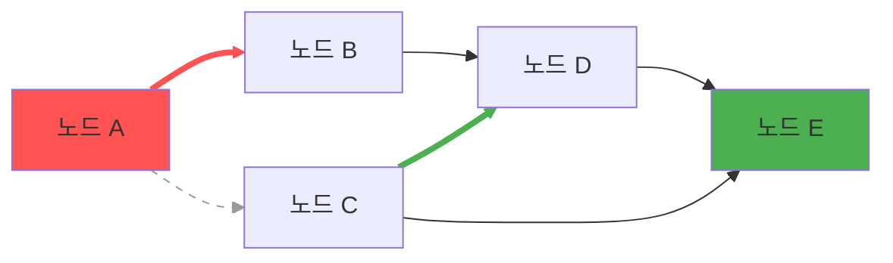

**최단 경로:** A → B → D → E (3홉)

**GraphRAG 사용:** 거리 개념이 어떻게 관련되는지 이해, 간접 연결 찾기.

### 2.3.4 중심성 측정

중심성은 그래프에서 가장 "중요한" 노드를 식별합니다.

| 측정항목 | 측정 대상 | GraphRAG 사용 |
|---------|------------------|--------------|
| **차수 중심성** | 연결 수 | 잘 연결된 개체 식별 |
| **매개 중심성** | 최단 경로상 노드 등장 빈도 | 커뮤니티 연결 브리지 개체 찾기 |
| **근접 중심성** | 모든 노드까지의 평균 거리 | 중앙 개체 식별 |
| **PageRank** | 링크하는 사람에 기반한 중요성 | 영향력별 개체 랭킹 |

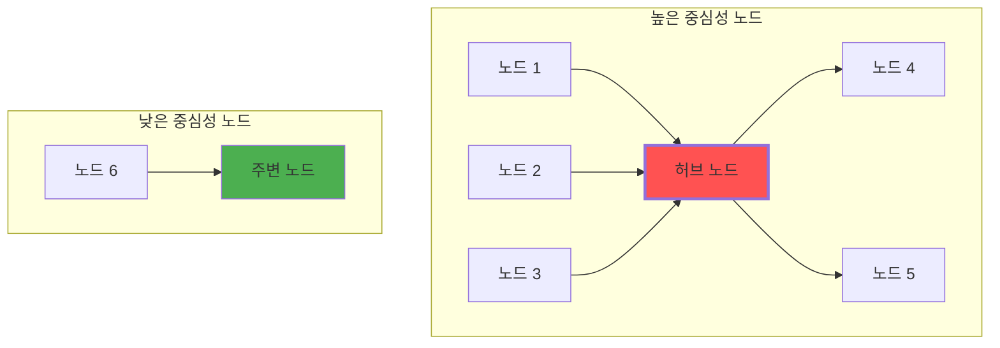

### 2.3.5 커뮤니티 탐지 개요

**커뮤니티 탐지**는 밀접하게 연결된 노드 그룹을 찾습니다.

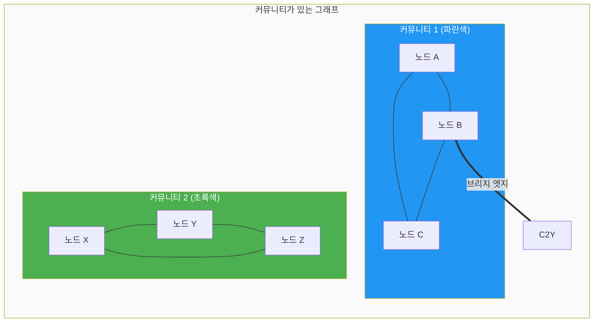

**중요한 이유:**
- 커뮤니티는 **일관된 주제나 테마**를 나타냄
- 지식의 **계층적 조직** 가능
- 효율적인 검색을 위한 **전역 요약** 가능

**GraphRAG는 Leiden 알고리즘을 사용**합니다([[Textbook - Community Detection]]에서 자세히 설명).

---

## 2.4 GraphRAG의 그래프 구조

### 2.4.1 4개 핵심 테이블

GraphRAG는 지식 그래프를 4개의 상호연결된 테이블로 표현합니다.

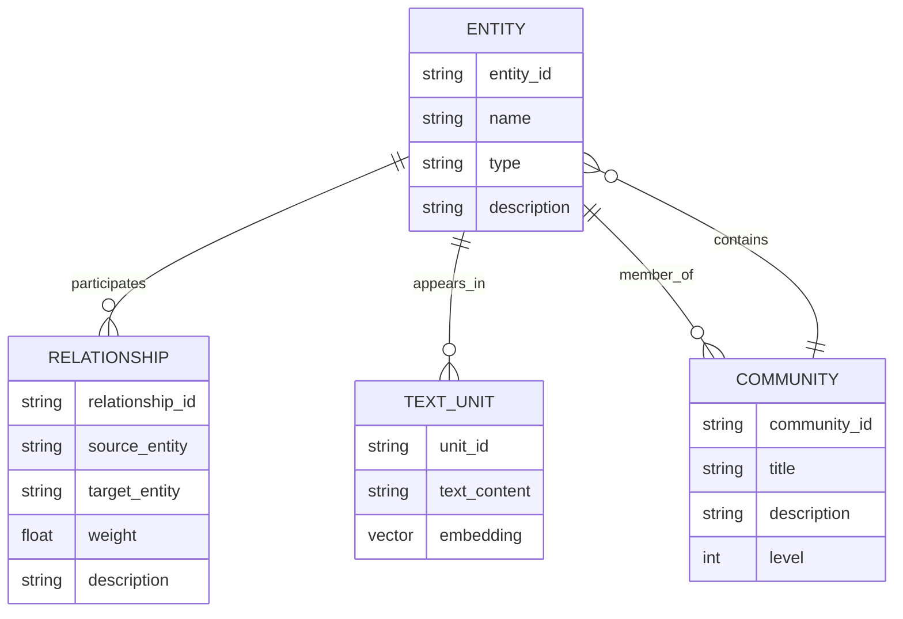

### 2.4.2 예시: 미니 지식 그래프

문서가 지식 그래프가 되는 과정을 추적해 보겠습니다.

**소스 텍스트:**
> "마리 퀴리는 1898년에 방사선을 발견했습니다. 그녀는 1903년 방사선 현상에 대한 연구로 노벨상을 수상한 최초의 여성이었습니다."

**추출된 개체:**
1. 마리 퀴리 (Person)
2. 방사선 (Concept)
3. 1898 (Year)
4. 노벨상 (Award)
5. 1903 (Year)
6. 방사선 현상 (Concept)

**추출된 관계:**
1. (마리 퀴리, 발견, 방사선) - 가중치: 1.0
2. (방사선, 발견 연도, 1898) - 가중치: 0.9
3. (마리 퀴리, 수상, 노벨상) - 가중치: 1.0
4. (노벨상, 수상 연도, 1903) - 가중치: 0.9
5. (마리 퀴리, 연구, 방사선 현상) - 가중치: 0.8
6. (방사선, 관련, 방사선 현상) - 가중치: 0.7

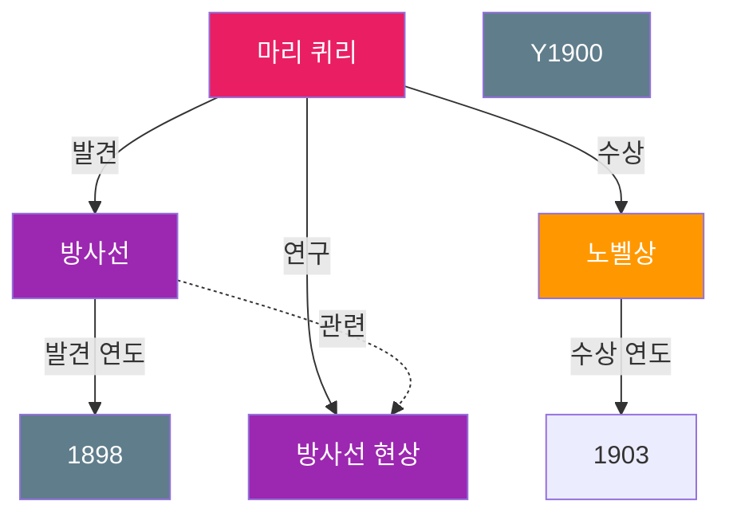

### 2.4.3 텍스트에서 그래프로: 완전한 흐름

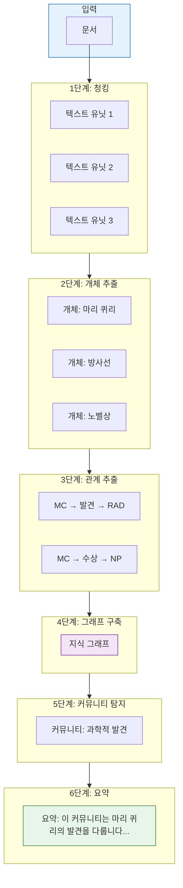

---

## 2.5 그래프 통계와 메트릭

### 2.5.1 그래프 설명

지식 그래프 작업 시 구조를 이해하는 데 도움이 되는 여러 통계가 있습니다.

| 메트릭 | 정의 | 의미 |
|--------|------------|------------------|
| **|V|** (차수) | 꼭짓점(개체) 수 | 지식 베이스 크기 |
| **\|E\|** (크기) | 엣지(관계) 수 | 지식 연결성 |
| **평균 차수** | 2\|E\|/\|V\| | 개체가 평균적으로 얼마나 연결되어 있는지 |
| **밀도** | \|E\| / (|V| × (|V|-1) / 2) | 그래프가 얼마나 완전한지 |
| **지름** | 가장 긴 최단 경로 | 거리 개체 간 거리 |
| **클러스터링 계수** | 이웃의 연결 경향 | 구조가 얼마나 커뮤니티 같은지 |

### 2.5.2 GraphRAG 특정 메트릭

GraphRAG는 여러 도메인별 메트릭을 추가합니다.

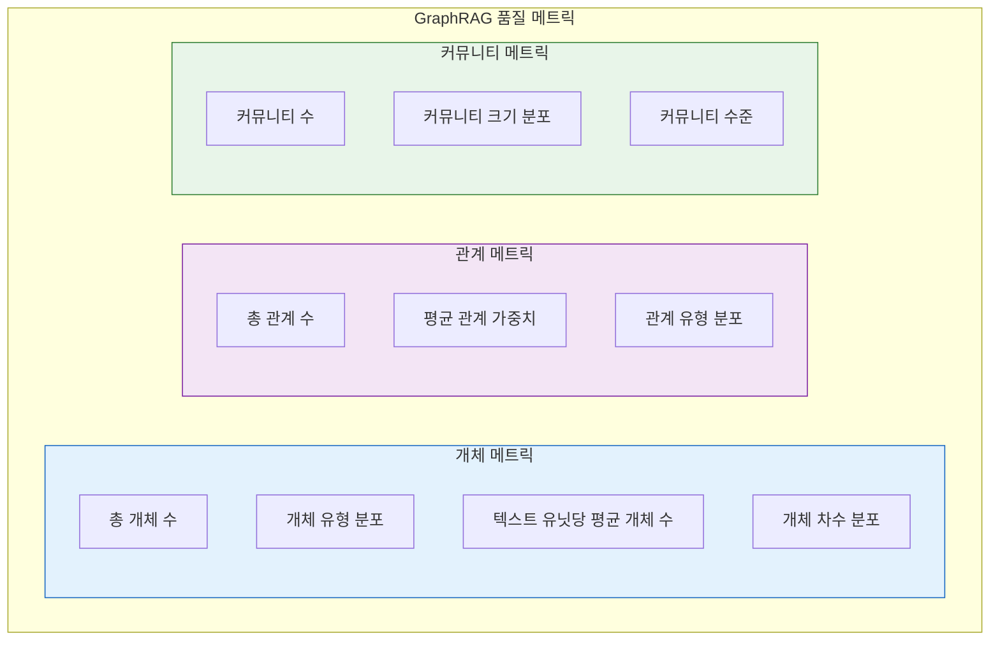

---

## 장 요약

이 장에서는 GraphRAG의 기반이 되는 그래프 이론의 기본 개념을 다루었습니다.

**핵심 개념:**
- **그래프**는 **꼭짓점**(노드)과 **엣지**(관계)로 구성됨
- **지식 그래프**는 유형과 속성을 통해 의미적 의미를 추가함
- **트리플**(주어-술어-목적어)은 지식 그래프의 구성 요소
- GraphRAG는 개체와 관계가 있는 **속성 그래프**를 사용함

**중요한 차이점:**
- **유향 vs. 무향**: 관계에 방향이 있는지
- **가중치 vs. 무가중치**: 관계에 강도 값이 있는지
- **단순 vs. 멀티**: 노드 간 여러 엣지가 존재할 수 있는지

**그래프 알고리즘:**
- **순회**(BFS, DFS)로 연결 탐색
- **경로 탐색**으로 거리 개념 간 관계 발견
- **중심성 측정**으로 중요한 개체 식별
- **커뮤니티 탐지**으로 주제 클러스터 찾기

**다음 단계:**
[[Textbook - NLP Basics]]에서 지식 그래프를 형성하는 개체와 관계를 추출하기 위해 텍스트가 어떻게 처리되는지 탐구하겠습니다.

---

## 복습 문제

1. 그래프의 두 가지 기본 구성 요소는 무엇입니까?
2. 유향 그래프와 무향 그래프의 차이점을 예와 함께 설명하세요.
3. 지식 그래프 맥락에서 "트리플"이란 무엇입니까?
4. 가중치 그래프가 GraphRAG에 중요한 이유는 무엇입니까?
5. 세 가지 중심성 측정과 그 용도를 설명하세요.
6. GraphRAG 데이터 모델의 4개 핵심 테이블은 무엇입니까?

---

## 연습 문제

1. "일론 머스크는 2002년에 우주 운송 비용을 줄이는 목표로 스페이스X를 설립했습니다"라는 문장에서 개체와 관계를 추출하세요. 트리플로 그래프를 그려보세요.

2. 다음 그래프에서 각 노드의 차수를 계산하세요.
   - 노드 A는 B, C, D에 연결
   - 노드 B는 A, C에 연결
   - 노드 C는 A, B, D에 연결
   - 노드 D는 A, C에 연결

3. 레시피 데이터베이스용 지식 그래프를 구축한다고 가정하세요. 어떤 개체 유형과 관계 유형을 정의하시겠습니까?

---

## 추가 참고자료

- "Networks, Crowds, and Markets" by Easley & Kleinberg (그래프 이론 소개)
- "Knowledge Graphs" by Hogan et al. (포괄적 설문)
- 정보 검색용 그래프 알고리즘 튜토리얼
- Leiden 알고리즘 논문 (Traag et al., 2019)
