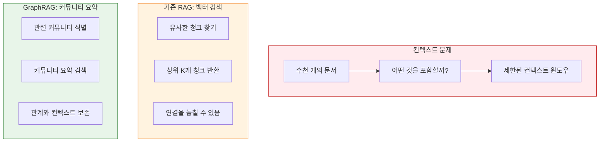
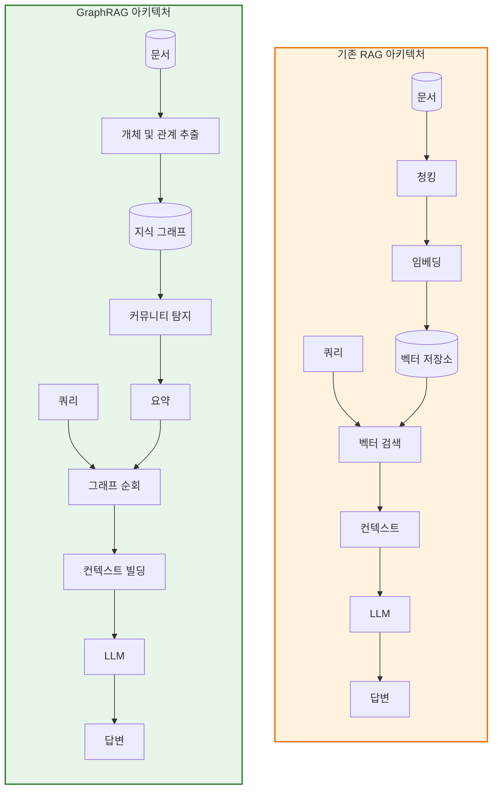
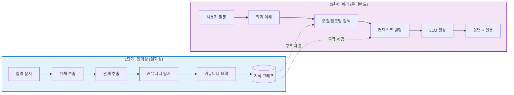
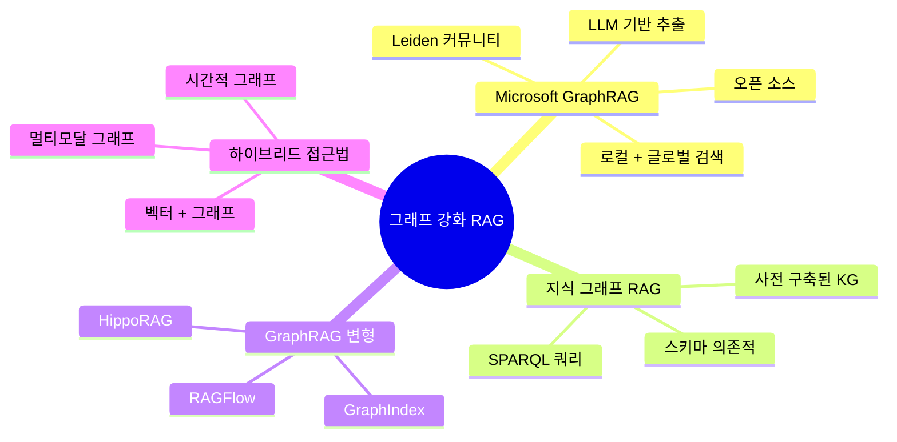

# Chapter 1: Introduction to GraphRAG

## 학습 목표

이 장을 마치면 다음을 수행할 수 있습니다:
- GraphRAG의 정의와 등장 배경 설명
- GraphRAG 개발을 이끈 한계점 설명
- 기존 RAG와 GraphRAG 비교
- GraphRAG가 우수한 실제 사용 사례 식별
- GraphRAG의 고수준 아키텍처 이해

---

## 1.1 GraphRAG란 무엇인가?

### 1.1.1 형식적 정의

**GraphRAG** (Graph-Based Retrieval-Augmented Generation, 그래프 기반 검색 증강 생성)은 **지식 그래프**와 **대규모 언어 모델**(LLMs)을 결합하는 고급 정보 검색 및 생성 방법입니다. 벡터 유사도 검색에만 의존하는 기존 RAG 시스템과 달리, GraphRAG는 정보를 상호연결된 개체와 그 관계의 그래프로 조직합니다.

### 1.1.2 핵심 통찰

GraphRAG의 기본이 되는 통찰은 **지식에는 구조가 있다**는 것입니다. 다음 차이점을 고려해 보세요:

```mermaid
flowchart LR
    subgraph Traditional["기존 RAG: 평평한 문서 청크"]
        D1["청크 1: 파리는 프랑스의 수도입니다"]
        D2["청크 2: 에펠 탑은 파리에 있습니다"]
        D3["청크 3: 프랑스는 서유럽에 있습니다"]
    end

    subgraph GraphRAG["GraphRAG: 구조화된 지식 그래프"]
        E1[["파리<br/>(도시)"]]
        E2[["프랑스<br/>(국가)"]]
        E3[["에펠 탑<br/>(랜드마크)"]]
        E4[["서유럽<br/>(지역)"]]

        E1 --|"수도"|--> E2
        E2 --|"포함"|--> E1
        E3 --|"위치"|--> E1
        E2 --|"소속"|--> E4
    end

    style Traditional fill:#ffebee,stroke:#c62828,stroke-width:2px
    style GraphRAG fill:#e8f5e9,stroke:#2e7d32,stroke-width:2px
```

기존 방식에서는 정보가 고립된 텍스트 청크로 존재합니다. 유사도 검색은 관련 청크를 찾을 수 있지만, 개념 간의 관계를 이해할 수는 없습니다. GraphRAG에서는 정보가 **개체**(파리, 프랑스, 에펠 탑 등)와 **관계**(수도, 위치, 포함)로 저장됩니다. 이 구조를 통해 시스템은 다음을 수행할 수 있습니다.

1. 관련 개체 간의 **연결 순회**
2. 개체 관계를 통한 **컨텍스트 이해**
3. 기본 지식 구조를 존중하는 **더 풍부하고 일관된 답변 제공**

### 1.1.3 핵심 용어

| 용어 | 정의 | 예시 |
|------|------|------|
| **개체 (Entity)** | 구별 가능한 객체, 개념, 명명된 것 | "파리", "마리 퀴리", "양자 물리학" |
| **관계 (Relationship)** | 두 개체 간의 연결 | 파리 --수도→ 프랑스 |
| **커뮤니티 (Community)** | 밀접하게 관련된 개체의 클러스터 | "제2차 세계대전"과 관련된 모든 개체 |
| **텍스트 유닛 (Text Unit)** | 소스 텍스트의 일부 | 문서의 문단 |
| **그래프 (Graph)** | 개체와 관계로 구성된 구조 | 전체 지식 네트워크 |

### 1.1.4 Microsoft의 GraphRAG

GraphRAG는 Microsoft Research가 오픈 소스 프로젝트로 개척했습니다. 특히 다음과 같은 기존 RAG 시스템의 한계를 해결합니다.

- **전역 질문**: 전체 데이터셋에 대한 이해가 필요한 질문
- **복잡한 쿼리**: 여러 상호연결된 개념을 포함하는 질문
- **요약 작업**: 대규모 문서 컬렉션에 대한 요약

---

## 1.2 LLM의 지식 문제

### 1.2.1 GraphRAG가 필요한 이유

GraphRAG를 이해하려면 먼저 해결하는 문제를 이해해야 합니다. GPT-4와 같은 대규모 언어 모델(LLM)은 훌륭하지만 기본적인 한계가 있습니다.

#### 한계 1: 정적 지식

**의미:** LLM은 특정 시점까지의 데이터로 학습됩니다. 학습 기준 이후의 사건이나 정보를 알 수 없습니다.

**예시:** 2023년에 학습된 LLM은 2024년에 발표된 과학 논문에 대한 질문에 답할 수 없습니다.

**기존 RAG 해결책:** 관련 문서를 검색하여 LLM에 제공합니다.

**GraphRAG 개선:** 문서뿐만 아니라 문서 내 개념 간의 *구조화된 관계*를 검색합니다.

#### 한계 2: 컨텍스트 윈도우 제약

**의미:** LLM은 한 번에 처리할 수 있는 텍스트 양에 제한이 있습니다("컨텍스트 윈도우"). 큰 컨텍스트(128K, 200K 토큰)라도 전체 지식 베이스를 단일 쿼리에 넣을 수는 없습니다.

**문제:** 수천 개의 문서가 있을 때 어떤 것을 포함해야 할까요? 기존 RAG는 유사도 검색을 사용하지만, 중요한 컨텍스트를 놓칠 수 있습니다.

**GraphRAG 해결책:** 관련 개체의 커뮤니티로 정보를 조직함으로써, 원시 텍스트 청크 대신 관련 주제의 *압축된 요약*을 제공할 수 있습니다.



#### 한계 3: 할루시네이션 문제

**의미:** LLM은 때때로 그럴듯하게 들리지만 잘못된 정보를 생성합니다. 모델의 학습 데이터가 모호하거나 정보 공백을 채우려 할 때 발생합니다.

**기존 RAG는 도움이 되지만 완전히 해결하지 못함:** RAG는 검색된 문서를 바탕으로 응답을 생성하여 할루시네이션을 줄입니다. 하지만 검색이 관련 정보를 놓치면 할루시네이션이 여전히 발생할 수 있습니다.

**GraphRAG의 장점:** 개체 간 관계를 이해함으로써 다음을 수행할 수 있습니다.
- 그래프의 여러 소스를 통해 사실 검증
- 명확한 출처와 함께 인용된 증거 제공
- 연결이 약하거나 누락된 경우 불확실성 표시

#### 한계 4: 전역 컨텍스트 상실

**의미:** 유사도를 기반으로 개별 청크를 검색하면 청크가 서로 및 광범위한 주제와 어떻게 관련되는지에 대한 "큰 그림"이 손실됩니다.

**예시:** "이 연구 논문 모음의 주요 주제는 무엇입니까?"라고 물으면 기존 RAG는 관련 논문을 검색할 수 있지만 지식의 전역 구조를 이해하지 못해 포괄적인 주제를 종합하는 데 어려움을 겪을 수 있습니다.

**GraphRAG의 해결책:** 커뮤니티는 지식의 **계층적 조직**을 제공하여 시스템이 구체적인 세부 사항과 광범위한 주제를 모두 이해할 수 있게 합니다.

### 1.2.2 비유: 도서관 카탈로그 시스템

기존 RAG는 검색창에 키워드를 입력하여 도서관을 검색하는 것과 같습니다. 키워드가 포함된 책 목록을 받지만 책 간의 관계는 알 수 없습니다.

GraphRAG는 다음을 수행하는 사서가 있는 것과 같습니다.
1. 모든 책이 서로 어떻게 연결되어 있는지 앎
2. 관련 주제의 "이웃"을 보여줌
3. 광범위한 주제와 범주를 이해
4. 특정 책에서 관련 지식의 전체 섹션으로 안내

---

## 1.3 그래프 기반 vs. 기존 RAG

### 1.3.1 아키텍처 비교



### 1.3.2 기능 비교 표

| 기능 | 기존 RAG | GraphRAG |
|---------|----------------|----------|
| **지식 표현** | 평평한 텍스트 청크 | 구조화된 개체-관계 그래프 |
| **검색 방법** | 벡터 유사도 | 그래프 순회 + 벡터 유사도 |
| **컨텍스트 이해** | 로컬 (청크 수준) | 로컬 + 글로벌 (커뮤니티 수준) |
| **관계 인식** | 명시적 관계 없음 | 명시적 가중치 관계 |
| **계층적 조직** | 없음 | 다중 수준 커뮤니티 계층 |
| **답변 생성** | 검색된 청크 기반 | 그래프 구조화된 컨텍스트 기반 |
| **적합한 쿼리 유형** | 구체적 사실 검색 | 복잡한 다중 홉, 전역 질문 |
| **구현 복잡성** | 더 간단함 | 더 복잡함 |
| **인덱싱 비용** | 더 낮음 | 더 높음 (LLM 추출 필요) |
| **복잡한 쿼리의 검색 품질** | 연결을 놓칠 수 있음 | 의미 구조를 더 잘 보존 |

### 1.3.3 각 접근법의 사용 시기

#### 기존 RAG를 사용할 때:
- 간단하고 직관적인 질문이 있는 경우
- 질문이 사실 기반이고 구체적인 경우
- 문서가 대부분 독립적인 경우
- 빠른 설정과 낮은 비용이 필요한 경우
- 예: "프랑스의 수도는 어디입니까?" 또는 "이 문서를 요약해주세요."

#### GraphRAG를 사용할 때:
- 복잡하고 다각적인 질문이 있는 경우
- 쿼리에 관계 이해가 필요한 경우
- 문서가 일관된 지식 베이스를 형성하는 경우
- 전역 주제와 패턴이 필요한 경우
- 예: "이 분야의 다양한 연구자들은 서로 어떻게 연결되어 있습니까?" 또는 "이 문서들의 주요 주제는 무엇입니까?"

### 1.3.4 구체적 예시

**쿼리:** "머신러닝 연구의 핵심 인물들은 서로 어떻게 연결되어 있습니까?"

**기존 RAG 응답:**
1. "머신러닝 연구자"가 언급된 문서 찾기
2. 개별 연구자가 언급된 청크 반환
3. 이름은 나열할 수 있지만 연결을 보여주는 데 어려움

**GraphRAG 응답:**
1. "머신러닝"에서 시작하여 개체 그래프 순회
2. 이 주제와 연결된 연구자 개체 찾기
3. 공동 저작, 인용, 기관적 관계 따르기
4. 제프리 힌튼, 얀 르쿤, 요슈아 벤지오가 공동 작업, 기관, 연구 분야를 통해 어떻게 연결되는지 보여주는 구조화된 답변 반환

---

## 1.4 실제 애플리케이션 및 사용 사례

### 1.4.1 학술 문헌 분석

**사용 사례:** 연구자들이 특정 분야의 학술 논문 지형을 이해해야 합니다.

**GraphRAG 장점:**
- 개체: 논문, 저자, 기관, 개념, 방법
- 관계: 인용, 공동 저작, 기반, 적용 방법
- 커뮤니티: 연구 하위 분야, 학파

**가치:** 커뮤니티 구조와 진화를 검토하여 "양자 컴퓨팅의 신흥 하위 분야는 무엇입니까?"와 같은 질문에 답변할 수 있습니다.

### 1.4.2 엔터프라이즈 지식 관리

**사용 사례:** 대규모 기업에는 직원이 검색해야 하는 수천 개의 문서(정책, 보고서, 이메일)가 있습니다.

**GraphRAG 장점:**
- 개체: 프로젝트, 사람, 제품, 마감일, 결정
- 관계: 작업, 승인, 영향, 선행
- 커뮤니티: 부서, 이니셔티브 영역

**가치:** 정책 → 프로젝트 → 이해관계자 → 영향을 순회하여 "새로운 규정 준수 정책이 우리의 활성 프로젝트에 어떤 영향을 미칩니까?"와 같은 질문에 답변할 수 있습니다.

### 1.4.3 법률 문서 분석

**사용 사례:** 로펌은 판례, 계약, 규정을 분석해야 합니다.

**GraphRAG 장점:**
- 개체: 사건, 법령, 조항, 당사자, 법적 개념
- 관계: 인용, 선행, 모순, 수정
- 커뮤니티: 법적 도메인, 관할권 영역

**가치:** 인용 네트워크를 따라 "법원은 유사한 사건에서 이 특정 조항을 어떻게 해석했습니까?"와 같은 질문에 답변할 수 있습니다.

### 1.4.4 뉴스 및 미디어 분석

**사용 사례:** 기자들은 진화하는 이야기와 연결을 추적해야 합니다.

**GraphRAG 장점:**
- 개체: 사람, 조직, 사건, 장소, 주제
- 관계: 언급됨, 보도됨, 응답
- 커뮤니티: 스토리 아크, 주제 클러스터

**가치:** 시간적 관계 체인을 따라 "이 스캔들은 이전 사건과 어떻게 연결됩니까?"와 같은 질문에 답변할 수 있습니다.

### 1.4.5 헬스케어와 의학 연구

**사용 사례:** 의학 연구자들은 연구 간 발견을 종합해야 합니다.

**GraphRAG 장점:**
- 개체: 질병, 치료법, 유전자, 단백질, 증상
- 관계: 치료, 원인, 연관됨, 상호작용
- 커뮤니티: 질병 영역, 치료 접근법

**가치:** 치료-질병 연결 네트워크를 탐색하여 "최근 연구에 따르면 이 질환에 어떤 대체 치료법이 있습니까?"와 같은 질문에 답변할 수 있습니다.

---

## 1.5 GraphRAG 접근법: 고수준 개요

### 1.5.1 2단계 아키텍처

GraphRAG는 두 개의 명확한 단계로 작동합니다.



### 1.5.2 인덱싱 단계

인덱싱 단계는 원시 문서를 구조화된 지식 그래프로 변환합니다.

1. **텍스트 청킹**: 문서를 관리 가능한 조각(텍스트 유닛)으로 분할
2. **개체 추출**: LLM이 개체 식별(사람, 장소, 개념 등)
3. **관계 추출**: LLM이 개체 간 관계 발견
4. **그래프 구축**: 개체와 관계가 지식 그래프 형성
5. **커뮤니티 탐지**: Leiden 알고리즘이 관련 개체의 클러스터 찾기
6. **요약**: 효율적인 검색을 위해 각 커뮤니티 요약

### 1.5.3 쿼리 단계

쿼리 단계는 지식 그래프를 사용하여 질문에 답변합니다.

1. **쿼리 파싱**: 사용자가 묻는 내용 이해
2. **검색 전략 선택**: 로컬, 글로벌 또는 혼합 검색 선택
3. **그래프 순회**: 관련 개체와 커뮤니티 찾기 위해 그래프 탐색
4. **컨텍스트 빌딩**: 검색된 정보를 일관된 컨텍스트로 조립
5. **답변 생성**: 그래프 파생 컨텍스트를 기반으로 LLM이 응답 생성

### 1.5.4 로컬 vs. 글로벌 검색

GraphRAG는 두 가지 주요 검색 모드를 제공합니다.

**로컬 검색:**
- 쿼리와 직접 관련된 개체에 집중
- 쿼리 개념의 "이웃" 검색처럼
- 구체적이고 대상이 명확한 질문에 적합
- 예: "마리 퀴리는 무엇을 발견했나요?"

**글로벌 검색:**
- 커뮤니티 수준 요약 사용
- 광범위한 주제 컨텍스트 제공
- 큰 그림 이해가 필요한 질문에 적합
- 예: "이 연구 말뭉치의 주요 주제는 무엇입니까?"

---

## 1.6 Microsoft GraphRAG vs. 다른 접근법

### 1.6.1 그래프 강화 RAG의 환경



### 1.6.2 Microsoft GraphRAG의 독특한 특징

| 기능 | Microsoft GraphRAG | 대안 |
|---------|-------------------|--------------|
| **추출** | LLM 기반, 개체 중심 | 규칙 기반, 패턴 기반 |
| **커뮤니티 탐지** | Leiden 알고리즘, 계층적 | 다양함 (Louvain, k-means) |
| **검색 모드** | 로컬 및 글로벌 | 일반적으로 로컬만 |
| **요약** | 커뮤니티 수준 요약 | 종종 누락됨 |
| **오픈 소스** | 예, Apache 2.0 | 다양함 |
| **LLM 통합** | 최우선, 전체 파이프라인 | 종종 추가 기능 |

### 1.6.3 GraphRAG가 최선의 선택이 아닌 경우

다음과 같은 경우 대안을 고려하세요:
- 데이터셋이 매우 작은 경우 (오버헤드가 가치 없을 수 있음)
- 쿼리가 항상 간단한 키워드 검색인 경우
- 지식 그래프의 실시간 업데이트가 필요한 경우
- 엄격한 대기 시간 요구사항이 있는 경우 (인덱싱이 느릴 수 있음)

---

## 장 요약

이 장에서는 그래프 기반 검색 증강 생성인 GraphRAG를 소개했습니다.

**핵심 개념:**
- GraphRAG는 텍스트 청크뿐만 아니라 개체와 관계로 지식을 조직합니다.
- LLM의 한계: 정적 지식, 컨텍스트 윈도우, 할루시네이션, 전역 컨텍스트 상실
- GraphRAG는 구조화된 지식과 커뮤니티 조직을 통해 이를 해결합니다.
- 두 가지 검색 모드: 로컬(개체 중심) 및 글로벌(커뮤니티 중심)

**중요한 차이점:**
- 기존 RAG: 평평한 청크에 대한 벡터 유사도
- GraphRAG: 구조화된 지식에 대한 그래프 순회
- GraphRAG는 복잡한 다중 홉 및 전역 질문에 우수합니다.

**다음 단계:**
[[Textbook - Graph Theory Fundamentals]]에서 GraphRAG를 강화하는 그래프 이론 개념(개체, 관계, 커뮤니티, 그래프 알고리즘)을 자세히 살펴보겠습니다.

---

## 복습 문제

1. GraphRAG가 해결하는 LLM의 4가지 핵심 한계는 무엇입니까?
2. GraphRAG의 지식 표현은 기존 RAG와 어떻게 다릅니까?
3. GraphRAG의 로컬 검색과 글로벌 검색의 차이점을 설명하세요.
4. GraphRAG가 기존 RAG보다 우수한 질문의 예를 하나 들어보세요.
5. GraphRAG 처리의 두 가지 주요 단계는 무엇입니까?

---

## 추가 참고자료

- GraphRAG에 대한 Microsoft Research 블로그
- "From Local to Global: A Graph RAG Approach to Query-Focused Summarization" (원본 논문)
- 지식 그래프 구축 튜토리얼
- 그래프의 커뮤니티 탐지 개요
