# Chapter 4: LLMs and RAG

## 학습 목표

이 장을 마치면 다음을 수행할 수 있습니다:
- 최신 LLM을 강화하는 트랜스포머 아키텍처 설명
- 어텐션 메커니즘이 작동하는 방법 이해
- 검색 증강 생성(RAG)의 개념 설명
- 기본 RAG 시스템의 한계 식별
- GraphRAG가 기존 RAG를 어떻게 향상시키는지 이해

---

## 4.1 LLM 아키텍처와 기능

### 4.1.1 대규모 언어 모델이란 무엇인가?

**대규모 언어 모델(LLM)**은 시퀀스에서 다음 토큰을 예측하도록 광범위한 텍스트로 학습된 신경망입니다. 이 간단한 목적함수를 대규모로 적용하면 일관된 텍스트를 생성하고, 질문에 답하고, 복잡한 추론 작업을 수행할 수 있는 모델이 생성됩니다.

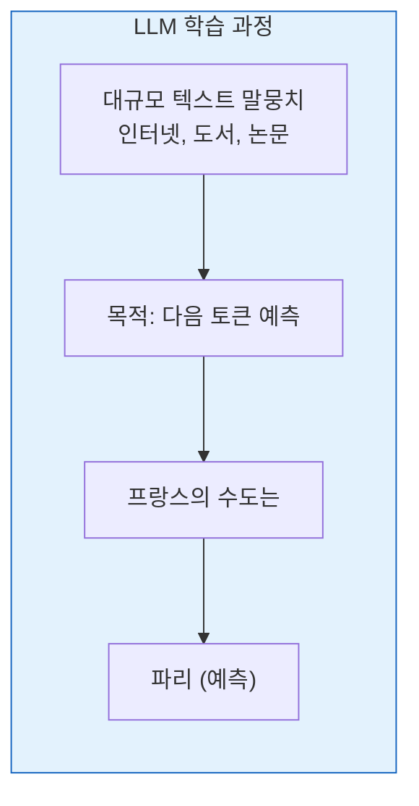

### 4.1.2 트랜스포머 아키텍처

최신 LLM은 **트랜스포머** 아키텍처("Attention Is All You Need", 2017)를 기반으로 구축됩니다.

#### 핵심 구성 요소

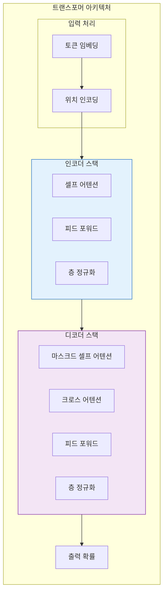

#### 인코더 vs. 디코더 모델

| 유형 | 아키텍처 | 예시 | 가장 적합한 |
|------|-------------|----------|----------|
| **인코더 전용** | 트랜스포머 인코더 | BERT, RoBERTa | 이해, 분류 |
| **디코더 전용** | 트랜스포머 디코더 | GPT-4, Claude | 생성, 창작 작업 |
| **인코더-디코더** | 둘 다 | T5, BART | 번역, 요약 |

**GraphRAG는 일반적으로 디코더 전용 모델**(GPT-4, Claude)을 생성에 사용합니다.

### 4.1.3 어텐션 메커니즘

**어텐션**을 통해 모델은 각 출력을 생성할 때 입력의 관련 부분에 집중할 수 있습니다.

#### 셀프 어텐션 직관

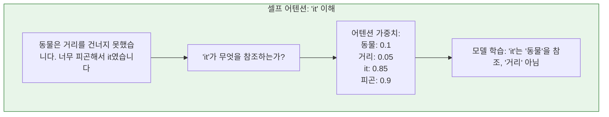

#### 어텐션 작동 방식 (간소화)

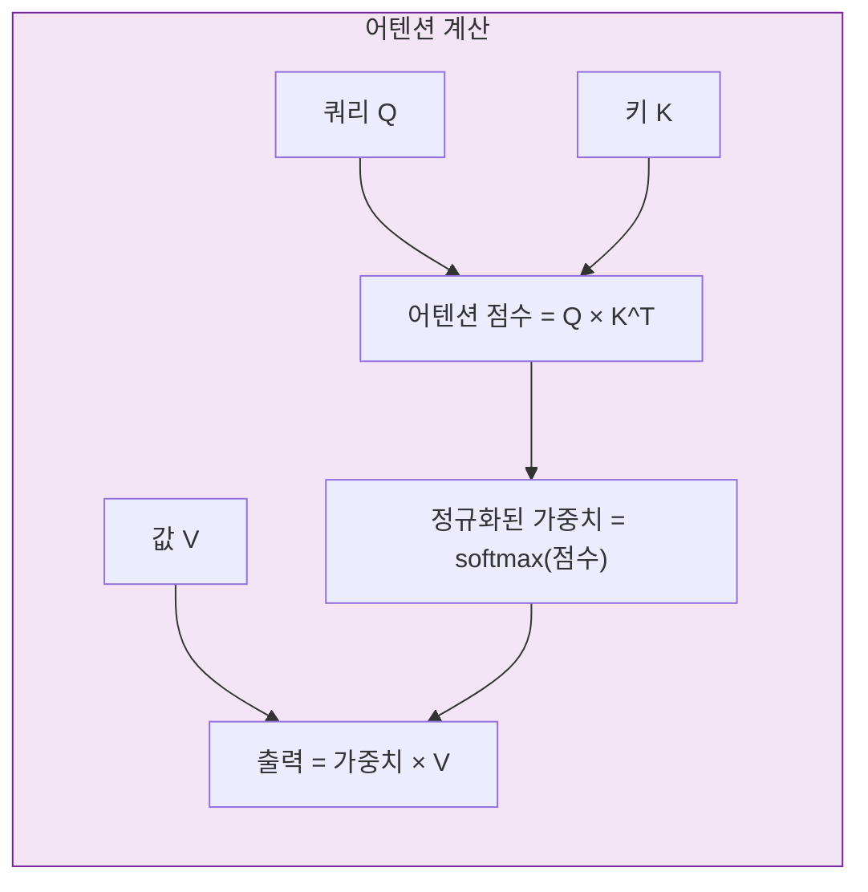

**직관:**
- **쿼리**: 찾고 있는 것
- **키**: 검색 대상
- **값**: 검색하고 싶은 것

### 4.1.4 토큰 제한과 컨텍스트 윈도우

모든 LLM에는 **컨텍스트 윈도우**가 있습니다. 한 번에 처리할 수 있는 최대 토큰 수입니다.

| 모델 | 컨텍스트 윈도우 | 의미 |
|--------|----------------|---------------|
| GPT-3.5 | 16K 토큰 | ~12,000 단어 |
| GPT-4 | 128K 토큰 | ~96,000 단어 |
| Claude 2 | 100K 토큰 | ~75,000 단어 |
| Claude 3 | 200K 토큰 | ~150,000 단어 |

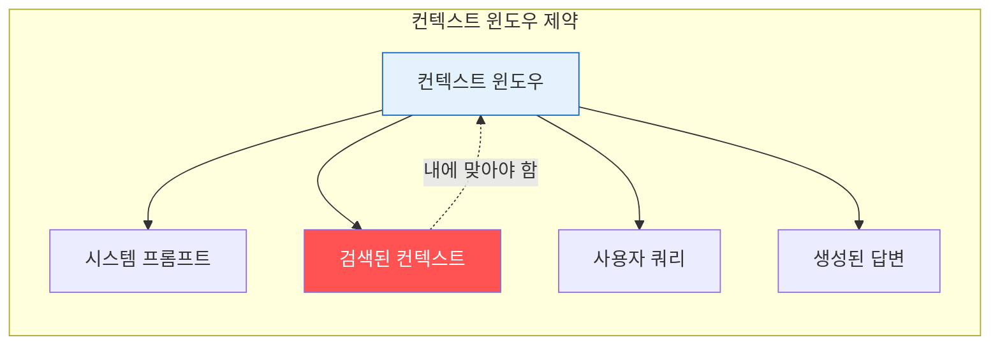

**문제:** 지식 베이스가 컨텍스트 윈도우보다 크면 모든 것을 포함할 수 없습니다. **검색**해야 합니다.

**이것이 우리가 RAG가 필요한 이유입니다!**

### 4.1.5 생성 vs. 이해

LLM에는 두 가지 주요 기능이 있습니다.

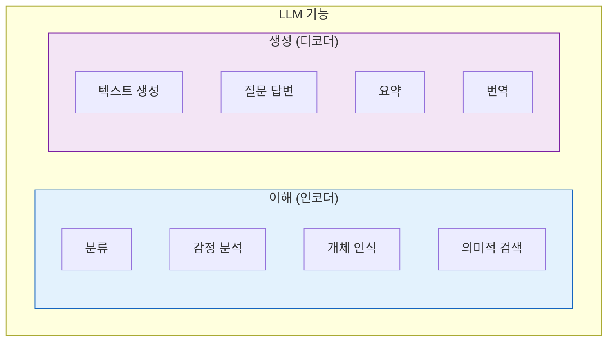

**RAG는 둘 다 사용합니다:**
1. **이해**: 사용자 쿼리 해석
2. **생성**: 최종 답변 생성
3. **검색**: 관련 컨텍스트 찾기 (이해와 생성 사이의 다리)

---

## 4.2 프롬프트 엔지니어링

### 4.2.1 좋은 프롬프트의 조건

**프롬프트 엔지니어링**은 LLM에서 원하는 출력을 이끌어내는 입력을 설계하는 기술입니다.

#### 프롬프트 구조

```mermaid
flowchart TB
    subgraph Prompt["프롬프트 구조"]
        direction TB

        SYS[시스템 메시지<br/>"당신은 도움이 되는 어시스턴트입니다..."]

        FEW[피샷 예시<br/>"Q: ...<br/>A: ..."]

        INST[지침<br/>"아래 컨텍스트를 바탕으로 답변하세요"]

        CTX[컨텍스트<br/>검색된 문서]

        Q[쿼리<br/>사용자의 질문]

        SYS --> FEW --> INST --> CTX --> Q
    end

    style SYS fill:#e3f2fd,stroke:#1565c0
    style CTX fill:#e8f5e9,stroke:#2e7d32
    style Q fill:#f3e5f5,stroke:#7b1fa2
```

### 4.2.2 인컨텍스트 학습

**인컨텍스트 학습**을 통해 LLM은 프롬프트에 제공된 예시로부터 가중치 업데이트 없이 학습할 수 있습니다.

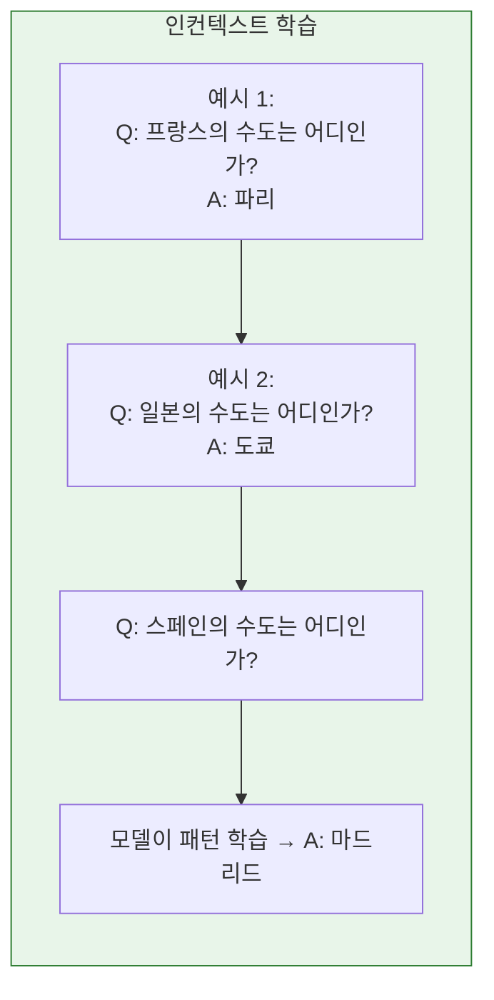

### 4.2.3 사고 연쇄 프롬프팅

**사고 연쇄(CoT)** 프롬프팅은 모델이 추론 과정을 보여주도록 장려합니다.

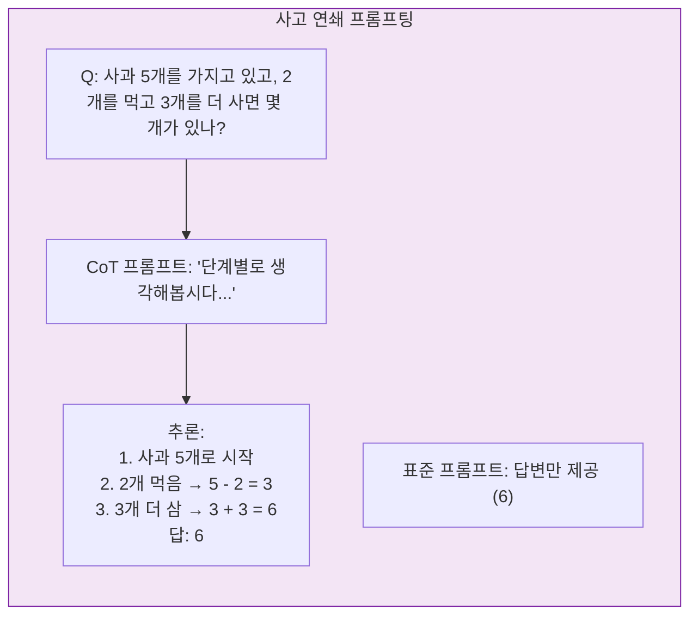

### 4.2.4 일반적인 프롬프팅 패턴

| 패턴 | 설명 | GraphRAG 사용 |
|---------|-------------|-----------------|
| **제로샷** | 예시 제공 안 함 | 간단한 쿼리 |
| **피샷** | 예시 제공 | 복잡한 추출 |
| **CoT** | 추론 표시 | 다중 홉 쿼리 |
| **셀프 일관성** | 여러 샘플, 투표 | 신뢰성 향상 |
| **ReAct** | 추론 + 행동 루프 | 대화형 탐색 |

---

## 4.3 검색 증강 생성 (RAG)

### 4.3.1 RAG 패러다임

**검색 증강 생성(RAG)**은 생성 전에 관련 정보를 검색하여 LLM을 강화합니다.

```mermaid
flowchart TB
    subgraph NoRAG["RAG 없이"]
        direction TB
        Q1[쿼리]
        LLM1[LLM]
        A1[답변<br/>(할루시네이션 가능)]

        Q1 --> LLM1 --> A1
    end

    subgraph WithRAG["RAG로"]
        direction TB
        Q2[쿼리]
        RETR[관련 문서<br/>검색]
        LLM2[LLM + 컨텍스트]
        A2[답변<br/>(사실에 기반)]

        Q2 --> RETR --> LLM2 --> A2
    end

    style NoRAG fill:#ffebee,stroke:#c62828
    style WithRAG fill:#e8f5e9,stroke:#2e7d32
```

### 4.3.2 검색이 중요한 이유

**문제:** LLM은 고정된 데이터로 학습되며 모든 것을 알 수 없습니다.

**해결책:** 쿼리 시점에 최신 정보, 도메인별 정보를 검색합니다.

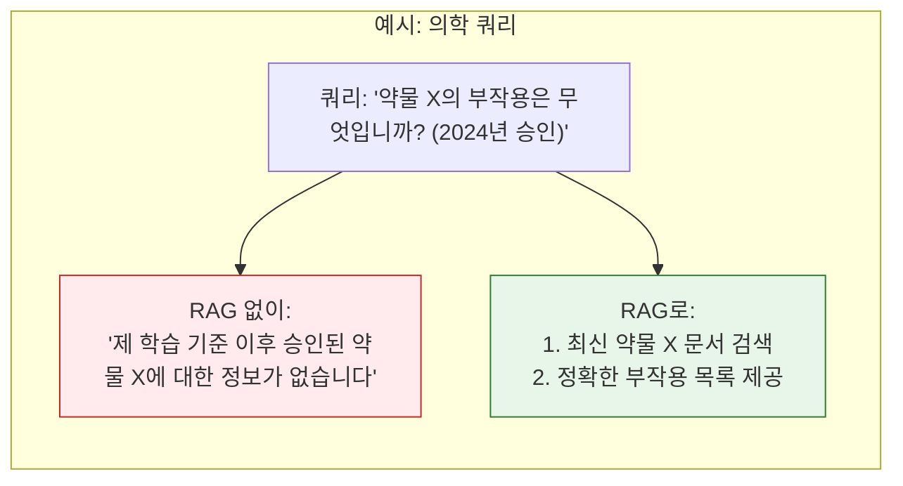

### 4.3.3 기본 RAG 아키텍처

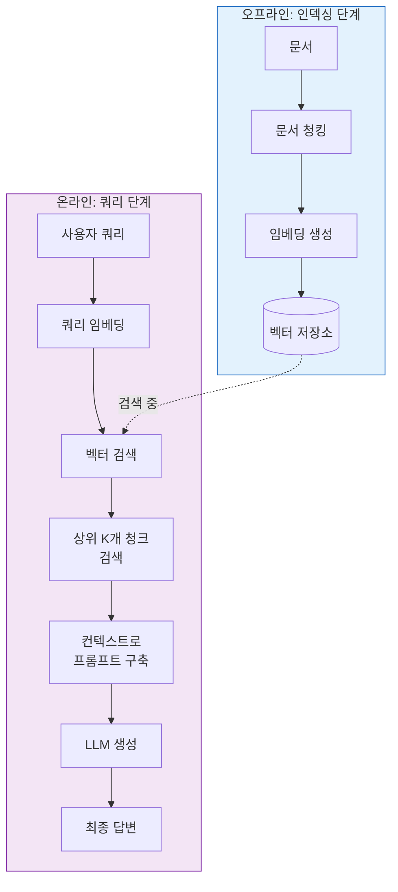

### 4.3.4 기본 RAG의 한계

| 한계 | 설명 | 영향 |
|------------|-------------|--------|
| **청크 격리** | 각 청크가 독립적으로 검색됨 | 청크 간 연결 누락 |
| **벡터 전용 검색** | 의미적 유사도에만 기반 | 구조적 관계 누락 |
| **전역 컨텍스트 없음** | "큰 그림"을 볼 수 없음 | 주제적 질문에 취약 |
| **출처 상실** | 정보 출처 추적 어려움 | 신뢰성 저하 |
| **키워드 불일치** | 쿼리 용어가 청크 용어와 일치하지 않음 | 관련 정보 누락 |

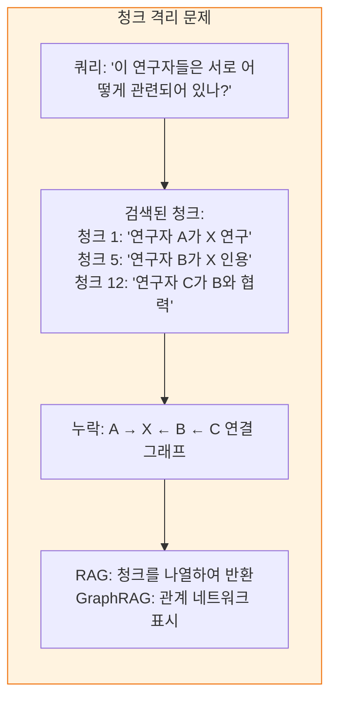

---

## 4.4 RAG에서 GraphRAG로

### 4.4.1 GraphRAG가 추가하는 것

GraphRAG는 기존 RAG에 **구조화된 지식**을 추가합니다.

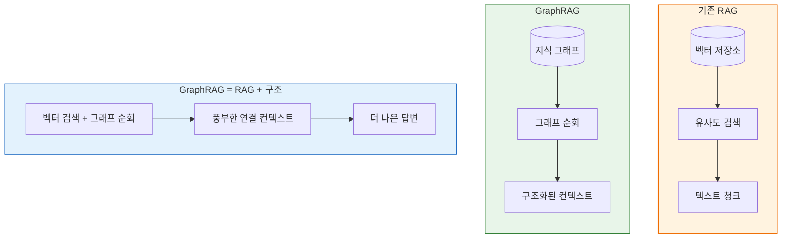

### 4.4.2 로컬 vs. 글로벌 검색

GraphRAG는 두 가지 검색 모드를 도입합니다.

#### 로컬 검색 (개체 중심)

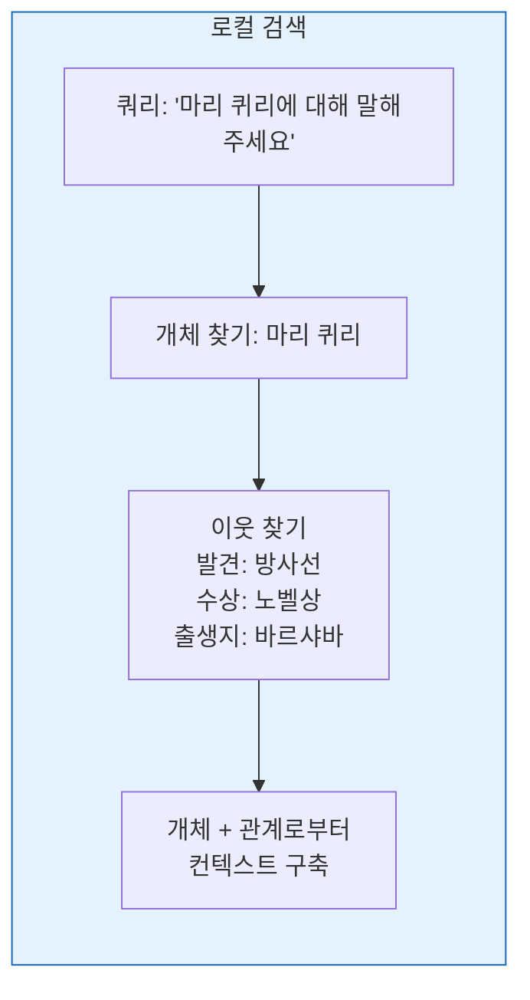

#### 글로벌 검색 (커뮤니티 중심)

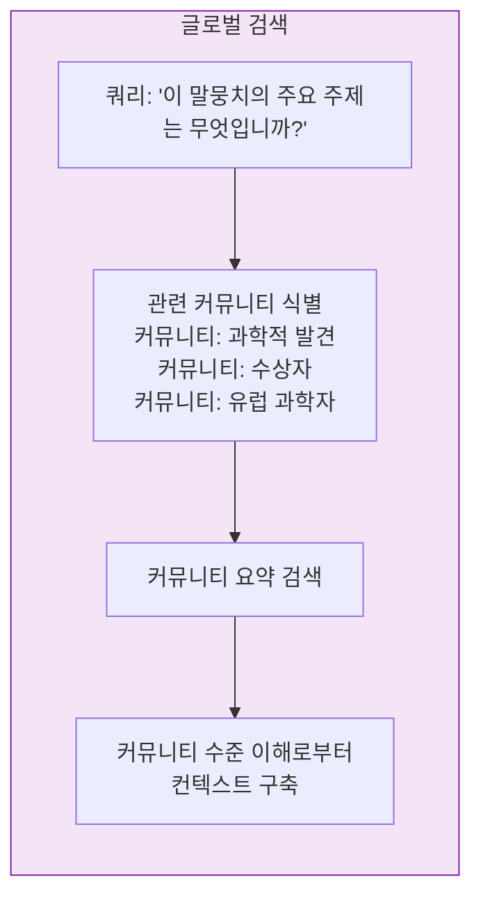

### 4.4.3 비교 표

| 측면 | 기존 RAG | GraphRAG 로컬 | GraphRAG 글로벌 |
|--------|----------------|----------------|-----------------|
| **검색 단위** | 텍스트 청크 | 개체 + 이웃 | 커뮤니티 요약 |
| **가장 적합한** | 사실 기반 질문 | 개체별 쿼리 | 주제적 질문 |
| **컨텍스트 유형** | 평평한 텍스트 | 구조화된 관계 | 요약된 주제 |
| **확장성** | 우수함 | 양호함 | 매우 양호함 |
| **복잡성** | 낮음 | 중간 | 중간 |

---

## 4.5 완전한 GraphRAG 파이프라인

### 4.5.1 엔드 투 엔드 아키텍처

```mermaid
flowchart TB
    subgraph Indexing["1단계: 인덱싱 (오프라인)"]
        direction TB

        DOCS[원시 문서]

        CHUNK[텍스트 유닛으로<br/>청킹]

        EXT[개체 및 관계 추출<br/>(LLM 기반)]

        GRAPH[지식 그래프 구축]

        COMM[커뮤니티 탐지<br/>(Leiden 알고리즘)]

        SUMM[커뮤니티 요약 생성<br/>(LLM 기반)]

        EMBED[임베딩 생성<br/>(텍스트 유닛, 개체, 커뮤니티)]

        STORE[(영구 저장소)]

        DOCS --> CHUNK --> EXT --> GRAPH --> COMM --> SUMM --> EMBED --> STORE
    end

    subgraph Query["2단계: 쿼리 (온라인)"]
        direction TB

        Q[사용자 쿼리]

        Q_ENT[쿼리 개체 추출]

        MODE[선택: 로컬 / 글로벌 / 혼합]

        RETR[검색:<br/>- 개체 이웃<br/>- 커뮤니티 요약<br/>- 텍스트 유닛]

        BUILD[컨텍스트 구축]

        GEN[답변 생성<br/>(LLM, 인용 포함)]

        Q --> Q_ENT --> MODE --> RETR --> BUILD --> GEN
    end

    STORE -.->|제공| RETR

    style Indexing fill:#e3f2fd,stroke:#1565c0
    style Query fill:#f3e5f5,stroke:#7b1fa2
```

### 4.5.2 핵심 혁신

1. **LLM 기반 추출**: 비정형 텍스트에서 구조화된 지식 추출
2. **커뮤니티 탐지**: 주제 그룹 자동 발견
3. **계층적 조직**: 다중 수준 커뮤니티 구조
4. **이중 검색 모드**: 로컬(개체) 및 글로벌(커뮤니티)
5. **풍부한 인용**: 모든 사실을 소스 텍스트로 추적 가능

---

## 장 요약

이 장에서는 LLM과 RAG를 탐구했습니다.

**LLM 기초:**
- **트랜스포머**는 셀프 어텐션으로 텍스트 처리
- **컨텍스트 윈도우**가 처리할 수 있는 텍스트 양 제한
- **생성**에는 이해 + 검색이 팩트 사실 정확성에 필요

**프롬프트 엔지니어링:**
- **인컨텍스트 학습**이 예시를 통해 교육
- **사고 연쇄**가 추론 개선
- 잘 설계된 프롬프트는 RAG 시스템에 필수적

**RAG 개념:**
- **RAG**는 생성 전에 관련 컨텍스트를 검색
- **해결** LLM 한계: 정적 지식, 할루시네이션
- **기존 RAG**는 텍스트 청크에 대한 벡터 유사도 사용

**GraphRAG 향상:**
- **추가** 구조화된 지식(그래프)를 RAG에
- **두 모드**: 로컬(개체 중심) 및 글로벌(커뮤니티 중심)
- **더 나은** 복잡한 다중 홉 및 주제적 질문

**다음 단계:**
기초가 완료되었습니다. [[Part 2: Core Concepts]]는 [[Textbook - Entity Extraction]]부터 GraphRAG 구성 요소를 자세히 살펴봅니다.

---

## 복습 문제

1. 인코더 전용과 디코더 전용 트랜스포머 모델의 핵심 차이점은 무엇입니까?
2. 어텐션 메커니즘을 직관적으로 설명하세요.
3. 검색 증강 생성이 필요한 이유는 무엇입니까?
4. 기본 RAG의 주요 한계는 무엇입니까?
5. GraphRAG의 로컬 검색과 글로벌 검색 차이점을 설명하세요.
6. GraphRAG 파이프라인의 두 가지 주요 단계는 무엇입니까?

---

## 연습 문제

1. 뉴스 기사에서 개체와 관계를 추출하는 프롬프트를 설계하세요. LLM에 어떤 지침을 주시겠습니까?

2. "양자 역학과 상대성론을 연결하는 것"이라는 쿼리에 로컬 또는 글로벌 GraphRAG 검색을 사용하시겠습니까? 이유는?

3. 기존 RAG와 GraphRAG가 다음을 어떻게 처리하는지 비교하세요: "이 데이터셋의 모든 연구자가 서로 어떻게 연결되어 있는지 요약하세요."

---

## 추가 참고자료

- "Attention Is All You Need" (Vaswani et al., 2017)
- "Retrieval-Augmented Generation for Knowledge-Intensive NLP" (Lewis et al., 2020)
- "From Local to Global: A Graph RAG Approach to Query-Focused Summarization" (GraphRAG 논문)
- 프롬프트 엔지니어링 가이드 (OpenAI, Anthropic)
