# Chapter 3: NLP Basics

## 학습 목표

이 장을 마치면 다음을 수행할 수 있습니다:
- 컴퓨터가 텍스트를 처리하고 표현하는 방법 이해
- 토큰화란 무엇이며 왜 중요한지 설명
- 개체명 인식(NER) 개념 설명
- 단어 및 문장 임베딩이 의미를 표현하는 방법 이해
- 기본 정보 검색 개념 설명

---

## 3.1 텍스트 처리 기초

### 3.1.1 텍스트 처리가 중요한 이유

컴퓨터는 텍스트를 직접 이해할 수 없습니다. 오직 숫자만 이해합니다. 텍스트 처리는 인간 언어를 기계가 작업할 수 있는 수치 표현으로 변환합니다.

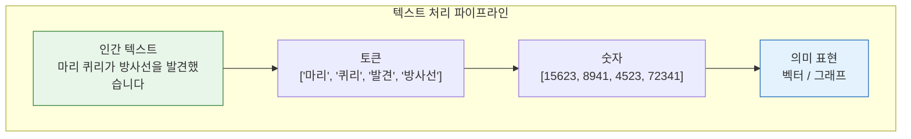

### 3.1.2 토큰화 설명

**토큰화**는 텍스트를 **토큰**이라는 더 작은 단위로 분할하는 과정입니다. 토큰은 다음일 수 있습니다.
- **단어**: "마리", "퀴리", "발견"
- **서브워드**: "발견", "-하였다" (복잡한 단어의 경우)
- **문자**: "마", "리", "퀴" (단독으로는 거의 사용되지 않음)

#### 토큰화가 중요한 이유

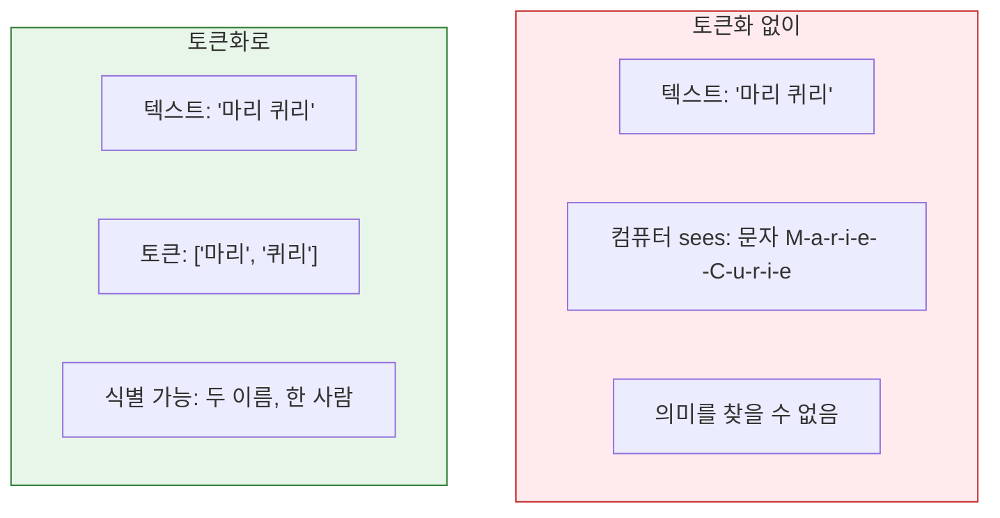

**예시:** 다양한 토큰화 접근법

| 텍스트 | 단어 수준 | 서브워드 수준 | 문자 수준 |
|------|------------|---------------|-----------------|
| "방사선" | `['방사선']` | `['방사', '선']` | `['방','사','선',...]` |
| "GPT-4" | `['GPT-4']` 또는 `['GPT', '4']` | `['GP', 'T', '-4']` | `['G','P','T','-','4']` |

#### LLM에서의 토큰화

최신 LLM은 **서브워드 토큰화**(예: Byte-Pair Encoding, WordPiece)를 사용합니다.

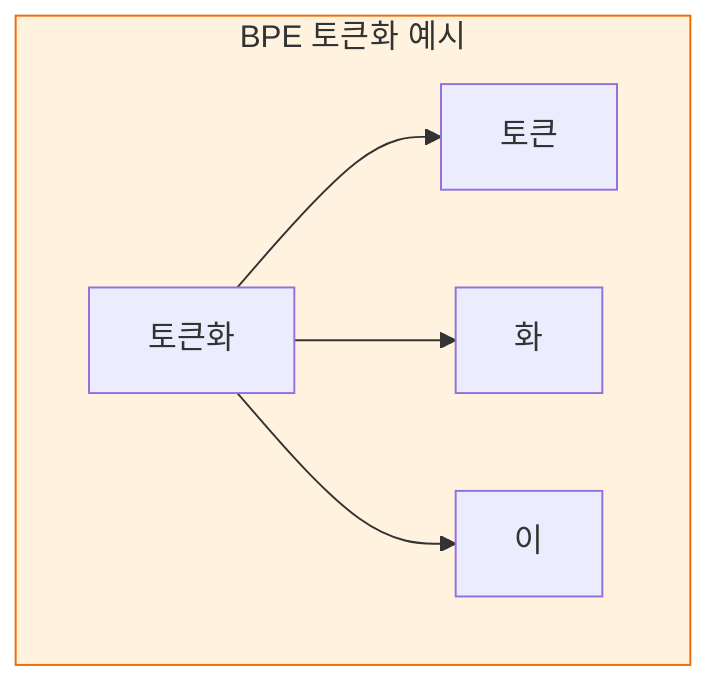

**서브워드를 사용하는 이유:**
- 희귀 단어 처리 (알려진 부분으로 분해)
- 복잡한 단어 처리 (접두사, -ing, -ed)
- 필요한 어휘 크기 감소

### 3.1.3 품사 태깅

**품사(POS) 태깅**은 문법적 역할을 식별합니다.

| 단어 | POS 태그 | 의미 |
|------|---------|---------|
| 마리 | **PROPN** | 고유 명사(이름) |
| 발견했습니다 | **VERB** | 동사(동작) |
| 방사선 | **NOUN** | 명사(것/개념) |

**GraphRAG 사용:**
- 개체 후보 식별 도움 (고유 명사)
- 관계 유형 이해 도움 (동사)
- 추출 정확도 향상

### 3.1.4 개체명 인식(NER) 기초

**개체명 인식(NER)**은 텍스트에서 개체명을 식별하고 분류합니다.

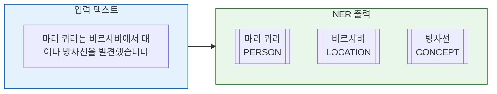

#### 일반적인 개체 유형

| 개체 유형 | 예시 | GraphRAG 사용 |
|-------------|----------|----------------|
| **PERSON** | 마리 퀴리, 알버트 아인슈타인 | 전기적 쿼리의 핵심 개체 |
| **ORGANIZATION** | Microsoft, NASA | 기관적 연결 |
| **LOCATION** | 파리, 화성 | 지리적 관계 |
| **DATE/TIME** | 1898, 지난주 월요일 | 시간적 관계 |
| **CONCEPT** | 방사선, 중력 | 도메인별 개체 |
| **EVENT** | 제2차 세계대전, 달 착륙 | 역사적 관계 |

#### 전통적 NER 접근법

1. **규칙 기반**: 패턴 매칭 (예: 대문자 단어)
2. **통계적**: HMM, CRF (레이블된 데이터로 학습)
3. **신경망**: BiLSTM-CRF, BERT 기반 (현재 최첨단)

#### GraphRAG의 LLM 기반 NER

GraphRAG는 개체 추출을 위해 LLM을 사용하며 장점이 있습니다.

| 기능 | 전통적 NER | LLM 기반 NER |
|---------|-----------------|---------------|
| **학습** | 레이블된 데이터 필요 | 사전 학습된 지식 사용 |
| **도메인 적응** | 재학습 필요 | 프롬프트를 통한 작동 |
| **개체 유형** | 고정 스키마 | 유연한 발견 유형 |
| **컨텍스트 이해** | 로컬 윈도우 | 전체 문서 컨텍스트 |
| **비용** | 낮은 추론 비용 | 더 높은 LLM API 비용 |

### 3.1.5 관계 추출 개념

**관계 추출**은 텍스트에서 언급된 개체 간의 연결을 찾습니다.

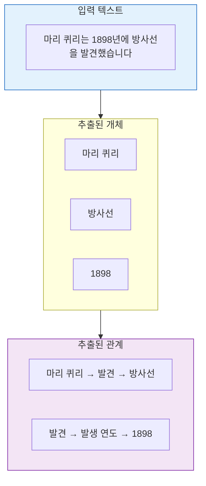

#### 관계 유형

| 유형 | 예시 | GraphRAG 관련성 |
|------|---------|-------------------|
| **명시적** | "A가 B를 설립함" | 직접 추출 |
| **암묵적** | "A와 B가 함께 일함" | 추론 필요 |
| **시간적** | "전에", "후에", "동안" | 시간 기반 쿼리 |
| **인과적** | "원인", "이끌다" | 설명적 쿼리 |
| **계층적** | "의 일부", "유형" | 분류법 구축 |

---

## 3.2 벡터 표현

### 3.2.1 단어 임베딩이란 무엇인가?

**단어 임베딩**은 의미가 유사한 단어가 유사한 벡터를 갖는 밀집 벡터 표현입니다.

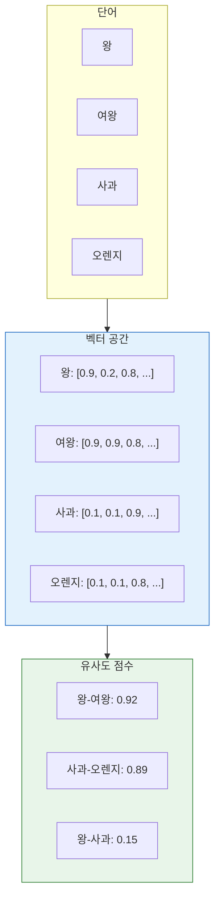

**핵심 통찰:** 유사한 단어는 벡터 공간에서 가깝게 위치합니다.

### 3.2.2 Word2Vec: 혁명

**Word2Vec** (2013)은 단어 임베딩을 학습하는 효율적인 방법을 도입했습니다.

#### 두 가지 아키텍처

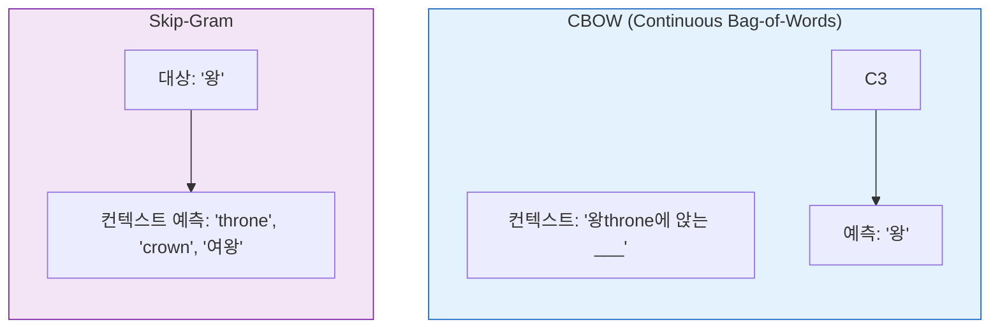

**유명한 속성:** 벡터 연산은 의미적 관계를 포착합니다!

```
왕 - 남성 + 여성 ≈ 여왕
파리 - 프랑스 + 독일 ≈ 베를린
```

### 3.2.3 GloVe: 글로벌 컨텍스트

**GloVe** (Global Vectors for Word Representation)는 다음을 결합합니다.
- **로컬 컨텍스트** (Word2Vec처럼)
- **글로벌 동시 출현 통계** (단어가 함께 나타나는 횟수 계산)

### 3.2.4 컨텍스트별 임베딩 (BERT 등)

정적 임베딩(Word2Vec, GloVe)은 각 단어에 하나의 고정된 벡터를 부여합니다. 문제점:

```
"은행" (금융) vs. "은행" (강) → 같은 벡터!
```

**컨텍스트별 임베딩**은 컨텍스트를 고려하여 이를 해결합니다.

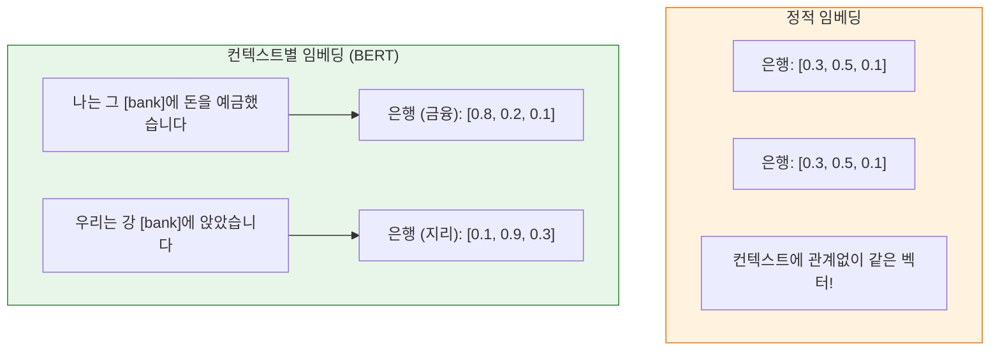

### 3.2.5 문장 및 문서 임베딩

GraphRAG를 위해 더 큰 단위를 임베딩해야 합니다.

| 수준 | 방법 | GraphRAG 사용 |
|-------|--------|--------------|
| **문장** | Sentence-BERT, Universal Sentence Encoder | 문장 수준 유사도 |
| **문단/청크** | 평균 풀링, 계층적 모델 | 텍스트 유닛 임베딩 |
| **문서** | 문서 수준 모델, 청크 집계 | 문서 수준 검색 |

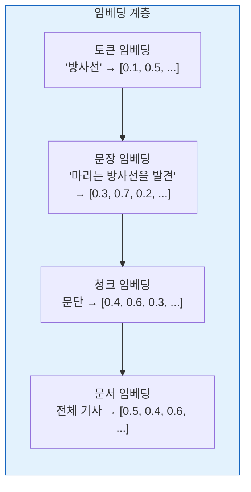

### 3.2.6 의미적 유사도

**코사인 유사도**는 두 벡터가 얼마나 유사한지 측정합니다.

```
유사도 = cos(θ) = (A · B) / (||A|| × ||B||)
```

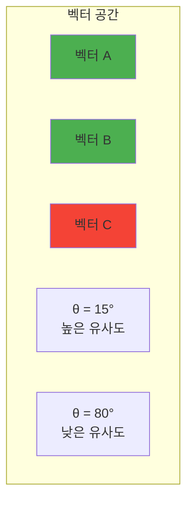

**GraphRAG에서 사용:** 다음을 위해
- 검색을 위한 유사한 텍스트 유닛 찾기
- 의미적 관련성별 개체 랭킹
- 관련 개념 클러스터링

---

## 3.3 정보 검색 개념

### 3.3.1 정보 검색이란 무엇인가?

**정보 검색(IR)**은 쿼리를 기반으로 대규모 컬렉션에서 관련 문서를 찾는 과정입니다.

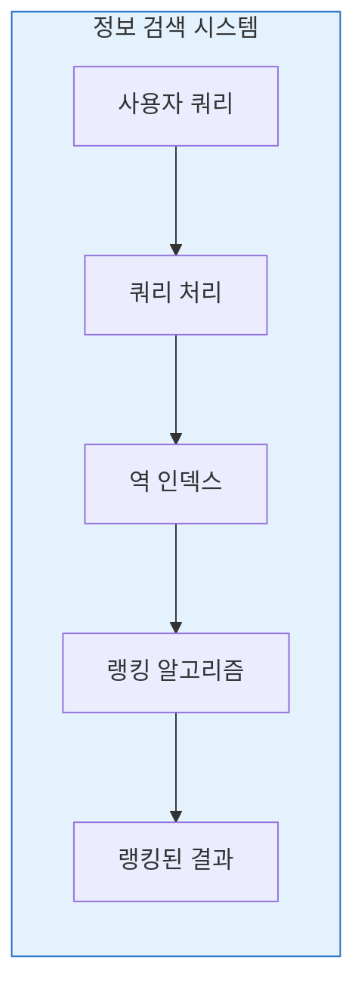

### 3.3.2 전통적 IR: TF-IDF와 BM25

#### TF-IDF (Term Frequency - Inverse Document Frequency)

단어 중요성을 다음을 통해 측정합니다.
- **용어 빈도(TF)**: 문서에서 용어가 나타나는 횟수
- **역 문서 빈도(IDF)**: 모든 문서에서 용어가 얼마나 희귀한지

```
TF-IDF(t, d) = TF(t, d) × IDF(t)

TF(t, d) = count(t in d) / d의 총 단어 수
IDF(t) = log(총 문서 / t를 포함한 문서)
```

**예시:**
- "방사선"이 마리 퀴리 전기에 나옴: 높은 TF, 낮은 IDF → 중간 점수
- "the"가 어떤 문서에 나옴: 높은 TF, 매우 낮은 IDF → 낮은 점수
- "폴로늄"이 하나의 문서에만 나옴: 중간 TF, 높은 IDF → 높은 점수

#### BM25

**BM25**는 TF-IDF를 다음을 통해 개선합니다.
- TF 포화 (일정 지점 이상 증가하지 않음)
- 문서 길이 정규화 고려

**사용되는 곳:** 많은 전통 검색 엔진 (Elasticsearch, Solr)

### 3.3.3 신경망 정보 검색

신경망 IR은 용어 매칭 대신 임베딩을 사용합니다.

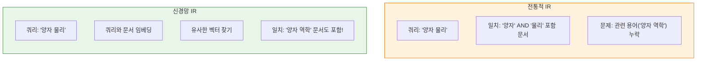

### 3.3.4 밀집 vs. 희소 표현

| 측면 | 희소 (TF-IDF) | 밀집 (임베딩) |
|--------|-----------------|-------------------|
| **표현** | 고차원, 대부분 0 | 더 낮은 차원, 밀집 |
| **매칭** | 정확한 용어 매칭 | 의미적 유사도 |
| **메모리** | 큰 어휘에 효율적 | 벡터 저장 필요 |
| **속도** | 역 인덱스로 매우 빠름 | 느림 (벡터 유사도 필요) |
| **품질** | 키워드 검색에 좋음 | 의미 검색에 더 좋음 |
| **어휘** | 고정 어휘 | 서브워드를 통해 OOV 처리 가능 |

### 3.3.5 관련성 점수

IR이 무엇이 관련 있는지 결정하는 방법:

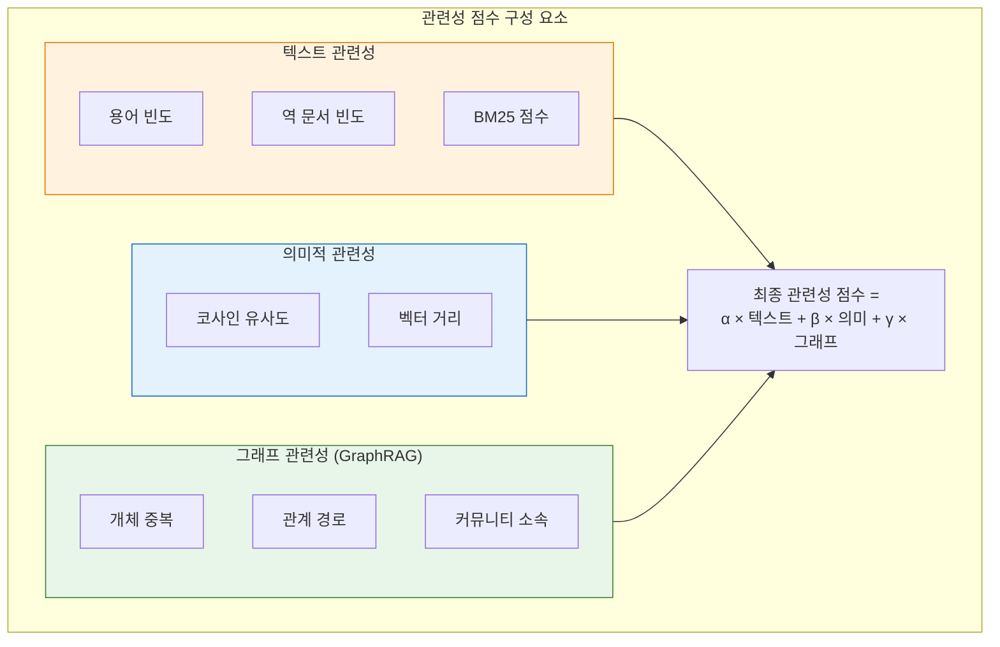

---

## 3.4 텍스트에서 지식 그래프로

### 3.4.1 GraphRAG용 NLP 파이프라인

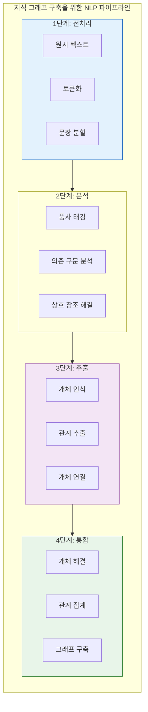

### 3.4.2 의존 구문 분석

**의존 구문 분석**은 단어 간의 문법적 관계를 찾습니다.

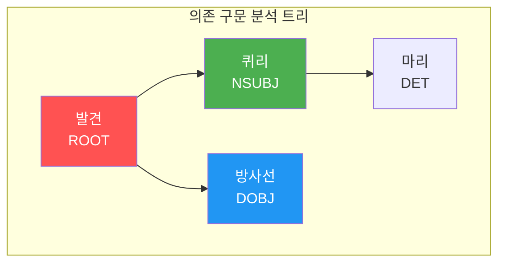

**GraphRAG 사용:**
- 주어-동사-목적어 트리플 식별 (관계!)
- "A가 B를 발견"와 "B가 A를 발견" 구별

### 3.4.3 상호 참조 해결

**상호 참조 해결**은 다른 표현이 같은 개체를 참조하는 시점을 결정합니다.

```
"마리 퀴리는 물리학자였습니다. 그녀는 방사선을 발견했습니다."
                              ↑
                              └── 마리 퀴리를 참조
```

**GraphRAG 사용:**
- 같은 개체에 대한 참조 통합
- 관계 추출 개선
- 완전한 개체 프로필 구축

---

## 장 요약

이 장에서는 GraphRAG를 가능하게 하는 NLP 기초를 다루었습니다.

**핵심 개념:**
- **토큰화**가 처리 가능한 단위로 텍스트를 분할
- **품사 태깅**이 문법적 역할 식별
- **NER**가 개체명 추출 (사람, 장소, 조직)
- **관계 추출**이 개체 간 연결 발견

**벡터 표현:**
- **단어 임베딩** (Word2Vec, GloVe)이 의미적 유사도 포착
- **컨텍스트별 임베딩** (BERT)이 중의성 처리
- **문장/문서 임베딩**이 의미적 검색 가능

**정보 검색:**
- **TF-IDF/BM25**이 전통적 키워드 검색
- **신경망 IR**이 의미적 유사도
- **GraphRAG**가 둘 다 그래프 구조와 결합

**다음 단계:**
[[Textbook - LLMs and RAG]]에서 대규모 언어 모델의 작동 방식과 검색 증강 생성이 이러한 NLP 기초를 어떻게 활용하는지 탐구하겠습니다.

---

## 복습 문제

1. NLP에 토큰화가 필요한 이유는 무엇입니까?
2. 단어 수준과 서브워드 수준 토큰화의 차이점은 무엇입니까?
3. 컨텍스트별 임베딩(BERT처럼)과 정적 임베딩(Word2Vec처럼)의 차이점은 무엇입니까?
4. TF-IDF 공식을 본인의 말로 설명하세요.
5. 관계 추출에서 의존 구문 분석의 역할은 무엇입니까?
6. 정보 검색을 위해 희소 표현과 밀집 표현을 비교하세요.

---

## 연습 문제

1. 단어 수준과 서브워드 수준 접근법을 사용하여 다음 문장을 토큰화하세요:
   "기존의 질병은 치료에 비현실적으로 저항했습니다."

2. 다음 문장이 주어졌을 때:
   - "마리 퀴리는 방사선을 발견했습니다."
   - "그녀는 훌륭한 과학자였습니다."
   상호 참조 해결을 수행하세요 - "그녀"는 누구를 참조합니까?

3. 100개의 단어가 있는 문서에서 "Curie"가 3번 나타나고, 1000개의 문서 말뭉치에서 50개의 문서에 "Curie"가 포함된 경우 단어 "Curie"의 TF-IDF를 계산하세요.

---

## 추가 참고자료

- "Speech and Language Processing" by Jurafsky & Martin
- "Introduction to Information Retrieval" by Manning et al.
- BERT 논문: "BERT: Pre-training of Deep Bidirectional Transformers"
- Sentence-BERT 문서
