# Chapter 6: Relationship Extraction
# 제 6장: 관계 추출

## Learning Objectives
## 학습 목표

By the end of this chapter, you will be able to:
이 장을 마치면 다음을 수행할 수 있습니다:
- Define what relationships are and their types
- 관계가 무엇이며 그 유형 정의하기
- Explain various methods for extracting relationships from text
- 텍스트에서 관계를 추출하는 다양한 방법 설명하기
- Calculate relationship strength and weights
- 관계 강도와 가중치 계산하기
- Validate and filter extracted relationships
- 추출된 관계를 검증하고 필터링하기
- Build and manage the edge table in GraphRAG
- GraphRAG에서 엣지 테이블 구축 및 관리하기

---

## 6.1 Understanding Relationships
## 6.1 관계 이해하기

### 6.1.1 What is a Relationship?
### 6.1.1 관계란 무엇인가?

A **relationship** (or edge) is a connection between two entities that describes how they relate to each other. In GraphRAG, relationships form the edges of our knowledge graph.
**관계(relationship)**(또는 엣지)는 두 개체 간의 연결로, 서로 어떻게 관련되어 있는지를 설명합니다. GraphRAG에서 관계는 지식 그래프의 엣지를 형성합니다.

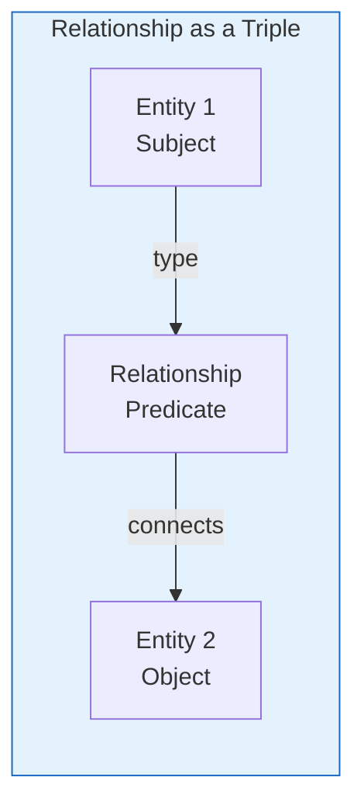

**Formal definition:** A relationship is a tuple `(source, target, type, weight)` where:
**형식적 정의:** 관계는 다음과 같은 튜플 `(source, target, type, weight)`입니다:
- `source`: The originating entity
- `source`: 시작 개체
- `target`: The destination entity
- `target`: 대상 개체
- `type`: The nature of the relationship
- `type`: 관계의 성격
- `weight`: Strength or confidence of the relationship
- `weight`: 관계의 강도 또는 신뢰도

### 6.1.2 Relationship Types
### 6.1.2 관계 유형

Relationships can be categorized in multiple ways:
관계는 여러 방식으로 분류할 수 있습니다:

#### By Semantic Type
#### 의미 유형별

| Category | Description | Examples | GraphRAG Usage |
|----------|-------------|----------|----------------|
| **Structural** | Organizational connections | part-of, contains, located-in | Essential for hierarchy |
| **구조적** | 조직적 연결 | ~의 일부, 포함, 위치 | 계층 구조에 필수적 |
| **Actional** | Actions and events | created, discovered, wrote | Captures dynamic information |
| **행동적** | 행동 및 사건 | 생성, 발견, 작성 | 동적 정보 포착 |
| **Temporal** | Time-based relations | before, after, during | Temporal queries |
| **시간적** | 시간 기반 관계 | ~이전, ~이후, ~동안 | 시간적 쿼리 |
| **Causal** | Cause and effect | causes, leads-to, prevents | Explanatory queries |
| **인과적** | 원인과 결과 | 원인, 결과, 방지 | 설명적 쿼리 |
| **Social** | Interpersonal connections | colleague-of, friend-of | Social network analysis |
| **사회적** | 대인 관계 | 동료, 친구 | 소셜 네트워크 분석 |
| **Semantic** | Meaning-based | similar-to, related-to | Concept exploration |
| **의미적** | 의미 기반 | ~과 유사, 관련됨 | 개념 탐색 |

#### By Directionality
#### 방향성별

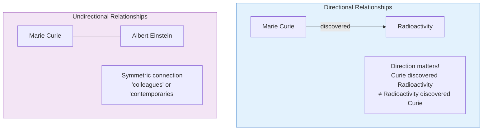

### 6.1.3 Relationship Properties
### 6.1.3 관계 속성

A relationship in GraphRAG has several properties:
GraphRAG의 관계는 여러 속성을 가집니다:

| Property | Description | Example |
|----------|-------------|---------|
| **Source** | Originating entity ID | `ent_001` (Marie Curie) |
| **소스** | 시작 개체 ID | `ent_001` (마리 퀴리) |
| **Target** | Destination entity ID | `ent_002` (Radioactivity) |
| **타겟** | 대상 개체 ID | `ent_002` (방사능) |
| **Type** | Relationship category | `discovered` |
| **유형** | 관계 범주 | `발견` |
| **Description** | Natural language explanation | "discovered in 1898" |
| **설명** | 자연어 설명 | "1898년에 발견" |
| **Weight** | Strength/confidence (0-1) | `0.95` |
| **가중치** | 강도/신뢰도 (0-1) | `0.95` |
| **Source Units** | Text units providing evidence | `["tu_001", "tu_003"]` |
| **소스 단위** | 증거를 제공하는 텍스트 단위 | `["tu_001", "tu_003"]` |
| **Count** | Number of occurrences | `5` |
| **카운트** | 발생 횟수 | `5` |
| **Attributes** | Additional metadata | `{"year": 1898}` |
| **속성** | 추가 메타데이터 | `{"year": 1898}` |

### 6.1.4 Real-World Examples
### 6.1.4 실제 예시

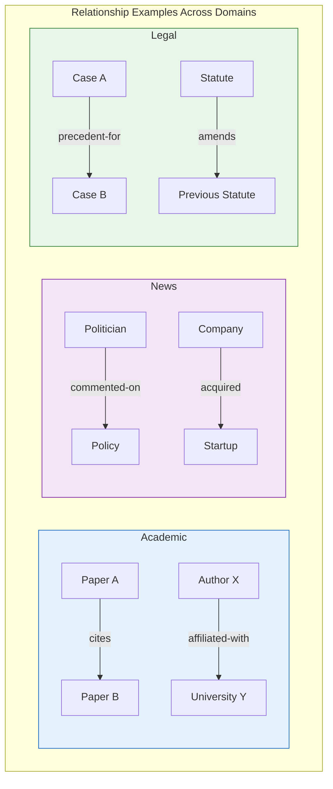

---

## 6.2 Extracting Relationships from Text
## 6.2 텍스트에서 관계 추출하기

### 6.2.1 The Relationship Extraction Problem
### 6.2.1 관계 추출 문제

Given a text with entities, find how they relate:
개체가 있는 텍스트가 주어지면, 그들이 어떻게 관련되어 있는지 찾습니다:

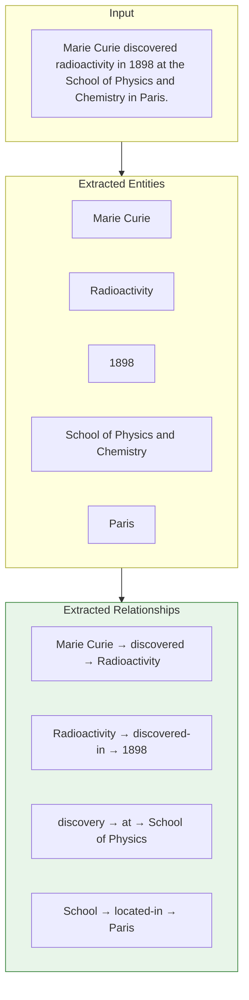

### 6.2.2 Extraction Methods
### 6.2.2 추출 방법

#### Co-occurrence Analysis
#### 동시 출현 분석

**Idea:** Entities appearing together are likely related.
**아이디어:** 함께 등장하는 개체는 관련되어 있을 가능성이 높습니다.

```mermaid
flowchart TB
    subgraph Cooccurrence["Co-occurrence Extraction"]
        direction TB

        DOC[Document]

        WINDOW[Sliding Window<br/>(e.g., 50 tokens)]

        COOC[Count co-occurrences<br/>within window]

        WEIGHT[Weight = count / distance]

        DOC --> WINDOW --> COOC --> WEIGHT
    end

    style Cooccurrence fill:#fff3e0,stroke:#ef6c00
```

**Advantages:**
**장점:**
- Fast and simple
- 빠르고 간단함
- No ML required
- ML 불필요
- Works for any domain
- 모든 도메인에서 작동

**Disadvantages:**
**단점:**
- Misses long-range relationships
- 장거리 관계를 놓침
- Doesn't capture relationship type
- 관계 유형을 포착하지 못함
- Many false positives
- 많은 오탐

#### Dependency Parse-Based Extraction
#### 의존 구문 분석 기반 추출

**Idea:** Use grammatical structure to find relationships.
**아이디어:** 문법적 구조를 사용하여 관계를 찾습니다.

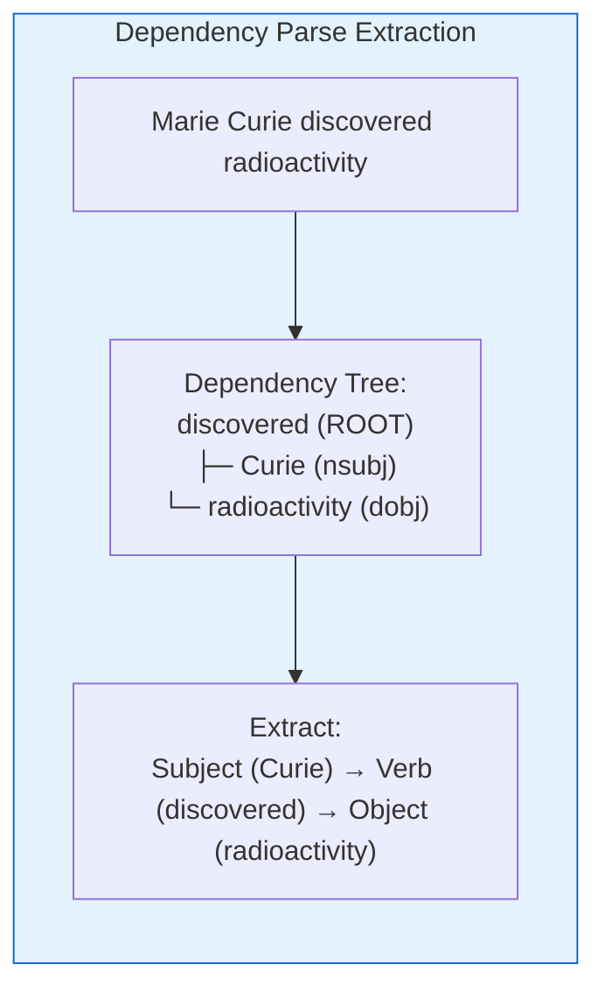

**Advantages:**
**장점:**
- Captures relationship type
- 관계 유형 포착
- Grammatically grounded
- 문법적으로 기반함
- More precise
- 더 정확함

**Disadvantages:**
**단점:**
- Limited to syntactic relationships
- 구문 관계로 제한됨
- Requires good parser
- 좋은 파서가 필요함
- Misses implicit relationships
- 암시적 관계를 놓침

#### LLM-Driven Relationship Extraction
#### LLM 기반 관계 추출

**Idea:** Use LLM's understanding to extract relationships.
**아이디어:** LLM의 이해를 사용하여 관계를 추출합니다.

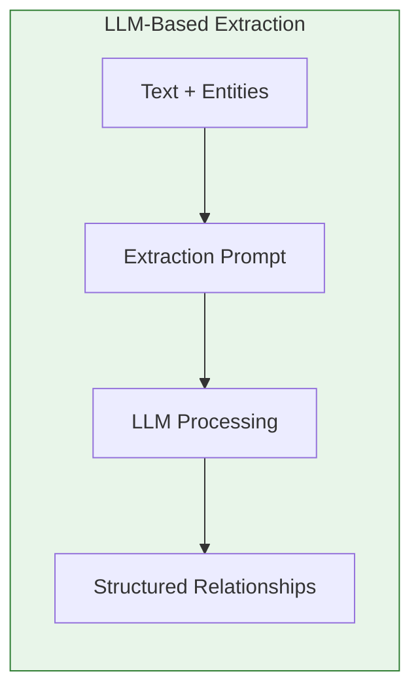

**Prompt Template:**
**프롬프트 템플릿:**

```markdown
From the text below, extract relationships between the given entities.

For each relationship, provide:
- source: source entity name
- target: target entity name
- type: relationship type (verb or phrase)
- description: brief explanation
- weight: confidence (0-1)

Entities: {entities}
Text: {text}

Respond in JSON format.
```

**Advantages:**
**장점:**
- Captures complex and implicit relationships
- 복잡하고 암시적인 관계 포착
- Flexible relationship types
- 유연한 관계 유형
- Good at handling ambiguity
- 모호성 처리에 능숙함

**Disadvantages:**
**단점:**
- Expensive (LLM API costs)
- 비쌈 (LLM API 비용)
- Slower than rule-based
- 규칙 기반보다 느림
- May hallucinate relationships
- 관계를 허위 생성할 수 있음

### 6.2.3 Relationship Strength Calculation
### 6.2.3 관계 강도 계산

Relationship weight combines multiple signals:
관계 가중치는 여러 신호를 결합합니다:

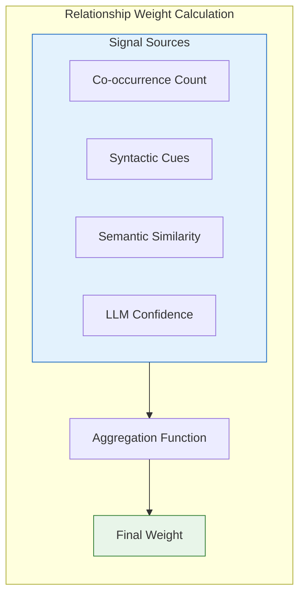

**Common weighting formulas:**
**일반적인 가중치 공식:**

```
# Simple co-occurrence weight
weight = count(source, target together) / total_occurrences

# Distance-adjusted weight
weight = Σ(1 / distance) for each co-occurrence

# Combined weight
weight = α × co_occurrence + β × llm_confidence + γ × type_importance
```

---

## 6.3 Relationship Validation
## 6.3 관계 검증

### 6.3.1 Filtering Weak Relationships
### 6.3.1 약한 관계 필터링

Not all extracted relationships are equally valuable.
모든 추출된 관계가 동일하게 가치 있는 것은 아닙니다.

#### Filtering Strategies
#### 필터링 전략

| Strategy | Description | Threshold Example |
|----------|-------------|-------------------|
| **Weight threshold** | Remove relationships below weight | `weight > 0.3` |
| **가중치 임계값** | 가중치 미만 관계 제거 | `weight > 0.3` |
| **Count threshold** | Require minimum occurrences | `count ≥ 2` |
| **카운트 임계값** | 최소 발생 횟수 요구 | `count ≥ 2` |
| **Type filtering** | Keep only certain types | Keep: discovered, cited |
| **유형 필터링** | 특정 유형만 유지 | 유지: 발견, 인용 |
| **Confidence filtering** | Use LLM confidence | `confidence > 0.7` |
| **신뢰도 필터링** | LLM 신뢰도 사용 | `confidence > 0.7` |

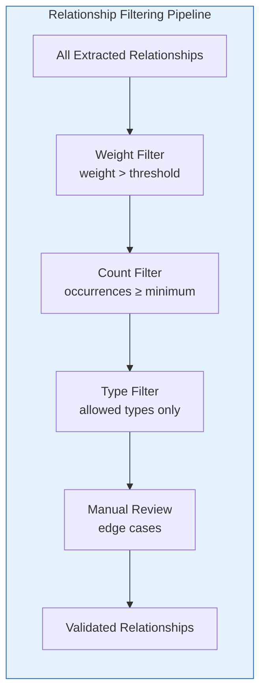

### 6.3.2 Relationship Aggregation
### 6.3.2 관계 집계

The same relationship may be extracted multiple times:
동일한 관계가 여러 번 추출될 수 있습니다:

```mermaid
flowchart LR
    subgraph Aggregate["Relationship Aggregation"]

        subgraph Before["Before Aggregation"]
            R1[Curie -discovered-> Radioactivity<br/>weight: 0.8<br/>source: chunk 1]
            R2[Curie -discovered-> Radioactivity<br/>weight: 0.9<br/>source: chunk 3]
            R3[Curie -discovered-> Radioactivity<br/>weight: 0.7<br/>source: chunk 7]
        end

        subgraph After["After Aggregation"]
            RFINAL[Curie -discovered-> Radioactivity<br/>weight: 0.8 (avg)<br/>count: 3<br/>sources: [chunk 1, 3, 7]]
        end

        Before --> After
    end

    style After fill:#e8f5e9,stroke:#2e7d32
```

**Aggregation strategies:**
**집계 전략:**

| Strategy | Formula | Use Case |
|----------|---------|----------|
| **Maximum** | `max(weights)` | Keep strongest evidence |
| **최대값** | `max(weights)` | 가장 강한 증거 유지 |
| **Average** | `mean(weights)` | Balance all evidence |
| **평균** | `mean(weights)` | 모든 증거 균형 |
| **Weighted average** | `Σ(weight × confidence) / Σ(confidence)` | Confidence-weighted |
| **가중 평균** | `Σ(weight × confidence) / Σ(confidence)` | 신뢰도 가중치 |
| **Boosting** | `min(1.0, base + count × boost)` | Reward repeated relationships |
| **부스팅** | `min(1.0, base + count × boost)` | 반복 관계 보상 |

### 6.3.3 Handling Conflicting Relationships
### 6.3.3 충돌하는 관계 처리

Sometimes the same entity pair has conflicting relationships:
때로는 동일한 개체 쌍에 충돌하는 관계가 있습니다:

```
Example 1: "Company A acquired Company B"
Example 2: "Company A and Company B merged"
```

**Resolution strategies:**
**해결 전략:**
1. **Time-based**: Use most recent
1. **시간 기반**: 가장 최근 것 사용
2. **Source-based**: Prefer authoritative sources
2. **소스 기반**: 권위 있는 소스 선호
3. **Confidence-based**: Use highest confidence
3. **신뢰도 기반**: 가장 높은 신뢰도 사용
4. **Human review**: Flag for manual inspection
4. **사람 검토**: 수동 검토를 위해 플래그
5. **Keep both**: Mark with uncertainty
5. **둘 다 유지**: 불확실성으로 표시

### 6.3.4 Relationship Confidence Scoring
### 6.3.4 관계 신뢰도 점수 매기기

Confidence scores indicate extraction certainty:
신뢰도 점수는 추출 확실성을 나타냅니다:

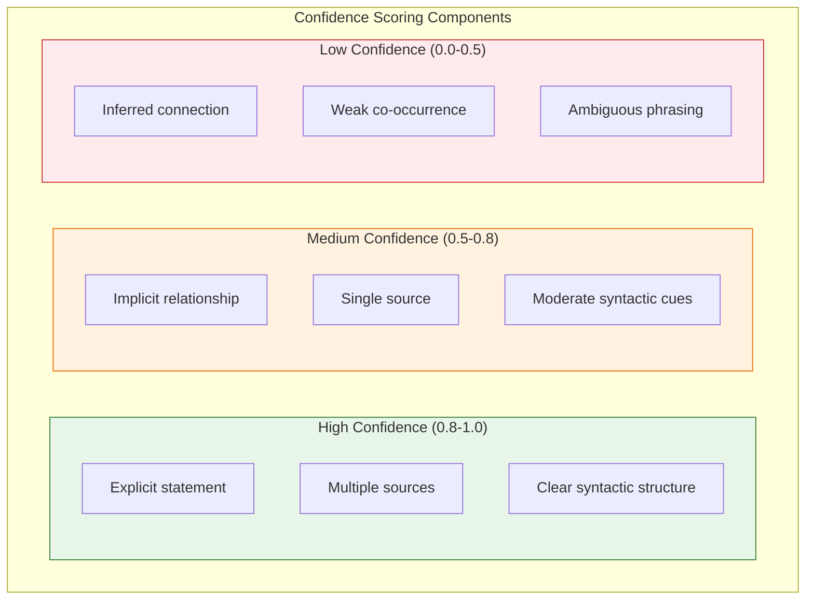

---

## 6.4 Building the Edge Table
## 6.4 엣지 테이블 구축

### 6.4.1 The GraphRAG Edge Schema
### 6.4.1 GraphRAG 엣지 스키마

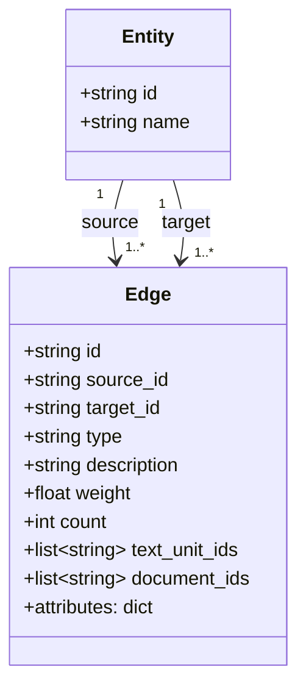

### 6.4.2 Example Edge Records
### 6.4.2 예시 엣지 레코드

```json
{
  "id": "edge_001",
  "source_id": "ent_marie_curie",
  "target_id": "ent_radioactivity",
  "type": "discovered",
  "description": "Marie Curie discovered radioactivity in 1898",
  "weight": 0.95,
  "count": 5,
  "text_unit_ids": ["tu_001", "tu_003", "tu_007", "tu_012", "tu_015"],
  "document_ids": ["doc_001", "doc_002"],
  "attributes": {
    "year": 1898,
    "confidence": "high"
  }
}
```

### 6.4.3 Weight Computation Methods
### 6.4.3 가중치 계산 방법

GraphRAG provides multiple weight computation options:
GraphRAG은 다양한 가중치 계산 옵션을 제공합니다:

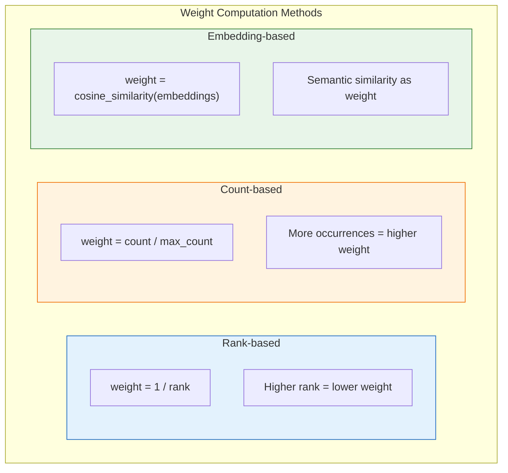

### 6.4.4 Temporal Aspects of Relationships
### 6.4.4 관계의 시간적 측면

Relationships can have temporal dimensions:
관계는 시간적 차원을 가질 수 있습니다:

| Temporal Type | Description | Example |
|---------------|-------------|---------|
| **Instantaneous** | Occurred at specific time | "discovered in 1898" |
| **순간적** | 특정 시점에 발생 | "1898년에 발견" |
| **Duration** | Existed over period | "worked at (1920-1930)" |
| **지속적** | 기간 동안 존재 | "(1920-1930) 근무" |
| **Sequential** | Before/after relationships | "preceded World War II" |
| **순차적** | 전/후 관계 | "제2차 세계대전 선행" |
| **Evolving** | Changes over time | "merged, then split" |
| **진화적** | 시간이 지나며 변화 | "합병 후 분리" |

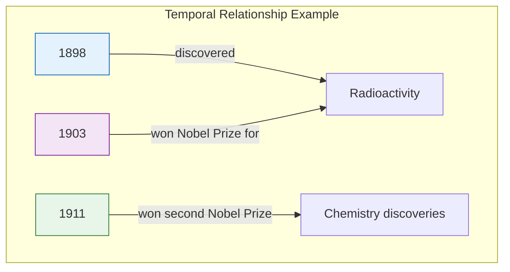

### 6.4.5 Handling Missing Relationships
### 6.4.5 누락된 관계 처리

Not all entity pairs will have relationships:
모든 개체 쌍이 관계를 가지는 것은 아닙니다:

**Strategies for missing relationships:**
**누락된 관계에 대한 전략:**
1. **Leave empty**: No edge = no relationship
1. **비워두기**: 엣지 없음 = 관계 없음
2. **Implicit relationship**: "related-to" with low weight
2. **암시적 관계**: 낮은 가중치의 "관련됨"
3. **Transitive inference**: If A→B and B→C, maybe A→C
3. **추이적 추론**: A→B이고 B→C이면, A→C일 수 있음
4. **Explicit negative**: Store "no relationship" metadata
4. **명시적 부정**: "관계 없음" 메타데이터 저장

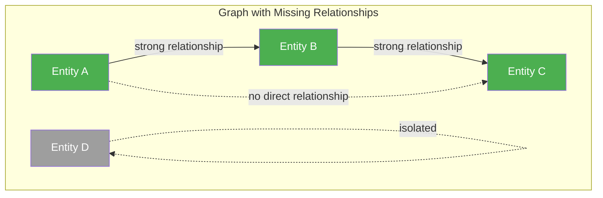

---

## Chapter Summary
## 장 요약

In this chapter, we covered relationship extraction in GraphRAG:
이 장에서는 GraphRAG의 관계 추출을 다루었습니다:

**Key Concepts:**
**핵심 개념:**
- **Relationships** are connections between entities with types, weights, and properties
- **관계**는 유형, 가중치, 속성을 가진 개체 간의 연결입니다
- Relationships can be **directional** or **undirectional**
- 관계는 **방향성** 또는 **비방향성**일 수 있습니다
- Relationship types include structural, actional, temporal, causal, social, and semantic
- 관계 유형에는 구조적, 행동적, 시간적, 인과적, 사회적, 의미적이 포함됩니다

**Extraction Methods:**
**추출 방법:**
- **Co-occurrence analysis**: Simple but noisy
- **동시 출현 분석**: 간단하지만 노이즈가 많음
- **Dependency parse**: Grammatically grounded but limited
- **의존 구문 분석**: 문법적으로 기반하지만 제한적
- **LLM-based**: Most flexible and accurate but expensive
- **LLM 기반**: 가장 유연하고 정확하지만 비쌈

**Validation and Quality:**
**검증 및 품질:**
- **Filtering** removes weak relationships by weight, count, and type
- **필터링**은 가중치, 카운트, 유형별로 약한 관계를 제거합니다
- **Aggregation** combines multiple extractions of the same relationship
- **집계**는 동일한 관계의 여러 추출을 결합합니다
- **Confidence scoring** indicates extraction certainty
- **신뢰도 점수**는 추출 확실성을 나타냅니다

**Edge Table:**
**엣지 테이블:**
- Stores source, target, type, description, weight, and metadata
- 소스, 타겟, 유형, 설명, 가중치, 메타데이터를 저장합니다
- Supports temporal relationships and various weight computation methods
- 시간적 관계와 다양한 가중치 계산 방법을 지원합니다
- Handles missing relationships appropriately
- 누락된 관계를 적절하게 처리합니다

**Next Steps:**
**다음 단계:**
With entities and relationships forming our graph, [[Textbook - Community Detection]] will explain how to find clusters of related entities.
개체와 관계가 그래프를 형성했으므로, [[Textbook - Community Detection]]에서 관련 개체의 클러스터를 찾는 방법을 설명합니다.

---

## Review Questions
## 복습 문제

1. What is a relationship in the context of knowledge graphs?
1. 지식 그래프의 문맥에서 관계란 무엇인가요?
2. Compare and contrast the three main relationship extraction methods.
2. 세 가지 주요 관계 추출 방법을 비교하고 대조하세요.
3. Why do we need to assign weights to relationships?
3. 관계에 가중치를 할당해야 하는 이유는 무엇인가요?
4. Describe the process of relationship aggregation.
4. 관계 집계 과정을 설명하세요.
5. How does temporal information affect relationship representation?
5. 시간 정보는 관계 표현에 어떤 영향을 미치나요?
6. What fields are included in GraphRAG's edge table schema?
6. GraphRAG의 엣지 테이블 스키마에 포함된 필드는 무엇인가요?

---

## Exercises
## 연습 문제

1. Given the text "Elon Musk founded SpaceX in 2002 with the goal of reducing space transportation costs," extract all relationships. What are the sources, targets, and types?
1. "Elon Musk founded SpaceX in 2002 with the goal of reducing space transportation costs"라는 텍스트가 주어지면, 모든 관계를 추출하세요. 소스, 타겟, 유형은 무엇인가요?

2. You have these relationship extractions for the same pair:
2. 동일한 쌍에 대한 다음 관계 추출이 있습니다:
   - (A, related-to, B, weight=0.6)
   - (A, related-to, B, weight=0.8)
   - (A, related-to, B, weight=0.7)
   Using each aggregation strategy (max, avg, weighted), what are the final weights?
   각 집계 전략(최대, 평균, 가중)을 사용할 때 최종 가중치는 얼마입니까?

3. Design a prompt for LLM-based relationship extraction for financial news articles. What relationship types would you want to capture?
3. 금융 뉴스 기사를 위한 LLM 기반 관계 추출 프롬프트를 설계하세요. 어떤 관계 유형을 포착하고 싶나요?

---

## Further Reading
## 추가 참고자료

- "Relation Extraction" literature survey
- "Knowledge Graph Construction from Text" tutorials
- GraphRAG relationship extraction documentation
- Dependency parsing for relation extraction
