# Chapter 10: System Architecture

## 학습 목표

이 장을 마치면 다음을 수행할 수 있습니다:
- GraphRAG 엔드투엔드 아키텍처 설명
- 인덱싱 파이프라인 구성 요소 이해
- 쿼리 파이프라인 흐름 설명
- 확장성 고려 사항 식별
- GraphRAG 시스템을 위한 배포 패턴 설계

---

## 10.1 GraphRAG 파이프라인 개요

### 10.1.1 엔드투엔드 아키텍처

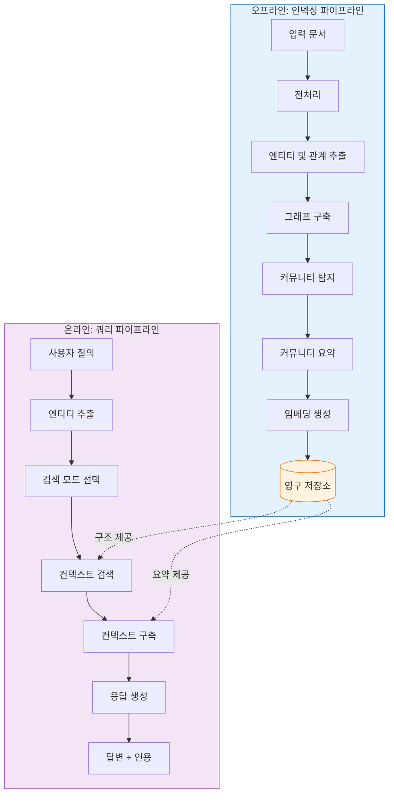

### 10.1.2 구성 요소 상호 작용

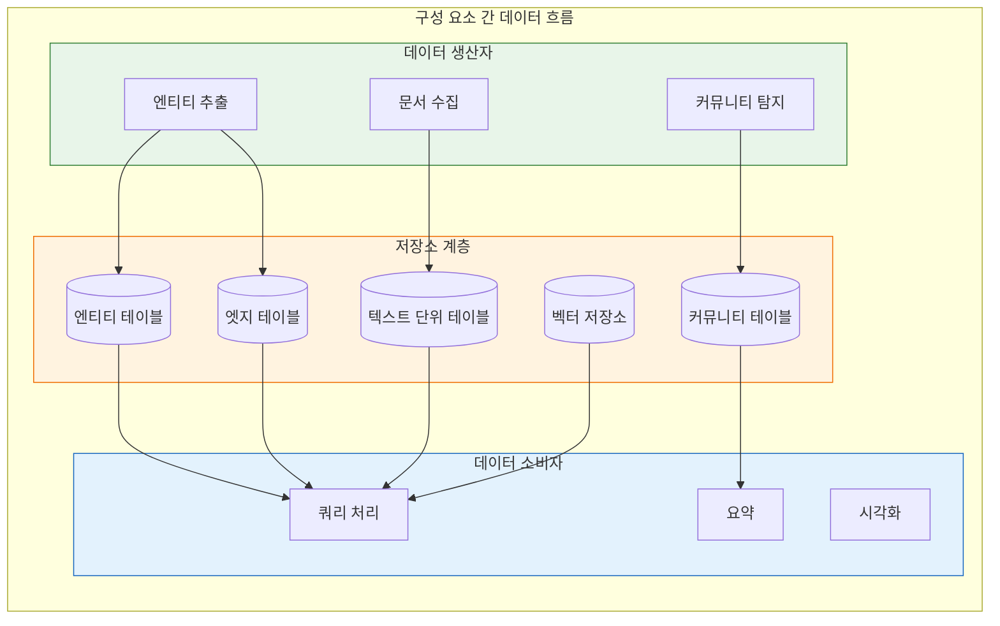

### 10.1.3 배포 패턴

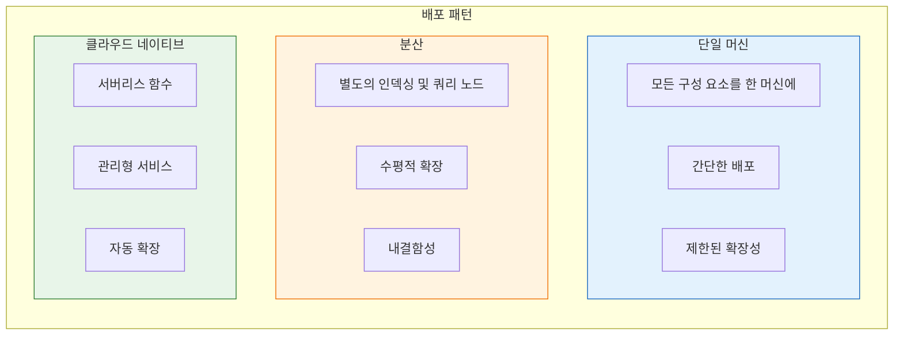

---

## 10.2 인덱싱 파이프라인

### 10.2.1 파이프라인 단계

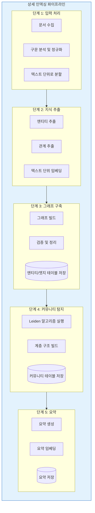

### 10.2.2 입력 처리

```mermaid
flowchart TB
    subgraph InputProc["입력 처리 세부 정보"]
        direction TB

        SUPPORTED[지원되는 형식:<br/>- TXT, MD<br/>- PDF<br/>- DOCX<br/>- HTML<br/>- JSON (사용자 지정)]

        NORMALIZE[정규화:<br/>- 텍스트 추출<br/>- 서식 제거<br/>- 인코딩 처리<br/>- 공백 정리]

        CHUNK[청킹 전략:<br/>- 고정 크기 또는 의미적<br/>- 중첩 처리<br/>- 크기 제한]

        METADATA[메타데이터 추출:<br/>- 문서 정보<br/>- 섹션 헤더<br/>- 날짜/시간]

        SUPPORTED --> NORMALIZE --> CHUNK --> METADATA
    end

    style InputProc fill:#e8f5e9,stroke:#2e7d32
```

### 10.2.3 추출 단계

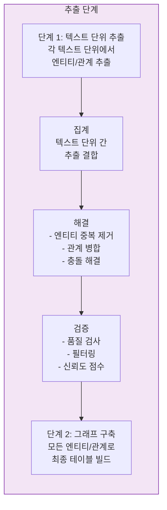

### 10.2.4 그래프 구축

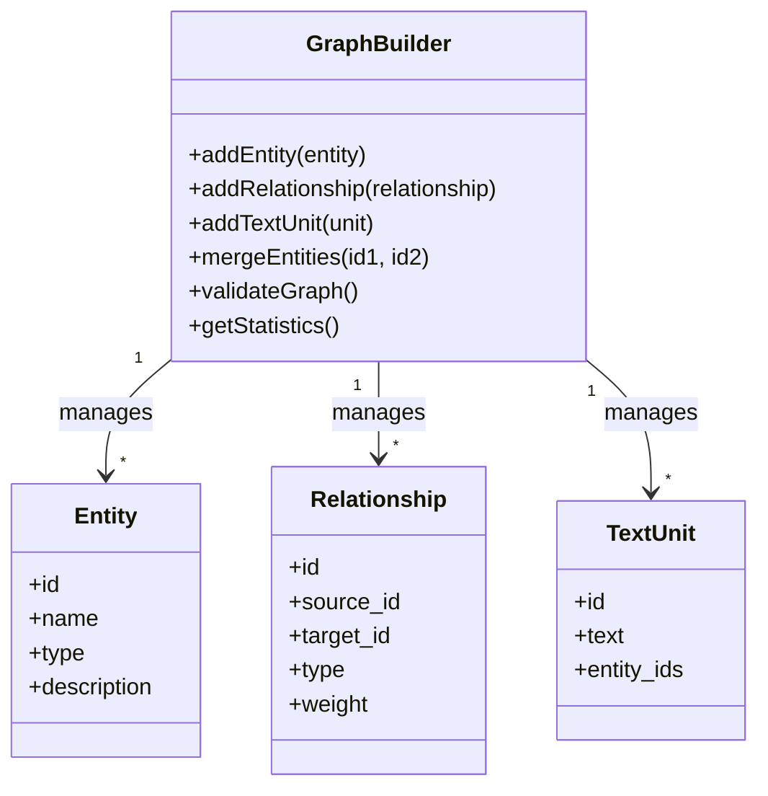

### 10.2.5 인덱싱 최적화

| 최적화 | 설명 | 영향 |
|--------------|-------------|--------|
| **병렬 추출** | 텍스트 단위를 동시에 처리 | 5-10배 속도 향상 |
| **배치 LLM 호출** | 여러 추출 결합 | API 오버헤드 감소 |
| **캐싱** | 임베딩, 반복 추출 캐시 | 더 빠른 재인덱싱 |
| **점진적 업데이트** | 변경된 문서만 처리 | 더 빠른 업데이트 |
| **벡터 인덱싱** | 벡터용 HNSW/IVF 사용 | 더 빠른 유사도 검색 |

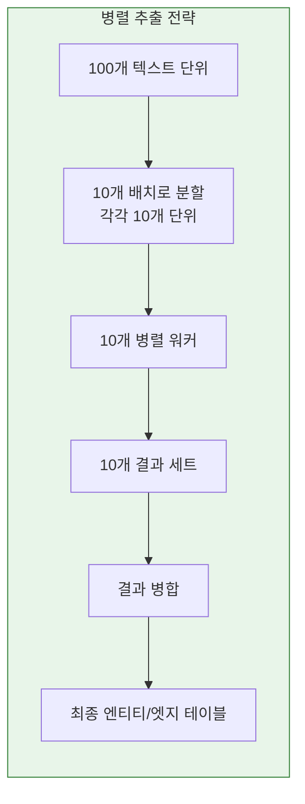

---

## 10.3 쿼리 파이프라인

### 10.3.1 파이프라인 단계

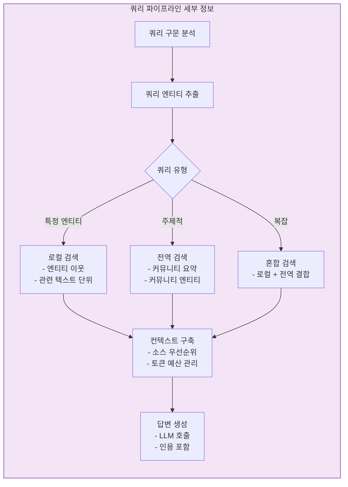

### 10.3.2 쿼리 구문 분석

```mermaid
flowchart TB
    subgraph QueryParse["쿼리 구문 분석"]
        direction TB

        RAW[원본 쿼리:<br/>"아인슈타인은 양자 역학에<br/>어떤 기여를 했습니까?"]

        TOKENIZE[토큰화]

        EXTRACT_E[엔티티 추출:<br/>- 아인슈타인<br/>- 양자 역학]

        CLASSIFY[의도 분류:<br/>유형: 엔티티 특정<br/>범위: 기여<br/>도메인: 물리학]

        PARSED[구문 분석된 쿼리 객체]

        RAW --> TOKENIZE --> EXTRACT_E --> CLASSIFY --> PARSED
    end

    style QueryParse fill:#e3f2fd,stroke:#1565c0
```

### 10.3.3 검색 전략

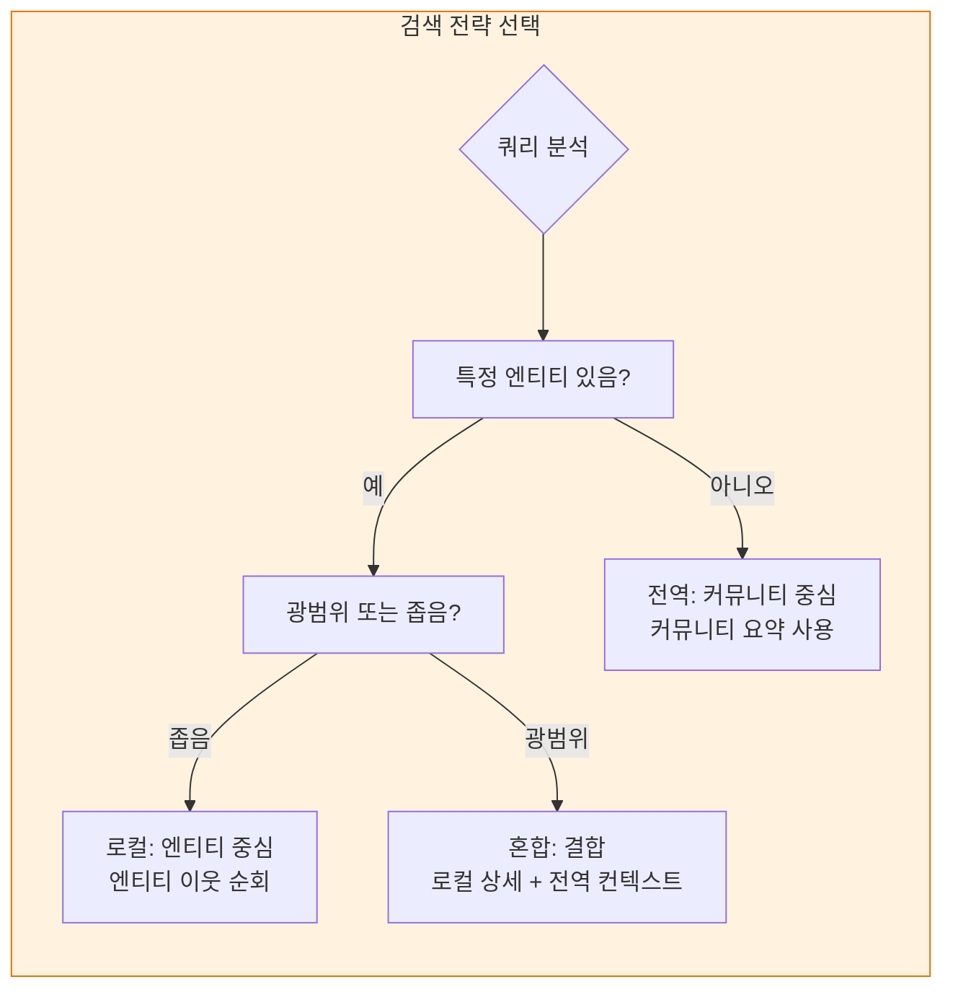

### 10.3.4 컨텍스트 빌딩

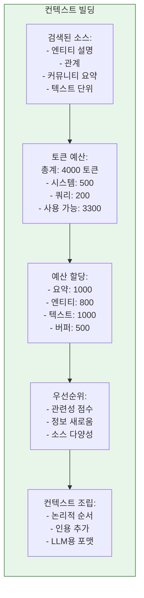

---

## 10.4 확장성 고려 사항

### 10.4.1 분산 인덱싱

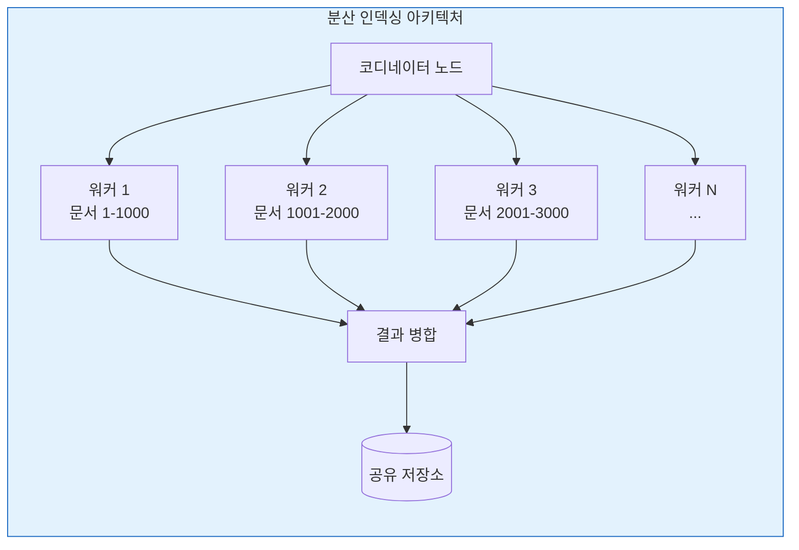

### 10.4.2 병렬 처리

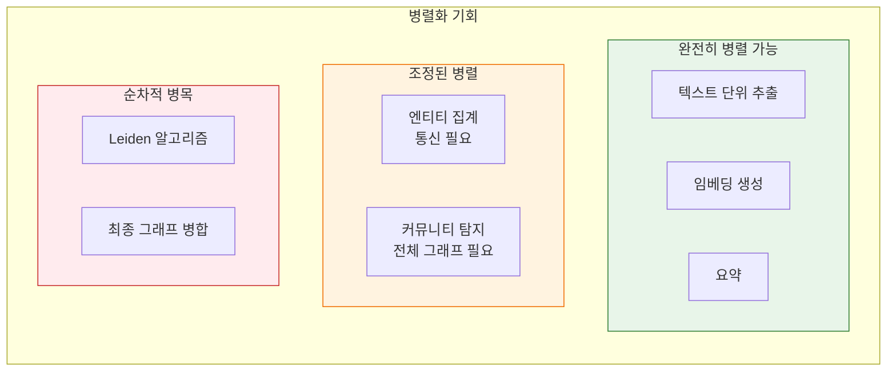

### 10.4.3 메모리 관리

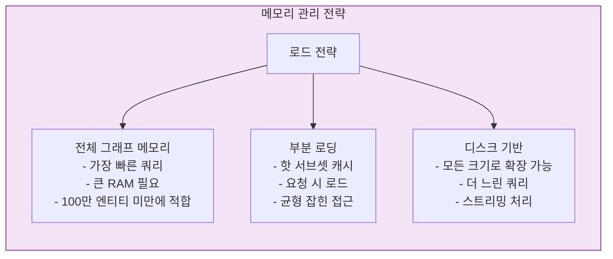

| 그래프 크기 | 메모리 전략 | 필요 RAM |
|------------|------------------|--------------|
| < 10만 엔티티 | 전체 인메모리 | 8-16 GB |
| 10만-100만 엔티티 | 부분 + 캐싱 | 32-64 GB |
| 100만-1000만 엔티티 | 디스크 기반 + 캐시 | 64-128 GB |
| > 1000만 엔티티 | 분산 | 클러스터 |

### 10.4.4 성능 최적화

```mermaid
flowchart TB
    subgraph Optimization["성능 최적화 기법"]
        direction TB

        subgraph IndexOpt["인덱싱 최적화"]
            IO1[배치 LLM 호출]
            IO2[병렬 텍스트 단위 처리]
            IO3[임베딩 캐싱]
            IO4[점진적 업데이트]
        end

        subgraph QueryOpt["쿼리 최적화"]
            QO1[빈번한 쿼리 캐싱]
            QO2[근사 최근접 이웃]
            QO3[엔티티/요약 사전 필터링]
            QO4[컨텍스트 압축]
        end

        subgraph StorageOpt["저장소 최적화"]
            SO1[벡터 인덱싱 (HNSW)]
            SO2[그래프 분할]
            SO3[칼럼 기반 저장소 (Parquet)]
            SO4[압축]
        end
    end

    style IndexOpt fill:#e3f2fd,stroke:#1565c0
    style QueryOpt fill:#e8f5e9,stroke:#2e7d32
    style StorageOpt fill:#f3e5f5,stroke:#7b1fa2
```

---

## 10.5 배포 아키텍처

### 10.5.1 단일 노드 배포

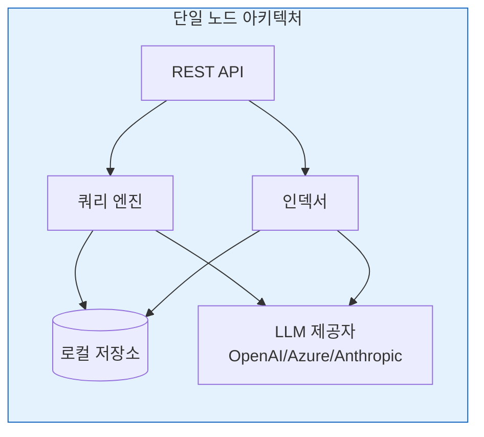

**장점:** 단순, 낮은 운영 오버헤드
**단점:** 제한된 확장성, 단일 실패 지점

### 10.5.2 분산 배포

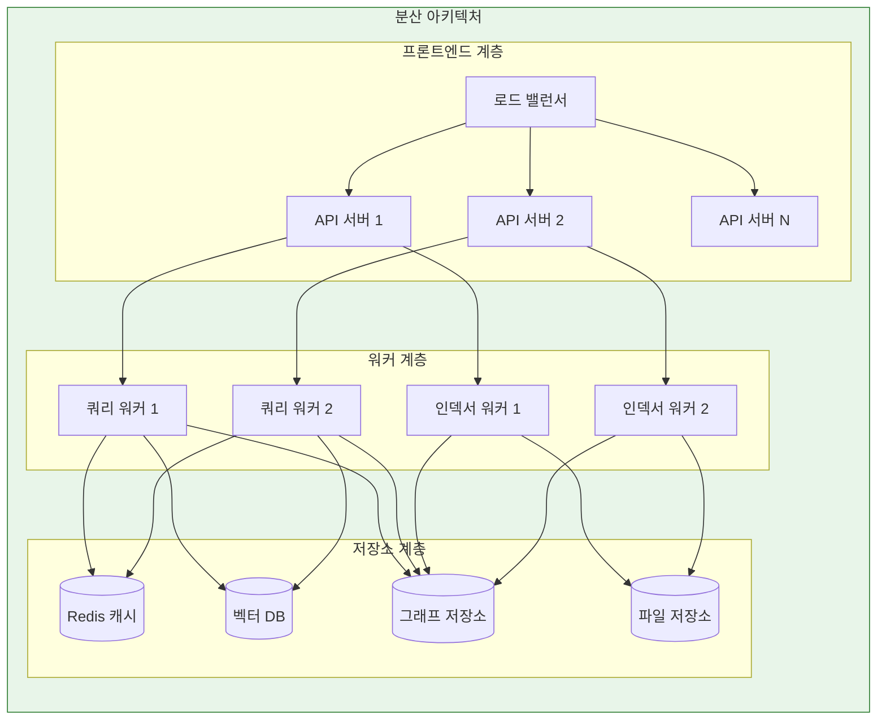

**장점:** 확장 가능, 내결함성
**단점:** 복잡, 높은 운영 비용

### 10.5.3 클라우드 네이티브 배포

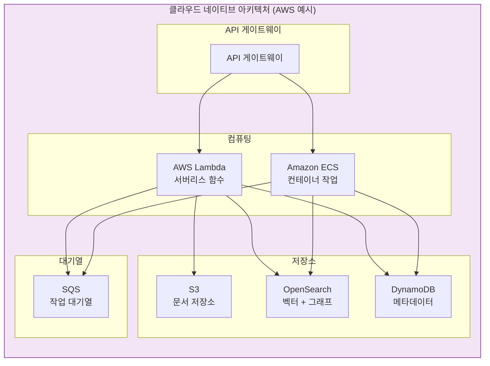

---

## 장 요약

이 장에서는 GraphRAG 시스템 아키텍처를 다루었습니다:

**아키텍처 개요:**
- 두 단계 설계: **인덱싱** (오프라인) 및 **쿼리** (온라인)
- 데이터 생산자와 소비자 간의 명확한 분리
- 단일 노드에서 클라우드 네이티브까지 다양한 배포 패턴

**인덱싱 파이프라인:**
- **입력 처리**: 문서 수집, 정규화, 청킹
- **추출 단계**: 엔티티 및 관계 추출과 집계
- **그래프 구축**: 지식 그래프 빌드 및 검증
- **커뮤니티 탐지**: Leiden 알고리즘 실행
- **요약**: 커뮤니티 요약 생성

**쿼리 파이프라인:**
- **쿼리 구문 분석**: 엔티티 추출 및 의도 분류
- **검색 전략**: 쿼리 유형에 따른 로컬, 전역 또는 혼합
- **컨텍스트 빌딩**: 예산 할당 및 우선순위 지정
- **답변 생성**: 인용이 포함된 LLM 호출

**확장성:**
- 완전히 병렬 가능한 작업에 대한 **병렬 처리**
- 대규모 문서 컬렉션을 위한 **분산 인덱싱**
- 다양한 그래프 크기를 위한 **메모리 관리** 전략
- 캐싱 및 인덱싱을 통한 **성능 최적화**

**다음 단계:**
[[Vector Embeddings Deep Dive]]에서 GraphRAG 시스템에 임베딩이 통합되는 방법을 다룹니다.

---

## 복습 질문

1. 인덱싱 파이프라인과 쿼리 파이프라인의 주요 차이점은 무엇입니까?
2. 인덱싱 파이프라인의 다섯 단계를 설명하세요.
3. 쿼리 파이프라인은 로컬 검색과 전역 검색 사이에서 어떻게 결정합니까?
4. GraphRAG의 확장성 고려 사항은 무엇입니까?
5. 단일 노드, 분산, 클라우드 네이티브 배포 패턴을 비교하세요.
6. 분산 GraphRAG 시스템의 주요 병목 현상은 무엇입니까?

---

## 연습문제

1. 100만 개 문서를 처리하고 초당 100개 쿼리를 처리해야 하는 GraphRAG 시스템을 위한 배포 아키텍처를 설계하세요.

2. 인덱싱 파이프라인이 너무 오래 걸립니다. 세 가지 잠재적 병목 현상을 식별하고 각각에 대한 최적화를 제안하세요.

3. AWS에 배포합니다. 각 구성 요소에 어떤 서비스를 사용하시겠습니까, 그 이유는 무엇입니까?

---

## 추가 참고자료

- GraphRAG 아키텍처 문서
- 분산 시스템 설계 패턴
- 클라우드 아키텍처 모범 사례
- 성능 최적화 기법
