# Chapter 8: Text Units and Chunking

## 학습 목표

이 장을 마치면 다음을 수행할 수 있습니다:
- 텍스트 단위의 정의와 GraphRAG에서의 역할 이해
- 다양한 청킹 전략 이해
- 다양한 사용 사례에 적합한 청킹 적용
- 텍스트 단위와 그래프 요소 간의 관계 관리
- 품질과 성능을 위한 청킹 최적화

---

## 8.1 텍스트 단위 개념

### 8.1.1 텍스트 단위란?

**텍스트 단위**는 GraphRAG에서 처리의 기본 단위가 되는 원본 텍스트의 연속적인 세그먼트입니다. 이는 원본 문서와 지식 그래프 사이의 다리 역할을 합니다.

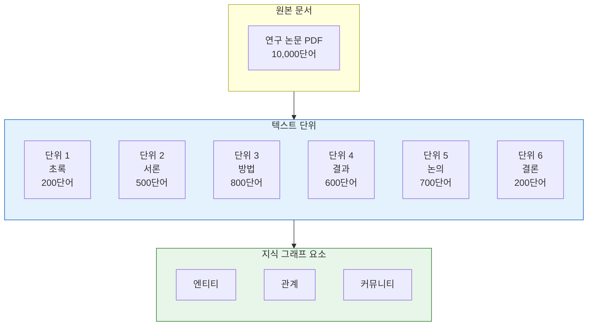

### 8.1.2 텍스트 단위가 중요한 이유

텍스트 단위는 여러 중요한 기능을 수행합니다:

| 기능 | 설명 | 중요성 |
|----------|-------------|------------|
| **추출 컨텍스트** | LLM 추출을 위한 범위가 지정된 컨텍스트 제공 | 집중된 추출 보장 |
| **출처 귀속** | 특정 텍스트에 대한 인용 가능 | 출처 제공 |
| **검색 입도** | 검색 대상 정의 | 컨텍스트와 관련성의 균형 |
| **엔티티 연결** | 엔티티를 원본 텍스트에 연결 | 추적 가능성 활성화 |
| **임베딩 단위** | 벡터 임베딩의 범위 정의 | 의미적 검색에 영향 |

### 8.1.3 그래프 요소와의 관계

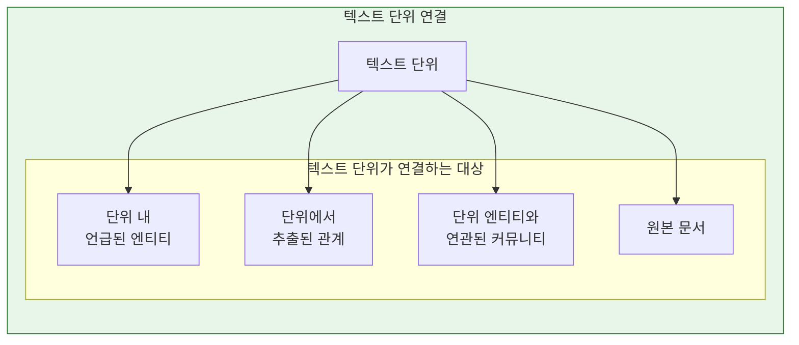

**양방향 연결:**
- 텍스트 단위 → 내에서 발견된 엔티티
- 엔티티 → 이를 언급하는 텍스트 단위
- 이를 통해 양방향으로 효율적인 순회 가능

### 8.1.4 입도 고려 사항

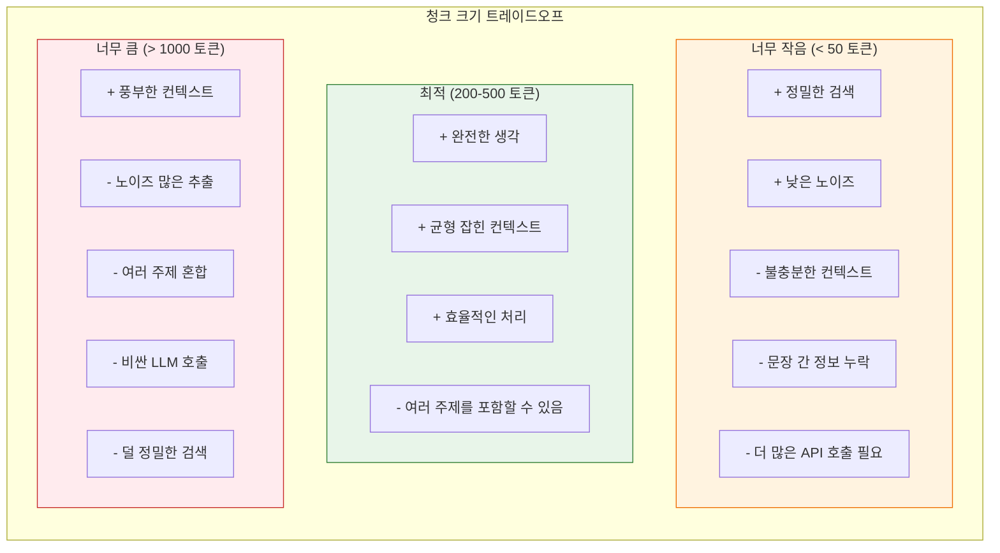

---

## 8.2 청킹 전략

### 8.2.1 고정 크기 청킹

텍스트를 고정된 수의 토큰으로 청크로 분할합니다.

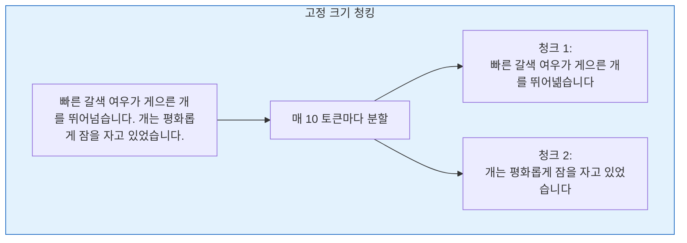

**장점:**
- 구현이 간단
- 예측 가능한 메모리 사용
- 병렬화가 쉬움

**단점:**
- 문장을 임의로 끊을 수 있음
- 의미적 응집성을 잃을 수 있음
- 주제 인식 부족

**매개변수:**
- `chunk_size`: 청크당 목표 토큰 수 (기본값: 300-500)
- `chunk_overlap`: 청크 간 중첩 토큰 (기본값: 50-100)

### 8.2.2 의미 청킹

자연스러운 의미적 경계에서 분할합니다.

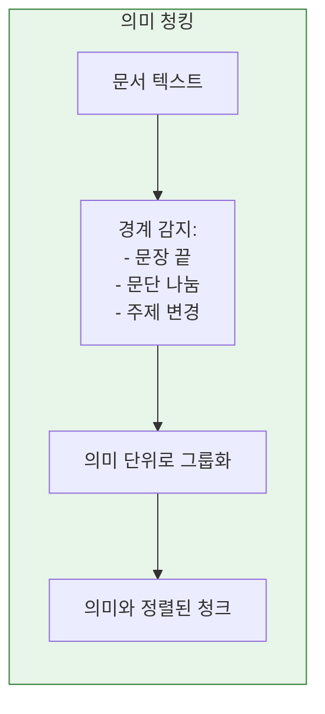

**경계 감지 방법:**

| 방법 | 설명 | 복잡도 |
|--------|-------------|------------|
| **문장 기반** | 문장 경계에서 분할 | 낮음 |
| **문단 기반** | 문단 경계에서 분할 | 낮음 |
| **주제 기반** | 주제 변경 감지에 NLP 사용 | 중간 |
| **LLM 기반** | LLM을 사용하여 응집된 세그먼트 식별 | 높음 |

### 8.2.3 엔티티 인식 청킹

엔티티 관계를 보존하도록 청크 경계를 설계합니다.

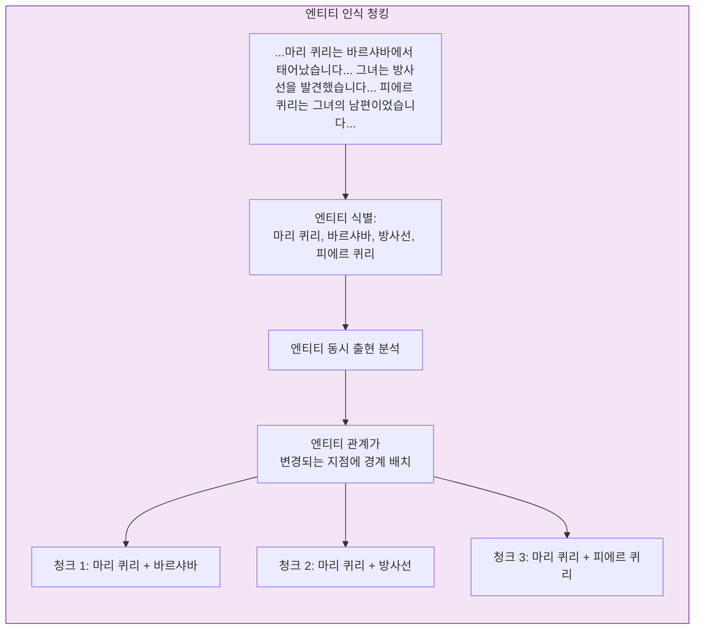

**전략:**
1. **엔티티를 먼저 추출**한 후 주변에서 청킹
2. **관련 엔티티**가 가능한 동일 청크에 유지되도록
3. **중첩 사용**으로 경계를 넘는 관계 포착

### 8.2.4 슬라이딩 윈도우 접근법

컨텍스트와 변형을 포착하기 위해 중첩된 윈도우를 사용합니다.

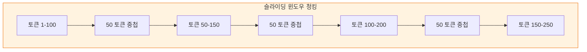

**중첩의 이점:**
- 경계에 있는 엔티티가 여러 청크에서 포착
- 추출의 불일치 감소
- 여러 검색 컨텍스트 제공

**트레이드오프:**
- 처리 시간 증가
- 더 많은 저장소 필요
- 추출의 잠재적 중복

### 8.2.5 전략 비교

| 전략 | 최적 용도 | 장점 | 단점 |
|----------|----------|------|------|
| **고정 크기** | 대규모 처리 | 단순, 예측 가능 | 의미를 깰 수 있음 |
| **의미적** | 일반 문서 | 의미 보존 | 구현이 더 어려움 |
| **엔티티 인식** | 지식 그래프 | 관계 보존 | 엔티티 추출이 선행 필요 |
| **슬라이딩 윈도우** | 중요한 응용 | 경계 포착 | 더 비쌈 |

---

## 8.3 텍스트 단위 속성

### 8.3.1 핵심 속성

GraphRAG의 각 텍스트 단위는 다음 핵심 속성을 가집니다:

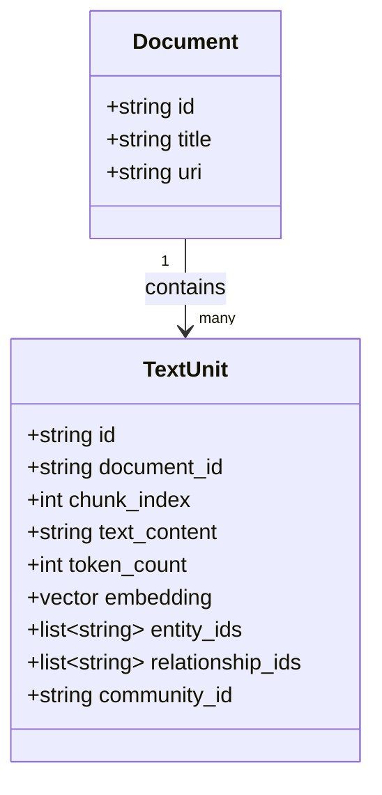

### 8.3.2 텍스트 내용 저장

텍스트 내용은 원본 형식으로 저장됩니다:

| 속성 | 타입 | 설명 |
|-----------|------|-------------|
| `id` | string | 고유 식별자 |
| `text` | string | 원본 텍스트 내용 |
| `tokens` | int | 대략적인 토큰 수 |
| `hash` | string | 중복 제거를 위한 콘텐츠 해시 |

### 8.3.3 메타데이터 연결

텍스트 단위는 원본 문서의 메타데이터를 포함합니다:

```json
{
  "id": "tu_00123",
  "document_id": "doc_004",
  "chunk_index": 3,
  "text": "마리 퀴리는 1898년에 방사선을 발견했습니다...",
  "tokens": 245,
  "metadata": {
    "source_section": "서론",
    "page_number": 2,
    "author": "John Smith",
    "publication_date": "2023-05-15"
  }
}
```

### 8.3.4 엔티티 링크

텍스트 단위는 엔티티와의 양방향 링크를 유지합니다:

```mermaid
flowchart LR
    subgraph Bidirectional["양방향 엔티티-단위 링크"]
        direction TB

        UNIT[텍스트 단위:<br/>"마리 퀴리는 발견했습니다..."]

        E1[엔티티: 마리 퀴리]

        E2[엔티티: 방사선]

        L1[unit.entity_ids:<br/>["ent_curie", "ent_radioactivity"]]

        L2[entity.text_unit_ids:<br/>["tu_001", "tu_005", ...]]

        UNIT --> L1
        L1 -.->|연결됨| E1
        L1 -.->|연결됨| E2
        E1 --> L2
        E2 --> L2
        L2 -.->|다시 연결됨| UNIT
    end

    style Bidirectional fill:#e8f5e9,stroke:#2e7d32
```

### 8.3.5 커뮤니티 할당

텍스트 단위는 엔티티를 통해 커뮤니티와 연결됩니다:

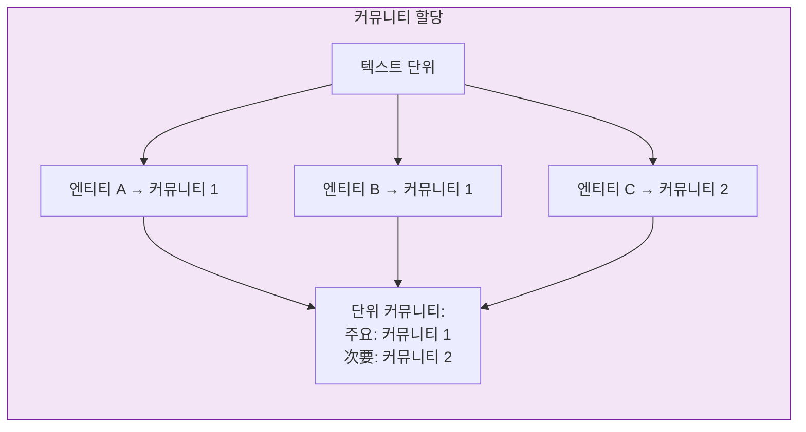

**할당 전략:**
1. **다수결 투표**: 엔티티 중 가장 빈번한 커뮤니티
2. **가중 투표**: 엔티티 중요도로 가중치
3. **다중 커뮤니티**: 모두 유지, 관련성 순위 지정

---

## 8.4 텍스트 단위 최적화

### 8.4.1 크기 vs 컨텍스트 트레이드오프

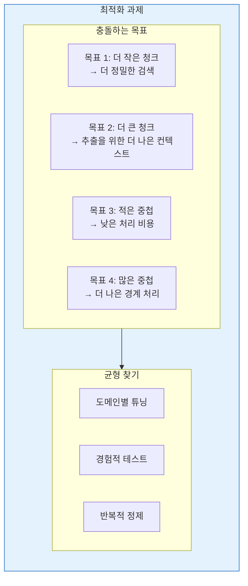

**권장 시작점:**

| 도메인 | 청크 크기 | 중첩 | 근거 |
|--------|------------|---------|-----------|
| **학술 논문** | 400-600 | 100 | 완전한 논증 보존 |
| **뉴스 기사** | 200-300 | 50 | 뉴스 문단은 독립적 |
| **법률 문서** | 300-500 | 75 | 정밀도와 컨텍스트 균형 |
| **기술 문서** | 500-800 | 150 | 기술 개념은 컨텍스트 필요 |

### 8.4.2 중첩 전략

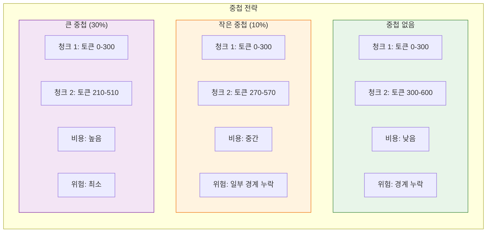

### 8.4.3 도메인별 고려 사항

#### 학술 문헌

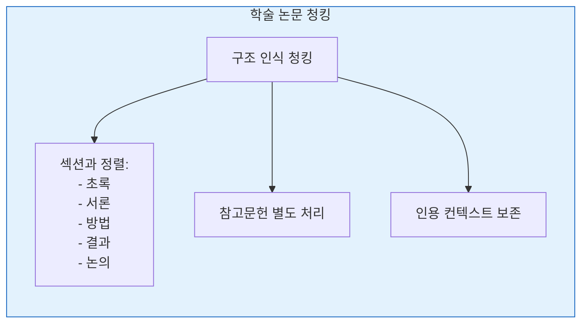

#### 뉴스 기사

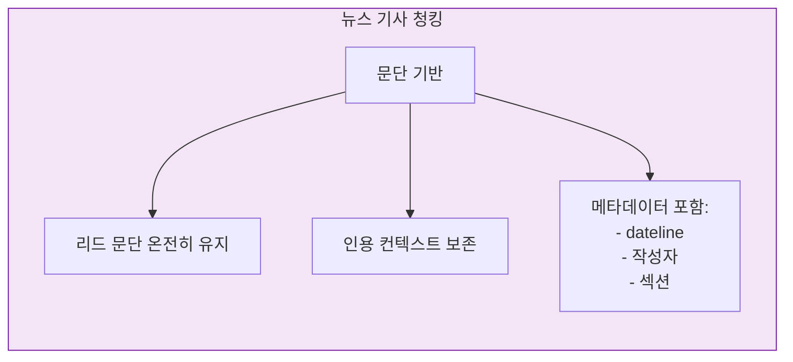

#### 법률 문서

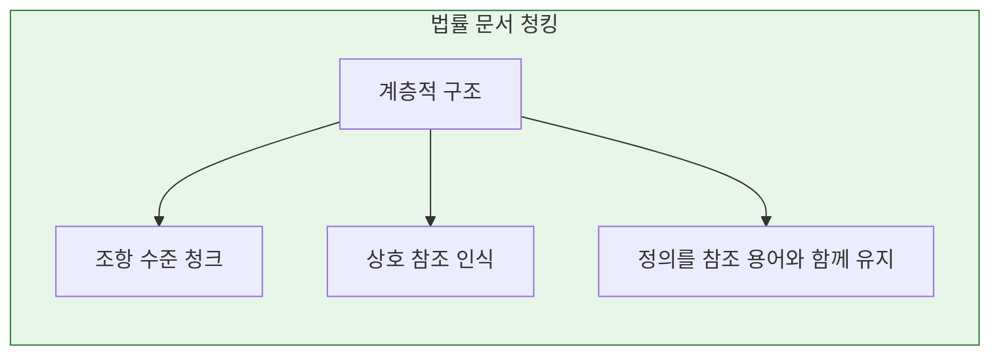

### 8.4.4 평가 기법

청킹이 잘 작동하는지 어떻게 알 수 있을까요?

| 메트릭 | 측정 방법 | 목표 |
|--------|----------------|--------|
| **엔티티 적용 범위** | 청크에서 발견된 엔티티 비율 | >95% |
| **관계 보존** | 동일 청크 내 관계 비율 | >80% |
| **검색 정밀도** | 검색된 관련 청크 | >0.7 |
| **추출 일관성** | 동일 엔티티가 유사하게 추출됨 | >90% |
| **처리 효율성** | 분당 처리된 청크 | 최대화 |

---

## 8.5 텍스트 단위 테이블 구조

### 8.5.1 스키마 정의

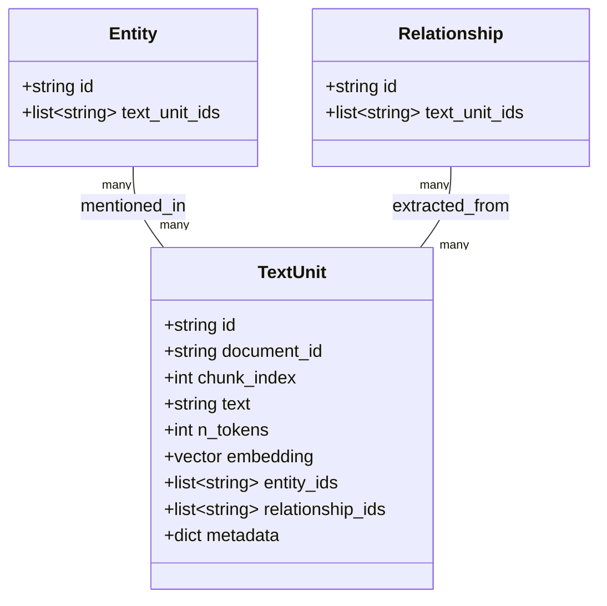

### 8.5.2 예시 텍스트 단위 레코드

```json
{
  "id": "tu_00123",
  "document_id": "doc_curie_bio",
  "chunk_index": 5,
  "text": "1898년, 마리 퀴리와 그녀의 남편 피에르는 두 가지 새로운 원소를 발견했습니다: 폴로늄과 라듐. 이 획기적인 연구는...",
  "n_tokens": 342,
  "embedding": [0.234, -0.567, 0.891, ...],
  "entity_ids": [
    "ent_marie_curie",
    "ent_pierre_curie",
    "ent_polonium",
    "ent_radium",
    "ent_1898"
  ],
  "relationship_ids": [
    "rel_curie_discovered_polonium",
    "rel_curie_discovered_radium",
    "rel_married_pierre"
  ],
  "community_ids": ["comm_radioactivity_research"],
  "metadata": {
    "section": "발견",
    "page": 12,
    "sentiment": "positive"
  }
}
```

---

## 장 요약

이 장에서는 GraphRAG의 텍스트 단위와 청킹을 다루었습니다:

**핵심 개념:**
- **텍스트 단위**는 원본 텍스트의 연속적인 세그먼트입니다
- **추출 컨텍스트**, **출처 귀속**, **검색 입도**를 제공합니다
- 텍스트 단위는 엔티티, 관계, 커뮤니티와의 **양방향 링크**를 가집니다

**청킹 전략:**
- **고정 크기**: 단순하지만 의미를 깰 수 있음
- **의미적**: 자연스러운 경계 보존
- **엔티티 인식**: 관련 엔티티를 함께 유지
- **슬라이딩 윈도우**: 중첩된 청크가 경계 포착

**최적화:**
- 도메인에 따른 **크기 vs 컨텍스트** 균형
- 경계 처리를 위해 **중첩** 사용
- **도메인별** 전략 적용
- **적용 범위**, **보존**, **효율성** 메트릭으로 평가

**텍스트 단위 구조:**
- 텍스트 내용, 임베딩, 메타데이터 저장
- 엔티티, 관계, 커뮤니티와 연결
- 검색을 위한 양방향 순회 활성화

**다음 단계:**
텍스트 단위가 정의되고 청킹되었으므로, [[Textbook - Community Summarization]]에서 효율적인 전역 검색을 가능하게 하는 요약 생성 방법을 설명합니다.

---

## 복습 질문

1. 텍스트 단위란 무엇이며 GraphRAG에서 어떤 역할을 합니까?
2. 고정 크기 청킹과 의미 청킹 전략을 비교하고 대조하세요.
3. 중첩된 청크를 사용하는 이유는 무엇입니까? 어떤 트레이드오프가 있습니까?
4. 텍스트 단위는 엔티티 및 커뮤니티와 어떻게 연결됩니까?
5. 청킹 품질을 평가하기 위해 어떤 메트릭을 사용하시겠습니까?
6. 텍스트 단위 테이블 스키마에 포함된 속성은 무엇입니까?

---

## 연습문제

1. 특허 문서 말뭉치를 위한 청킹 전략을 설계하세요. 어떤 크기의 청크를 사용하시겠으며, 어떤 경계를 존중하시겠습니까?

2. 5000단어의 기후 변화 기사가 있습니다. 약 300단어 목표로 의미 청킹을 사용하면 몇 개의 청크가 예상됩니까? 20% 중첩을 사용하면 어떻게 됩니까?

3. 텍스트 단위가 세 개의 다른 커뮤니티의 엔티티를 언급합니다. 텍스트 단위의 커뮤니티 멤버십을 어떻게 할당하시겠습니까?

---

## 추가 참고자료

- "Text chunking strategies for RAG" (다양한 블로그 게시물)
- 의미 청킹 기법
- GraphRAG 텍스트 단위 문서
- 검색 시스템 평가
