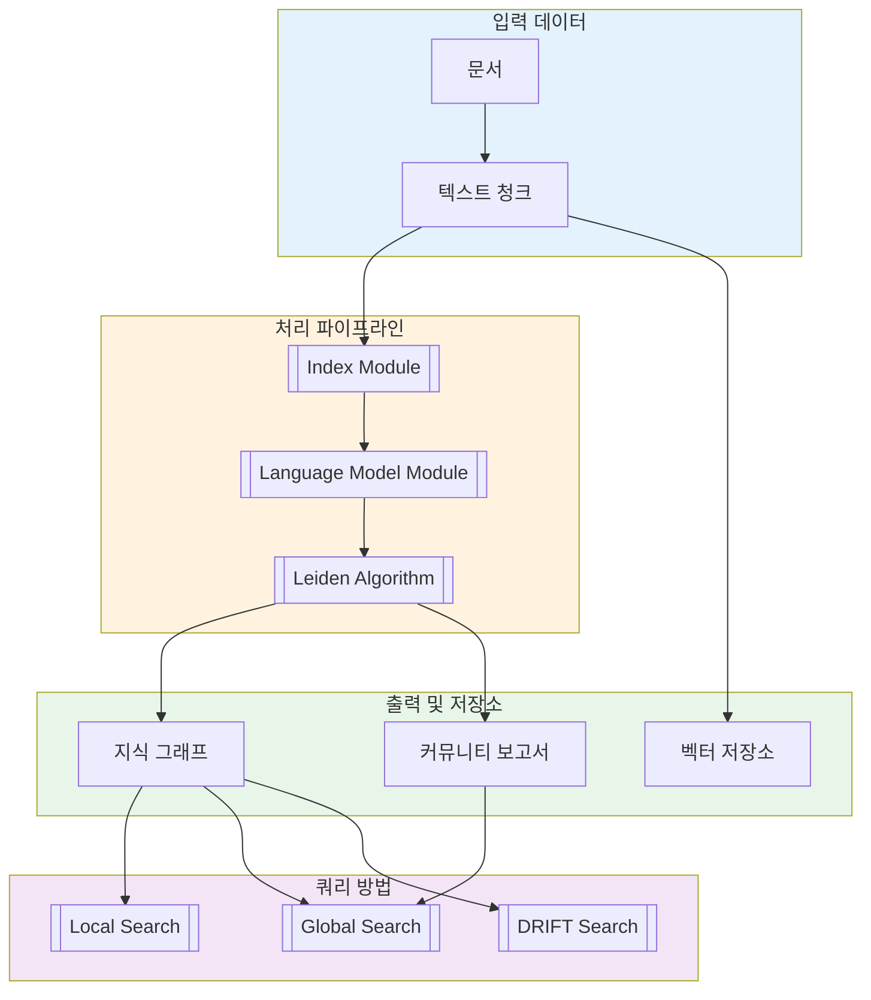

# GraphRAG 아키텍처 개요

이 문서는 GraphRAG 시스템 아키텍처, 구성 요소, 그리고 상호작용 방식에 대한 포괄적인 개요를 제공합니다.

## 아키텍처 상위 수준



## 핵심 패키지 구조

```
graphrag/
├── cli/                    # [[Index Module]] - 명령줄 인터페이스
│   ├── main.py
│   ├── index.py
│   ├── query.py
│   ├── initialize.py
│   └── prompt_tune.py
├── config/                 # [[Configuration Module]] - 설정 관리
│   ├── models/
│   ├── defaults.py
│   └── load_config.py
├── index/                  # [[Index Module]] - 인덱싱 파이프라인
│   ├── operations/
│   ├── run/
│   ├── input/
│   └── text_splitting/
├── query/                  # [[Query Module]] - 검색 작업
│   ├── llm/
│   ├── context/
│   └── factory.py
├── data_model/             # [[Entity]] - 데이터 구조
│   ├── entity.py
│   ├── relationship.py
│   ├── community.py
│   └── ...
├── storage/                # [[Storage Module]] - 데이터 지속성
│   ├── file_pipeline_storage.py
│   ├── blob_pipeline_storage.py
│   └── cosmosdb_pipeline_storage.py
├── cache/                  # 캐싱 메커니즘
│   ├── memory_cache.py
│   └── json_cache.py
├── language_model/         # [[Language Model Module]] - LLM 연동
│   ├── openai/
│   ├── litellm/
│   └── factory.py
├── vector_stores/          # [[Storage Module]] - 벡터 DB
│   ├── lancedb.py
│   ├── azure_ai_search.py
│   └── cosmos_db.py
└── prompts/                # 프롬프트 템플릿
```

## 데이터 흐름

### 1. 입력 단계

```
문서 -> 파일 로딩 -> 텍스트 청킹
```

- 다양한 소스(CSV, JSON, TXT)에서 문서 로드
- 텍스트를 처리 가능한 조각으로 분할(기본값: 1200 토큰)
- 기본 전처리 적용

### 2. 처리 단계

```
텍스트 청크 -> 엔티티/관계 추출 -> 그래프 구축 -> 커뮤니티 탐지
```

- [[LLM Integration Deep Dive]]을 사용한 NLP 작업으로 엔티티와 관계 추출
- 그래프 구조 생성 및 검증
- [[Leiden Algorithm]]으로 커뮤니티 탐지
- 임베딩 생성

### 3. 출력 단계

```
지식 그래프 -> Parquet 파일 -> 벡터 저장소 -> 커뮤니티 보고서
```

- 지식 그래프가 Parquet 형식으로 저장
- 벡터 저장소에 임베딩 저장
- 커뮤니티 보고서 생성
- GraphML 내보내기는 선택 사항

## 구성 요소 상호작용

### 모듈 의존성 그래프

```
                    ┌─────────────┐
                    │     CLI     │
                    └──────┬──────┘
                           │
                    ┌──────▼──────┐
                    │     API     │
                    └──────┬──────┘
                           │
        ┌──────────────────┼──────────────────┐
        │                  │                  │
┌───────▼───────┐ ┌────────▼────────┐ ┌─────▼──────┐
│  [[Configuration Module]] │  [[Index Module]]  │  [[Query Module]] │
└───────────────┘ └────────┬────────┘ └─────┬──────┘
                         │                │
        ┌────────────────┼────────────────┤
        │                │                │
┌───────▼──────┐  ┌──────▼──────┐  ┌─────▼─────┐
│언어 모델     │  │데이터 모델  │  │벡터 저장소│
└──────────────┘  └─────────────┘  └───────────┘
        │                │
┌───────▼────────────────▼────────┐
│      [[Storage Module]]             │
└─────────────────────────────────┘
```

## 디자인 패턴

### 1. 팩토리 패턴
- [[Storage Module]] - 저장소 인스턴스 생성
- [[Language Model Module]] - LLM 인스턴스 생성
- [[Storage Module]] - 벡터 저장소 인스턴스 생성
- [[Query Module]] - 검색 엔진 생성

### 2. 전략 패턴
- 임베딩 전략(OpenAI, 커스텀)
- 추출 전략(LLM, NLP)
- 검색 전략(로컬, 전역, DRIFT)

### 3. 빌더 패턴
- 여러 소스에서 설정 로드
- 파이프라인 워크플로우 구축

### 4. 옵저버 패턴
- 모니터링을 위한 콜백 시스템
- 진행률 추적을 위한 워크플로우 콜백

## 핵심 구성 요소

### 입력 처리

| 구성 요소 | 역할 |
|-----------|---------------|
| [[Index Module]] | 문서를 청크로 분할 |
| [[Index Module]] | 다양한 형식에서 로드 |
| [[Index Module]] | 기본 텍스트 정규화 |

### 그래프 구축

| 구성 요소 | 역할 |
|-----------|---------------|
| [[Entity Extraction Deep Dive]] | 개체명 식별 |
| [[Relationship Extraction Deep Dive]] | 엔티티 연결 발견 |
| [[Index Module]] | 관련 없는 노드 제거 |
| [[Index Module]] | 시각화(UMAP/zero) |

### 커뮤니티 분석

| 구성 요소 | 역할 |
|-----------|---------------|
| [[Leiden Algorithm]] | 커뮤니티 탐지 |
| [[Community Report]] | 요약 생성 |
| [[Context Building Deep Dive]] | 엔티티 컨텍스트 생성 |

### 검색 및 검색

| 구성 요소 | 역할 |
|-----------|---------------|
| [[Local Search]] | 엔티티 중심 검색 |
| [[Global Search]] | 커뮤니티 수준 검색 |
| [[DRIFT Search]] | 반복적 정제 |
| [[Context Building Deep Dive]] | 쿼리 컨텍스트 구축 |

## 설정 계층 구조

1. **파일 기반 설정** (`settings.yaml`)
2. **환경 변수 우선적용** (`.env`)
3. **명령줄 인자**

## 성능 고려사항

### 캐싱
- LLM 응답 캐싱으로 비용 절감
- 중간 결과 저장
- 구성 가능한 캐시 크기 및 TTL

### 병렬 처리
- 많은 작업이 동시에 실행
- 저장소 작업을 위한 비동기 I/O
- LLM 호출을 위한 배치 처리

### 메모리 관리
- 대규모 데이터셋을 위한 스트리밍 처리
- 청크 기반 처리
- 구성 가능한 메모리 제한

## 보안 고려사항

### 인증
- API 키 인증
- Azure 관리 ID 지원
- 환경 변수 저장

### 데이터 프라이버시
- 로컬 처리 옵션 제공
- 로컬 LLM 사용 시 데이터 외부 유출 없음
- 구성 가능한 캐시 처리

## 출력 형식

| 형식 | 설명 |
|--------|-------------|
| Parquet | 구조화된 데이터(엔티티, 관계, 커뮤니티) |
| GraphML | 시각화를 위한 그래프 내보내기 |
| JSON | 설정 및 메타데이터 |
| Markdown | 커뮤니티 보고서 |

## 확장성 포인트

| 확장 | 인터페이스 |
|-----------|-----------|
| 커스텀 저장소 | `PipelineStorage` |
| 커스텀 LLM | `BaseLanguageModel` |
| 커스텀 벡터 저장소 | `BaseVectorStore` |
| 커스텀 워크플로우 | `WorkflowFunction` |
| 커스텀 콜백 | `WorkflowCallbacks` |

---
*참고: [[GraphRAG란 무엇인가?]], [[Data Flow]], [[Technology Stack]], [[Architecture Overview]]*
