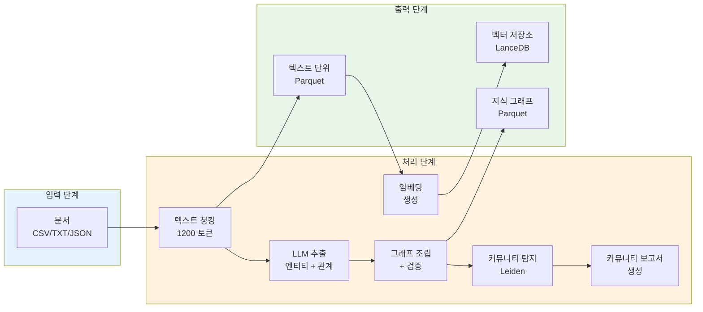

# GraphRAG 데이터 흐름

이 문서는 입력 문서부터 쿼리 결과까지 GraphRAG 시스템을 통해 데이터가 어떻게 흐르는지 설명합니다.

## 전체 파이프라인 개요



## 입력 단계

### 문서 입력

```
소스 파일 -> 형식 감지 -> 콘텐츠 추출 -> 문서 객체
```

**지원 형식:**
- CSV: 텍스트 열이 있는 표 형식 데이터
- JSON: 구조화된 문서
- TXT: 일반 텍스트 파일

**설정:**
```yaml
input:
  type: file
  file_type: text  # csv, json, text
  file_pattern: "input/*.txt"
  text_column: "text"
  encoding: "utf-8"
```

**출력:** 메타데이터가 포함된 문서 객체

## 처리 단계

### 1. 텍스트 청킹

```
문서 -> 텍스트 분할기 -> 청크 (1200 토큰, 100 겹침)
```

**목적:** 대형 문서를 LLM 처리 가능한 청크로 분할

**전략:**
- **토큰 기반**: 정확한 토큰 수를 위해 tiktoken 사용
- **문장 기반**: 문장 경계를 위해 NLTK 사용

**설정:**
```yaml
chunks:
  size: 1200
  overlap: 100
  strategy: tokens  # 또는 sentences
```

**출력:** [[Text Unit]] 객체

### 2. 엔티티 및 관계 추출

```
텍스트 단위 -> LLM 처리 -> 추출된 그래프 요소
```

**추출 프로세스:**
1. 각 청크를 추출 프롬프트와 함께 LLM으로 전송
2. LLM이 유형과 설명이 포함된 엔티티 식별
3. LLM이 가중치가 포함된 관계 식별
4. 결과를 파싱하고 검증

**엔티티 유형:**
- 조직(Organization)
- 인물(Person)
- 지역(Geo/Location)
- 이벤트(Event)
- 커스텀 유형

**출력:** [[엔티티]] 및 [[Relationship]] 객체

### 3. 그래프 조립

```
추출된 요소 -> 병합 -> 중복 제거 -> 검증 -> 지식 그래프
```

**단계:**
1. 모든 청크의 추출 결과 병합
2. 유사한 엔티티 중복 제거
3. 그래프 구조 검증
4. 노드 차수 계산
5. 약한 연결 프루닝

**출력:** 검증된 지식 그래프

### 4. 커뮤니티 탐지

```
지식 그래프 -> Leiden 알고리즘 -> 계층형 커뮤니티
```

**알고리즘:** graspologic을 통한 [[Leiden Algorithm]]

**프로세스:**
1. 여러 수준에서 커뮤니티 탐지
2. 부모-자식 관계 구축
3. 커뮤니티 통계 계산
4. 엔티티를 커뮤니티에 할당

**출력:** 계층 구조가 포함된 [[Community]] 객체

### 5. 커뮤니티 보고서 생성

```
커뮤니티 -> LLM 요약 -> 커뮤니티 보고서
```

**프로세스:**
1. 각 커뮤니티의 엔티티 컨텍스트 수집
2. 요약을 위해 LLM으로 전송
3. 인사이트와 관계 생성
4. 전체 콘텐츠와 요약 저장

**출력:** [[Community Report]] 객체

### 6. 임베딩 생성

```
텍스트 단위 + 엔티티 + 커뮤니티 -> 임베딩 모델 -> 벡터 표현
```

**임베딩 대상:**
- 텍스트 청크
- 엔티티 설명
- 커뮤니티 컨텍스트
- 관계 설명

**모델:**
- OpenAI: text-embedding-3-small/large
- 커스텀: 모든 임베딩 함수

**출력:** [[Storage Module]]에 저장된 벡터 표현

## 출력 단계

### Parquet 파일

```
┌─────────────────────────────────────────────────────────────┐
│                      출력 디렉토리                          │
├─────────────────────────────────────────────────────────────┤
│                                                             │
│  create_final_documents.parquet       -> 소스 문서          │
│  create_final_text_units.parquet      -> 텍스트 청크        │
│  create_final_entities.parquet        -> 추출된 엔티티      │
│  create_final_relationships.parquet   -> 관계               │
│  create_final_communities.parquet     -> 커뮤니티           │
│  create_final_community_reports.parquet -> 요약             │
│  create_final_covariates.parquet      -> 클레임/메타데이터  │
│                                                             │
└─────────────────────────────────────────────────────────────┘
```

### 벡터 저장소

```
임베딩 -> 벡터 데이터베이스 -> 유사도 검색
```

**지원 저장소:**
- [[Storage Module]]: 로컬 파일 기반
- [[Storage Module]]: 클라우드 관리형
- [[Storage Module]]: 벡터 검색이 포함된 NoSQL

## 쿼리 흐름

### 로컬 검색 흐름

```
쿼리 -> 엔티티 추출 -> 컨텍스트 빌딩 ->
관계 수집 -> 텍스트 단위 검색 ->
LLM 생성 -> 응답
```

**단계:**
1. 쿼리에서 엔티티 추출
2. 관련 엔티티 찾기(2-3 홉)
3. 다음에서 컨텍스트 구축:
   - 커뮤니티 보고서(25% 토큰)
   - 로컬 엔티티/관계(25% 토큰)
   - 관련 텍스트 단위(50% 토큰)
4. LLM으로 응답 생성

### 전역 검색 흐름

```
쿼리 -> 커뮤니티 선택 -> 맵 단계(병렬) ->
리듀스 단계 -> LLM 생성 -> 응답
```

**단계:**
1. 관련 커뮤니티 선택
2. 맵: 병렬로 중간 답변 생성
3. 리듀스: 최종 응답으로 집계
4. LLM으로 최종 답변 생성

### DRIFT 검색 흐름

```
쿼리 -> 프라이머 단계 -> 초기 컨텍스트 ->
정제 단계 -> 반복적 확장 ->
최종 생성 -> 응답
```

**단계:**
1. 프라이머: 초기 이해 생성
2. 초기 컨텍스트 구축
3. 정제: 반복적으로 컨텍스트 확장
4. 포괄적인 최종 응답 생성

## 데이터 관계

```
┌─────────────┐
│  문서       │
└──────┬──────┘
       │ 1:N
       ▼
┌─────────────┐       ┌─────────────┐       ┌─────────────┐
│  텍스트 단위│──────▶│   엔티티    │◀──────│관계         │
└─────────────┘       └──────┬──────┘       └─────────────┘
       │                     │
       │                     │ N:M
       │                     ▼
       │              ┌─────────────┐
       └─────────────▶│  커뮤니티   │
                      └──────┬──────┘
                             │
                             ▼
                      ┌─────────────┐
                      │커뮤니티 보고서│
                      └─────────────┘
```

## 데이터 변환 요약

| 단계 | 입력 | 출력 | 변환 |
|-------|-------|--------|----------------|
| 청킹 | 문서 | 텍스트 단위 | 텍스트 분할 |
| 추출 | 텍스트 단위 | 엔티티, 관계 | LLM 추출 |
| 조립 | 원시 추출 결과 | 검증된 그래프 | 병합, 중복 제거 |
| 커뮤니티 | 그래프 | 커뮤니티 | Leiden 클러스터링 |
| 보고서 | 커뮤니티 | 요약 | LLM 생성 |
| 임베딩 | 텍스트, 엔티티 | 벡터 | 임베딩 모델 |

---
*참고: [[Architecture Overview]], [[Index Module]], [[Query Module]], [[Local Search]], [[Global Search]]*
