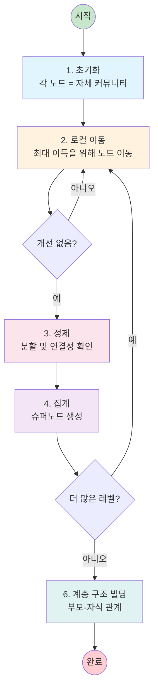

# Leiden 알고리즘

**Leiden 알고리즘**은 GraphRAG에서 지식 그래프 내 관련 엔티티 클러스터를 식별하기 위해 사용하는 고품질 커뮤니티 탐지 방법입니다.

## 개요

Leiden 알고리즘은 Louvain 알고리즘의 개선된 버전으로, 잘 연결된 커뮤니티를 보장하고 더 빠르게 수렴합니다.

```python
from graspologic.partition import hierarchical_leiden

communities = hierarchical_leiden(
    graph,
    max_cluster_size=50
)
```

## 핵심 기능

| 기능 | 설명 |
|---------|-------------|
| **잘 연결됨** | 커뮤니티가 연결되어 있음을 보장 |
| **빠름** | 선형 시간 복잡도 O(n) |
| **계층형** | 다중 수준 계층 구조 생성 |
| **결정론적** | 랜덤 시드로 재현 가능 |
| **확장 가능** | 대규모 그래프를 효율적으로 처리 |

## 알고리즘 단계



## 품질 함수

알고리즘은 **상수 Potts 모델(CPM)**을 최적화합니다:

```
품질 = Σ [커뮤니티_내_엣지 - γ * (가능한_엣지)]

여기서:
- 커뮤니티_내_엣지: 실제 내부 엣지
- 가능한_엣지: 가능한 최대 내부 엣지
- γ: 해상도 매개변수(커뮤니티 크기 제어)
```

### 해상도 매개변수

| γ 값 | 효과 |
|---------|--------|
| 낮음 (< 0.5) | 더 적고 더 큰 커뮤니티 |
| 중간 (0.5 - 1.5) | 균형형(기본값: 1.0) |
| 높음 (> 1.5) | 더 많고 더 작은 커뮤니티 |

## 계층형 출력

알고리즘은 계층 구조를 생성합니다:

```
레벨 0: [0] - 루트 커뮤니티 (모든 노드)
레벨 1: [1, 2, 3] - 주요 분할
레벨 2: [4, 5, 6, 7, 8, 9] - 하위 커뮤니티

계층 구조:
- 커뮤니티 1 -> [4, 5]
- 커뮤니티 2 -> [6, 7]
- 커뮤니티 3 -> [8, 9]
```

## 설정

### GraphRAG 설정

```yaml
cluster_graph:
  max_cluster_size: 50    # 목표 커뮤니티 크기
  use_lcc: true          # 가장 큰 연결 요소 사용
  seed: 42               # 재현성을 위한 랜덤 시드
```

### Python 사용법

```python
import networkx as nx
from graspologic.partition import hierarchical_leiden

# 그래프 생성
G = nx.Graph()
G.add_edges_from([(1, 2), (2, 3), (3, 4), (4, 1)])

# Leiden 실행
communities = hierarchical_leiden(
    G,
    max_cluster_size=50,
    random_seed=42
)

# 결과: 계층형 커뮤니티 할당
```

## 복잡도 분석

| 측면 | 복잡도 |
|--------|------------|
| **시간** | O(n) - 노드 수에 선형적 |
| **공간** | O(n + m) - 노드 + 엣지 |
| **반복** | 일반적으로 5-10회 |
| **수렴** | 보장됨 |

## Louvain과의 비교

| 측면 | Leiden | Louvain |
|--------|--------|---------|
| **보장** | 잘 연결된 커뮤니티 | 분리될 수 있음 |
| **속도** | 더 빠름 | 더 느림 |
| **품질** | 더 높음 | 더 낮음 |
| **해상도 제한** | 없음 | 있음 |

## GraphRAG 내 사용법

### 파이프라인 연동

```
인덱스 파이프라인:
...
3. 그래프 추출 -> 지식 그래프
4. 그래프 최종화 -> 정제된 그래프
5. Leiden 클러스터링 -> 커뮤니티 (여기)
6. 커뮤니티 보고서 -> 요약
...
```

### 출력 구조

```python
# 커뮤니티 계층 구조
{
    "level": 2,
    "communities": [
        {
            "id": "comm-001",
            "parent": "comm-000",
            "children": ["comm-004", "comm-005"],
            "entity_ids": ["e1", "e2", "e3"]
        }
    ]
}
```

## 관련 주제

- [[Community]] - 커뮤니티 데이터 모델
- [[Index Module]] - Leiden이 사용되는 위치
- [[Global Search]] - 커뮤니티 계층 구조 사용
- [[Index Module]] - 입력 그래프 구축

---
*참고: [[Community]], [[Index Module]], [[Global Search]]*
