# Community Detection Deep Dive

커뮤니티 감지(Community Detection)은 지식 그래프에서 밀접하게 연결된 엔티티 그룹을 식별하여, 문서의 주제적 구조를 발견하는 핵심 알고리즘입니다.

## 목차

### 1. 개요
- [커뮤니티 감지의 목적](#-커뮤니티-감지의-목적)
- [빗대어 보기: 소셜 미디어 그룹 형성](#-빗대어-보기-소셜-미디어-그룹-형성)

### 2. Leiden 알고리즘
- [알고리즘 원리](#-알고리즘-원리)
- [수학적 기초](#-수학적-기초)
- [4단계 상세 분석](#4단계-상세-분석)

### 3. 계층적 구조
- [계층적 커뮤니티](#-계층적-커뮤니티-구조)
- [레벨별 특성](#-레벨별-특성)

### 4. 구현
- [Python 구현](#python-구현)
- [엔티티-커뮤니티 매핑](#엔티티-커뮤니티-매핑)

### 5. 품질 평가
- [품질 메트릭](#-품질-메트릭)
- [커뮤니티 분석](#-커뮤니티-분석)

### 6. 고급 기법
- [다중 레벨 최적화](#다중-레벨-최적화)
- [템포럴 커뮤니티](#템포럴-커뮤니티)
- [오버래핑 허용](#-오버래핑-허용)

---

## 🎯 커뮤니티 감지의 목적

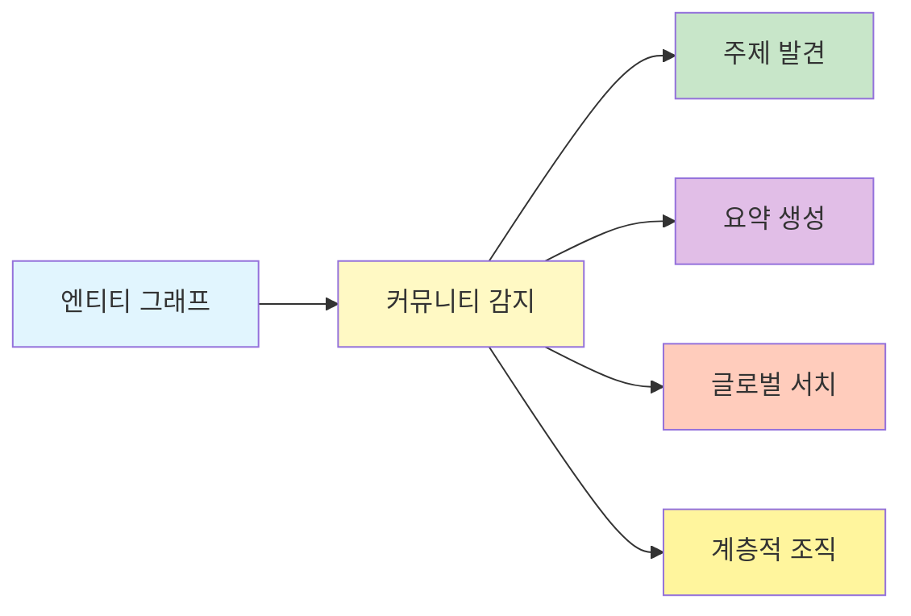

1. **주제 발견**: 관련 엔티티를 주제별로 그룹화
2. **요약 생성**: 커뮤니티별로 자연어 요약 생성
3. **글로벌 서치**: 커뮤니티 레벨의 질문 답변
4. **계층적 조직**: 다양한 추상화 수준 제공

## 📖 빗대어 보기: 소셜 미디어 그룹 형성

커뮤니티 감지는 **소셜 미디어에서 자연스럽게 형성되는 관심 그룹**과 유사합니다:

| 소셜 미디어 | GraphRAG 커뮤니티 |
|-------------|------------------|
| 같은 주제에 관심 | 같은 커뮤니티 엔티티 |
| 자주 상호작용 | 높은 관계 가중치 |
| 하위 그룹 형성 | 계층적 레벨 |
| 그룹 규모 다양성 | 다양한 커뮤니티 크기 |
| 그룹 간 연결 | 커뮤니티 간 엣지 |

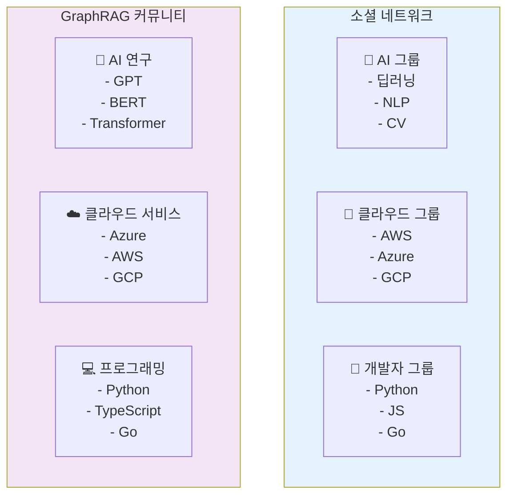

## 🏗️ Leiden 알고리즘 심층 분석

### 알고리즘 원리

Leiden 알고리즘은 모듈성(Modularity)을 최적화하여 그래프를 커뮤니티로 분할합니다.

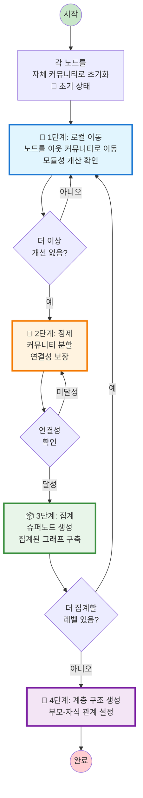

### 4단계 상세 분석

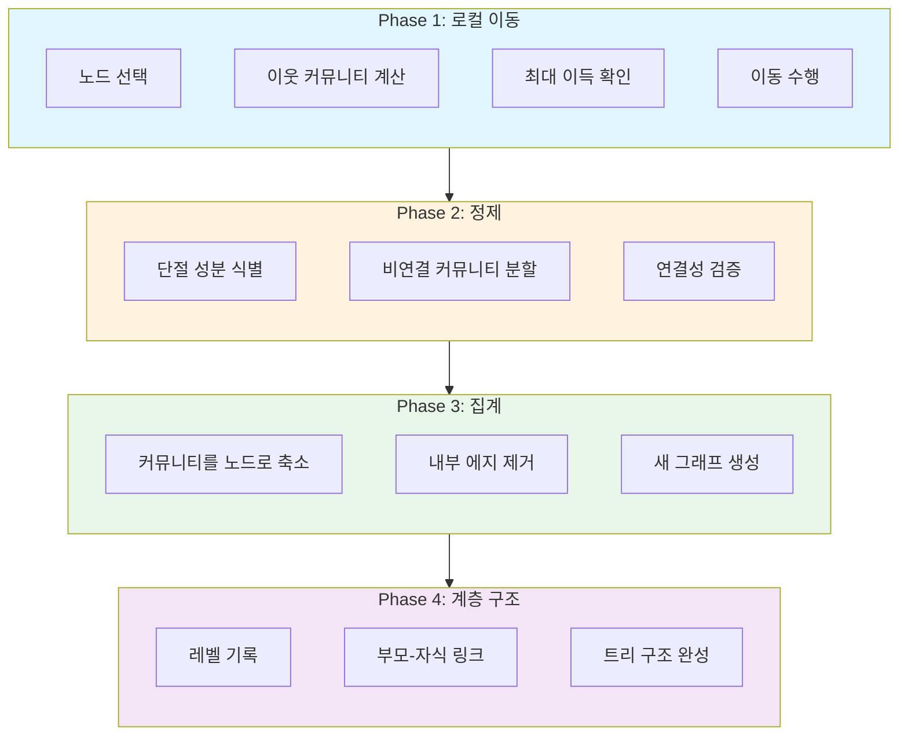

## 📐 수학적 기초

### Constant Potts Model (CPM)

Leiden은 CPM 품질 함수를 최적화합니다:

$$
\mathcal{H} = \sum_{i,j} A_{ij} \cdot \delta(\sigma(i), \sigma(j)) - \gamma \sum_i \sum_{\sigma} n_\sigma(i,j)
$$

여기서:
- $A_{ij}$: 인접 행렬 (엔티티 i, j 간 연결)
- $\delta$: Kronecker delta (동일 커뮤니티 여부)
- $\gamma$: 해상도 파라미터
- $n_\sigma(i,j)$: 가능한 엣지 수

### 모듈성 게인

노드가 커뮤니티 C로 이동할 때의 게인:

$$
\Delta \mathcal{H} = \mathcal{H}_{new} - \mathcal{H}_{old}
$$

양수 게인인 경우에만 이동 수행.

### 파라미터 영향

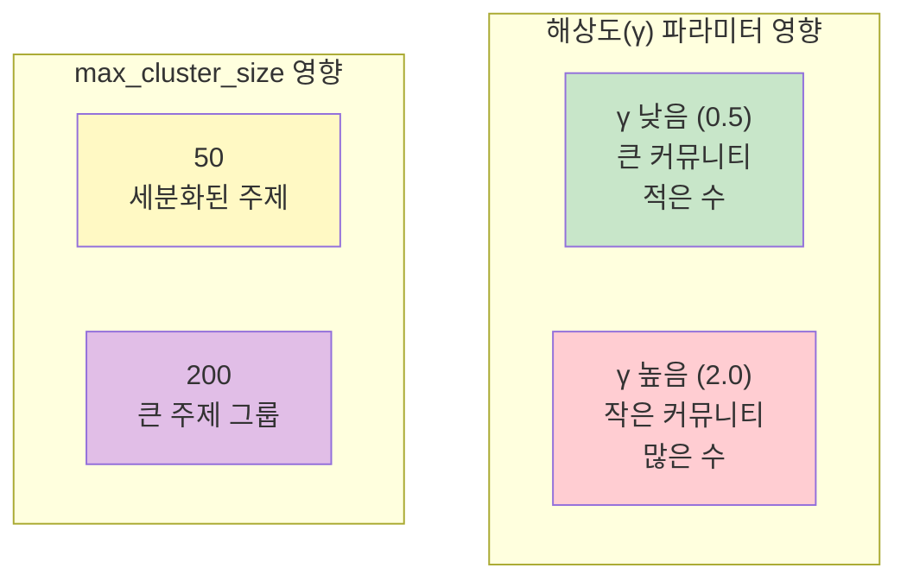

| 파라미터 | 증가 시 효과 | 감소 시 효과 |
|----------|----------------|----------------|
| `max_cluster_size` | 더 큰 커뮤니티 | 더 작은 커뮤니티 |
| `resolution` | 더 많은 작은 커뮤니티 | 더 적은 큰 커뮤니티 |
| `use_lcc=false` | 모든 노드 포함 | 연결된 노드만 |

## 🔍 GraphRAG에서의 활용

### 구성 매개변수

```yaml
cluster_graph:
  max_cluster_size: 50      # 목표 커뮤니티 크기
  use_lcc: true            # 최대 연결 성분만 사용
  seed: 42                 # 재현성을 위한 시드
  resolution: 1.0          # gamma 값 (해상도)
```

## 📊 계층적 커뮤니티 구조

### 레벨별 특성

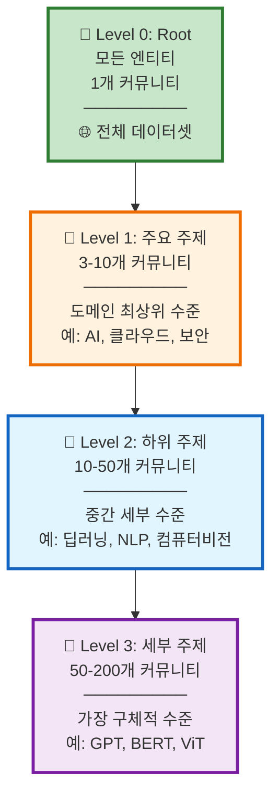

### 실제 예시 구조

```
Level 0: comm-000 (모든 엔티티)
├── Level 1: comm-001 (AI 연구)
│   ├── Level 2: comm-004 (머신러닝)
│   │   ├── Level 3: comm-010 (딥러닝)
│   │   │   └── 엔티티: GPT, BERT, Transformer
│   │   └── Level 3: comm-011 (강화학습)
│   │       └── 엔티티: DQN, PPO, A3C
│   └── Level 2: comm-005 (자연어 처리)
│       ├── Level 3: comm-012 (번역)
│       └── Level 3: comm-013 (요약)
├── Level 1: comm-002 (클라우드)
│   ├── Level 2: comm-006 (인프라)
│   └── Level 2: comm-007 (서비스)
└── Level 1: comm-003 (보안)
```

### 커뮤니티 트리 시각화

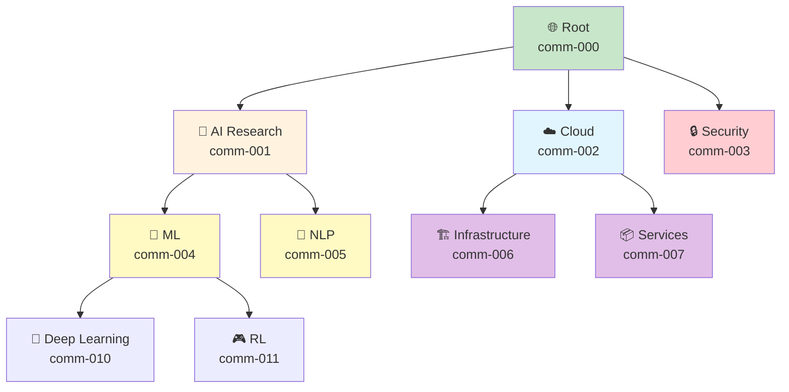

## 🔧 구현 상세

### Python 구현

```python
import networkx as nx
from graspologic.partition import hierarchical_leiden

def detect_communities(
    graph: nx.Graph,
    max_cluster_size: int = 50,
    seed: int = 42
) -> dict:
    """
    Leiden 알고리즘으로 커뮤니티 감지
    """
    # NetworkX 그래프를 graspologic 형식으로 변환
    adjacency = nx.to_numpy_array(graph)

    # 계층적 Leiden 실행
    partition = hierarchical_leiden(
        adjacency,
        max_cluster_size=max_cluster_size,
        random_seed=seed
    )

    # 결과 파싱
    communities = {}
    for node_id, community_id in partition.items():
        if community_id not in communities:
            communities[community_id] = []
        communities[community_id].append(node_id)

    return communities
```

### 엔티티-커뮤니티 매핑

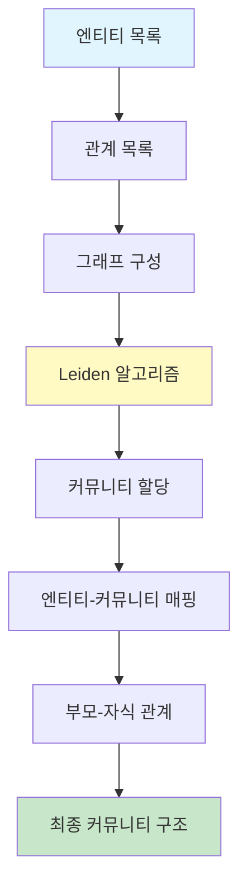

```python
def assign_entities_to_communities(
    entities: pd.DataFrame,
    relationships: pd.DataFrame
) -> pd.DataFrame:
    """
    엔티티에 커뮤니티 ID 할당
    """
    # 그래프 생성
    G = nx.Graph()

    for _, entity in entities.iterrows():
        G.add_node(entity['id'])

    for _, rel in relationships.iterrows():
        G.add_edge(rel['source'], rel['target'], weight=rel['weight'])

    # 커뮤니티 감지
    partition = detect_communities(G)

    # 엔티티에 커뮤니티 ID 추가
    entity_to_comm = {}
    for comm_id, members in partition.items():
        for entity_id in members:
            entity_to_comm[entity_id] = comm_id

    entities['community_id'] = entities['id'].map(entity_to_comm)

    return entities
```

## 📈 커뮤니티 품질 평가

### 품질 메트릭


| 메트릭 | 설명 | 좋은 값 | 의미 |
|--------|------|---------|------|
| **Modularity** | 커뮤니티 내 밀집도 | 0.3 - 0.7 | 높을수록 좋은 분리 |
| **Conductance** | 외부 연결 비율 | < 0.3 | 낮을수록 좋음 |
| **Coverage** | 할당된 엔티티 비율 | > 0.95 | 높을수록 좋음 |
| **Silhouette** | 클러스터 품질 | > 0.5 | 높을수록 좋음 |

### 커뮤니티 분석

```python
def analyze_community_quality(
    graph: nx.Graph,
    partition: dict
) -> dict:
    """
    커뮤니티 품질 분석
    """
    import networkx.algorithms.community as nx_comm

    # 모듈러리티
    modularity = nx_comm.quality.modularity(
        graph,
        list(partition.values())
    )

    # 커버리지
    coverage = len(partition) / graph.number_of_nodes()

    # 평균 커뮤니티 크기
    comm_sizes = [len(members) for members in partition.values()]
    avg_size = sum(comm_sizes) / len(comm_sizes)

    # 크기 분포
    size_distribution = {
        'min': min(comm_sizes),
        'max': max(comm_sizes),
        'std': pd.Series(comm_sizes).std()
    }

    return {
        'modularity': modularity,
        'coverage': coverage,
        'avg_size': avg_size,
        'size_distribution': size_distribution
    }
```

### 품질 평가 흐름

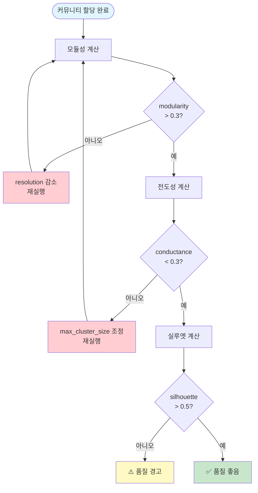

## 🎓 고급 기법

### 1. 다중 레벨 최적화

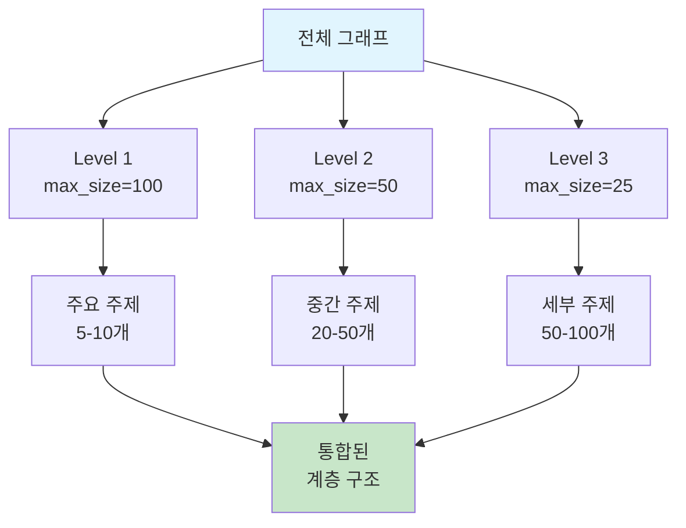

```python
def optimize_multi_level(
    graph: nx.Graph,
    level_targets: dict = {2: 30, 3: 10}
) -> dict:
    """
    특정 레벨에서 목표 커뮤니티 크기 달성
    """
    partition = {}

    for level, target_size in level_targets.items():
        # 해당 레벨 감지
        level_partition = hierarchical_leiden(
            graph,
            max_cluster_size=target_size
        )

        # 결과 병합
        for node, comm in level_partition.items():
            partition[f"{level}_{comm}"] = node

    return partition
```

### 2. 템포럴 커뮤니티

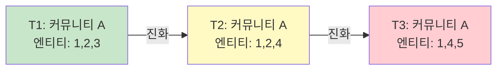

```python
def detect_temporal_communities(
    graphs: list[nx.Graph],  # 시간별 그래프
    window: int = 3
) -> dict:
    """
    시간에 따른 커뮤니티 진화 추적
    """
    communities_over_time = []

    for i, graph in enumerate(graphs):
        partition = detect_communities(graph)
        communities_over_time.append({
            'time': i,
            'communities': partition
        })

    # 커뮤니티 연속성 분석
    return track_community_evolution(communities_over_time, window)
```

### 3. 오버래핑 허용

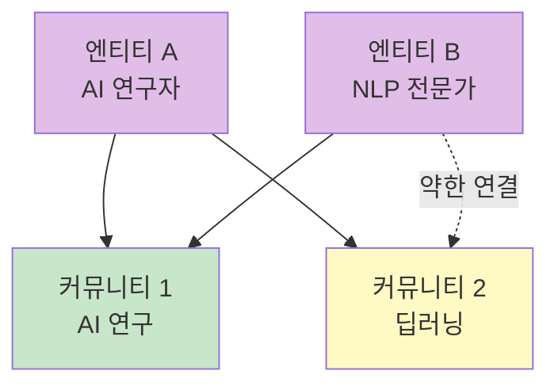

```python
def allow_overlapping_communities(
    graph: nx.Graph,
    entities: pd.DataFrame
) -> dict:
    """
    엔티티가 여러 커뮤니티에 속하도록 허용
    """
    from sklearn.cluster import SpectralClustering

    # 엔티티 임베딩 기반 클러스터링
    embeddings = np.array([
        e['description_embedding']
        for _, e in entities.iterrows()
    ])

    # 여러 클러스터링 실행
    n_communities = 10
    overlapping = {}

    for run in range(3):  # 3번 실행
        clustering = SpectralClustering(
            n_clusters=n_communities,
            random_state=run
        )
        labels = clustering.fit_predict(embeddings)

        for entity_idx, label in enumerate(labels):
            entity_id = entities.iloc[entity_idx]['id']

            if entity_id not in overlapping:
                overlapping[entity_id] = []
            overlapping[entity_id].append(f"run{run}_comm{label}")

    return overlapping
```

## 🔗 관련 컴포넌트

- [[Community]]: 커뮤니티 데이터 모델
- [[Community Report]]: 커뮤니티 요약
- [[Entity]]: 커뮤니티 구성원
- [[Global Search]]: 커뮤니티 레벨 검색

## 💡 성능 최적화 팁

1. **그래프 필터링**: 약한 연결 제거로 처리 속도 향상
2. **병렬 처리**: 독립적 하위그래프에서 병렬 실행
3. **캐싱**: 재계산 방지
4. **증분 업데이트**: 새로운 엔티티만 재할당

---
*See also: [[Community]], [[Leiden Algorithm]], [[Index Module]]*
