# Context Building Deep Dive

컨텍스트 빌딩(Context Building)은 GraphRAG의 검색 엔진에서 사용자 쿼리에 대한 관련 정보를 수집하고 구성하는 핵심 프로세스입니다.

## 목차

### 1. 개요
- [컨텍스트 빌더의 목적](#-컨텍스트-빌더의-목적)
- [빗대어 보기: 스마트 리서치 어시스턴트](#-빗대어-보기-스마트-리서치-어시스턴트)

### 2. 아키텍처
- [컨텍스트 아키텍처](#-컨텍스트-아키텍처)
- [처리 파이프라인](#-처리-파이프라인)

### 3. 로컬 컨텍스트
- [로컬 컨텍스트 빌더](#-로컬-컨텍스트-빌더)
- [관계 우선순위 전략](#-관계-우선순위-전략)
- [Hop 순회](#hop-순회)

### 4. 글로벌 컨텍스트
- [글로벌 컨텍스트 빌더](#-글로벌-컨텍스트-빌더)
- [Map-Reduce 아키텍처](#map-reduce-아키텍처)
- [동적 커뮤니티 선택](#-동적-커뮤니티-선택)

### 5. 토큰 할당
- [토큰 할당 전략](#-토큰-할당-전략)
- [비율 할당](#-비율-할당)
- [지능형 토큰 관리](#-지능형-토큰-관리)

### 6. 최적화
- [재순위 (Reranking)](#1-재순위-reranking)
- [컨텍스트 압축](#2-컨텍스트-압축)
- [다양성 확보](#3-다양성-확보)

---

## 🎯 컨텍스트 빌더의 목적

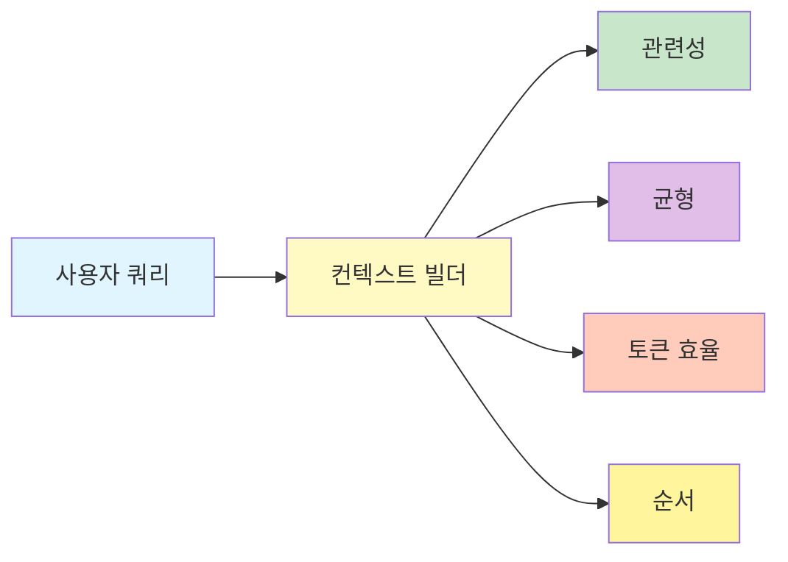

1. **관련성**: 쿼리와 가장 관련된 정보 선택
2. **균형**: 다양한 정보 소스의 적절한 혼합
3. **토큰 효율**: 제한된 토큰 예산 내에서 최대한 정보 제공
4. **순서**: 중요한 정보가 먼저 표시되도록 순서화

## 📖 빗대어 보기: 스마트 리서치 어시스턴트

컨텍스트 빌더는 **연구자를 위해 관련 자료를 수집하고 정리하는 스마트 어시스턴트**와 유사합니다:

| 리서치 어시스턴트 | 컨텍스트 빌더 |
|-----------------|--------------|
| 연구 주제 이해 | 쿼리 분석 |
| 관련 논문 검색 | 관련 엔티티 검색 |
| 인용 관계 추적 | 관계 순회 |
| 주요 발췌 정리 | 텍스트 유닛 선택 |
| 전문가 의견 수집 | 커뮤니티 리포트 |
| 요약 보고서 작성 | 최종 컨텍스트 구성 |

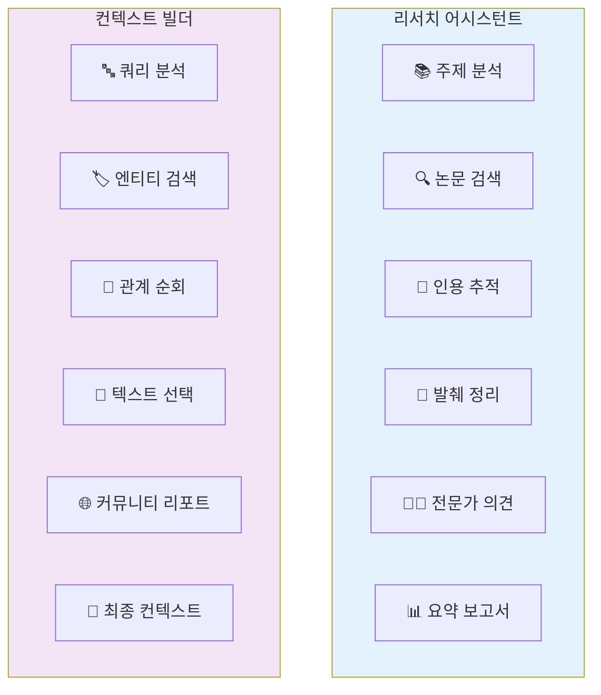

## 🏗️ 컨텍스트 아키텍처

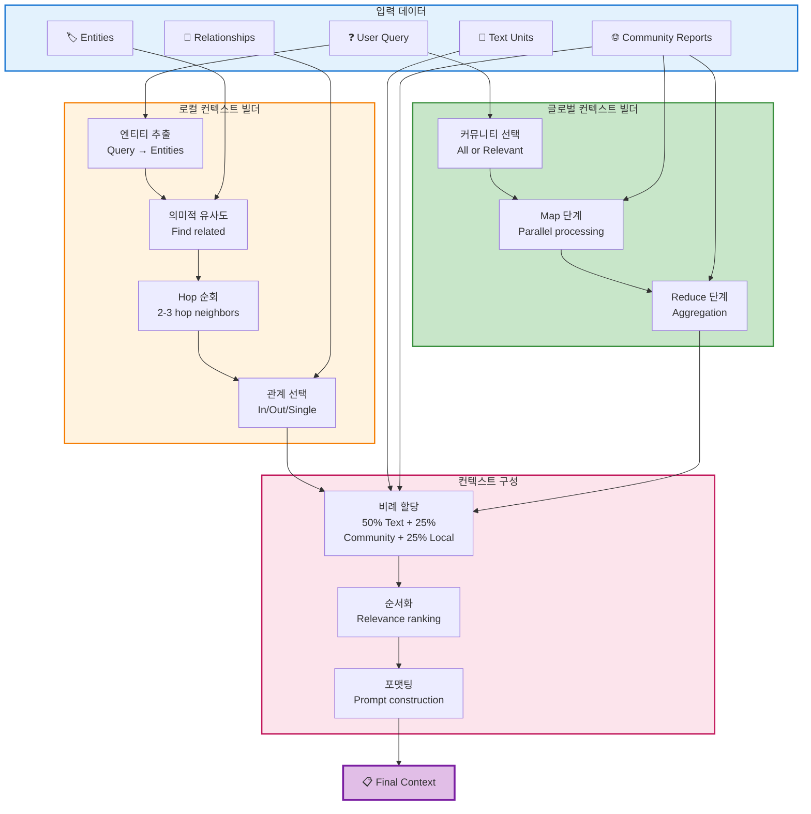

### 처리 파이프라인

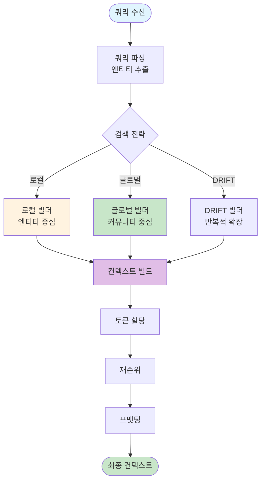

## 🔍 로컬 컨텍스트 빌더

### 상세 알고리즘

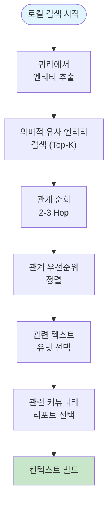

```python
class LocalContextBuilder:
    def __init__(
        self,
        text_unit_prop: float = 0.5,      # 50% 텍스트
        community_prop: float = 0.25,     # 25% 커뮤니티
        local_prop: float = 0.25,         # 25% 로컬 데이터
        max_context_tokens: int = 12000,
        top_k_entities: int = 10,
        top_k_relationships: int = 10
    ):
        self.text_unit_prop = text_unit_prop
        self.community_prop = community_prop
        self.local_prop = local_prop
        self.max_tokens = max_context_tokens
        self.top_k_entities = top_k_entities
        self.top_k_relationships = top_k_relationships
```

### 관계 우선순위 전략

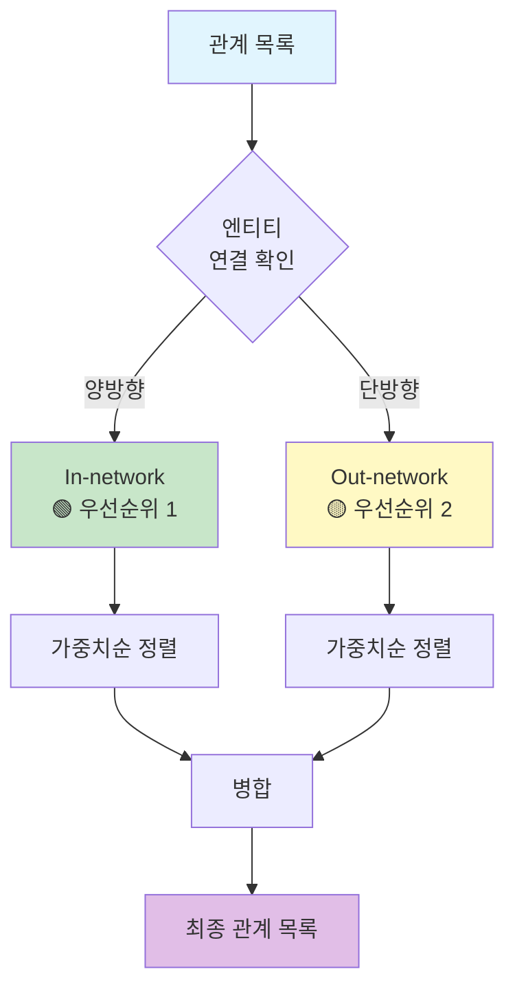

| 우선순위 | 유형 | 설명 | 예시 |
|----------|------|------|------|
| 1 | In-network | 쿼리 관련 엔티티 간 연결 | A↔B (둘 다 관련) |
| 2 | Out-network | 한쪽만 관련된 연결 | A→B (A만 관련) |
| 3 | Single | 단일 연결 | 낮은 가중치 |

### Hop 순회

```mermaid
flowgraph TB
    Q["쿼리 엔티티"] --> HOP1["Hop 1<br/>직접 연결"]

    HOP1 --> N1["이웃 엔티티 A"]
    HOP1 --> N2["이웃 엔티티 B"]

    N1 --> HOP2["Hop 2<br/>간접 연결"]
    N2 --> HOP2

    HOP2 --> N3["2-hop 엔티티 C"]
    HOP2 --> N4["2-hop 엔티티 D"]

    style Q fill:#fff9c4
    style HOP1 fill:#c8e6c9
    style HOP2 fill:#a5d6a7
```

```
Hop 0: [쿼리 엔티티]
Hop 1: [직접 연결된 엔티티]
Hop 2: [1-hop의 이웃 엔티티]
Hop 3: [2-hop의 이웃 엔티티]

일반적으로 2-3 hop 까지 순회
```

## 🌐 글로벌 컨텍스트 빌더

### Map-Reduce 아키텍처

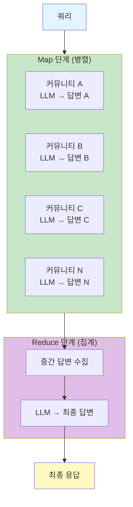

```python
async def _map_phase(
    self,
    query: str,
    communities: list[dict],
    reports: pd.DataFrame,
    concurrency: int
) -> list[str]:
    """
    각 커뮤니티에서 독립적으로 답변 생성
    """
    semaphore = asyncio.Semaphore(concurrency)

    async def process_community(comm):
        async with semaphore:
            report = reports[reports['community'] == comm['id']].iloc[0]

            prompt = f"""
            Given this community report:
            {report['full_content']}

            And the question: {query}

            Provide a brief intermediate answer focused on this community.
            """

            return await llm.execute(prompt)

    # 병렬 실행
    tasks = [process_community(c) for c in communities]
    results = await asyncio.gather(*tasks)

    return results
```

### 동적 커뮤니티 선택

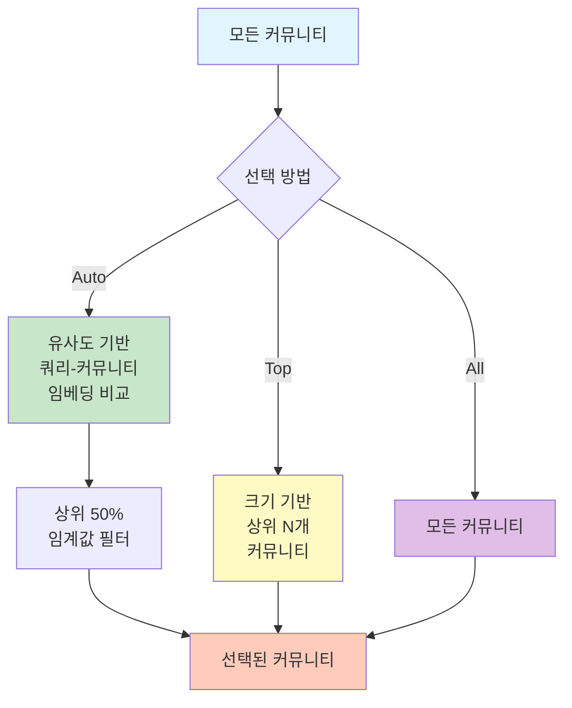

| 방법 | 설명 | 사용 사례 |
|------|------|----------|
| `auto` | 쿼리와 유사한 커뮤니티 선택 | 일반적 |
| `top` | 크기 기반 상위 선택 | 포괄적 질문 |
| `all` | 모든 커뮤니티 사용 | 완전한 분석 |

## 📊 토큰 할당 전략

### 비율 할당

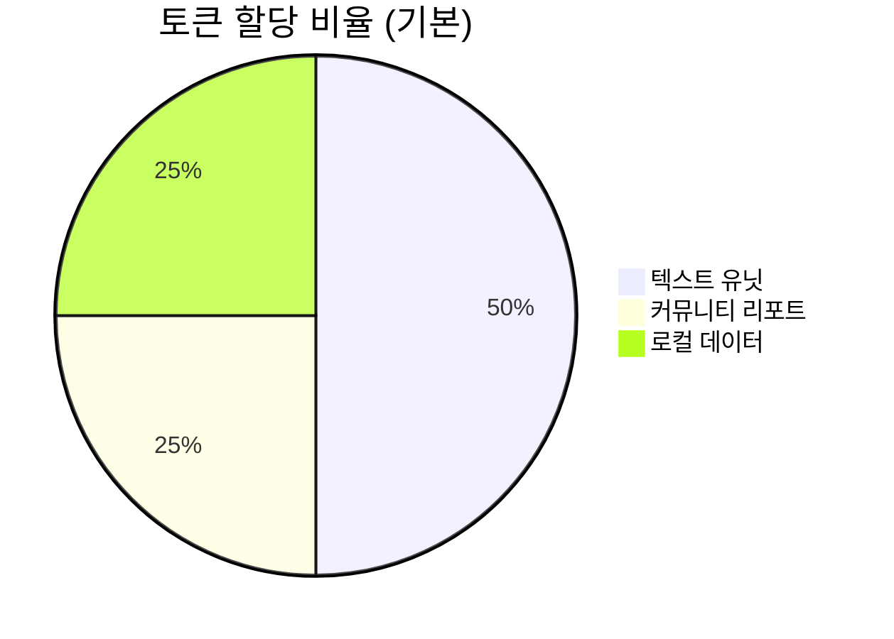

```python
def _allocate_tokens(
    self,
    text_units: list[str],
    community_reports: list[str],
    entities: list[dict],
    relationships: list[dict],
    max_tokens: int = 12000
) -> dict:
    """
    정해진 비율로 토큰 할당
    """
    total_available = max_tokens

    # 비율별 할당량 계산
    text_budget = int(total_available * self.text_unit_prop)      # 6000
    report_budget = int(total_available * self.community_prop)   # 3000
    local_budget = int(total_available * self.local_prop)        # 3000

    return {
        'text_units': select_by_token_count(text_units, text_budget),
        'community_reports': select_by_token_count(community_reports, report_budget),
        'local_data': select_local_data(entities, relationships, local_budget)
    }
```

### 지능형 토큰 관리

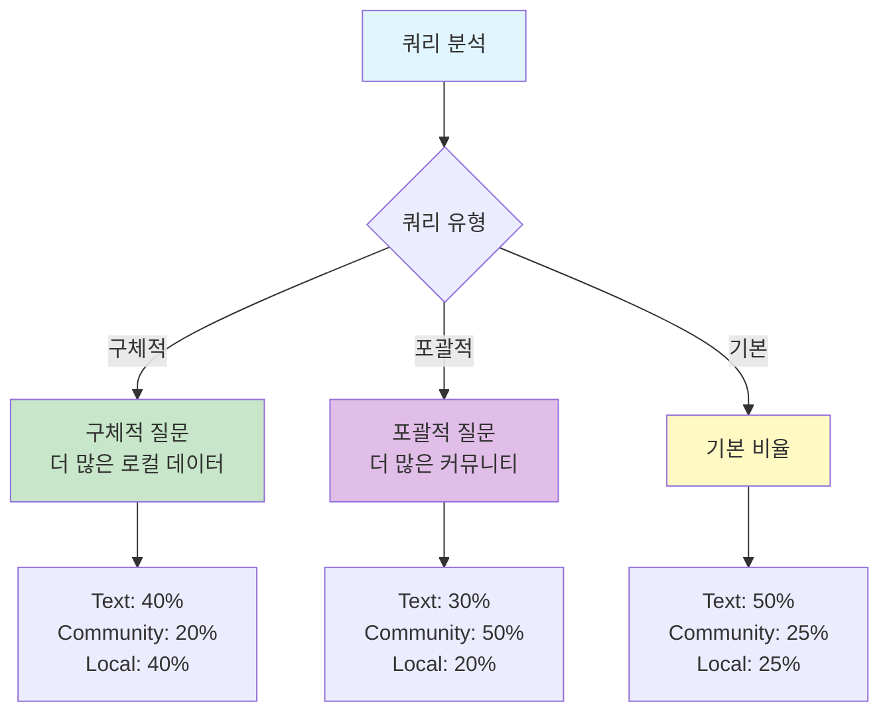

```python
def _allocate_tokens_adaptive(
    self,
    query_type: str,
    available_data: dict,
    max_tokens: int
) -> dict:
    """
    쿼리 유형에 따른 적응형 토큰 할당
    """
    if query_type == "specific":
        allocation = {
            'text_units': 0.4,
            'community_reports': 0.2,
            'local_data': 0.4
        }
    elif query_type == "broad":
        allocation = {
            'text_units': 0.3,
            'community_reports': 0.5,
            'local_data': 0.2
        }
    else:
        allocation = {
            'text_units': 0.5,
            'community_reports': 0.25,
            'local_data': 0.25
        }

    return allocation
```

## 🎓 컨텍스트 최적화

### 1. 재순위 (Reranking)

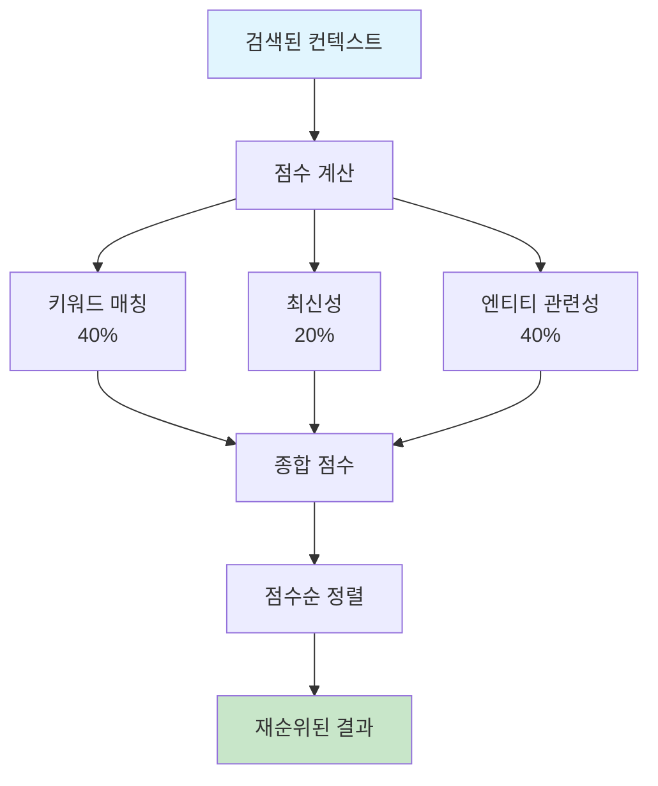

```python
def rerank_context(
    context_items: list[dict],
    query: str
) -> list[dict]:
    """
    검색된 컨텍스트 항목을 재순위
    """
    scores = []

    for item in context_items:
        # 1. 키워드 매칭 점수
        keyword_score = calculate_keyword_match(query, item)

        # 2. 최신성 점수
        recency_score = calculate_recency(item)

        # 3. 엔티티 관련성
        entity_score = calculate_entity_relevance(query, item)

        # 종합 점수
        total = (
            keyword_score * 0.4 +
            recency_score * 0.2 +
            entity_score * 0.4
        )

        scores.append((item, total))

    # 점수순 정렬
    sorted_items = sorted(scores, key=lambda x: -x[1])

    return [item for item, _ in sorted_items]
```

### 2. 컨텍스트 압축

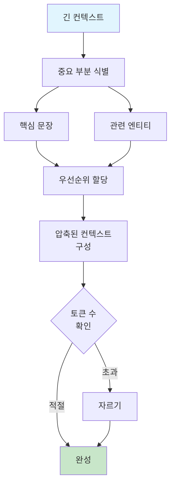

### 3. 다양성 확보

```mermaid
flowgraph LR
    S1["선택된 항목 1<br/>벡터: [0.8, 0.3]"]
    S2["선택된 항목 2<br/>벡터: [0.85, 0.35]"]

    C1["후보 항목 1<br/>벡터: [0.82, 0.32]"]
    C2["후보 항목 2<br/>벡터: [0.1, 0.2]"]

    S1 -.-"유사함"-.-> C1
    S1 -.-"다름"-.-> C2

    style S1 fill:#c8e6c9
    style S2 fill:#c8e6c9
    style C1 fill:#ffcdd2
    style C2 fill:#a5d6a7
```

```python
def ensure_diversity(
    selected_items: list[dict],
    all_items: list[dict],
    diversity_threshold: float = 0.7
) -> list[dict]:
    """
    선택된 항목의 다양성 확보
    """
    diverse_items = [selected_items[0]]

    for item in all_items:
        if item in selected_items:
            continue

        # 기존 항목들과의 유사도 확인
        similarities = [
            cosine_similarity(item['embedding'], emb)
            for emb in selected_embeddings
        ]

        max_similarity = max(similarities) if similarities else 0

        # 유사도가 임계값보다 낮으면 추가
        if max_similarity < diversity_threshold:
            diverse_items.append(item)

    return diverse_items
```

## 📊 컨텍스트 품질 메트릭


| 메트릭 | 설명 | 측정 방법 | 목표 |
|--------|------|----------|------|
| **Relevance** | 쿼리와의 관련성 | LLM으로 평가 | > 0.7 |
| **Coverage** | 주제涵盖 범위 | 포함된 엔티티/커뮤니티 수 | 다양 |
| **Conciseness** | 불필요 정보 제거 | 압축률 | 높음 |
| **Coherence** | 논리적 일관성 | 문장 간 연결성 | > 0.7 |

## 🔗 관련 컴포넌트

- [[Local Search]]: 로컬 컨텍스트 사용
- [[Global Search]]: 글로벌 컨텍스트 사용
- [[Entity]]: 컨텍스트 구성 요소
- [[Community Report]]: 커뮤니티 컨텍스트

---
*See also: [[Query Module]], [[Local Search]], [[Global Search]]*
