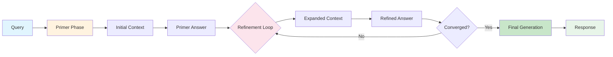

# DRIFT 검색

**DRIFT 검색** (Descriptive Representations for Indexing and Tracking Transformations)은 반복적 정제가 필요한 복잡한 multi-hop 질문을 위한 고급 쿼리 메서드입니다.

## 🎯 사용 사례

DRIFT 검색은 다음에 탁월합니다:
- "개념 A가 말뭉치를 통해 개념 B와 어떻게 관련되는가?"
- "시간 경과에 따른 이 주제의 발전을 추적해라"
- "X와 Y 사이의 중간 연결은 무엇인가?"
- 복잡한 multi-hop 추론

## 🏗️ 작동 방식

DRIFT 검색은 두 단계의 반복적 접근 방식을 사용합니다:



### 단계 1: 프라이머

프라이머 단계는 쿼리 공간을 탐색합니다:

1. 초기 이해 생성
2. 주요 엔티티와 개념 식별
3. 예비 컨텍스트 빌드
4. 탐색 방향 식별

### 단계 2: 정제

정제 단계는 이해를 반복적으로 개선합니다:

1. 탐색 안내를 위해 프라이머 컨텍스트 사용
2. 관련 엔티티로 컨텍스트 확장
3. 새로운 정보를 기반으로 이해 정제
4. 수렴 또는 최대 반복 횟수까지 반복

## ⚙️ 구성

### YAML 구성

```yaml
drift_search:
  # 토큰 제한
  max_tokens: 12000           # 최대 전체 토큰
  primer_max_tokens: 2000     # 프라이머 단계 제한
  max_context_tokens: 8000    # 정제 컨텍스트 제한

  # 반복 제어
  max_iterations: 5           # 최대 정제 반복 횟수
  convergence_threshold: 0.1  # 조기 중지 임계값

  # 탐색
  exploration_factor: 2.0     # 반복당 확장 정도
```

### 프로그래밍 방식 사용

```python
from graphrag.api import drift_search

result = await drift_search(
    query="AI 연구가 기후 과학과 어떻게 연결되는가?",
    config="./settings.yaml",
    conversation_history=None
)
```

## 🆚 다른 메서드와의 비교

| 측면 | DRIFT 검색 | 로컬 검색 | 글로벌 검색 |
|--------|--------------|--------------|---------------|
| **범위** | 반복적 확장 | 2-3 홉 | 전체 그래프 |
| **최적 용도** | Multi-hop 추론 | 구체적인 엔티티 | 광범위한 주제 |
| **반복** | 여러 번 (5+) | 단일 | 두 번 (map-reduce) |
| **상태** | 유지됨 | 없음 | 없음 |
| **속도** | 가장 느림 | 빠름 | 중간 |

## 📊 반복 프로세스

```
┌─────────────────────────────────────────────────────────────┐
│                      DRIFT 검색 흐름                       │
└─────────────────────────────────────────────────────────────┘

반복 0 (프라이머):
쿼리 -> 엔티티 추출 -> 초기 컨텍스트 -> 프라이머 답변

반복 1:
프라이머 답변 + 쿼리 -> 확장된 컨텍스트 -> 정제된 답변

반복 2:
정제된 답변 + 쿼리 -> 추가 확장 -> 더 정제된 답변

반복 N:
수렴 또는 max_iterations까지

최종 답변:
모든 반복에서 종합
```

## 🔧 구현 세부 정보

### 위치
`/graphrag/query/llm/drift_search/drift_search.py`

### 주요 함수

```python
async def drift_search(
    query: str,
    context_builder: DriftContextBuilder,
    chat_model: LanguageModel,
) -> SearchResult:
    # 프라이머 단계
    primer_context = await build_primer_context(query)
    primer_answer = await generate_answer(query, primer_context)

    # 정제 단계
    current_answer = primer_answer
    for iteration in range(max_iterations):
        # 현재 답변을 기반으로 컨텍스트 확장
        expanded_context = await expand_context(
            query, current_answer
        )

        # 정제된 답변 생성
        refined_answer = await generate_answer(
            query, expanded_context
        )

        # 수렴 확인
        if converged(current_answer, refined_answer):
            break

        current_answer = refined_answer

    return SearchResult(current_answer)
```

## 💡 최적 결과를 위한 팁

1. **복잡한 관계**: multi-hop 연결에 대해 질문
   - "AI 연구가 기후 과학과 어떻게 연결되는가?" (O)
   - "이 말뭉치에서 의료와 경제를 연결하는 것은 무엇인가?" (O)

2. **탐색적 질문**: 개방형 탐색에 사용
   - "양자 컴퓨팅의 발전을 추적해라" (O)
   - "주제 X에 대한 모든 연결은 무엇인가?" (O)

3. **후속 쿼리**: 이전 결과 기반 구축
   ```python
   history = [
       {"role": "user", "content": "X와 Y는 어떻게 관련되어 있는가?"},
       {"role": "assistant", "content": "..."},
       {"role": "user", "content": "Z와의 연결은 어떠한가?"}
   ]
   ```

## 🐛 문제 해결

### 반복이 너무 많음
**문제**: 검색이 너무 오래 걸림

**해결 방법**:
- `max_iterations` 감소
- `convergence_threshold` 증가
- `exploration_factor` 조정

### 수렴하지 않음
**문제**: 수렴 없이 최대 반복 횟수 도달

**해결 방법**:
- `convergence_threshold` 증가
- 쿼리 복잡도 검토
- 대신 [[Global Search]] 사용 고려

## 🔗 관련 주제

- [[Local Search]] - 엔티티 중심 검색
- [[Global Search]] - 커뮤니티 레벨 검색
- [[Query Module]] - 쿼리 아키텍처
- [[Context Building Deep Dive]] - 컨텍스트 빌딩 전략

---
*참고: [[Query Module]], [[Local Search]], [[Global Search]]*
