# Entity Extraction Deep Dive

엔티티 추출(Entity Extraction)은 GraphRAG 파이프라인의 핵심 컴포넌트로, 비정형 텍스트에서 의미있는 명명된 엔티티를 식별하고 추출하는 프로세스입니다.

## 목차

### 1. 개요
- [엔티티 추출의 목적](#-엔티티-추출의-목적)
- [빗대어 보기: 도서관 카탈로그 시스템](#-빗대어-보기-도서관-카탈로그-시스템)

### 2. 아키텍처
- [추출 아키텍처](#-추출-아키텍처)
- [처리 단계별 상세](#-처리-단계별-상세)

### 3. 엔티티 유형
- [기본 엔티티 유형](#-기본-엔티티-유형)
- [도메인별 커스텀 유형](#-도메인별-커스텀-유형)

### 4. 추출 프롬프트
- [GraphRAG 기본 프롬프트](#-graphrag-기본-프롬프트)
- [프롬프트 최적화 기법](#-프롬프트-최적화-기법)
- [구분자 시스템](#-구분자-시스템)

### 5. 구현 상세
- [추출 파이프라인](#-추출-파이프라인)
- [중복 제거 알고리즘](#-중복-제거-알고리즘)

### 6. 성능 최적화
- [품질 평가](#-품질-평가)
- [오류 패턴 분석](#-오류-패턴-분석)
- [고급 기법](#-고급-기법)

---

## 🎯 엔티티 추출의 목적

엔티티 추출은 다음을 달성하기 위해 수행됩니다:

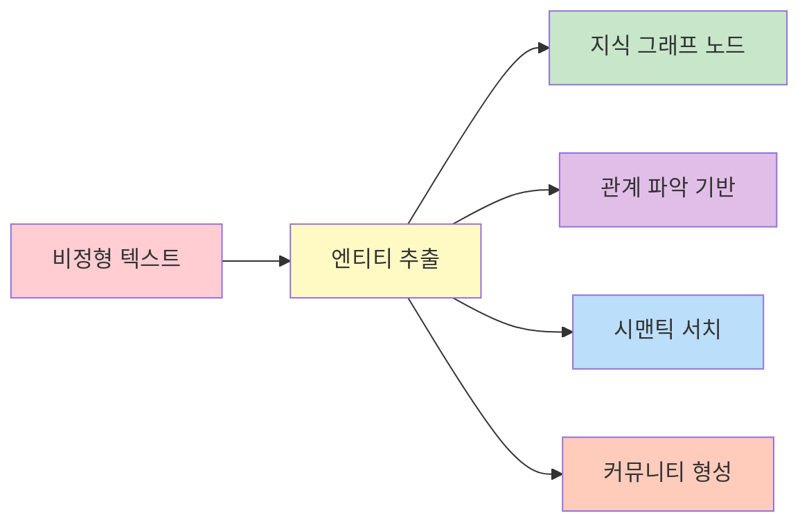

1. **지식 그래프 구성**: 텍스트에서 노드를 식별
2. **관계 파악**: 엔티티 간 연결의 기반 제공
3. **의미적 검색**: 엔티티 설명을 통한 의미론적 검색 가능
4. **커뮤니티 형성**: 관련 엔티티를 그룹화하여 주제 발견

## 📖 빗대어 보기: 도서관 카탈로그 시스템

엔티티 추출은 **도서관의 사서가 새로운 책을 분류하는 과정**과 유사합니다:

| 도서관 사서 | 엔티티 추출 시스템 |
|------------|------------------|
| 책의 주제 분류 | 텍스트에서 엔티티 유형 결정 |
| 저자 이름 추출 | person 타입 엔티티 추출 |
| 출판사 확인 | organization 타입 추출 |
| 카드 카탈록 작성 | 엔티티 설명 생성 |
| 중복 도서 확인 | 중복 제거 알고리즘 |
| 관련 주제 분류 | 커뮤니티 할당 |

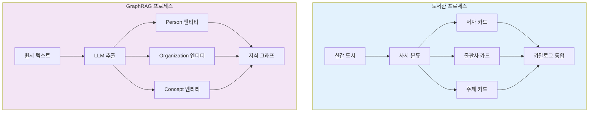

## 🏗️ 추출 아키텍처

```mermaid
flowchart TB
    subgraph Input["입력 계층"]
        TU["Text Units<br/>(문서 청크)"]
    </subgraph>

    subgraph Extract["추출 계층"]
        PRE["전처리<br/>📝 토큰화<br/>📝 문장 분할<br/>📝 NER 태깅"]
        PROMPT["프롬프트 생성<br/>📝 엔티티 유형 지정<br/>📝 예제 제공<br/>📝 구분자 설정"]
        LLM["LLM 호출<br/>📝 구조화된 출력 요청<br/>📝 Few-shot Learning<br/>📝 CoT 추론"]
        PARSE["결과 파싱<br/>📝 JSON → 객체<br/>📝 필드 검증<br/>📝 오류 복구"]
    </subgraph>

    subgraph Output["출력 계층"]
        RAW["Raw Entities<br/>📊 중복 포함"]
        DEDUP["중복 제거<br/>📊 이름 정규화<br/>📊 유사도 계산"]
        FINAL["Final Entities<br/>📊 ID 할당<br/>📊 설명 강화"]
    </subgraph>

    TU --> PRE --> PROMPT --> LLM --> PARSE --> RAW --> DEDUP --> FINAL

    style Input fill:#e3f2fd,stroke:#1976d2,stroke-width:2px
    style Extract fill:#fff3e0,stroke:#f57c00,stroke-width:2px
    style Output fill:#e8f5e9,stroke:#388e3c,stroke-width:2px
```

### 처리 단계별 상세

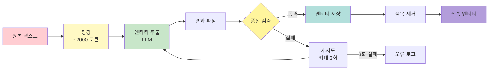

## 📋 엔티티 유형 분류

### 기본 엔티티 유형

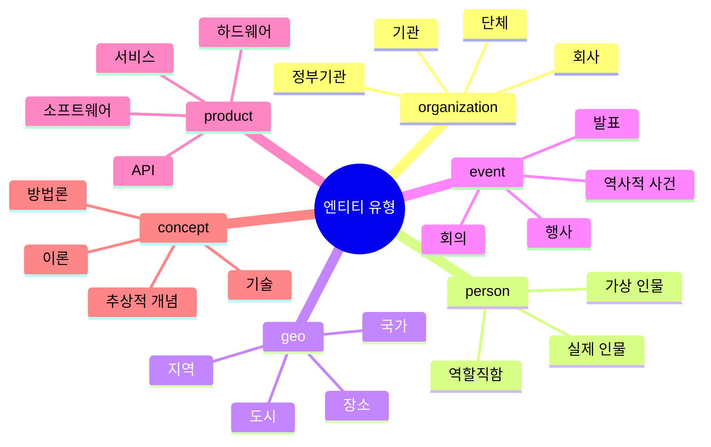

| 유형 | 설명 | 예시 | 추출 난이도 |
|------|------|------|-------------|
| `organization` | 회사, 기관, 단체 | Microsoft, OpenAI, MIT | 쉬움 ⭐ |
| `person` | 사람, 개인 | Satya Nadella, Sam Altman | 쉬움 ⭐ |
| `geo` | 지리적 위치 | Seattle, Redmond, USA | 중간 ⭐⭐ |
| `event` | 이벤트, 사건 | WWDC, F8 Conference | 중간 ⭐⭐ |
| `product` | 제품, 서비스 | GPT-4, Azure, GitHub | 어려움 ⭐⭐⭐ |
| `concept` | 추상적 개념 | AI, 머신러닝, 딥러닝 | 어려움 ⭐⭐⭐ |

### 엔티티 유형별 추출 패턴

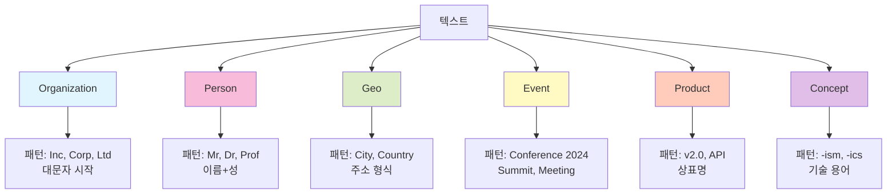

### 도메인별 커스텀 유형

```yaml
extract_graph:
  entity_types:
    - organization
    - person
    - geo
    - event
    - product
    - concept
    - research_topic  # 커스텀: 연구 주제
    - technology      # 커스텀: 기술 스택
    - project         # 커스텀: 프로젝트명
```

## 🔍 추출 프롬프트 구조

### GraphRAG 기본 프롬프트

```
From the text below, extract all entities.

For each entity, provide:
- title: The entity name
- type: One of {organization, person, geo, event}
- description: A brief description

Text: {text_chunk}

Output format:
{entity_delimiter}
Title: {name}
Type: {type}
Description: {description}
{record_delimiter}
```

### 프롬프트 구조 다이어그램

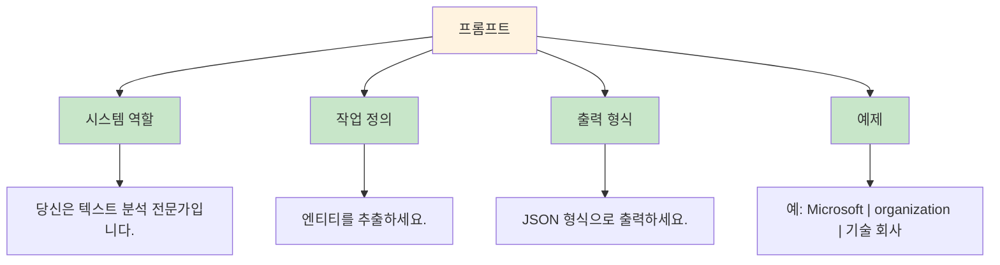

### 프롬프트 최적화 기법

1. **Few-shot Learning**: 예제 제공
2. **CoT (Chain of Thought)**: 추론 단계 명시
3. **구조화된 출력**: 구분자(delimiter) 사용

### 구분자 시스템

```mermaid
flowchart LR
    A[엔티티 1] -->|TUPLE| B[필드 구분]
    B --> C[<|>]
    A2[엔티티 2] --> C
    C -->|RECORD| D[레코드 구분]
    D --> E[##]
    E -->|COMPLETION| F[완료 신호]
    F --> G[<|COMPLETE|>]

    style A fill:#e1f5fe
    style A2 fill:#e1f5fe
    style C fill:#fff9c4
    style E fill:#c8e6c9
    style G fill:#ffcdd2
```

| 구분자 | 용도 | 기본값 | 예시 |
|--------|------|--------|------|
| `TUPLE_DELIMITER` | 필드 구분 | `<|>` | `Microsoft<|>organization<|>Tech company` |
| `RECORD_DELIMITER` | 레코드 구분 | `##` | `엔티티1##엔티티2` |
| `COMPLETION_DELIMITER` | 완료 신호 | `<|COMPLETE|>` | 출력 종료 표시 |

## ⚙️ 추출 파라미터

### 주요 설정값

```yaml
extract_graph:
  # LLM 설정
  max_gleanings: 1              # 청크당 추출 횟수
  prompt: "prompts/extract_entity.txt"

  # 엔티티 유형
  entity_types:
    - organization
    - person
    - geo
    - event

  # 추출 제한
  max_entities: 50              # 청크당 최대 엔티티 수

  # 병렬 처리
  num_threads: 4                # 병렬 추출 스레드 수
```

### 파라미터 영향도 분석

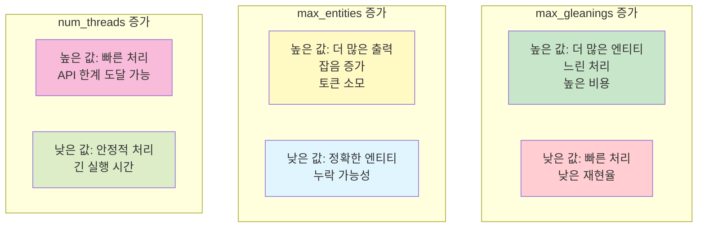

### Gleaning (다중 추출)

```python
# 청크당 여러 번 추출하여 결과 병합
for gleaning in range(max_gleanings):
    entities = await llm_extract(chunk)
    all_entities.extend(entities)

# 중복 제거
deduplicated = merge_entities(all_entities)
```

## 🔧 구현 상세

### 추출 파이프라인

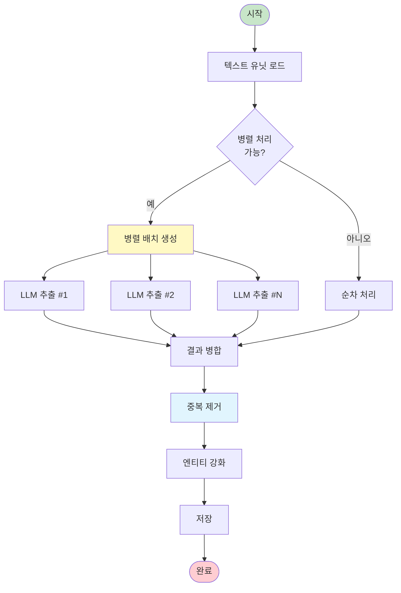

```python
async def extract_entities(
    text_units: pd.DataFrame,
    entity_types: list[str],
    llm: BaseLanguageModel,
    num_threads: int = 4,
) -> pd.DataFrame:
    """
    텍스트 유닛에서 엔티티 추출
    """
    # 1. 병렬 처리를 위한 배치 생성
    batches = create_batches(text_units, num_threads)

    # 2. 각 배치에 대해 LLM 추출
    results = await asyncio.gather(*[
        extract_batch(batch, entity_types, llm)
        for batch in batches
    ])

    # 3. 결과 병합
    raw_entities = merge_results(results)

    # 4. 중복 제거
    entities = deduplicate_entities(raw_entities)

    # 5. 엔티티 강화 (설명 생성, 임베딩)
    entities = enrich_entities(entities)

    return entities
```

### 중복 제거 알고리즘

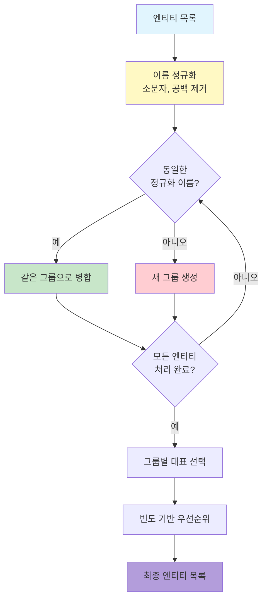

```python
def deduplicate_entities(
    entities: list[Entity],
    similarity_threshold: float = 0.85
) -> list[Entity]:
    """
    이름 유사도 기반 중복 제거
    """
    # 1. 정규화 (소문자, 공백 제거)
    normalized = [(e, normalize_name(e.title)) for e in entities]

    # 2. 유사한 이름 그룹화
    groups = {}
    for entity, norm_name in normalized:
        if norm_name in groups:
            groups[norm_name].append(entity)
        else:
            groups[norm_name] = [entity]

    # 3. 각 그룹에서 대표 엔티티 선택
    deduplicated = []
    for group in groups.values():
        # 가장 많이 등장한 엔티티 선택
        representative = max(group, key=lambda e: e.frequency)
        deduplicated.append(representative)

    return deduplicated
```

## 📊 품질 평가

### 품질 메트릭


| 메트릭 | 설명 | 목표값 | 계산식 |
|--------|------|--------|--------|
| **Precision** | 추출된 엔티티 중 실제 엔티티 비율 | > 0.85 | TP / (TP + FP) |
| **Recall** | 실제 엔티티 중 추출된 비율 | > 0.75 | TP / (TP + FN) |
| **F1 Score** | Precision과 Recall의 조화 평균 | > 0.80 | 2×(P×R)/(P+R) |
| **Type Accuracy** | 올바른 유형 분류 비율 | > 0.90 | 올바른 유형 / 전체 |

### 일반적인 오류 패턴

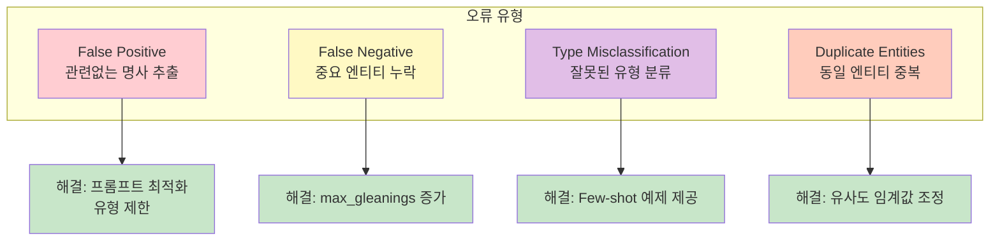

| 오류 | 원인 | 해결방법 |
|------|------|----------|
| **False Positive** | 관련없는 명사 추출 | 프롬프트 최적화, 유형 제한 |
| **False Negative** | 중요 엔티티 누락 | max_gleanings 증가 |
| **Type Misclassification** | 잘못된 유형 분류 | Few-shot 예제 제공 |
| **Duplicate Entities** | 동일 엔티티 중복 | 유사도 임계값 조정 |

## 🎓 고급 기법

### 1. 커스텀 프롬프트 튜닝

```python
# 도메인별 프롬프트 생성
domain_prompt = f"""
You are an expert in {domain} entity extraction.

Extract entities from the following text with focus on:
- Key players (people, organizations)
- Important locations
- Significant events
- Relevant concepts and terminology

Entity Types: {entity_types}

Text: {{text}}
"""
```

### 2. NLP 기반 전처리

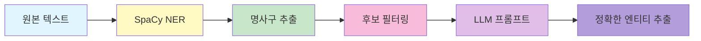

```python
import spacy

# SpaCy로 사전 추출
nlp = spacy.load("en_core_web_sm")
doc = nlp(text)

# 명사 후보 추출
noun_phrases = [chunk.text for chunk in doc.noun_chunks]

# LLM에 힌트 제공
prompt = f"""
Extract entities from this text. Focus on:
{chr(10).join(f"- {np}" for np in noun_phrases[:10])}

Text: {text}
"""
```

### 3. 컨텍스트 확장

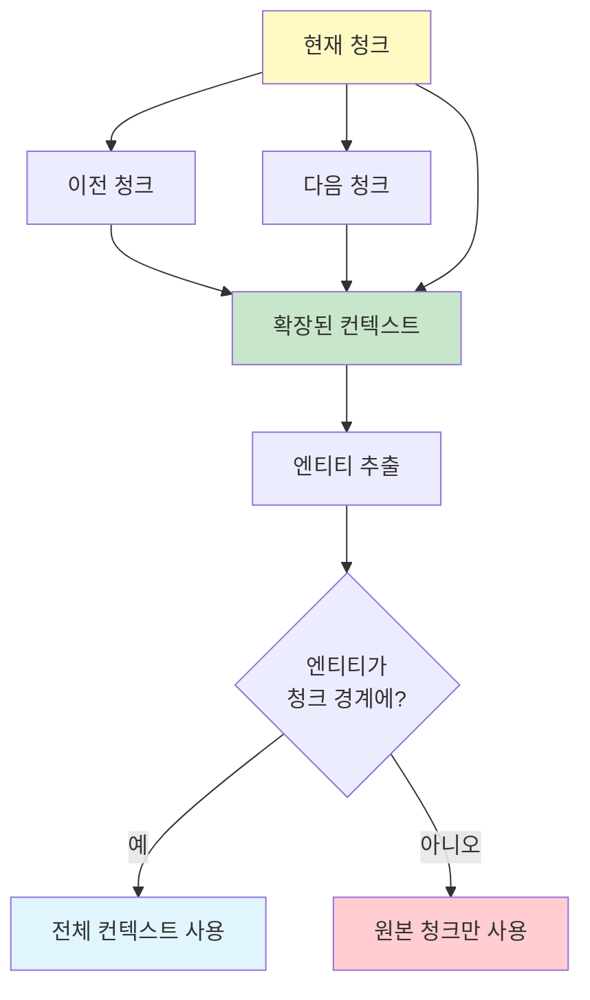

```python
# 주변 텍스트 유닛 포함
def get_expanded_context(text_unit, all_units, window=2):
    """주변 청크의 컨텍스트 포함"""
    idx = all_units.index(text_unit)
    context_units = all_units[max(0, idx-window):idx+window+1]
    return " ".join(u.text for u in context_units)
```

## 🔗 관련 컴포넌트

- [[Relationship]]: 엔티티 간 관계 추출
- [[Text Unit]]: 추출 입력 데이터
- [[Language Model Module]]: LLM 통합
- [[Community]]: 추출된 엔티티의 커뮤니티 그룹화

## 💡 성능 최적화 팁

1. **배치 처리**: 한 번의 LLM 호출로 여러 청크 처리
2. **캐싱**: 동일한 텍스트 재추출 방지
3. **병렬 처리**: `num_threads`로 동시 추출
4. **Smart Chunking**: 엔티티가 많은 청크 분할

---
*See also: [[Entity]], [[Relationship]], [[Index Module]]*
