# LLM Integration Deep Dive

GraphRAG의 LLM 통합 계층은 OpenAI, Azure OpenAI, LiteLLM 등 다양한 LLM 제공자와의 통합을 담당하며, 속도 제한, 재시도, 토큰 관리를 포함한 프로덕션 준비 인터페이스를 제공합니다.

## 목차

### 1. 개요
- [LLM 모듈의 책임](#-llm-모듈의-책임)
- [빗대어 보기: 고속도로 톨게이트 시스템](#-빗대어-보기-고속도로-톨게이트-시스템)

### 2. 아키텍처
- [시스템 아키텍처](#-아키텍처)
- [계층별 상세](#-계층별-상세)

### 3. 제공자별 구현
- [OpenAI](#1-openai)
- [Azure OpenAI](#2-azure-openai)
- [LiteLLM](#3-litellm)

### 4. 속도 제한 관리
- [Rate Limiter 구현](⚡-속도-제한-rate-limiting)
- [이중 제한 시스템](#이중-제한-시스템)
- [대기 전략](#대기-전략)

### 5. 재시도 로직
- [지수 백오프](#지수-백오프-exponential-backoff)
- [재시도 전략 비교](#재시도-전략-비교)

### 6. 토큰 관리
- [토큰 카운터](#-토큰-관리)
- [모델별 인코딩](#모델별-인코딩)

### 7. 고급 기법
- [비동기 처리](#-비동기-처리)
- [스트리밍 응답](#스트리밍-응답)
- [함수 호출](#함수 호출-function-calling)

---

## 🎯 LLM 모듈의 책임

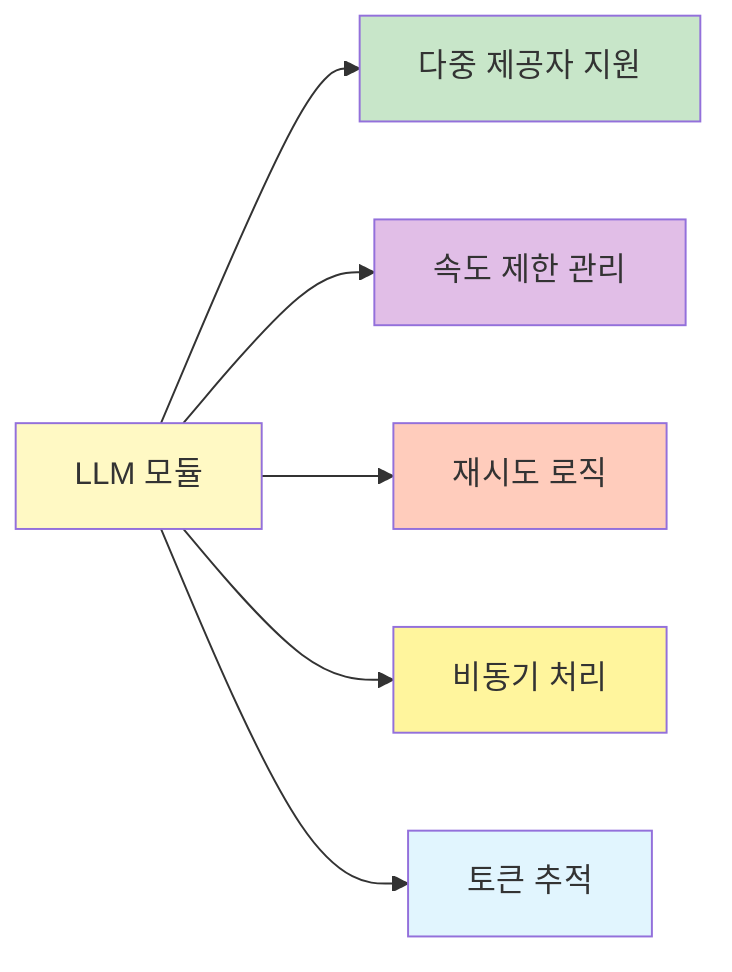

1. **다중 제공자 지원**: OpenAI, Azure OpenAI, 100+ LiteLLM 제공자
2. **속도 제한 관리**: RPM/TPM 이중 제한
3. **재시도 로직**: 지수 백오프 및 점진적 지연
4. **비동기 처리**: 병렬 요청 처리
5. **토큰 추적**: 사용량 모니터링

## 📖 빗대어 보기: 고속도로 톨게이트 시스템

LLM 통합의 속도 제한 관리는 **고속도로 톨게이트의 차량 통제 시스템**과 유사합니다:

| 톨게이트 시스템 | LLM 속도 제한 |
|---------------|--------------|
| 차량 진입 | API 요청 |
| 시간당 차량 제한 | RPM (Requests Per Minute) |
| 하중 제한 | TPM (Tokens Per Minute) |
| 대기 큐 | 요청 대기열 |
| 우선 차량 | 우선순위 처리 |
| 재진입 대기 시간 | 재시도 지연 |

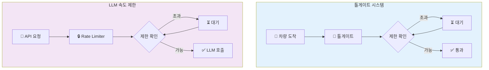

## 🏗️ 아키텍처

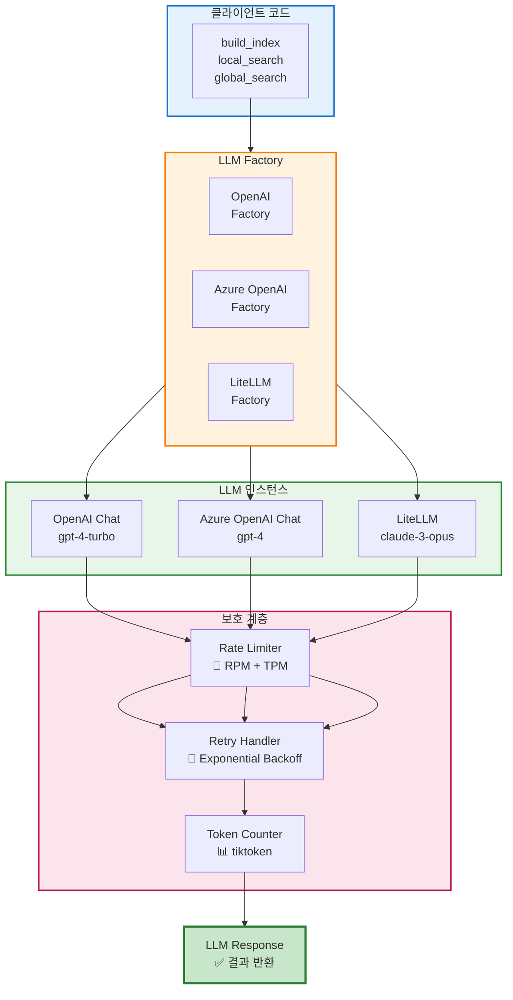

### 계층별 상세

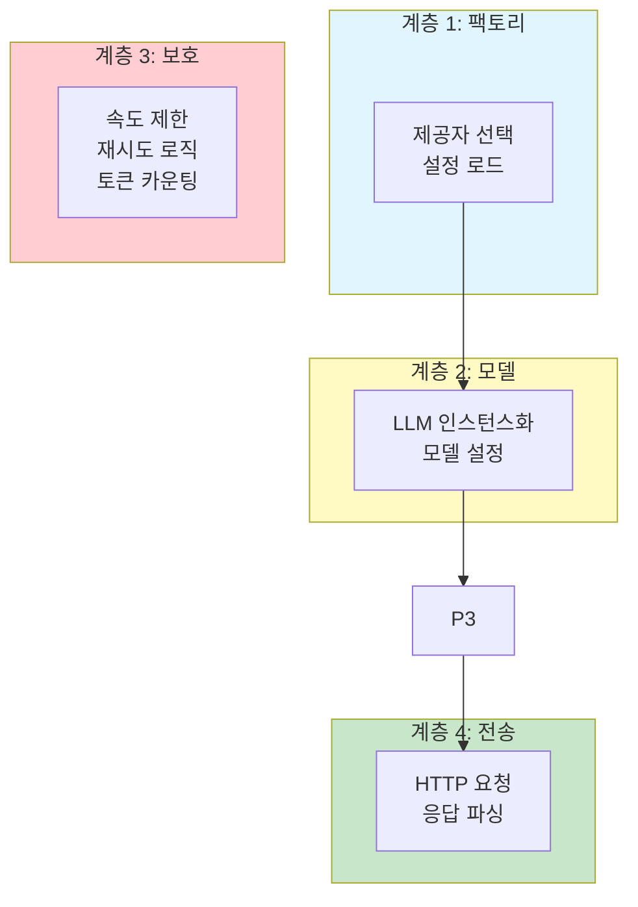

## 📋 제공자별 구현

### 1. OpenAI

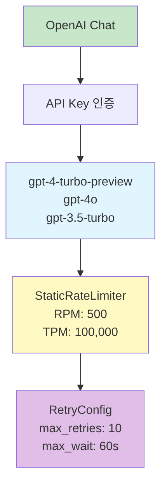

```python
class OpenAIChat(BaseLanguageModel):
    def __init__(
        self,
        model: str = "gpt-4-turbo-preview",
        api_key: str | None = None,
        temperature: float = 0.0,
        max_tokens: int = 4000,
        requests_per_minute: int = 500,
        tokens_per_minute: int = 100000,
    ):
        self.client = AsyncOpenAI(api_key=api_key)
        self.model = model
        self.rate_limiter = StaticRateLimiter(
            requests_per_minute,
            tokens_per_minute
        )
        self.retry_config = RetryConfig(
            strategy="exponential_backoff",
            max_retries=10,
            max_retry_wait=60
        )
```

### 2. Azure OpenAI

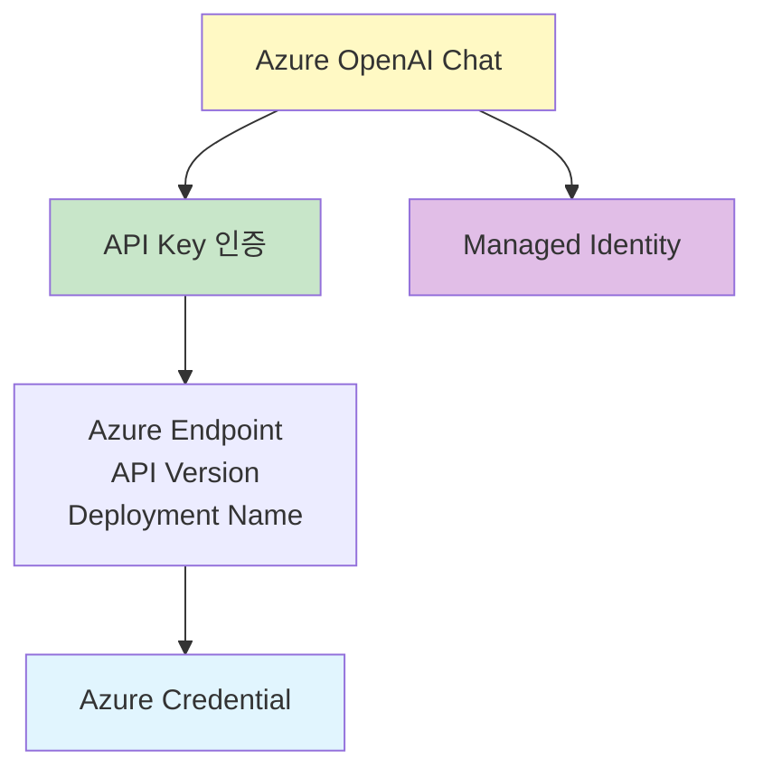

```python
class AzureOpenAIChat(BaseLanguageModel):
    def __init__(
        self,
        model: str,
        api_base: str,
        api_version: str,
        deployment_name: str,
        api_key: str | None = None,
        auth_type: str = "api_key",  # or "azure_managed_identity"
    ):
        if auth_type == "azure_managed_identity":
            # DefaultAzureCredential 사용
            from azure.identity import DefaultAzureCredential
            credential = DefaultAzureCredential()

            self.client = AsyncAzureOpenAI(
                azure_endpoint=api_base,
                api_version=api_version,
                azure_deployment=deployment_name,
                credential=credential
            )
        else:
            self.client = AsyncAzureOpenAI(
                azure_endpoint=api_base,
                api_version=api_version,
                azure_deployment=deployment_name,
                api_key=api_key
            )
```

### 3. LiteLLM

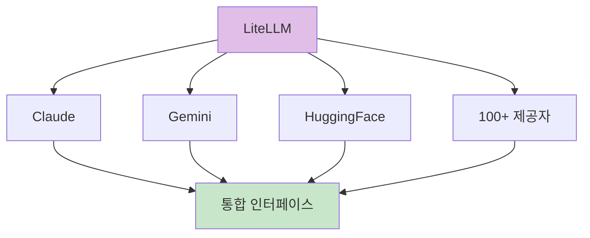

```python
class LiteLLMModel(BaseLanguageModel):
    def __init__(
        self,
        model: str,  # e.g., "claude-3-opus-20240229"
        model_provider: str,  # e.g., "anthropic"
        api_key: str | None = None,
    ):
        import litellm

        self.model = model
        self.model_provider = model_provider
        self.litellm_client = litellm.aasync_litellm
```

## ⚡ 속도 제한 (Rate Limiting)

### Rate Limiter 구현

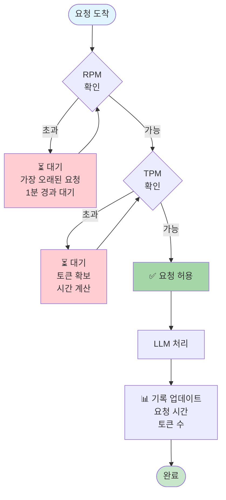

```python
import asyncio
import time
from collections import deque
from typing import Deque

class StaticRateLimiter:
    def __init__(
        self,
        requests_per_minute: int,
        tokens_per_minute: int
    ):
        self.rpm = requests_per_minute
        self.tpm = tokens_per_minute

        # 요청 이력 (시간 스탬프)
        self.request_history: Deque[float] = deque()

        # 토큰 이력 (시간, 토큰 수) 쌍
        self.token_history: Deque[tuple[float, int]] = deque()

    async def acquire(self, tokens: int = 0):
        """
        속도 제한 준수까지 대기
        """
        now = time.time()

        # 1. 요청 제한 확인
        while len(self.request_history) >= self.rpm:
            # 가장 오래된 요청이 1분 이상 전인지 확인
            oldest_request = self.request_history[0]
            if now - oldest_request >= 60:
                self.request_history.popleft()
            else:
                # 대기 시간 계산
                wait_time = 60 - (now - oldest_request)
                await asyncio.sleep(wait_time)
                now = time.time()

        # 2. 토큰 제한 확인
        recent_tokens = sum(
            count for ts, count in self.token_history
            if now - ts < 60
        )

        if recent_tokens + tokens > self.tpm:
            # 대기 시간 계산
            available_in = self._get_time_for_tokens(tokens)
            await asyncio.sleep(available_in)
            now = time.time()

        # 3. 기록
        self.request_history.append(now)
        self.token_history.append((now, tokens))
```

### 이중 제한 시스템

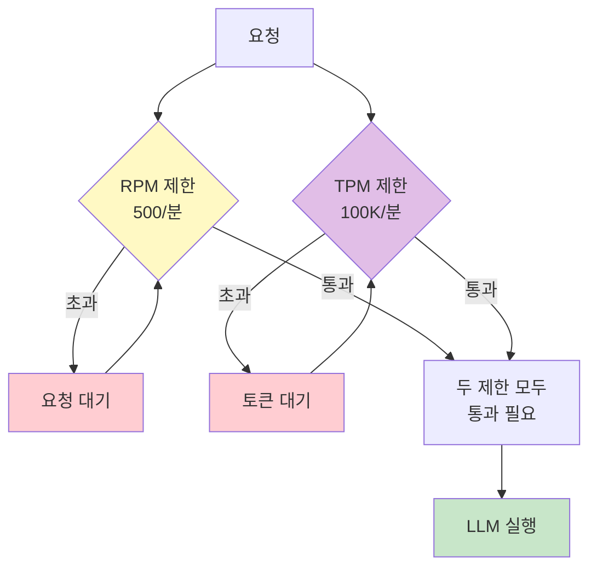

| 제한 유형 | 목적 | 일반적 값 |
|----------|------|-----------|
| **RPM** | 요청 빈도 제한 | 500/분 |
| **TPM** | 토큰 처리량 제한 | 100,000/분 |
| **TPD** | 일일 토큰 제한 | 10,000,000/일 |

### 대기 전략

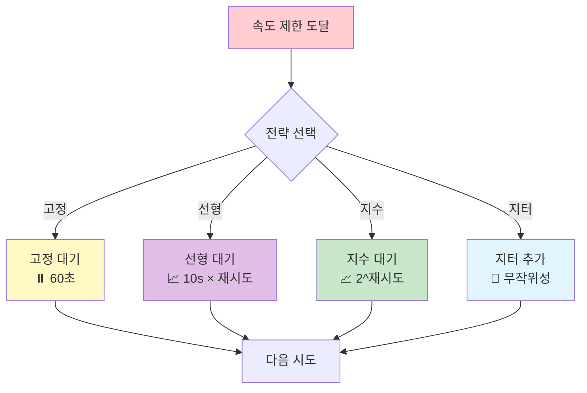

## 🔄 재시도 로직 (Retry Logic)

### 지수 백오프 (Exponential Backoff)

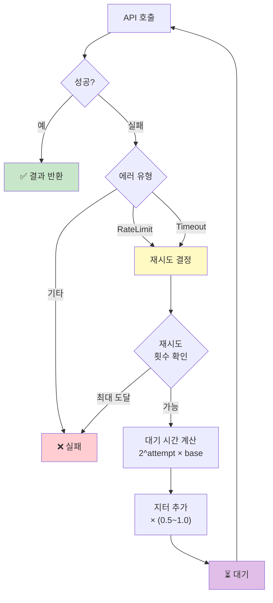

```python
async def execute_with_retry(
    llm_call: Callable,
    max_retries: int = 10,
    base_delay: float = 1.0,
    max_delay: float = 60.0,
    jitter: bool = True
):
    """
    지수 백오프를 사용한 재시도 실행
    """
    last_error = None

    for attempt in range(max_retries + 1):
        try:
            return await llm_call()

        except RateLimitError as e:
            if attempt == max_retries:
                raise MaxRetriesError(f"Max retries exceeded: {e}")

            # 대기 시간 계산
            delay = min(base_delay * (2 ** attempt), max_delay)

            # Jitter 추가 (불돌 방지)
            if jitter:
                import random
                delay = delay * (0.5 + random.random())

            logging.warning(f"Rate limited. Retry {attempt + 1}/{max_retries} after {delay:.2f}s")
            await asyncio.sleep(delay)

        except APITimeoutError as e:
            # 타임아웃은 더 긴 대기
            delay = min(base_delay * (2 ** attempt), max_delay * 2)
            await asyncio.sleep(delay)

        except Exception as e:
            # 기타 오류는 즉시 실패
            raise e
```

### 재시도 전략 비교

| 전략 | 대기 시간 공식 | 장점 | 단점 | 추천 상황 |
|------|---------------|------|------|-----------|
| `exponential_backoff` | 2^attempt | 빠른 회복 | 서버 부하 가능 | 일반적 |
| `incremental` | attempt × base | 예측 가능 | 느린 회복 | 안정적인 서비스 |
| `native_retry` | 제공자 의존 | 최적화됨 | 제공자마다 다름 | 단일 제공자 |
| `random` | 무작위 | 충돌 방지 | 느린 회복 | 분산 시스템 |

## 📊 토큰 관리

### 토큰 카운터 구조

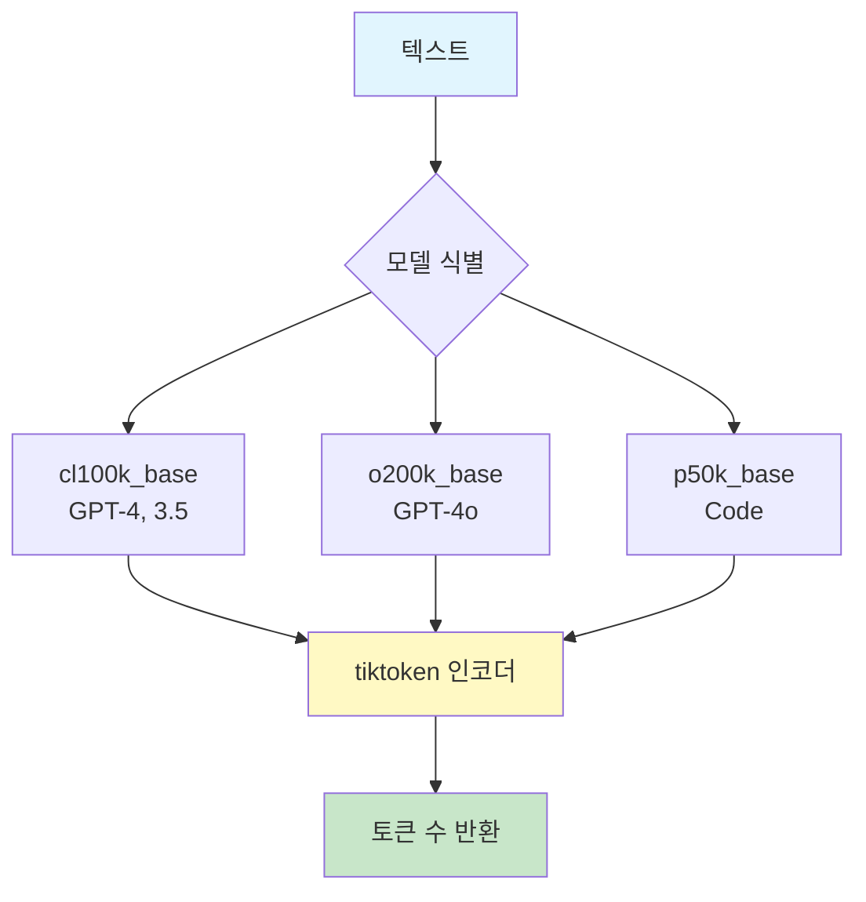

```python
class Tokenizer:
    # tiktoken 인코딩 매핑
    ENCODINGS = {
        "cl100k_base": {  # GPT-4, GPT-3.5-Turbo
            "models": ["gpt-4", "gpt-3.5-turbo", "text-embedding-3-*"]
        },
        "o200k_base": {  # GPT-4o
            "models": ["gpt-4o"]
        },
        "p50k_base": {  # Code models
            "models": ["code-davinci-*"]
        }
    }

    def __init__(self, model: str):
        self.encoding = self._get_encoding(model)

    def count(self, text: str) -> int:
        """텍스트의 토큰 수 반환"""
        return len(self.encoding.encode(text))

    def truncate(self, text: str, max_tokens: int) -> str:
        """토큰 제한으로 텍스트 자르기"""
        tokens = self.encoding.encode(text)
        truncated = tokens[:max_tokens]
        return self.encoding.decode(truncated)
```

### 모델별 인코딩

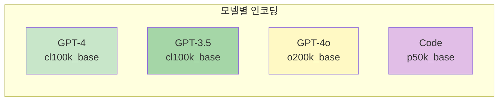

## 🔧 비동기 처리

### 병렬 요청 아키텍처

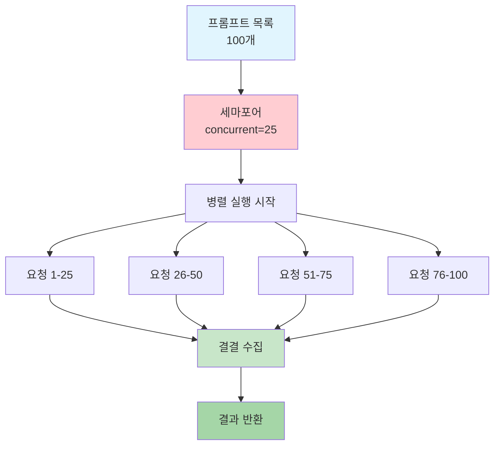

```python
async def parallel_llm_calls(
    prompts: list[str],
    llm: BaseLanguageModel,
    concurrent_requests: int = 25
) -> list[str]:
    """
    여러 프롬프트를 병렬로 처리
    """
    # 세마포어로 동시 요청 수 제한
    semaphore = asyncio.Semaphore(concurrent_requests)

    async def process(prompt: str):
        async with semaphore:
            return await llm.execute(prompt)

    # 병렬 실행
    tasks = [process(p) for p in prompts]
    results = await asyncio.gather(*tasks, return_exceptions=True)

    # 예외 처리
    final_results = []
    for result in results:
        if isinstance(result, Exception):
            logging.error(f"LLM call failed: {result}")
            final_results.append("")  # 실패 시 빈 문자열
        else:
            final_results.append(result)

    return final_results
```

### Async 모드 선택

| 모드 | 설명 | 사용 사례 |
|------|------|----------|
| `asyncio` | 진정한 비동기 I/O | I/O 바운드 작업 |
| `threaded` | 스레드 풀에서 실행 | CPU 바운드 작업 |

## 🎓 고급 기법

### 스트리밍 응답

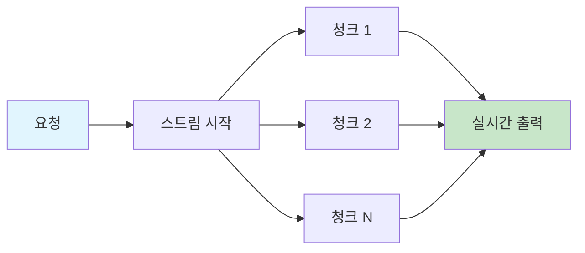

```python
async def stream_execute(
    self,
    prompt: str
) -> AsyncIterator[str]:
    """
    스트리밍 응답 생성
    """
    async with self.client.chat.completions.create(
        model=self.model,
        messages=[{"role": "user", "content": prompt}],
        stream=True
    ) as response:
        async for chunk in response:
            if chunk.choices[0].delta.content:
                yield chunk.choices[0].delta.content
```

### 함수 호출 (Function Calling)

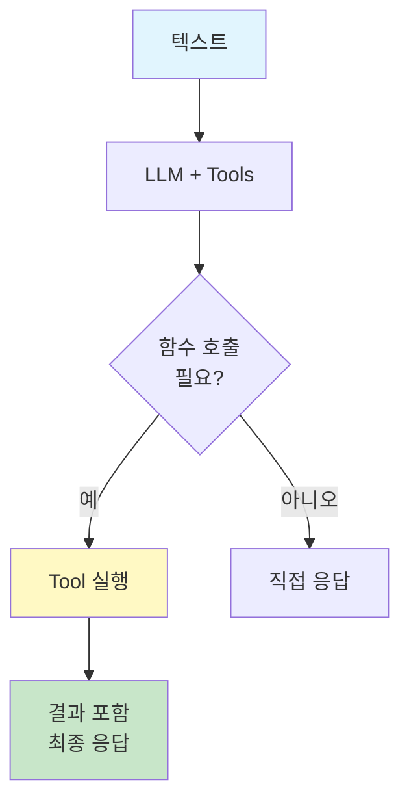

## 📊 성능 최적화

### 최적화 전략

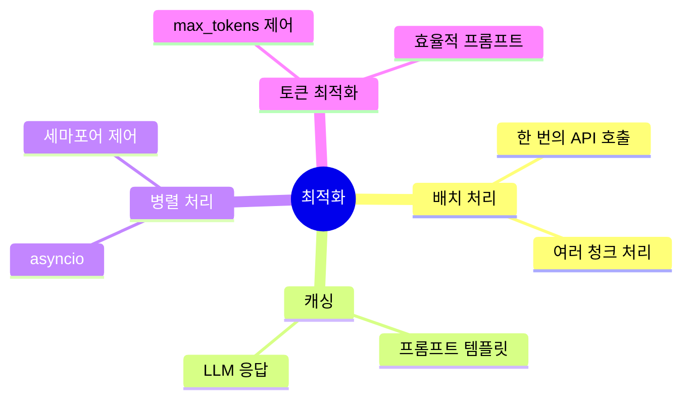

## 🔗 관련 컴포넌트

- [[Index Module]]: 인덱싱 중 LLM 사용
- [[Query Module]]: 쿼리 처리 중 LLM 사용
- [[Storage Module]]: 응답 캐싱

## 💡 비용 최적화 팁

1. **캐싱 활성화**: 동일 요청 재처리 방지
2. **배치 처리**: 여러 요청을 한 번에 처리
3. **모델 선택**: 작업에 맞는 모델 선택
4. **토큰 제한**: `max_tokens`로 출력 길이 제어

---
*See also: [[Language Model Module]], [[Index Module]], [[Query Module]]*
