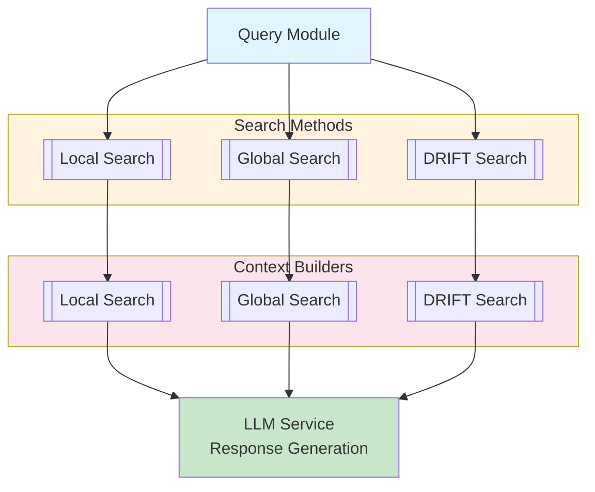

# GraphRAG 쿼리 모듈

**쿼리 모듈** (`/graphrag/query/`)은 지식 그래프에 대한 정교한 검색 기능을 구현하며, 다양한 유형의 질문에 최적화된 여러 쿼리 전략을 지원합니다.

## 📋 개요

쿼리 모듈은 4가지 고유한 검색 메서드를 제공합니다:
- [[Local Search]] - 엔티티 중심, 구체적인 질문
- [[Global Search]] - 커뮤니티 레벨, 광범위한 질문
- [[DRIFT Search]] - 복잡한 multi-hop 질문
- [[Local Search]] - 전통적인 RAG 접근 방식

## 🏗️ 아키텍처



## 🔍 검색 메서드

### 로컬 검색

**최적 용도**: 특정 엔티티에 대한 구체적인 질문

**특징**:
- 2-3 홉 내의 근접 엔티티 쿼리
- 텍스트 유닛 컨텍스트 사용
- 커뮤니티 리포트, 엔티티, 관계, 텍스트 유닛 결합
- 비례적 토큰 할당:
  - 50% 텍스트 유닛
  - 25% 커뮤니티 리포트
  - 25% 로컬 엔티티/관계

**예시 쿼리**:
```
"Microsoft의 AI 연구에 누가 관여하고 있나?"
"X와 Y의 관계는 무엇인가?"
```

**참고**: [[Local Search]]

### 글로벌 검색

**최적 용도**: 전체 그래프 컨텍스트가 필요한 광범위한 질문

**특징**:
- 전체 지식 그래프 컨텍스트 활용
- 커뮤니티 리포트 활용
- 병렬 처리를 위한 map-reduce 아키텍처
- 커뮤니티 레벨 인사이트 집계

**예시 쿼리**:
```
"이 데이터셋의 주요 테마는 무엇인가?"
"모든 문서의 주요 주제를 요약해라."
```

**참고**: [[Global Search]]

### DRIFT 검색

**최적 용도**: 복잡한 multi-hop 질문

**특징**:
- 프라이머 단계를 통한 반복적 쿼리 정제
- 시간 또는 개념 기반 검색
- 엔티티 진화 추적
- 상태 기반 쿼리 관리

**예시 쿼리**:
```
"개념 A가 말뭉치를 통해 개념 B와 어떻게 관련되는가?"
"시간 경과에 따른 이 주제의 발전을 추적해라."
```

**참고**: [[DRIFT Search]]

### 기본 검색

**최적 용도**: 간단한 텍스트 기반 쿼리

**특징**:
- 전통적인 RAG 접근 방식
- 그래프 구조 미활용
- 벡터 임베딩만 사용
- 간단한 유사도 검색

**예시 쿼리**:
```
"X에 대한 문서를 찾아라."
```

## 🏗️ 컨텍스트 빌더

### 로컬 컨텍스트 빌더

**위치**: `/graphrag/query/llm/local_search/context_builder.py`

**목적**: 로컬 검색 쿼리를 위한 컨텍스트를 빌드합니다.

**주요 기능**:
- 오버샘플링이 포함된 의미 유사도를 통한 엔티티 추출
- 관계 우선순위:
  1. 네트워크 내 연결
  2. 네트워크 외 연결
  3. 단일 연결
- 토큰 인식 컨텍스트 관리
- 구성 가능한 컨텍스트 제한

**프로세스**:
1. 의미 유사도를 통해 관련 엔티티 찾기
2. N 홉 내의 관련 엔티티 가져오기
3. 유형별 관계 우선순위 지정
4. 비례적 컨텍스트 빌드

### 글로벌 컨텍스트 빌더

**위치**: `/graphrag/query/llm/global_search/`

**목적**: 커뮤니티 리포트에서 컨텍스트를 빌드합니다.

**주요 기능**:
- 커뮤니티 레벨 요약 집계
- 계층적 컨텍스트 조립
- 커뮤니티 병렬 처리
- 토큰 예산 관리

### DRIFT 컨텍스트 빌더

**위치**: `/graphrag/query/llm/drift_search/context_builder.py`

**목적**: 반복적 DRIFT 검색을 위한 컨텍스트를 빌드합니다.

**주요 기능**:
- 초기 탐색을 위한 프라이머 단계
- 상세 분석을 위한 정제 단계
- 반복 간 상태 관리
- 동적 쿼리 확장

## 🔧 팩토리 패턴

### 쿼리 엔진 팩토리

**위치**: `/graphrag/query/factory.py`

```python
class QueryEngineFactory:
    def create_engine(
        self,
        config: GraphRagConfig,
        data: QueryData,
    ) -> BaseSearchEngine:
        method = config.search_method
        if method == SearchMethod.LOCAL:
            return LocalSearchEngine(config, data)
        elif method == SearchMethod.GLOBAL:
            return GlobalSearchEngine(config, data)
        # ... 다른 메서드
```

## 🎯 질문 생성

### 로컬 질문 생성기

**위치**: `/graphrag/query/llm/local_search/question_gen.py`

**목적**: 컨텍스트와 대화 기록에서 검색 질문을 생성합니다.

**기능**:
- 컨텍스트 인식 질문 생성
- 대화 기록 통합
- 메타데이터가 포함된 구조화된 출력
- 다중 질문 생성

**질문 형식**:
```python
{
    "question": "AI 연구에 누가 관여하고 있는가?",
    "entities": ["entity1", "entity2"],
    "relationships": ["rel1", "rel2"],
    "metadata": {...}
}
```

## ⚡ 성능 최적화

### 토큰 관리
- 토큰 인식 컨텍스트 빌딩
- 구성 요소별 구성 가능한 토큰 제한
- tiktoken을 통한 효율적인 토큰 수 계산
- 스트리밍 응답

### 병렬 처리
- 커뮤니티 리포트 병렬 처리 (글로벌 검색)
- 엔티티 임베딩 동시 계산
- 배치 벡터 작업

### 캐싱
- LLM 응답 캐싱
- 벡터 유사도 결과 캐싱
- 컨텍스트 빌더 캐싱

## 📊 데이터 흐름

### 로컬 검색 흐름

```
쿼리 -> 엔티티 추출 -> 컨텍스트 빌딩 ->
관계 수집 -> 텍스트 유닛 검색 ->
LLM 생성 -> 응답
```

### 글로벌 검색 흐름

```
쿼리 -> 커뮤니티 선택 -> 맵 단계 (병렬) ->
리듀스 단계 -> LLM 생성 -> 응답
```

### DRIFT 검색 흐름

```
쿼리 -> 프라이머 단계 -> 초기 컨텍스트 ->
정제 단계 -> 반복적 확장 ->
최종 생성 -> 응답
```

## ⚙️ 구성

### 로컬 검색 구성

```yaml
local_search:
  text_unit_prop: 0.5      # 텍스트 유닛에 50% 토큰
  community_prop: 0.25     # 커뮤니티에 25% 토큰
  conversation_history_max_turns: 10
  top_k_entities: 10
  top_k_relationships: 10
  max_context_tokens: 12000
```

### 글로벌 검색 구성

```yaml
global_search:
  max_tokens: 12000
  data_max_tokens: 12000
  map_max_tokens: 1000
  reduce_max_tokens: 2000
  concurrency: 32
```

### DRIFT 검색 구성

```yaml
drift_search:
  max_tokens: 12000
  primer_max_tokens: 2000
  max_context_tokens: 8000
```

## 🔗 관련 구성 요소

- [[Index Module]] - 지식 그래프 빌딩
- [[Entity]] - 지식 그래프 엔티티
- [[Relationship]] - 엔티티 관계
- [[Community]] - 커뮤니티 구조
- [[Text Unit]] - 텍스트 청크
- [[Storage Module]] - 벡터 임베딩

## 📚 주요 파일

| 파일 | 용도 |
|------|---------|
| `/graphrag/query/llm/local_search/local_search.py` | 로컬 검색 |
| `/graphrag/query/llm/global_search/global_search.py` | 글로벌 검색 |
| `/graphrag/query/llm/drift_search/drift_search.py` | DRIFT 검색 |
| `/graphrag/query/llm/basic_search/basic_search.py` | 기본 검색 |
| `/graphrag/query/factory.py` | 쿼리 엔진 팩토리 |
| `/graphrag/query/callbacks.py` | 쿼리 콜백 |

---
*참고: [[Architecture Overview]], [[Local Search]], [[Global Search]], [[Configuration Module]]*
