# Relationship Extraction Deep Dive

관계 추출(Relationship Extraction)은 추출된 엔티티 간의 의미 있는 연결을 식별하고, 이를 가중치가 있는 그래프 에지로 변환하는 프로세스입니다.

## 목차

### 1. 개요
- [관계 추출의 목적](#-관계-추출의-목적)
- [빗대어 보기: 소셜 네트워크 분석](#-빗대어-보기-소셜-네트워크-분석)

### 2. 아키텍처
- [추출 아키텍처](#-추출-아키텍처)
- [관계 감지 방법](#-관계-감지-방법)

### 3. 관계 유형
- [관계 유형 분류](#-관계-유형-분류)
- [도메인별 관계 패턴](#-도메인별-관계-패턴)

### 4. 가중치 계산
- [빈도 기반 가중치](#빈도-기반-가중치)
- [신뢰도 기반 가중치](#신뢰도-기반-가중치)
- [결합 가중치](#결합-가중치)

### 5. 구현 상세
- [관계 추출 파이프라인](#-관계-추출-파이프라인)
- [관계 병합](#-관계-병합)

### 6. 고급 기법
- [대칭 관계 추론](#대칭-관계-추론)
- [추론적 관계](#-추론적-관계)
- [그래프 통계](#-그래프-통계)

---

## 🎯 관계 추출의 목적

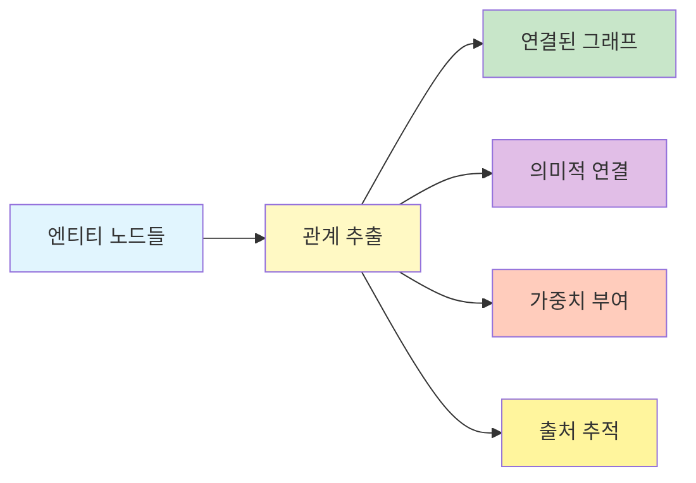

1. **그래프 구조 형성**: 엔티티를 연결하여 네트워크 생성
2. **의미적 연결**: 단순 공채를 넘어선 의미 관계 파악
3. **가중치 계산**: 관계 강도 정량화
4. **컨텍스트 제공**: 추적 및 검증을 위한 출처 정보

## 📖 빗대어 보기: 소셜 네트워크 분석

관계 추출은 **소셜 네트워크에서 사람들 간의 관계를 매핑하는 것**과 유사합니다:

| 소셜 네트워크 | 관계 추출 시스템 |
|-------------|----------------|
| 친구 관계 | entity 간 연결 |
| 친밀도 점수 | relationship weight |
| 함께 있는 사진 | co-occurrence in text unit |
| 관계 타입(가족, 직장) | relationship type |
| 소개 경로 | text_unit_ids (출처) |

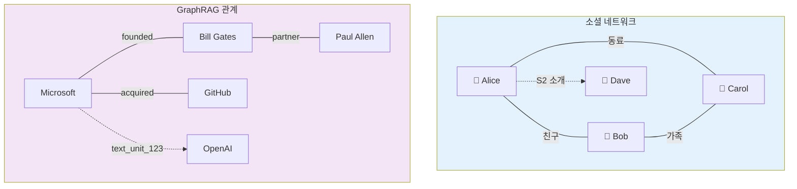

## 🏗️ 추출 아키텍처

```mermaid
flowchart TB
    subgraph Input["입력"]
        E["Entities<br/>📊 엔티티 목록"]
        TU["Text Units<br/>📝 텍스트 청크"]
    </subgraph>

    subgraph Detect["관계 감지"]
        CO["공채 분석<br/>🔍 Co-occurrence<br/>Window-based"]
        LLM["LLM 추출<br/>🤖 관계 유형<br/>🤖 설명 생성"]
        SYM["대칭성 확인<br/>↔️ Bidirectional?"]
    </subgraph>

    subgraph Weight["가중치 계산"]
        FREQ["빈도 기반<br/>📊 Frequency<br/>등장 횟수"]
        CONF["신뢰도 점수<br/>📈 Confidence<br/>LLM 출력 품질"]
        COMB["결합 가중치<br/>⚖️ 최종 계산"]
    </subgraph>

    subgraph Output["출력"]
        REL["Relationships<br/>📋 source, target, weight<br/>📋 description<br/>📋 text_unit_ids"]
    </subgraph>

    E --> CO
    E --> LLM
    TU --> LLM

    CO --> FREQ
    LLM --> CONF
    LLM --> SYM

    FREQ --> COMB
    CONF --> COMB
    SYM --> COMB

    COMB --> REL

    style Input fill:#e3f2fd,stroke:#1976d2,stroke-width:2px
    style Detect fill:#fff3e0,stroke:#f57c00,stroke-width:2px
    style Weight fill:#fce4ec,stroke:#c2185b,stroke-width:2px
    style Output fill:#e8f5e9,stroke:#388e3c,stroke-width:2px
```

### 관계 추출 흐름도

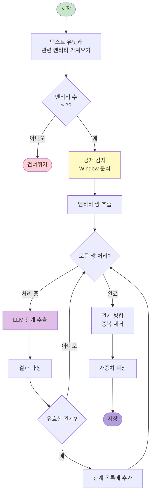

## 🔍 관계 감지 방법

### 1. 공채 기반 감지 (Co-occurrence)

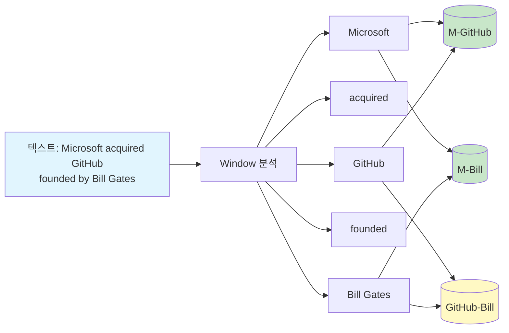

```python
def detect_cooccurrence(
    text_unit: TextUnit,
    entities: list[Entity],
    window: int = 100  # 토큰 윈도우
) -> list[tuple[str, str, int]]:
    """
    같은 문맥에서 등장하는 엔티티 쌍 감지
    """
    entity_positions = {}

    # 엔티티 위치 매핑
    for entity in entities:
        for match in re.finditer(entity.title, text_unit.text):
            entity_positions[entity.id] = match.start()

    # 가까운 엔티티 쌍 찾기
    relationships = []
    for e1, pos1 in entity_positions.items():
        for e2, pos2 in entity_positions.items():
            if e1 < e2 and abs(pos1 - pos2) <= window:
                relationships.append((e1, e2))

    return relationships
```

### 2. LLM 기반 관계 추출

```
From the text below, extract relationships between entities.

For each relationship, provide:
- source: Source entity
- target: Target entity
- description: How they relate
- weight: Strength (0-1)

Entities in context:
{entity_list}

Text: {text}

Output format:
Source: {entity}
Target: {entity}
Description: {relationship}
Weight: {float}
```

### 관계 감지 방법 비교

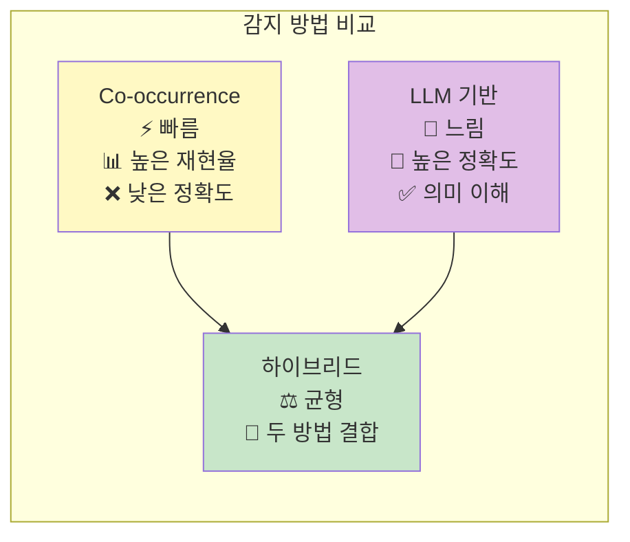

## 📋 관계 유형 분류

### 기본 관계 유형

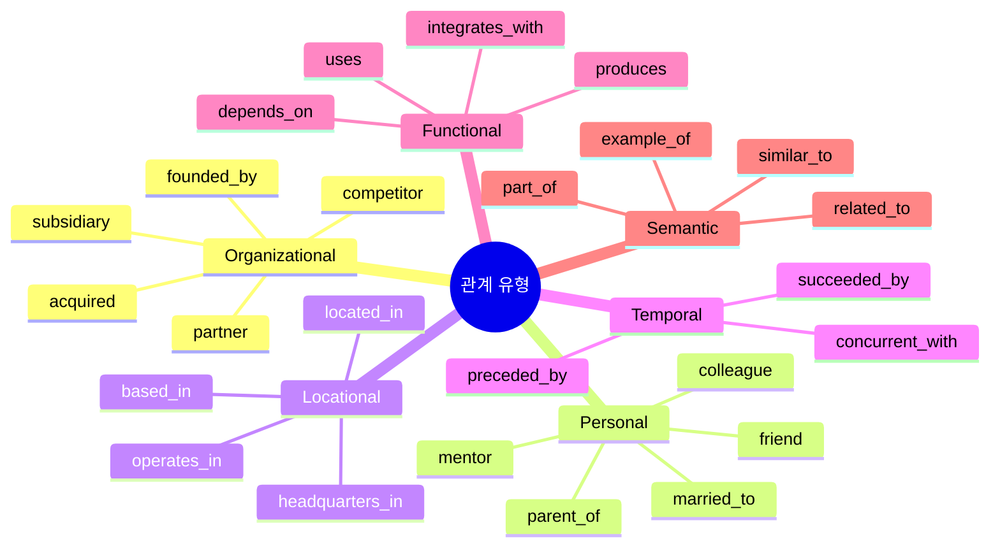

| 유형 | 패턴 | 예시 | 방향성 |
|------|------|------|--------|
| **Organizational** | 조직 구조 | Microsoft → acquired → GitHub | 단방향 |
| **Personal** | 사람 관계 | Satya → CEO_of → Microsoft | 단방향 |
| **Locational** | 위치 기반 | GitHub → based_in → San Francisco | 단방향 |
| **Temporal** | 시간 기반 | GPT-3 → preceded_by → GPT-4 | 단방향 |
| **Functional** | 기능적 | Azure → uses → OpenAI | 단방향 |

### 도메인별 관계 패턴

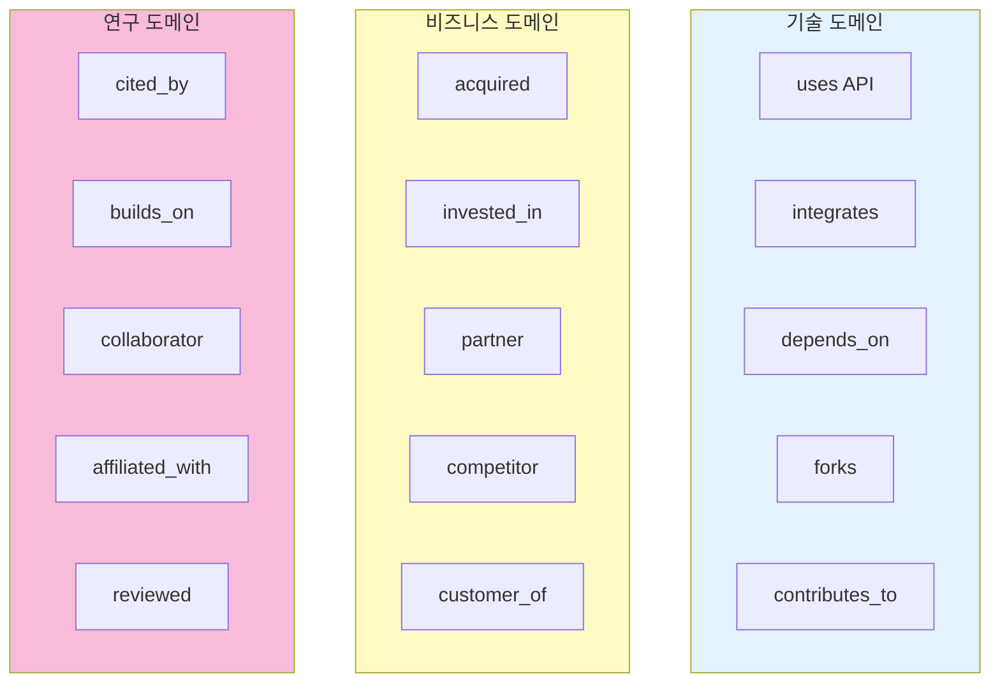

## 📊 가중치 계산

### 가중치 구성 요소

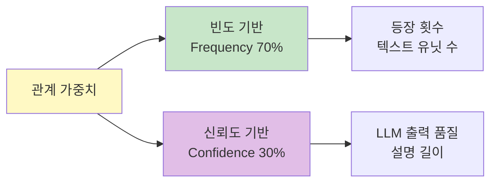

### 빈도 기반 가중치

```python
def calculate_frequency_weight(
    relationships: list[Relationship],
    text_units: list[TextUnit]
) -> dict[str, float]:
    """
    관계 등장 빈도로 가중치 계산
    """
    freq = defaultdict(int)

    for rel in relationships:
        for unit_id in rel.text_unit_ids:
            # 관계 ID로 빈도 카운트
            freq[rel.id] += 1

    # 정규화
    max_freq = max(freq.values()) if freq else 1
    weights = {k: v/max_freq for k, v in freq.items()}

    return weights
```

### 가중치 분포 예시

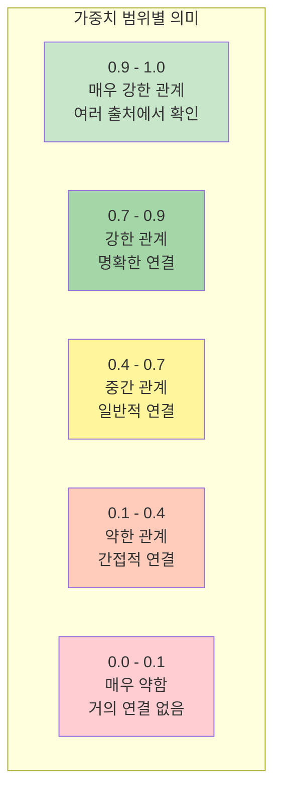

### 신뢰도 기반 가중치

```python
def calculate_confidence_weight(
    llm_response: str,
    entity_similarity: float
) -> float:
    """
    LLM 응답 신뢰도 계산
    """
    # 1. 구조적 완전성
    has_all_fields = check_completeness(llm_response)

    # 2. 엔티티 관련성
    relevance = entity_similarity

    # 3. 설명 품질
    description_quality = len(llm_response.split()) / 10  # 단어 수 기반

    # 종합 신뢰도
    confidence = (
        has_all_fields * 0.4 +
        relevance * 0.3 +
        min(description_quality, 1.0) * 0.3
    )

    return confidence
```

### 결합 가중치

```python
weight = frequency * 0.7 + confidence * 0.3
```

## 🔧 구현 상세

### 관계 추출 파이프라인

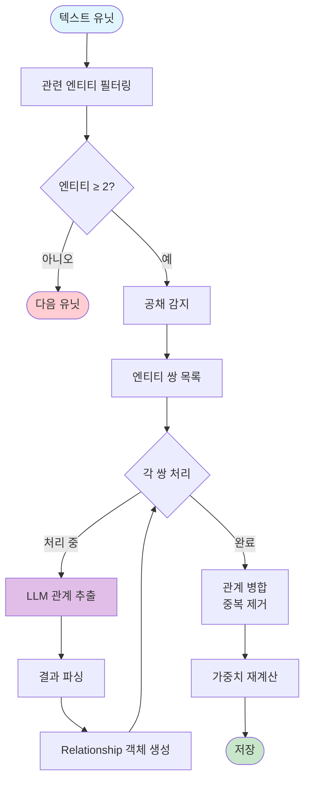

```python
async def extract_relationships(
    text_units: pd.DataFrame,
    entities: pd.DataFrame,
    llm: BaseLanguageModel,
) -> pd.DataFrame:
    """
    텍스트 유닛에서 관계 추출
    """
    relationships = []

    # 각 텍스트 유닛에 대해
    for _, unit in text_units.iterrows():
        # 해당 유닛의 엔티티 필터링
        unit_entities = entities[
            entities['text_unit_ids'].apply(
                lambda x: unit['id'] in str(x)
            )
        ]

        if len(unit_entities) < 2:
            continue

        # 공채 감지
        cooccur = detect_cooccurrence(unit, unit_entities)

        # LLM 기반 관계 추출
        for e1_id, e2_id in cooccur:
            e1 = unit_entities[unit_entities['id'] == e1_id].iloc[0]
            e2 = unit_entities[unit_entities['id'] == e2_id].iloc[0]

            # LLM 호출
            result = await llm.extract_relationship(
                text=unit['text'],
                entity1=e1['title'],
                entity2=e2['title']
            )

            # 관계 생성
            rel = Relationship(
                source=e1_id,
                target=e2_id,
                description=result['description'],
                weight=result['weight'],
                text_unit_ids=[unit['id']]
            )
            relationships.append(rel)

    # 중복 제거 및 가중치 병합
    relationships = merge_relationships(relationships)

    return pd.DataFrame([r.to_dict() for r in relationships])
```

### 관계 병합 알고리즘

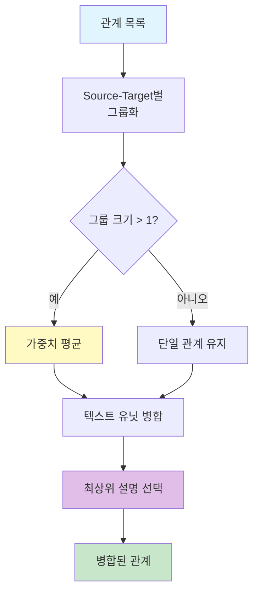

```python
def merge_relationships(
    relationships: list[Relationship]
) -> list[Relationship]:
    """
    동일한 source-target 쌍의 관계 병합
    """
    groups = defaultdict(list)

    # 그룹핑
    for rel in relationships:
        key = (rel.source, rel.target)
        groups[key].append(rel)

    # 병합
    merged = []
    for key, rels in groups.items():
        # 가중치 평균
        avg_weight = sum(r.weight for r in rels) / len(rels)

        # 텍스트 유닛 합치기
        all_units = []
        for r in rels:
            all_units.extend(r.text_unit_ids or [])

        # 설명 병합 (가장 자세한 것 선택)
        best_desc = max(rels, key=lambda r: len(r.description or ""))

        merged.append(Relationship(
            source=key[0],
            target=key[1],
            weight=avg_weight,
            description=best_desc.description,
            text_unit_ids=list(set(all_units))
        ))

    return merged
```

## 📈 관계 통계

### 일반적인 분포

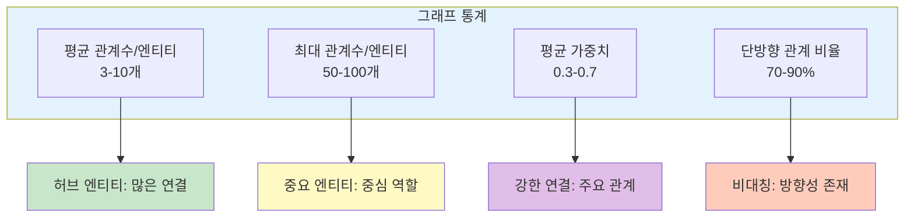

| 메트릭 | 일반적 값 | 의미 |
|--------|-----------|------|
| 평균 관계수/엔티티 | 3-10 | 대부분 엔티티는 소수의 연결 |
| 최대 관계수/엔티티 | 50-100 | 허브 엔티티 존재 |
| 평균 가중치 | 0.3-0.7 | 중간 정도 강도 |
| 단방향 관계 비율 | 70-90% | 대부분 비대칭 관계 |

### 그래프 지표

```python
# 그래프 분석
import networkx as nx

G = nx.Graph()
for rel in relationships:
    G.add_edge(rel.source, rel.target, weight=rel.weight)

# 네트워크 지표
avg_degree = sum(dict(G.degree()).values()) / len(G.nodes())
density = nx.density(G)
clustering = nx.average_clustering(G)

print(f"Avg Degree: {avg_degree:.2f}")
print(f"Density: {density:.4f}")
print(f"Clustering: {clustering:.4f}")
```

## 🎓 고급 기법

### 1. 대칭 관계 추론

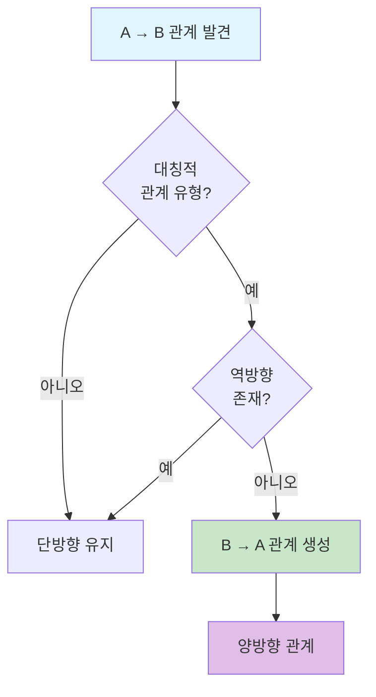

```python
def infer_symmetric_relationships(
    relationships: list[Relationship]
) -> list[Relationship]:
    """
    A -> B 관계에서 B -> A 관계 추론
    """
    symmetric_types = {
        'colleague_of', 'partner_of',
        'connected_to', 'related_to'
    }

    new_relations = []
    for rel in relationships:
        # 대칭적 관계 유형인지 확인
        if any(t in rel.description.lower() for t in symmetric_types):
            # 역방향 관계 확인
            has_reverse = any(
                r.source == rel.target and r.target == rel.source
                for r in relationships
            )
            if not has_reverse:
                # 역방향 관계 생성
                new_relations.append(Relationship(
                    source=rel.target,
                    target=rel.source,
                    description=rel.description,
                    weight=rel.weight
                ))

    return relationships + new_relations
```

### 2. 추론적 관계

```mermaid
flowgraph TB
    A[엔티티 A] -->|관계| B[엔티티 B]
    B -->|관계| C[엔티티 C]

    A -.->|추론| C[간접 관계]

    style A fill:#c8e6c9
    style B fill:#fff9c4
    style C fill:#e1bee7
```

```python
def infer_transitive_relationships(
    G: nx.Graph,
    min_path_length: int = 2
) -> list[tuple[str, str, str]]:
    """
    추이적 관계 추론
    A -> B -> C에서 A -> C 관계 추론
    """
    inferred = []

    for node1 in G.nodes():
        for node2 in G.nodes():
            if node1 == node2:
                continue

            # 2-hop 경로 찾기
            try:
                path = nx.shortest_path(G, node1, node2)
                if len(path) == 3:  # 2-hop
                    inferred.append((node1, node2, "indirect"))
            except nx.NetworkXNoPath:
                continue

    return inferred
```

### 3. 관계 강화 전략

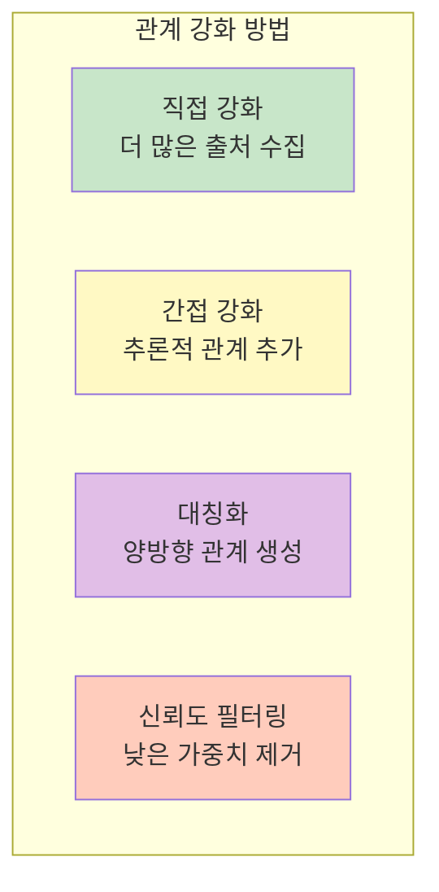

## 🔗 관련 컴포넌트

- [[Entity Extraction Deep Dive]]: 엔티티 추출
- [[Entity]]: 엔티티 데이터 모델
- [[Community]]: 관계를 통한 커뮤니티 형성
- [[Leiden Algorithm]]: 커뮤니티 감지

## 💡 성능 최적화 팁

1. **사전 필터링**: 중요한 엔티티 쌍만 추출
2. **배치 LLM 호출**: 여러 관계를 한 번에 처리
3. **캐싱**: 동일 엔티티 쌍 재처리 방지
4. **병렬 처리**: 독립적인 텍스트 유닛 병렬 처리

---
*See also: [[Relationship]], [[Entity]], [[Index Module]]*
