# Vector Embeddings Deep Dive

벡터 임베딩(Vector Embeddings)은 텍스트를 고차원 수치 벡터로 변환하여, 의미론적 유사도 계산과 시맨틱 서치를 가능하게 하는 핵심 기술입니다.

## 목차

### 1. 개요
- [임베딩의 목적](#-임베딩의-목적)
- [빗대어 보기: 도서관 위치 시스템](#-빗대어-보기-도서관-위치-시스템)

### 2. 아키텍처
- [임베딩 아키텍처](#-임베딩-아키텍처)
- [처리 파이프라인](#-처리-파이프라인)

### 3. 임베딩 모델
- [OpenAI Embeddings](#openai-embeddings)
- [차원 선택 가이드](#-차원-선택-가이드)

### 4. 임베딩 전략
- [텍스트 청크 임베딩](#1-텍스트-청크-임베딩)
- [엔티티 설명 임베딩](#2-엔티티-설명-임베딩)
- [커뮤니티 컨텍스트 임베딩](#3-커뮤니티-컨텍스트-임베딩)

### 5. 유사도 계산
- [코사인 유사도](#코사인-유사도-cosine-similarity)
- [다른 유사도 메트릭](#다른-유사도-메트릭)

### 6. 검색 기법
- [Top-K 검색](#top-k-검색)
- [ANN 검색](#ann-approximate-nearest-neighbor)
- [하이브리드 검색](#하이브리드-검색)

### 7. 최적화
- [임베딩 최적화](#-임베딩-최적화)

---

## 🎯 임베딩의 목적

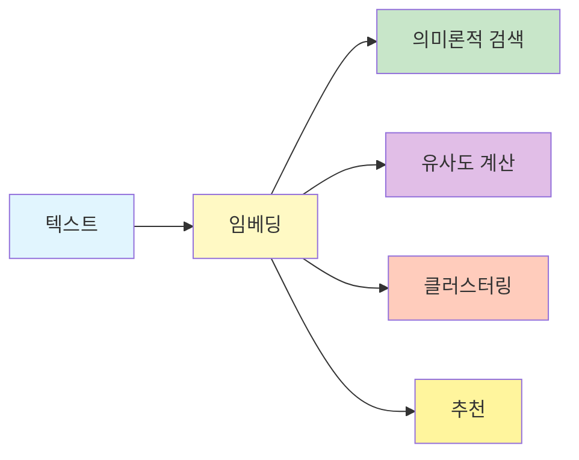

1. **의미론적 검색**: 키워드 매칭을 넘어 의미 기반 검색
2. **유사도 계산**: 텍스트/엔티티 간 의미적 거리 측정
3. **클러스터링**: 유사한 항목들의 그룹화
4. **추천**: 관련 콘텐츠의 추천

## 📖 빗대어 보기: 도서관 위치 시스템

벡터 임베딩은 **도서관에서 책의 주제별 위치를 좌표로 나타내는 것**과 유사합니다:

| 도서관 시스템 | 벡터 임베딩 |
|-------------|------------|
| 책 주제 분류 | 텍스트 → 벡터 변환 |
| 비슷한 주제 근처 배치 | 유사한 의미 가까운 좌표 |
| 주제 거리 계산 | 코사인 유사도 |
| 새 책 위치 배정 | 새 텍스트 임베딩 |
| 분야별 섹션 | 클러스터링 |

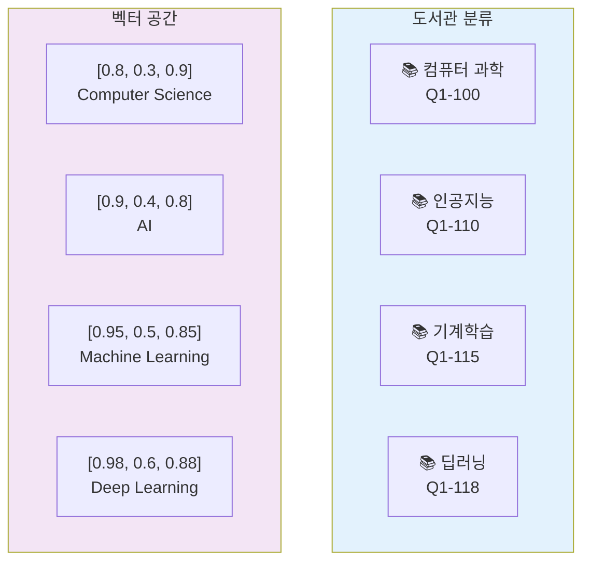

### 벡터 공간 시각화

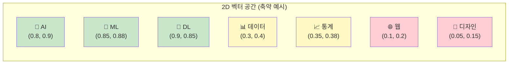

## 🏗️ 임베딩 아키텍처

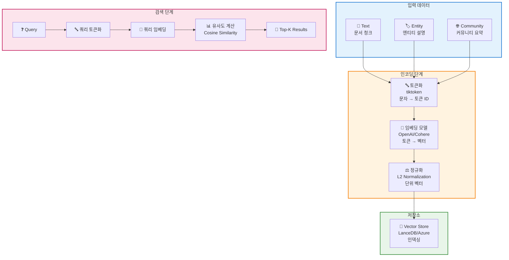

### 처리 파이프라인

```mermaid
flowchart LR
    A["원본 텍스트<br/>'GraphRAG is...'"] --> B[토큰화<br/>[1234, 5678, ...]]

    B --> C[임베딩 모델<br/>text-embedding-3-small]

    C --> D["벡터 출력<br/>[0.1, -0.3, 0.8, ...]<br/>1536 차원"]

    D --> E[L2 정규화<br/>단위 벡터]

    E --> F[벡터 DB 저장]

    style A fill:#e1f5fe
    style B fill:#fff9c4
    style C fill:#c8e6c9
    style D fill:#e1bee7
    style E fill:#ffccbc
    style F fill:#fff59d
```

## 📊 임베딩 모델

### OpenAI Embeddings

| 모델 | 차원 | 성능 | 비용 | 속도 |
|------|------|------|------|------|
| `text-embedding-3-small` | 1536 | 우수 ⭐⭐⭐⭐ | 낮음 💰 | 빠름 ⚡ |
| `text-embedding-3-large` | 3072 | 최상 ⭐⭐⭐⭐⭐ | 중간 💰💰 | 중간 ⚡⚡ |
| `text-embedding-ada-002` | 1536 | 좋음 ⭐⭐⭐ | 낮음 💰 | 빠름 ⚡ |

### 모델 비교 시각화

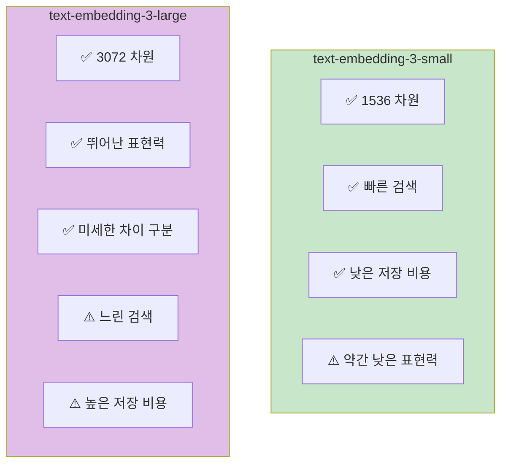

### 차원 선택 가이드

```
┌─────────────────────────────────────────────────────┐
│                  1536 차원 (small)                   │
├─────────────────────────────────────────────────────┤
│  장점: ✅ 빠른 검색                                 │
│        ✅ 낮은 저장 비용                            │
│        ✅ 적은 메모리 사용                          │
│  단점: ⚠️  약간 낮은 표현력                         │
│  추천: 📌 일반적인 문서 검색                         │
│        📌 실시간 검색 시스템                         │
│        📌 대규모 데이터셋                           │
└─────────────────────────────────────────────────────┘

┌─────────────────────────────────────────────────────┐
│                  3072 차원 (large)                   │
├─────────────────────────────────────────────────────┤
│  장점: ✅ 뛰어난 표현력                             │
│        ✅ 미세한 차이 구분                           │
│        ✅ 복잡한 의미 이해                           │
│  단점: ⚠️  느린 검색                                 │
│        ⚠️  높은 저장 비용                            │
│        ⚠️  많은 메모리 사용                          │
│  추천: 📌 정밀한 의미 검색이 필요한 경우             │
│        📌 전문 도메인                               │
│        📌 작은 규모 데이터셋                         │
└─────────────────────────────────────────────────────┘
```

## 🔍 임베딩 전략

### 1. 텍스트 청크 임베딩

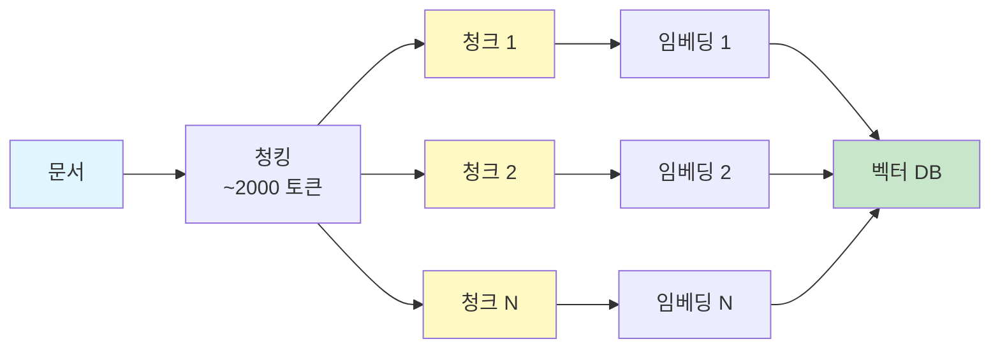

```python
async def embed_text_units(
    text_units: pd.DataFrame,
    embed_model: BaseEmbeddingModel,
    batch_size: int = 100
) -> np.ndarray:
    """
    텍스트 청크 임베딩
    """
    embeddings = []

    for i in range(0, len(text_units), batch_size):
        batch = text_units.iloc[i:i+batch_size]

        # 배치 임베딩
        batch_embeddings = await embed_model.embed_batch(
            texts=batch['text'].tolist()
        )
        embeddings.extend(batch_embeddings)

    return np.array(embeddings)
```

### 2. 엔티티 설명 임베딩

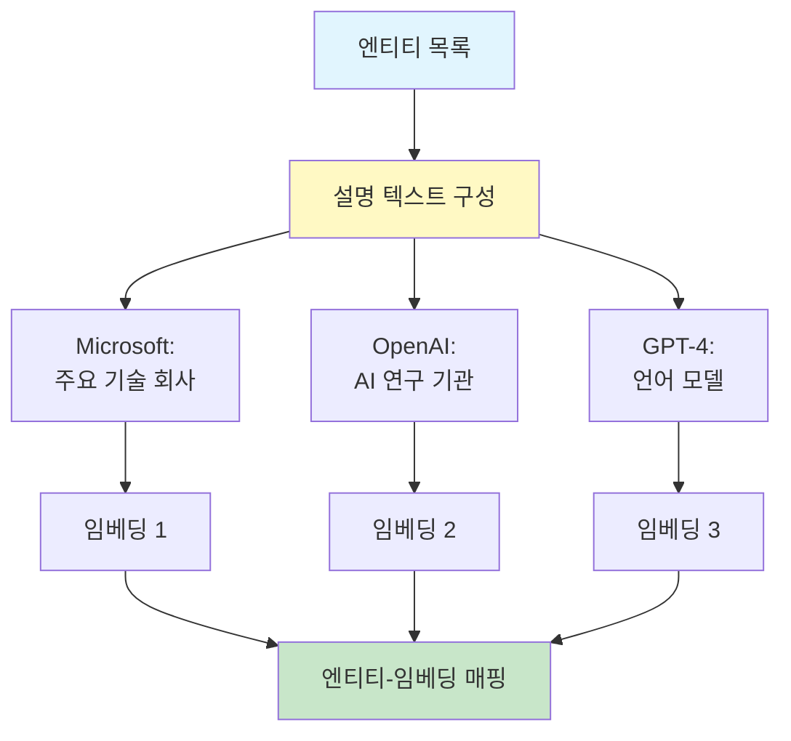

```python
def embed_entities(
    entities: pd.DataFrame,
    embed_model: BaseEmbeddingModel
) -> dict[str, np.ndarray]:
    """
    엔티티 설명 임베딩
    """
    # 설명 텍스트 구성
    texts = [
        f"{e['title']}: {e['description']}"
        for _, e in entities.iterrows()
    ]

    # 임베딩
    embeddings = embed_model.embed_batch(texts)

    # 매핑
    return {
        entity_id: emb
        for entity_id, emb in zip(entities['id'], embeddings)
    }
```

### 3. 커뮤니티 컨텍스트 임베딩

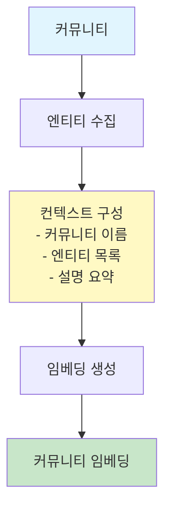

```python
def embed_community_contexts(
    communities: pd.DataFrame,
    entities: pd.DataFrame,
    embed_model: BaseEmbeddingModel
) -> dict[str, np.ndarray]:
    """
    커뮤니티 전체 컨텍스트 임베딩
    """
    context_embeddings = {}

    for _, community in communities.iterrows():
        # 커뮤니티 엔티티 수집
        comm_entities = entities[
            entities['community_id'] == community['id']
        ]

        # 컨텍스트 구성
        entity_names = comm_entities['title'].tolist()
        entity_desc = comm_entities['description'].tolist()

        context_text = f"""
        Community: {community['title']}
        Entities: {', '.join(entity_names)}
        Descriptions: {' | '.join(entity_desc[:5])}
        """

        # 임베딩
        embedding = embed_model.embed(context_text)
        context_embeddings[community['id']] = embedding

    return context_embeddings
```

## 📐 유사도 계산

### 코사인 유사도 (Cosine Similarity)

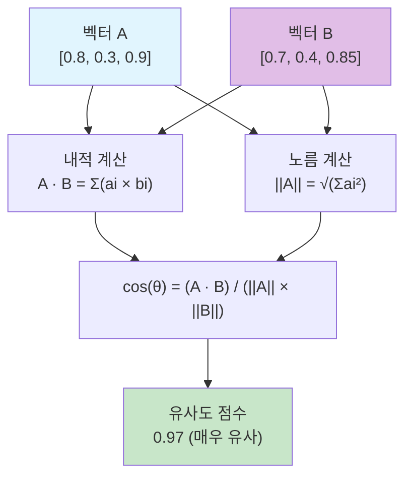

가장 일반적으로 사용되는 유사도 메트릭:

```python
import numpy as np

def cosine_similarity(
    a: np.ndarray,
    b: np.ndarray
) -> float:
    """
    코사인 유사도 계산
    """
    # 내적
    dot_product = np.dot(a, b)

    # 노름
    norm_a = np.linalg.norm(a)
    norm_b = np.linalg.norm(b)

    # 코사인 유사도
    return dot_product / (norm_a * norm_b)
```

### 유사도 점수 해석

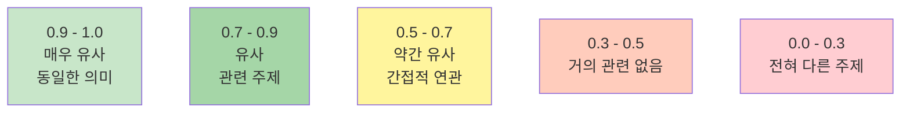

### 다른 유사도 메트릭

| 메트릭 | 공식 | 특징 | 사용 사례 |
|--------|------|------|----------|
| **Cosine** | A·B / (\|A\|\|B\|) | 방향만, 크기 무시 | 텍스트 임베딩 |
| **Euclidean** | √(Σ(a-b)²) | 거리 기반 | 이미지 임베딩 |
| **Dot Product** | A·B | 원점 기반 | 정규화된 벡터 |

## 🔍 벡터 검색

### Top-K 검색

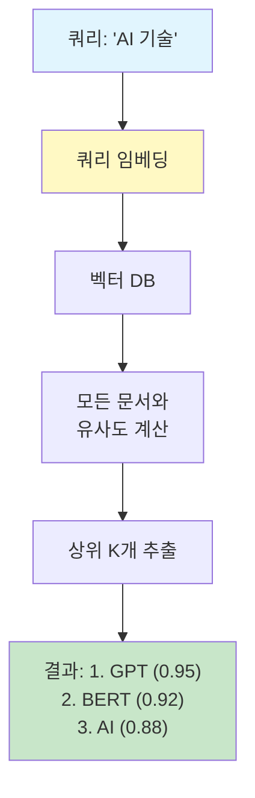

```python
def vector_search(
    query_embedding: np.ndarray,
    index: np.ndarray,  # (N, D) 임베딩 행렬
    k: int = 10
) -> list[tuple[int, float]]:
    """
    Top-K 유사 문서 검색
    """
    # 모든 문서와 유사도 계산
    similarities = cosine_similarity_matrix(query_embedding, index)

    # 상위 K개 추출
    top_k_indices = np.argsort(similarities)[::-1][:k]

    return [
        (idx, similarities[idx])
        for idx in top_k_indices
    ]
```

### ANN (Approximate Nearest Neighbor)

대규모 데이터에서는 정확한 검색 대신 근사 검색 사용:

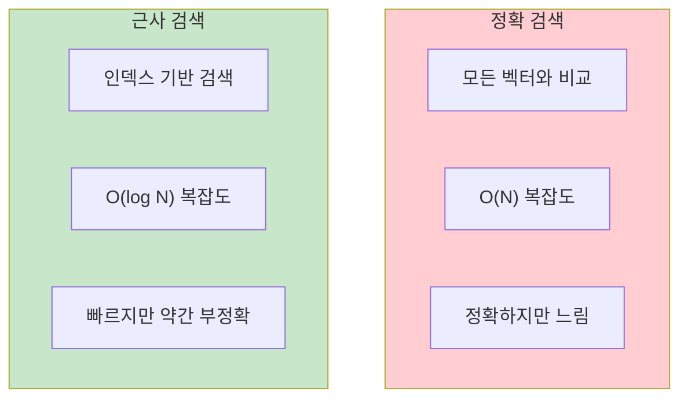

```python
import lancedb

def create_vector_index():
    """LanceDB 인덱스 생성"""
    db = lancedb.connect("./output/lancedb")

    # 테이블 생성 (IVF_FLAT 인덱스)
    db.create_table(
        "embeddings",
        data=[
            {
                "id": i,
                "vector": embedding,
                "text": text
            }
            for i, (embedding, text) in enumerate(zip(embeddings, texts))
        ]
    )

    # IVF_FLAT 인덱스 생성
    db.create_index(
        "embeddings",
        vector_column_name="vector",
        index_type="IVF_FLAT",
        metric="cosine"
    )
```

### ANN 검색 성능 비교

| 데이터 크기 | 정확 검색 | ANN 검색 | 속도 향상 |
|-----------|----------|----------|-----------|
| 1K | 5ms | 1ms | 5x |
| 10K | 50ms | 5ms | 10x |
| 100K | 500ms | 50ms | 10x |
| 1M | 5000ms | 200ms | 25x |

## 🎓 임베딩 최적화

### 1. 하이브리드 검색

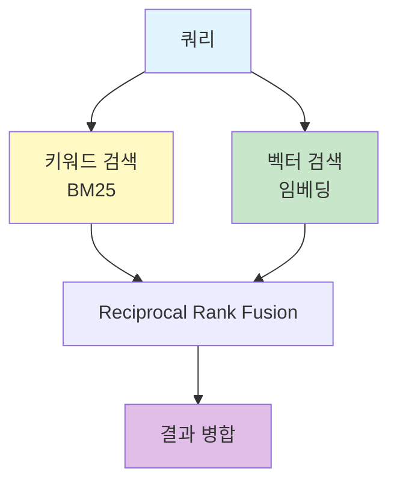

```python
def hybrid_search(
    query: str,
    alpha: float = 0.5  # 키워드 vs 벡터 가중치
) -> list[dict]:
    """
    하이브리드 검색 (키워드 + 벡터)
    """
    # 1. 키워드 검색
    keyword_results = bm25_search(query)

    # 2. 벡터 검색
    vector_results = vector_search(query)

    # 3. 결과 결합 (Reciprocal Rank Fusion)
    scores = {}

    for rank, doc in enumerate(keyword_results):
        scores[doc['id']] = scores.get(doc['id'], 0) + 1 / (rank + 1)

    for rank, doc in enumerate(vector_results):
        scores[doc['id']] = scores.get(doc['id'], 0) + 1 / (rank + 1)

    # 4. 정렬
    sorted_results = sorted(scores.items(), key=lambda x: -x[1])

    return sorted_results
```

### 2. 쿼리 확장


```python
def expand_query_embedding(
    query: str,
    entities: list[Entity],
    embed_model: BaseEmbeddingModel
) -> np.ndarray:
    """
    관련 엔티티로 쿼리 임베딩 강화
    """
    # 원본 쿼리 임베딩
    query_emb = embed_model.embed(query)

    # 관련 엔티티 임베딩
    entity_embs = [
        embed_model.embed(f"{e['title']}: {e['description']}")
        for e in entities[:5]  # 상위 5개
    ]

    # 가중 평균
    alpha = 0.7  # 쿼리 가중치
    beta = 0.3   # 엔티티 가중치

    expanded_emb = alpha * query_emb + beta * np.mean(entity_embs, axis=0)

    # 재정규화
    return expanded_emb / np.linalg.norm(expanded_emb)
```

### 3. 임베딩 캐싱

```python
import pickle

class EmbeddingCache:
    def __init__(self, cache_path: str):
        self.cache_path = cache_path
        self.cache = self._load_cache()

    def get(self, text: str) -> np.ndarray | None:
        return self.cache.get(text)

    def set(self, text: str, embedding: np.ndarray):
        self.cache[text] = embedding
        with open(self.cache_path, 'wb') as f:
            pickle.dump(self.cache, f)
```

## 📊 성능 벤치마크

| 작업 | 작은 크기 (< 1K) | 중간 크기 (10K) | 큰 크기 (100K+) |
|------|-------------------|-------------------|-------------------|
| **임베딩** | 1-2초 | 10-20초 | 2-5분 |
| **정확 검색** | < 1ms | 10-50ms | 100-500ms |
| **ANN 검색** | < 1ms | 5-20ms | 50-200ms |
| **저장소** | 10MB | 100MB | 1GB+ |

## 🔗 관련 컴포넌트

- [[Storage Module]]: 벡터 데이터베이스
- [[Text Unit]]: 텍스트 임베딩 대상
- [[Entity]]: 엔티티 임베딩
- [[Local Search]]: 임베딩 활용 검색

## 💡 성능 최적화 팁

1. **배치 처리**: 한 번의 API 호출로 여러 텍스트 처리
2. **캐싱**: 동일한 텍스트 재임베딩 방지
3. **ANN 인덱스**: 대규모 데이터에서 근사 검색 사용
4. **차원 축소**: 필요한 경우 차원 축소로 저장 비용 절감

---
*See also: [[Storage Module]], [[Local Search]], [[Text Unit]]*
