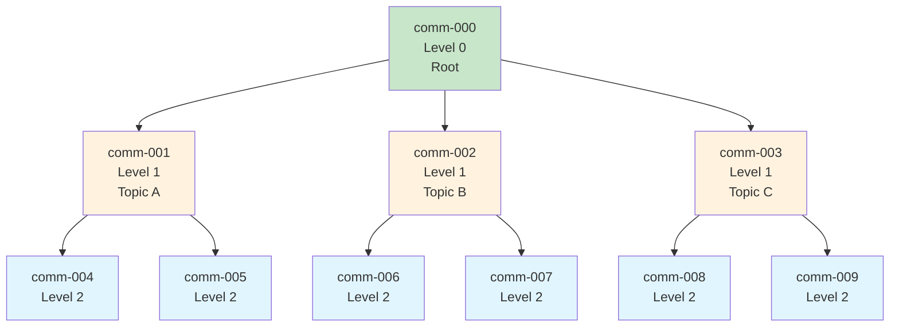

# Community

**Community(커뮤니티)**는 GraphRAG 지식 그래프에서 [[Leiden Algorithm]]으로 감지된 관련 엔티티와 관계의 계층적 클러스터를 나타냅니다.

## 정의

```python
@dataclass
class Community(Named):
    id: str                           # 고유 식별자
    short_id: str | None              # 사람이 읽을 수 있는 ID
    title: str                        # 커뮤니티 제목
    level: str                        # 계층 레벨
    parent: str                       # 상위 커뮤니티 ID
    children: list[str]               # 하위 커뮤니티 ID
    entity_ids: list[str] | None      # 멤버 엔티티
    relationship_ids: list[str] | None # 멤버 관계
    text_unit_ids: list[str] | None   # 관련 텍스트 단위
    covariate_ids: dict[str, list[str]] | None  # 타입별 메타데이터
    attributes: dict[str, Any] | None # 추가 속성
    size: int | None                  # 커뮤니티 크기
    period: str | None                # 시기
```

## 계층 구조



## 커뮤니티 속성

### 식별자
- **id**: 고유 식별자
- **short_id**: 사람이 읽을 수 있는 버전
- **title**: 표시 이름

### 계층
- **level**: 계층 레벨(0, 1, 2, 3, ...)
- **parent**: 상위 커뮤니티의 ID
- **children**: 하위 커뮤니티의 ID

### 멤버십
- **entity_ids**: 이 커뮤니티의 엔티티
- **relationship_ids**: 이 커뮤니티의 관계
- **text_unit_ids**: 소스 텍스트 단위

### 메타데이터
- **covariate_ids**: 타입별 메타데이터(claims, facts)
- **attributes**: 추가 속성
- **size**: 텍스트 단위 수
- **period**: 관련 시기

## 커뮤니티 레벨

| 레벨 | 설명 | 세분성 | 사용 사례 |
|-------|-------------|-------------|----------|
| **0** | 루트 커뮤니티 | 전체 그래프 | 전체 개요 |
| **1** | 주요 주제 영역 | 넓은 도메인 | 상위 수준 테마 |
| **2** | 하위 주제 | 중간 세분성 | 기본 검색 레벨 |
| **3+** | 세부적 | 특정 주제 | 상세 분석 |

## 커뮤니티 감지

### 알고리즘: [[Leiden Algorithm]]

**프로세스**:
1. 각 엔티티를 자체 커뮤니티로 시작
2. 모듈성을 기반으로 커뮤니티를 반복적으로 병합
3. 품질을 위해 커뮤니티 정제
4. 알고리즘을 재귀적으로 적용하여 계층 구조 구축

**파라미터**:
```yaml
cluster_graph:
  max_cluster_size: 50  # 커뮤니티당 최대 엔티티 수
  use_lcc: true         # 최대 연결 컴포넌트 사용
  seed: 42             # 재현성을 위한 랜덤 시드
```

### 품질 메트릭

| 메트릭 | 설명 |
|--------|-------------|
| **모듈성(Modularity)** | 커뮤니티 분할의 품질 |
| **전도성(Conductance)** | 내부 에지와 외부 에지의 비율 |
| **크기(Size)** | 엔티티 수 |
| **밀도(Density)** | 내부 에지 밀도 |

## 저장

커뮤니티는 Parquet 형식으로 저장됩니다:

```python
# output/create_final_communities.parquet
columns = [
    "id", "human_readable_id", "community", "level", "parent",
    "children", "title", "entity_ids", "relationship_ids",
    "text_unit_ids", "period", "size"
]
```

## 사용 예시

### 커뮤니티 로드

```python
import pandas as pd

communities = pd.read_parquet("output/create_final_communities.parquet")

# 특정 레벨의 커뮤니티 가져오기
level_2 = communities[communities["level"] == 2]

# 가장 큰 커뮤니티 가져오기
largest = communities.nlargest(10, "size")

# 커뮤니티의 하위 항목 가져오기
parent_id = "comm-001"
children = communities[
    communities["parent"].apply(lambda x: parent_id in str(x))
]
```

### 계층 탐색

```python
def get_community_tree(community_id, communities):
    """커뮤니티의 전체 계층 구조 가져오기"""
    comm = communities[communities["id"] == community_id].iloc[0]

    result = {
        "id": comm["id"],
        "title": comm["title"],
        "level": comm["level"],
        "children": []
    }

    # 하위 항목을 재귀적으로 가져오기
    for child_id in comm["children"]:
        result["children"].append(
            get_community_tree(child_id, communities)
        )

    return result
```

## 모범 사례

1. **레벨 선택**: 쿼리에 적절한 레벨 선택
   - 넓은 질문: 레벨 0-1
   - 구체적인 질문: 레벨 2-3

2. **계층 탐색**: 상위에서 시작하여 필요시 드릴다운
   ```
   Level 0 → Level 1 → Level 2 → Entities
   ```

3. **컨텍스트 구축**: 효율적인 컨텍스트를 위해 커뮤니티 요약 사용
   - [[Global Search]]는 커뮤니티 보고서 사용
   - [[Local Search]]는 커뮤니티 컨텍스트 포함

## 커뮤니티 통계

일반적인 분포:

| 메트릭 | 값 |
|--------|-------|
| **레벨 수** | 3-5 |
| **레벨별 커뮤니티 수** | 지수적으로 감소 |
| **커뮤니티당 엔티티 수** | 5-50(max_cluster_size에 따라 달라짐) |
| **평균 깊이** | 2-3 |

## 관련 주제

- [[Entity]] - 커뮤니티 멤버
- [[Relationship]] - 커뮤니티 연결
- [[Community Report]] - 커뮤니티 요약
- [[Leiden Algorithm]] - 감지 알고리즘
- [[Global Search]] - 커뮤니티 수준 검색

---
*참고: [[Entity]], [[Entity]], [[Community Report]], [[Leiden Algorithm]]*
