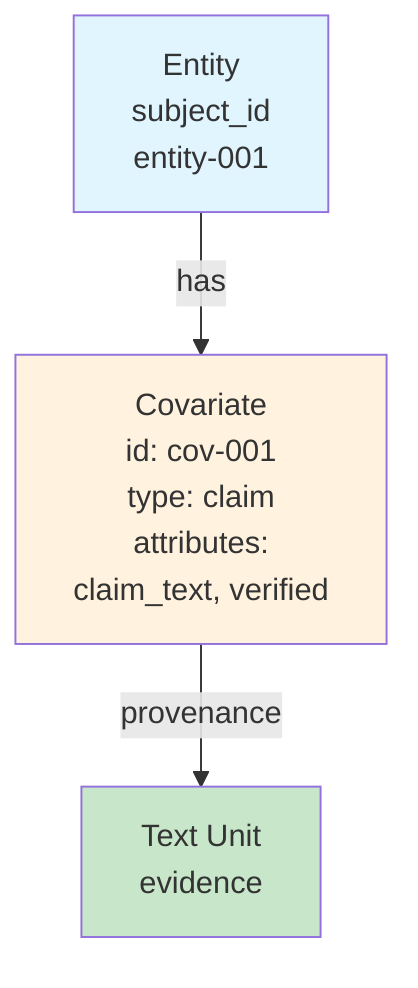

# Covariate

**Covariate(공변량)**는 GraphRAG 지식 그래프에서 주제와 연결된 추가 메타데이터(클레임, 사실, 기타 단언)를 나타냅니다.

## 정의

```python
@dataclass
class Covariate(Identified):
    id: str                           # 고유 식별자
    short_id: str | None              # 사람이 읽을 수 있는 ID
    subject_id: str                   # 연결된 엔티티 ID
    subject_type: str = "entity"      # 주제 타입(entity, relationship)
    covariate_type: str = "claim"     # 공변량 타입
    text_unit_ids: list[str] | None   # 소스 증거
    attributes: dict[str, Any] | None # 공변량별 데이터
```

## 목적

공변량은 다음을 통해 지식 그래프를 확장합니다:
- **클레임**: 텍스트에서 추출된 사실적 단언
- **팩트**: 검증된 정보
- **속성**: 추가 속성
- **메타데이터**: 기타 연결된 정보

## 공변량 속성

### 식별자
- **id**: 고유 식별자
- **short_id**: 사람이 읽을 수 있는 버전

### 연관
- **subject_id**: 연결된 엔티티 또는 관계의 ID
- **subject_type**: 주제 타입("entity" 또는 "relationship")
- **covariate_type**: 메타데이터 타입("claim", "fact" 등)

### 증거
- **text_unit_ids**: 증거를 포함하는 소스 텍스트 단위

### 데이터
- **attributes**: 공변량별 데이터(타입에 따라 다름)

## 공변량 타입

| 타입 | 설명 | 예시 속성 |
|------|-------------|-------------------|
| `claim` | 사실적 단언 | `claim_text`, `verified`, `confidence` |
| `fact` | 검증된 팩트 | `fact`, `source`, `date` |
| `attribute` | 엔티티 속성 | `key`, `value` |
| `temporal` | 시간 관련 | `timestamp`, `duration` |
| `sentiment` | 감정 분석 | `score`, `magnitude` |

## 공변량 구조



## 클레임 추출

### 프로세스

```
Text Units → Claim Extraction → Covariates → Entity Association
```

### 추출 프롬프트

```
다음 텍스트에서 사실적 클레임을 추출하세요.
각 클레임에 대해 다음을 제공하세요:
- 클레임 텍스트
- 주제(엔티티)
- 검증 상태(알 경우)
- 신뢰도 점수

텍스트: {text_chunk}
```

### 예시 클레임

| 클레임 | 주제 | 속성 |
|-------|---------|------------|
| "Microsoft was founded in 1975" | Microsoft | `year: 1975, verified: true` |
| "Bill Gates is CEO of Microsoft" | Bill Gates | `role: CEO, verified: false` |

## 저장

공변량은 Parquet 형식으로 저장됩니다:

```python
# output/create_final_covariates.parquet
columns = [
    "id", "human_readable_id", "subject_id", "subject_type",
    "covariate_type", "text_unit_ids", "attributes"
]
```

## 사용 예시

### 공변량 로드

```python
import pandas as pd

covariates = pd.read_parquet("output/create_final_covariates.parquet")

# 엔티티의 클레임 가져오기
entity_id = "entity-001"
entity_claims = covariates[
    (covariates["subject_id"] == entity_id) &
    (covariates["covariate_type"] == "claim")
]

# 검증된 팩트 가져오기
verified = covariates[
    covariates["attributes"].apply(
        lambda x: x.get("verified", False) if x else False
    )
]

# 높은 신뢰도의 클레임 가져오기
high_conf = covariates[
    covariates["attributes"].apply(
        lambda x: x.get("confidence", 0) > 0.8 if x else False
    )
]
```

### 프로그래밍 방식 공변량 생성

```python
from graphrag.data_model import Covariate

covariate = Covariate(
    id="cov-001",
    short_id="C001",
    subject_id="entity-001",
    subject_type="entity",
    covariate_type="claim",
    text_unit_ids=["unit-001", "unit-002"],
    attributes={
        "claim_text": "Founded in 1975",
        "verified": True,
        "confidence": 1.0,
        "year": 1975
    }
)
```

## 공변량 통계

| 메트릭 | 설명 |
|--------|-------------|
| **엔티티당 수** | 엔티티당 평균 클레임 수 |
| **검증율** | 검증된 클레임의 백분율 |
| **신뢰도 분포** | 신뢰도 점수의 분포 |
| **타입 분포** | 공변량 타입별 분류 |

## 사용 사례

1. **팩트 검증**: 클레임 검증 상태 추적
2. **엔티티 보강**: 엔티티에 속성 추가
3. **증거 추적**: 소스 텍스트에 클레임 연결
4. **신뢰도 점수매기기**: 클레임 신뢰성 평가

## 설정

```yaml
# 클레임 추출
extract_claims:
  enabled: true
  prompt: "prompts/claim_extraction.txt"
  max_claims_per_chunk: 10

# 클레임 검증
verify_claims:
  enabled: true
  sources: ["wikipedia", "trusted_db"]
```

## 관련 주제

- [[Entity]] - 공변량의 주제
- [[Text Unit]] - 증거의 소스
- [[Entity Extraction Deep Dive]] - 클레임 추출 방법
- [[Index Module]] - 파이프라인 개요

---
*참고: [[Entity]], [[Entity]], [[Text Unit]], [[Index Module]]*
