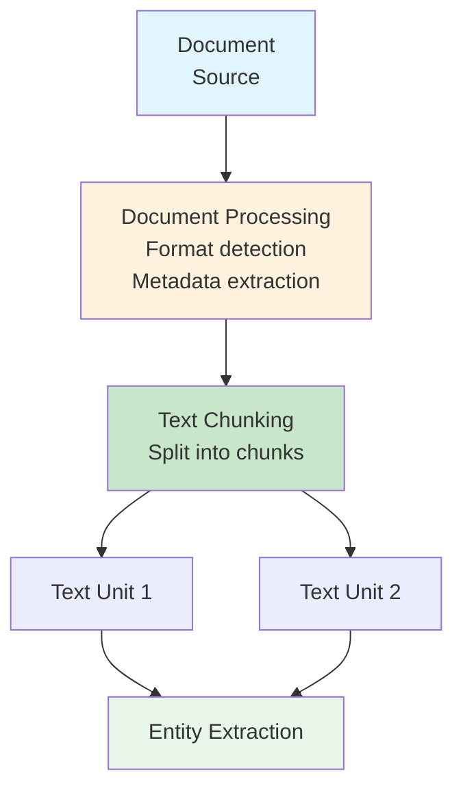

# Document

**Document(문서)**는 GraphRAG 시스템의 소스 문서를 나타내며, 지식이 추출되는 원시 입력 자료입니다.

## 정의

```python
@dataclass
class Document(Named):
    id: str                           # 고유 식별자
    short_id: str | None              # 사람이 읽을 수 있는 ID
    title: str                        # 문서 제목
    type: str = "text"                # 문서 타입
    text_unit_ids: list[str] = []     # 구성 텍스트 청크
    text: str = ""                    # 전체 원시 텍스트 내용
    attributes: dict[str, Any] | None # 구조화된 메타데이터
```

## 문서 속성

### 식별자
- **id**: 고유 식별자
- **short_id**: 사람이 읽을 수 있는 버전
- **title**: 문서 제목 또는 이름

### 내용
- **type**: 문서 타입(text, csv, json 등)
- **text**: 전체 원시 텍스트 내용
- **text_unit_ids**: 이 문서가 분할된 텍스트 청크의 ID

### 메타데이터
- **attributes**: 추가 메타데이터(작성자, 날짜, 소스 등)

## 문서 처리 플로우



## 지원 형식

| 형식 | 확장자 | 참고 |
|--------|-----------|-------|
| **텍스트** | .txt | 일반 텍스트 파일 |
| **CSV** | .csv | 텍스트 열 지정 필요 |
| **JSON** | .json | 구조화된 문서 |

### 설정

```yaml
input:
  type: file
  file_type: text  # csv, json, text
  file_pattern: "input/*.txt"
  text_column: "text"      # CSV용
  title_column: "title"     # CSV용(선택사항)
  encoding: "utf-8"
```

## 저장

문서는 Parquet 형식으로 저장됩니다:

```python
# output/create_final_documents.parquet
columns = [
    "id", "human_readable_id", "title", "type",
    "text_unit_ids", "attributes"
]
```

## 사용 예시

### 문서 로드

```python
import pandas as pd

documents = pd.read_parquet("output/create_final_documents.parquet")

# 문서 제목 가져오기
for _, doc in documents.iterrows():
    print(f"{doc['id']}: {doc['title']}")

# 문서의 텍스트 단위 가져오기
doc_id = "doc-001"
doc = documents[documents["id"] == doc_id].iloc[0]
text_unit_ids = doc["text_unit_ids"]
```

### CSV 입력 처리

```yaml
# 특정 열이 있는 CSV 파일용
input:
  type: file
  file_type: csv
  file_pattern: "input/articles.csv"
  text_column: "content"
  title_column: "headline"
  metadata:
    - "author"
    - "date"
    - "category"
```

### JSON 입력 처리

```yaml
# JSON 파일용
input:
  type: file
  file_type: json
  file_pattern: "input/data.json"
```

## 문서 통계

일반적인 문서 특성:

| 메트릭 | 일반적인 값 |
|--------|---------------|
| **크기** | 가변적(클 수 있음) |
| **문서당 청크 수** | 길이/청크 크기에 따라 다름 |
| **문서당 엔티티 수** | 10-100+ |
| **텍스트 단위** | 문서 크기에 비례 |

## 모범 사례

1. **깨끗한 입력**: 처리 전 불필요한 포맷 제거
2. **일관된 제목**: 의미 있고 설명적인 제목 사용
3. **메타데이터**: 더 나은 추적을 위한 관련 메타데이터 포함
4. **텍스트 품질**: 텍스트가 기계 판독 가능한지 확인

## 관련 주제

- [[Text Unit]] - 문서에서 분할된 청크
- [[Entity]] - 문서에서 추출된 엔티티
- [[Index Module]] - 문서 처리 방법
- [[Index Module]] - 문서 분할 방법

---
*참고: [[Entity]], [[Text Unit]], [[Entity]], [[Index Module]]*
