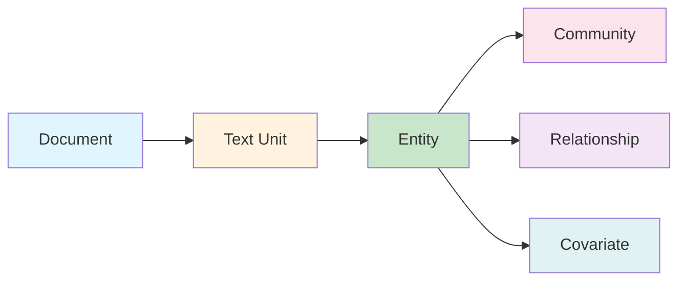

# Entity

**Entity(엔티티)**는 GraphRAG 지식 그래프의 노드를 나타내며, 소스 문서에서 추출된 명명된 개체(사람, 조직, 위치, 이벤트)입니다.

## 정의

```python
@dataclass
class Entity(Named):
    id: str                          # 고유 식별자
    short_id: str | None             # 사람이 읽을 수 있는 ID
    title: str                       # 엔티티 이름
    type: str | None                 # 엔티티 타입
    description: str | None          # 엔티티 설명
    description_embedding: list[float] | None  # 시맨틱 임베딩
    name_embedding: list[float] | None        # 이름 임베딩
    community_ids: list[str] | None  # 소속 커뮤니티
    text_unit_ids: list[str] | None  # 소스 텍스트 단위
    rank: int | None = 1             # 중요도 점수
    attributes: dict[str, Any] | None  # 추가 메타데이터
```

## 엔티티 타입

| 타입 | 설명 | 예시 |
|------|-------------|----------|
| `organization` | 회사, 기관 | Microsoft, OpenAI, MIT |
| `person` | 사람, 개인 | Satya Nadella, Sam Altman |
| `geo` | 위치, 장소 | Seattle, Redmond, USA |
| `event` | 이벤트, 사건 | WWDC, F8 Conference |
| `custom` | 도메인별 타입 | (사용자 정의) |

## 관계

엔티티는 다른 그래프 구성 요소와 연결됩니다:



## 엔티티 속성

### 식별자
- **id**: 고유 식별자(UUID 또는 해시)
- **short_id**: 사람이 읽을 수 있는 버전
- **title**: 표시 이름

### 분류
- **type**: 엔티티 범주(organization, person, geo, event)
- **description**: 자연어 설명
- **rank**: 중요도 점수(높을수록 더 중요)

### 연결
- **community_ids**: 이 엔티티가 속한 커뮤니티
- **text_unit_ids**: 엔티티가 등장하는 소스 텍스트 청크
- **relationships**: (Relationship 모델을 통해)

### 임베딩
- **description_embedding**: 설명의 시맨틱 임베딩
- **name_embedding**: 이름의 시맨틱 임베딩

### 메타데이터
- **attributes**: 추가 키-값 쌍

## 엔티티 추출

### 프로세스

1. **텍스트 청킹**: 문서를 청크로 분할
2. **LLM 추출**: 각 청크를 엔티티 추출 프롬프트와 함께 LLM으로 전송
3. **파싱**: 구조화된 출력을 Entity 객체로 파싱
4. **중복 제거**: 유사한 엔티티 병합
5. **임베딩**: 유사도 검색을 위한 설명 임베딩

### 추출 프롬프트

LLM에 다음 프롬프트를 제공합니다:
```
다음 텍스트에서 모든 엔티티를 추출하세요.
각 엔티티에 대해 다음을 제공하세요:
- 제목/이름
- 타입(organization, person, geo, event)
- 설명

텍스트: {text_chunk}
```

## 엔티티 통계

엔티티에 대해 계산되는 일반적인 메트릭:

| 메트릭 | 설명 |
|--------|-------------|
| **빈도(Frequency)** | 말뭉치에서의 언급 횟수 |
| **차수(Degree)** | 연결 수 |
| **순위(Rank)** | 중요도 점수 |
| **매개성(Betweenness)** | 그래프 내 중심성 |

## 저장

엔티티는 Parquet 형식으로 저장됩니다:

```python
# output/create_final_entities.parquet
columns = [
    "id", "human_readable_id", "title", "type", "description",
    "text_unit_ids", "frequency", "degree", "x", "y"
]
```

## 사용 예시

### 엔티티 로드

```python
import pandas as pd

entities = pd.read_parquet("output/create_final_entities.parquet")

# 모든 조직 가져오기
orgs = entities[entities["type"] == "organization"]

# 순위별 상위 엔티티 가져오기
top_entities = entities.nlargest(10, "rank")

# 이름으로 엔티티 찾기
microsoft = entities[entities["title"] == "Microsoft"]
```

### 프로그래밍 방식 엔티티 생성

```python
from graphrag.data_model import Entity

entity = Entity(
    id="entity-001",
    short_id="E001",
    title="Microsoft",
    type="organization",
    description="Technology company",
    community_ids=["comm-001"],
    rank=1
)
```

## 모범 사례

1. **일관된 명명**: 엔티티에 표준 이름 사용
2. **설명적 타입**: 적절한 엔티티 타입 선택
3. **풍부한 설명**: 더 나은 임베딩을 위해 의미 있는 설명 제공
4. **메타데이터**: 도메인별 속성에 attributes 사용

## 관련 주제

- [[Relationship]] - 엔티티 간 연결
- [[Community]] - 엔티티 그룹화
- [[Text Unit]] - 소스 텍스트 청크
- [[Entity Extraction Deep Dive]] - 엔티티 추출 방법
- [[Local Search]] - 엔티티 중심 검색

---
*참고: [[Entity]], [[Relationship]], [[Community]], [[Index Module]]*
