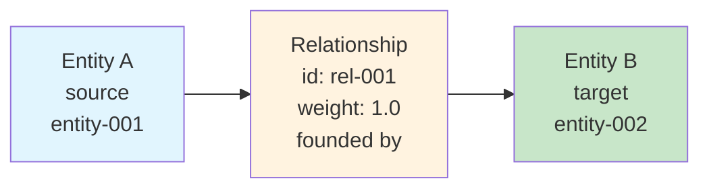

# Relationship

**Relationship(관계)**는 GraphRAG 지식 그래프의 에지를 나타내며, 선택적 설명과 가중치가 있는 두 엔티티 간의 연결입니다.

## 정의

```python
@dataclass
class Relationship(Identified):
    id: str                           # 고유 식별자
    short_id: str | None              # 사람이 읽을 수 있는 ID
    source: str                       # 소스 엔티티 ID
    target: str                       # 타겟 엔티티 ID
    weight: float | None = 1.0        # 관계 강도
    description: str | None           # 관계 설명
    description_embedding: list[float] | None  # 시맨틱 임베딩
    text_unit_ids: list[str] | None   # 소스 텍스트 단위
    rank: int | None = 1              # 중요도 점수
    attributes: dict[str, Any] | None # 추가 메타데이터
```

## 관계 구조



## 관계 속성

### 식별자
- **id**: 고유 식별자
- **short_id**: 사람이 읽을 수 있는 버전

### 연결
- **source**: 소스 엔티티의 ID
- **target**: 타겟 엔티티의 ID
- **weight**: 연결 강도(기본값: 1.0)

### 설명
- **description**: 관계에 대한 자연어 설명
- **description_embedding**: 시맨틱 임베딩

### 증거
- **text_unit_ids**: 이 관계가 나타나는 소스 텍스트 단위
- **rank**: 중요도 점수

### 메타데이터
- **attributes**: 추가 키-값 쌍

## 관계 타입

GraphRAG는 특정 관계 타입을 강제하지 않으며 데이터에서 자연스럽게 생성됩니다:

| 타입 | 예시 |
|------|---------|
| 조직적 | "founded by", "acquired", "subsidiary of" |
| 개인적 | "married to", "child of", "colleague of" |
| 위치적 | "based in", "located in", "operates in" |
| 시간적 | "preceded by", "succeeded by" |
| 일반적 | "related to", "associated with" |

## 가중치 계산

관계 가중치는 강도를 나타내며 다음을 기반으로 할 수 있습니다:

| 요소 | 설명 |
|--------|-------------|
| **빈도** | 관계가 나타나는 횟수 |
| **신뢰도** | LLM 신뢰도 점수 |
| **최신성** | 언급된 시점 |
| **컨텍스트** | 지지 증거의 품질 |

기본 공식: `weight = frequency * confidence_factor`

## 관계 추출

### 프로세스

1. **엔티티 동시 출현**: 함께 언급된 엔티티 식별
2. **LLM 분석**: 관계 추출을 위해 컨텍스트를 LLM으로 전송
3. **타입 추론**: 설명에서 관계 타입 결정
4. **가중치 할당**: 빈도/신뢰도를 기반으로 가중치 계산
5. **중복 제거**: 유사한 관계 병합

### 추출 프롬프트

```
다음 엔티티 간의 관계를 추출하세요:
{entities}

각 관계에 대해 다음을 제공하세요:
- 소스 엔티티
- 타겟 엔티티
- 관계 설명
- 신뢰도 점수

텍스트: {text_chunk}
```

## 저장

관계는 Parquet 형식으로 저장됩니다:

```python
# output/create_final_relationships.parquet
columns = [
    "id", "human_readable_id", "source", "target", "description",
    "weight", "combined_degree", "text_unit_ids"
]
```

## 사용 예시

### 관계 로드

```python
import pandas as pd

relationships = pd.read_parquet("output/create_final_relationships.parquet")

# 엔티티의 관계 가져오기
entity_id = "entity-001"
outgoing = relationships[relationships["source"] == entity_id]
incoming = relationships[relationships["target"] == entity_id]

# 가장 강한 관계 가져오기
strongest = relationships.nlargest(10, "weight")

# 특정 관계 타입 찾기
founded_by = relationships[
    relationships["description"].str.contains("found", case=False)
]
```

### 프로그래밍 방식 관계 생성

```python
from graphrag.data_model import Relationship

relationship = Relationship(
    id="rel-001",
    short_id="R001",
    source="entity-001",  # Microsoft
    target="entity-002",  # Bill Gates
    weight=1.0,
    description="founded by"
)
```

## 관계 메트릭

| 메트릭 | 설명 |
|--------|-------------|
| **차수(Degree)** | 총 연결(입력 + 출력) |
| **입력 차수(In-Degree)** | 들어오는 연결 |
| **출력 차수(Out-Degree)** | 나가는 연결 |
| **가중치(Weight)** | 연결 강도 |
| **매개성(Betweenness)** | 그래프 내 중심성 |

## 관계 패턴

### 일반적인 패턴

```
Person --[founded]--> Organization
Organization --[acquired]--> Organization
Person --[works for]--> Organization
Organization --[based in]--> Location
Event --[held in]--> Location
```

### 양방향 관계

일부 관계는 본질적으로 양방향입니다:
- `married to` ↔ `married to`
- `partner of` ↔ `partner of`
- `collaborates with` ↔ `collaborates with`

## 문제 해결

### 누락된 관계
**문제**: 예상된 관계를 찾을 수 없음

**해결책**:
- 추출 프롬프트 확인
- 텍스트 내 엔티티 동시 출현 확인
- 추출 파라미터 조정

### 낮은 가중치
**문제**: 모든 관계의 가중치가 1.0

**해결책**:
- 빈도 기반 가중치 활성화
- 추출 신뢰도 확인
- 가중치 계산 로직 검토

## 관련 주제

- [[Entity]] - 연결된 엔티티
- [[Community]] - 엔티티 그룹화
- [[Entity Extraction Deep Dive]] - 엔티티 추출 방법
- [[Index Module]] - 지식 그래프 구축

---
*참고: [[Entity]], [[Entity]], [[Community]], [[Index Module]]*
