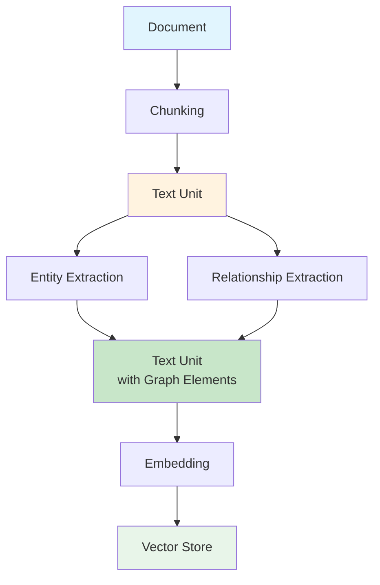

# Text Unit

**Text Unit(텍스트 단위)**는 소스 문서의 텍스트 청크와 연결된 그래프 요소(엔티티, 관계, 공변량)를 나타냅니다.

## 정의

```python
@dataclass
class TextUnit(Identified):
    id: str                           # 고유 식별자
    short_id: str | None              # 사람이 읽을 수 있는 ID
    text: str                         # 실제 텍스트 내용
    entity_ids: list[str] | None      # 언급된 엔티티
    relationship_ids: list[str] | None # 존재하는 관계
    covariate_ids: dict[str, list[str]] | None  # 클레임/메타데이터
    n_tokens: int | None              # 토큰 단위 텍스트 길이
    document_ids: list[str] | None    # 소스 문서
    attributes: dict[str, Any] | None # 추가 메타데이터
```

## 목적

텍스트 단위는 GraphRAG에서 여러 목적을 제공합니다:

1. **청킹**: 큰 문서를 처리 가능한 조각으로 분할
2. **컨텍스트**: 쿼리 응답을 위한 증거 제공
3. **출처(Provenance)**: 추출된 정보의 소스 추적
4. **임베딩**: 시맨틱 유사도 검색 활성화

## 텍스트 단위 속성

### 내용
- **id**: 고유 식별자
- **short_id**: 사람이 읽을 수 있는 버전
- **text**: 실제 텍스트 내용
- **n_tokens**: 토큰 단위 길이(크기 관리용)

### 연관
- **entity_ids**: 이 텍스트에 언급된 엔티티
- **relationship_ids**: 이 텍스트에 존재하는 관계
- **covariate_ids**: 클레임 및 기타 메타데이터(타입별 키)
- **document_ids**: 소스 문서

### 메타데이터
- **attributes**: 추가 속성

## 텍스트 단위 플로우



## 텍스트 청킹

### 전략

| 전략 | 설명 | 최적 용도 |
|----------|-------------|----------|
| **토큰** | 토큰 인식 청킹 | LLM 처리 |
| **문장** | 문장 경계 청킹 | 읽기 쉬운 청크 |

### 설정

```yaml
chunks:
  size: 1200        # 청크 크기(토큰)
  overlap: 100      # 청크 간 중복
  strategy: tokens  # tokens 또는 sentences
```

### 청킹 알고리즘

**토큰 기반**:
```python
def chunk_tokens(text, size=1200, overlap=100):
    tokens = tokenize(text)
    chunks = []
    for i in range(0, len(tokens), size - overlap):
        chunk = tokens[i:i + size]
        chunks.append(detokenize(chunk))
    return chunks
```

**문장 기반**:
```python
def chunk_sentences(text, size=1200, overlap=100):
    sentences = nltk.sent_tokenize(text)
    chunks = []
    current = []
    current_tokens = 0

    for sentence in sentences:
        sentence_tokens = count_tokens(sentence)
        if current_tokens + sentence_tokens > size and current:
            chunks.append(" ".join(current))
            current = current[-overlap:] if overlap else []
            current_tokens = sum(count_tokens(s) for s in current)
        current.append(sentence)
        current_tokens += sentence_tokens

    if current:
        chunks.append(" ".join(current))
    return chunks
```

## 저장

텍스트 단위는 Parquet 형식으로 저장됩니다:

```python
# output/create_final_text_units.parquet
columns = [
    "id", "human_readable_id", "text", "n_tokens", "document_ids",
    "entity_ids", "relationship_ids", "covariate_ids"
]
```

## 사용 예시

### 텍스트 단위 로드

```python
import pandas as pd

text_units = pd.read_parquet("output/create_final_text_units.parquet")

# 특정 엔티티를 포함하는 텍스트 단위 가져오기
entity_id = "entity-001"
containing_units = text_units[
    text_units["entity_ids"].apply(lambda x: entity_id in str(x))
]

# 특정 문서의 텍스트 단위 가져오기
doc_id = "doc-001"
doc_units = text_units[
    text_units["document_ids"].apply(lambda x: doc_id in str(x))
]

# 키워드로 텍스트 단위 찾기
keyword = "artificial intelligence"
matching = text_units[
    text_units["text"].str.contains(keyword, case=False)
]
```

### 검색에서의 텍스트 단위

**Local Search**는 컨텍스트의 50%를 텍스트 단위로 사용합니다:

```python
# Local Search에서
context = {
    "text_units": relevant_text_units,  # 토큰의 50%
    "community_reports": reports,        # 토큰의 25%
    "entities": entities,                # 토큰의 25%
}
```

## 통계

일반적인 텍스트 단위 특성:

| 메트릭 | 일반적인 값 |
|--------|---------------|
| **크기** | 1000-1500 토큰 |
| **중복** | 50-200 토큰 |
| **단위당 엔티티 수** | 2-10 |
| **단위당 관계 수** | 1-5 |

## 모범 사례

1. **청크 크기**: LLM의 컨텍스트 창에 맞추기
   - 더 작음: 더 정확함, 더 많은 API 호출
   - 더 큼: 더 많은 컨텍스트, 더 적은 API 호출

2. **중복**: 연속성 보장
   - 너무 작음: 경계에서 컨텍스트 손실
   - 너무 큼: 중복 처리

3. **전략 선택**:
   - LLM 최적화를 위해 `tokens` 사용
   - 사람 가독성을 위해 `sentences` 사용

## 관련 주제

- [[Document]] - 소스 문서
- [[Entity]] - 텍스트 단위에서 추출된 엔티티
- [[Relationship]] - 텍스트 단위에서 발견된 관계
- [[Vector Embeddings Deep Dive]] - 벡터 표현
- [[Local Search]] - 컨텍스트를 위한 텍스트 단위 사용

---
*참고: [[Entity]], [[Document]], [[Entity]], [[Index Module]]*
